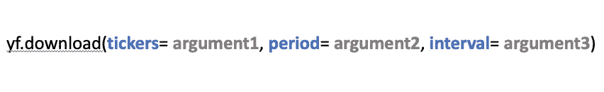
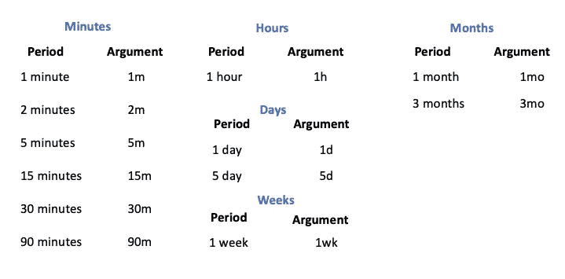
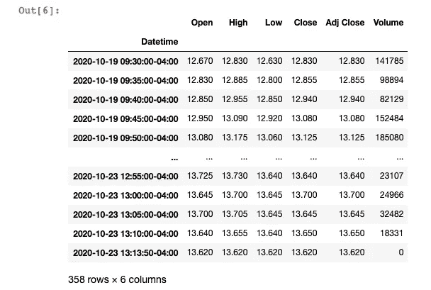
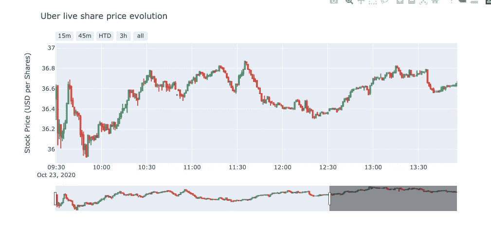

# Python:如何获取实时市场数据(滞后小于 0.1 秒)。

> 原文：<https://towardsdatascience.com/python-how-to-get-live-market-data-less-than-0-1-second-lag-c85ee280ed93?source=collection_archive---------0----------------------->

## 这篇文章会有点特别。我将测试 Yahoo Finance API for Python 的最新版本，它提供了免费获取不到一秒钟延迟的实时数据的可能性。


在 [Unsplash](https://unsplash.com?utm_source=medium&utm_medium=referral) 上 [ActionVance](https://unsplash.com/@actionvance?utm_source=medium&utm_medium=referral) 拍照

***来自《走向数据科学》编辑的提示:*** *虽然我们允许独立作者根据我们的* [*规则和指导方针*](/questions-96667b06af5) *发表文章，但我们并不认可每个作者的贡献。你不应该在没有寻求专业建议的情况下依赖一个作者的作品。详见我们的* [*读者术语*](/readers-terms-b5d780a700a4) *。*

在本文中，您将学习如何使用 Python 包获得实时股票市场数据，而无需调用昂贵的 API，如彭博。我已经帮你测试过了。那有用吗？让我们看看。

> 如果你现在热衷于自己动手，你可以在本文末尾找到完整的 Python 代码

您将能够使用 Python 包获得股票市场数据，如价格、交易量和基本面数据。(*滞后小于 0.01 秒*)

本文是下面文章的补充，在下面的文章中，我演示了如何用不到 3 行代码获得市场数据:

[](/how-to-get-market-data-from-the-nyse-in-less-than-3-lines-python-41791212709c) [## 如何从纽交所获取不到 3 行的市场数据(Python)。

### 在本文中，您将学习使用 Python 获取股票市场数据，如价格、交易量和基本面数据…

towardsdatascience.com](/how-to-get-market-data-from-the-nyse-in-less-than-3-lines-python-41791212709c) 

好，我们开始吧。

## 开始前

首先，如果你想跟踪我的进度，在开始之前，你需要在你的机器上安装一个 **Python 3** 版本和以下软件包:

*   **熊猫**
*   **NumPy**
*   **y 金融**
*   **plottly**(非强制，但对绘图有用)

如果这些软件包中的任何一个尚未安装，您可以使用 pip 命令，如下所示。

```
pip install yfinance
pip install plotly
```

一旦您确保安装了以下软件包，我们就可以开始了。

> ***如果你已经有了使用 Python 的经验，可以跳到第二步。第一步是导入数据。***

# 一、进口包装

第一步将包括导入必要的包。

首先，您将使用以下代码行导入先前安装的软件包:

上面几行是查询要导入的 numpy，pandas，yfinance & plotly。

一旦我们成立了，让我们进行下一步。

既然库已经导入，我们现在可以导入市场数据。

# 二。与市场接轨

既然已经上传了所需的不同包。我们将以 **UBER** 为例，通过 Yahoo Finance API 设置我们的导入。

Yahoo Finance API 将需要 3 个强制参数，顺序如下:

*   跑马灯 *(1)*
*   *开始日期+结束日期*或期间 *(2)*
*   音程 *(3)*

对于我们的例子，股票代号*(参数 1)* 将是 **UBER** 。此外，在本例中，我们将选择最后 5 天的时间段*(参数 2)* ，而不是定义开始和结束日期。我们将设置 5 分钟的间隔*(参数 3)* 。快速提醒一下，优步的股票代码是**优步**。

要调用您的数据，您必须使用以下结构:



上面描述了获取我们感兴趣的市场数据的结构。

在进一步讨论之前，我将带来第三个论点的一些细节(*区间*)。

## 区间快速查找

我想给你一个快速拍摄不同的间隔，你可以使用雅虎财经 API 设置。

下面详细列出了可能需要的间隔的完整列表:



上面列出了可以选择的不同间隔。

该间隔不会干扰获取实时数据的选项。

我们继续。

## 现场测试

当我执行下面的行时，我们是 2020 年 10 月 23 日，实际上是伦敦时间下午 5:13，这意味着市场是开放的。

仅供参考:英国时间下午 5:13 相当于纽约时间下午 1:13。

我们已经定义了 3 个参数，让我们执行下面的代码:

下面几行代码都是调用雅虎财经 API

简单回顾一下，下面的代码行调用 Yahoo finance API 并请求获得最近 5 天的数据，间隔为 5 分钟。

这里是**的输出:**



使用上面的代码发布的输出。

价格已经即时更新；我将数据与当前值进行了比较，我们匹配。

**轰！**

如您所见，每秒钟都有一个更新发布。例如，如果您查看下面的输出，所提供的最新数据是 1:13 PM 和 50 秒。如果您重新运行您的内核，数据将再次更新。

任务完成。

我把现场测试推得更远，你可以看到数据每秒都在更新，**令人印象深刻**。此外，您可以在下面的解释视频中获得完整的代码解释:

完整的现场测试编码和解释在上面的视频。

这是使用 Python 和 Plotly 传播的最终实时图:



最终输出:实时图表随时间更新。

赛义德·莱萨尼

如果你想在这个话题上更进一步，这里是本文的第二部分，有一个真实的算法交易例子:

[](https://medium.com/analytics-vidhya/python-i-have-tested-a-trading-mathematical-technic-in-realtime-658a80381151) [## Python:我已经测试了实时交易数学技术。

### 我用 Python 实时测试了一个著名的预测市场的数学技术的实现…

medium.com](https://medium.com/analytics-vidhya/python-i-have-tested-a-trading-mathematical-technic-in-realtime-658a80381151) 

# **来源:**

(1)一天学会算法交易:

[](https://www.udemy.com/course/python-for-algorithmic-trading/?couponCode=LOVE_SEPTEMBER) [## 2021 年:一天学会算法交易

### 你好，我是赛义德·莱萨尼。我一直在伦敦的多家银行担任数据科学家，是一名…

www.udemy.com](https://www.udemy.com/course/python-for-algorithmic-trading/?couponCode=LOVE_SEPTEMBER) 

# 完整的 python 代码:

完整的 Python 代码