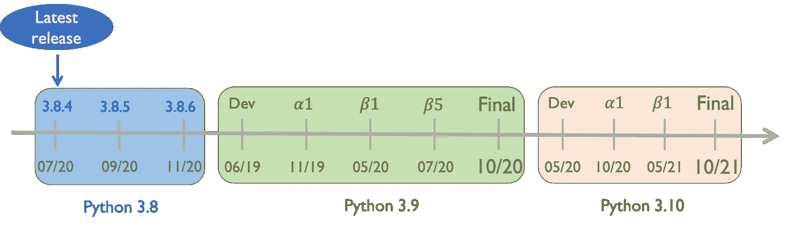

# 2021 年的 Python 时间表和即将推出的功能

> 原文：<https://towardsdatascience.com/python-in-2021-timeline-and-upcoming-features-c8369abbcc52?source=collection_archive---------13----------------------->


Gabriela Gomez 在 [Unsplash](https://unsplash.com?utm_source=medium&utm_medium=referral) 上拍摄的照片

## Python 3.10 的一些新特性的预览

我们目前生活在 **Python 3.8** 的*稳定时代*，Python 的最新稳定版本 [3.8.4](https://www.python.org/downloads/) 于上周发布。 **Python 3.9** 已经处于测试开发阶段，一个[测试版](https://www.python.org/downloads/mac-osx/) (3.9.0b4)于 2020 年 7 月 3 日预发布，第五个测试版预发布定于明天**。3.9 的第一个稳定版本预计在 2020 年 10 月发布。Python 3.10 的开发也于 2020 年 5 月启动，第一个测试版预计于 2021 年 5 月发布。**

**显然，对于 Python 爱好者来说，*有趣的时代就在前方*。浏览三个版本(3.8、3.9 和 3.10)的发布时间表促使我在有趣的 Python 开发即将到来的时间表中编辑**关键日期**。**

> **“我妈妈总是说生活就像一盒巧克力。你永远不知道你会得到什么。”——《阿甘正传》**

****

**Python 开发周期中的关键日期(未按比例)来源:[https://www.python.org/dev/peps/](https://www.python.org/dev/peps/)**

**通常，在开发周期中会有 4–5 个测试版，在第一个测试版发布之后的版本中不会引入新的特性。对于 3.8，beta-1 于 2019 年 6 月发布，对于 3.9，beta-1 于 2020 年 5 月发布。虽然**未来 Python 3.10** 刚刚启动，官方网站已经提供了一些[的亮点](https://docs.python.org/3.10/whatsnew/3.10.html)。**

**这篇文章旨在提供一个时间表的简要概述和一个**即将到来的**新 Python 版本的**突出特性**的预览，改编自 Python 网站的官方示例。请注意，我们可以期待在 3.10 版本中有更多的新功能，我会随时更新下面的列表。**

# **突出 Python 3.10 中的功能**

## **1)二进制表示中 1 的频率**

**将引入一个新方法`bit_count()`，该方法将返回整数的二进制表示中存在的**个一。结果将是**独立于整数的符号**。这个功能的一个用例是在信息论中，对于两个等长的字符串，您可以找到两个字符串不同的地方的总数。这种差异被称为汉明距离(参见 [Wiki](https://en.wikipedia.org/wiki/Hamming_distance) )。阅读[这里的](https://bugs.python.org/issue29882)了解 Python 中这一功能的历史。****

**这个方法简单地将`str`类型的`count`方法称为`str.count('1')`。下面的例子解释了这一点**

```
# Positive integer 
>>> num = 108# Let's first get the binary representation of num
>>> bin(num)
'0b1101100'**>>>** num.bit_count()
4# Negative integer
>>> num = -108>>> bin(num)
'-0b1101100'**>>>** num.bit_count()
4# Under the hood
>>> bin(num).count('1')
```

## **2)拉链会“更严格”**

**一个新的可选关键字参数`strict`将被添加到`zip`函数中。如果你通过了`strict=True`，你正在压缩的**的长度必须相等，**否则`ValueError`将被抛出。在 Python 3.9 之前，如果您压缩两个长度不等的列表，您将得到长度等于较小列表的输出。**

**在下面的例子中可以看到，在 Python 3.10 之前，`zip()`函数忽略了第一个列表中不匹配的`'D'`。相比之下，Python 3.10 会抛出一个`ValueError`。鉴于压缩相同数量的项目的直观性，我喜欢这个功能，因为它可以唤醒你重新检查你的输入。在 [PEP 618](https://www.python.org/dev/peps/pep-0618/) 阅读更多关于这个问题的内容。**

****Python 3.10 之前****

```
>>> list(zip(['A', 'B', 'C', 'D'], ['Apple', 'Ball', 'Cat']))
[('A', 'Apple'), ('B', 'Ball'), ('C', 'Cat')]
```

****在 Python 3.10 中****

```
>>> list(zip(['A', 'B', 'C', 'D'], ['Apple', 'Ball', 'Cat'],
             strict=True))
Traceback (most recent call last):
  *...*
ValueError: zip() argument 1 is longer than argument 2
```

## **3)字典的只读视图**

**字典的三个关键方法，`keys()`、`values()`和`items()`，返回类似集合的对象，分别对应于字典的键、值和项的*动态视图*。您在这些视图中所做的任何更改也将**反映到**原始词典中。**

**在 Python 3.10 中，上述三种方法返回的所有视图都有一个名为`mapping`的附加属性**，该属性将返回映射的一个只读代理**。这个只读代理将包装视图引用的原始字典。下面的例子说明了这一点:**

**让我们定义一个字典，并将它的键和值存储在不同的变量中**

```
>>> fruits = {'Mangos': 12, 'Figs': 100, 'Guavas': 3, 'Kiwis': 70}
>>> keys = fruits.keys()
>>> values = fruits.values()>>> list(keys)
['Mangos', 'Figs', 'Guavas', 'Kiwis']
```

**现在让我们使用`del`语句从这个字典中删除两个元素。如果您现在打印键和值，您将看到它只返回剩余的项。原始字典中的变化现在反映在视图中(这里的`keys`和`values`)。**

```
>>> del fruits['Figs']
>>> del fruits['Guavas']>>> print (list(keys), list(values))
['Mangos', 'Kiwis'] [12, 70]
```

**现在，有了`mapping`，你仍然可以得到原始字典的只读代理。酷！不是吗？**

```
*# returns a read-only proxy of the* ***original dictionary***
>>> values.mapping
mappingproxy({'Mangos': 12, 'Figs': 100, 'Guavas': 3, 'Kiwis': 70})>>>values.mapping['Guavas']
3
```

## **4)移除一些向后兼容性**

**从 Python 3.10 起将**取消对[集合](https://docs.python.org/3.9/library/collections.abc.html#collections-abstract-base-classes)模块的抽象基类(ABCs)的别名支持。因此，现在是停止忽略相应的反对警告并调整代码的好时机。****

****到 Python 3 . 9 . 0 B4(2020 年 7 月 3 日发布)****

**直接从`collections`模块导入任何[这些](https://docs.python.org/3.9/library/collections.abc.html#collections-abstract-base-classes)ABC 将导致到目前为止的`DeprecationWarning`**

```
>>> from collections import ABC_NameDeprecationWarning: Using or importing the ABCs from 'collections' instead of from 'collections.abc' is deprecated since Python 3.3,and in 3.9 it will stop working
```

**这让我想到了这篇文章的结尾。因为 Python 3.10 将会公布更多的发布亮点，所以我会将它们添加到本文中。敬请期待 ***让我们一起期待 Python 3.10*** 。你可以在这里关注当前版本和即将发布版本的发布时间表: [3.8](https://www.python.org/dev/peps/pep-0569/#release-schedule) 、 [3.9](https://www.python.org/dev/peps/pep-0596/#id4) 、 [3.10](https://www.python.org/dev/peps/pep-0619/#id4) 。如果您也想了解 Matplotlib 和 Scikit-learn 的最新特性，请阅读我最近发表的关于 Matplotlib 3 新特性和 Scikit-learn 新特性的文章。**