# 用 Altair 实现 Python 交互式数据可视化

> 原文：<https://towardsdatascience.com/python-interactive-data-visualization-with-altair-b4c4664308f8?source=collection_archive---------4----------------------->

## 用不到 20 行代码创建交互式图表。

# 一个简单的例子

在我们进入细节之前，我想向您展示一个不到 20 行代码的交互式图表。

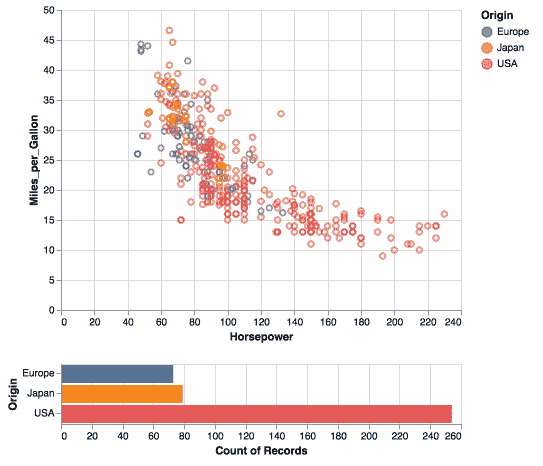

这个图表是用 Python 数据可视化库 Altair 创建的。Altair 是 Python 的一个声明性统计可视化库，基于 [Vega](http://vega.github.io/vega) 和 [Vega-Lite](http://vega.github.io/vega-lite) 。Altair 提供了强大而简洁的可视化语法，使您能够快速构建各种各样的统计可视化。

这个库的关键思想是你在*数据列*和*可视编码通道*之间声明链接，比如 x 轴、y 轴、颜色等。其余的情节细节是自动处理的。基于这种声明性的绘图思想，可以使用相对简洁的语法创建一系列从简单到复杂的绘图和可视化。

下面是来自[官方示例图库](https://altair-viz.github.io/gallery/index.html)的部分示例截图。


来自[官方示例图库](https://altair-viz.github.io/gallery/index.html)的一些牛郎星示例

# 装置

这个库有很多依赖项，我强烈建议创建一个新的虚拟环境。此外，避免使用 ***base(root)*** 也是一个最佳实践，因为这可能会破坏您的系统。

关于创建 Python 虚拟环境的教程，你可以看看:

[](/create-virtual-environment-using-virtualenv-and-add-it-to-jupyter-notebook-6e1bf4e03415) [## 使用“virtualenv”创建虚拟环境，并将其添加到 Jupyter 笔记本中

### 你是机器学习工程师，正在使用 Python 和 Jupyter Notebook 吗？在这篇文章中，你会看到为什么…

towardsdatascience.com](/create-virtual-environment-using-virtualenv-and-add-it-to-jupyter-notebook-6e1bf4e03415) [](https://medium.com/analytics-vidhya/create-virtual-environment-using-conda-and-add-it-to-jupyter-notebook-d319a81dfd1) [## 使用“conda”创建虚拟环境，并将其添加到 Jupyter 笔记本中

### 你正在使用 anaconda 和使用 Jupyter Notebook 和 Python 吗？在这篇文章中，你将看到如何创建虚拟的…

medium.com](https://medium.com/analytics-vidhya/create-virtual-environment-using-conda-and-add-it-to-jupyter-notebook-d319a81dfd1) 

以下是安装 Altair 的两个选项:

*   终端— pip/conda
*   阿南康达-领航员

## 通过 pip/conda 的终端

假设您已经处于想要安装 Altair 的环境中。

Altair 可以与示例数据集一起安装在 [vega_datasets](https://github.com/altair-viz/vega_datasets) 中，

```
pip install altair vega_datasets
```

如果您使用的是 conda 软件包管理器，则等同于:

```
conda install -c conda-forge altair vega_datasets
```

成功安装后，您应该能够打开 Jupyter Notebook 或 JupyterLab，并执行来自[示例库](https://altair-viz.github.io/gallery/index.html#example-gallery)的任何代码。

## 巨蟒领航员

启动***anaconda-Navigator***，导航到 ***环境*** ，选择您喜欢安装 Altair 的环境，例如“*数据可视化*”。然后从下拉菜单中选择*未安装*。

重要提示:您应该始终避免使用 ***base(root)*** ，因为库及其依赖项的更新可能会破坏您的系统。

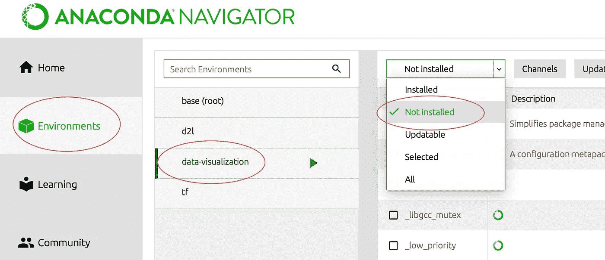

使用 Anaconda-Navigator 安装 Altair

从**搜索**字段中搜索*牛郎星*，并选择库。之后点击*应用*应该可以安装 Altair 及其依赖项。可以按照同样的方法安装示例数据集 [vega_datasets](https://github.com/altair-viz/vega_datasets) 。

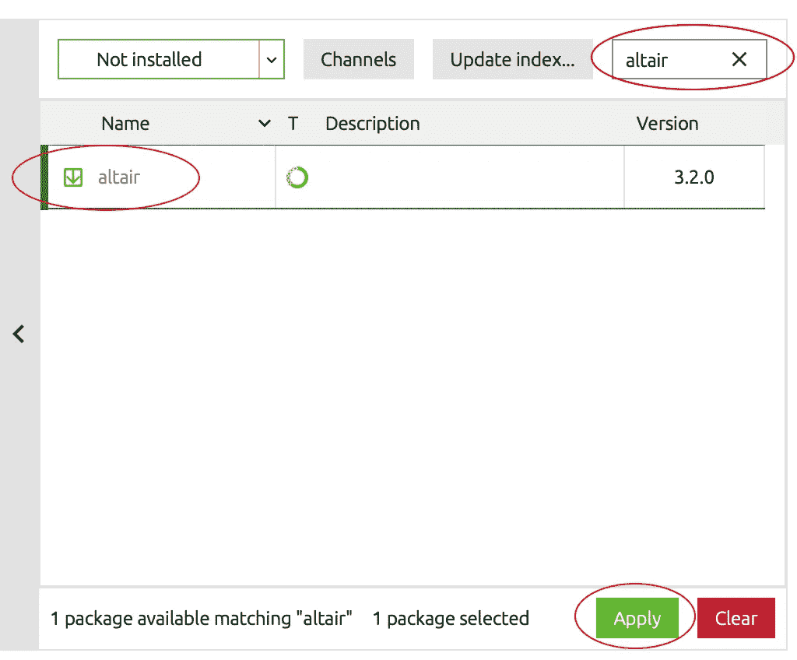

一旦成功安装，返回**主页**并确保您处于正确的**环境*。*** 你应该能够启动 Jupyter Notebook 或 JupyterLab，并执行[示例库](https://altair-viz.github.io/gallery/index.html#example-gallery)中的任何代码。

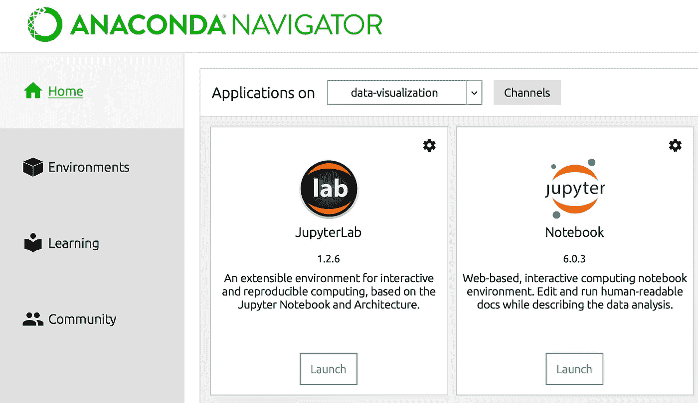

从 Anaconda Navigator 启动 JupyterLab 或 Jupyter Notebook

# 牛郎星图表基础指南

牛郎星官方用户指南里有很多概念，但是***数据*** ， ***标志*** ， ***编码*** 是基本的。理解以下概念应该足以让您创建基本的交互式图表。

## 数据

Altair 内部使用的数据以 Pandas DataFrame 格式存储，但有四种方式可以传入:

*   作为熊猫的数据框架
*   作为数据或相关对象
*   作为指向 json 或 csv 格式文件的 url 字符串
*   作为支持 __geo_interface__(例如 [Geopandas 地理数据框架](http://geopandas.org/data_structures.html#geodataframe)、 [Shapely Geometries](https://shapely.readthedocs.io/en/latest/manual.html#geometric-objects) 、 [GeoJSON 对象](https://github.com/jazzband/geojson#geojson-objects))的对象

下面是一个导入 Pandas 和 Altair 的示例，并创建一个简单的数据帧来可视化，在列 **col-1** 中有一个分类变量，在列 **col-2** 中有一个数字变量:

```
**import altair as alt
import** **pandas** **as** **pd**data = pd.DataFrame({'col-1': list('CCCDDDEEE'),
                     'col-2': [2, 7, 4, 1, 2, 6, 8, 4, 7]})
chart = alt.Chart(data)
```

## 马克斯（英格兰人姓氏）

选择数据后，您需要选择各种图表，如条形图、折线图、面积图、散点图、直方图和地图。`mark`属性指定了这些属性应该如何在图上精确地表示。Altair 提供了许多基本标记属性:

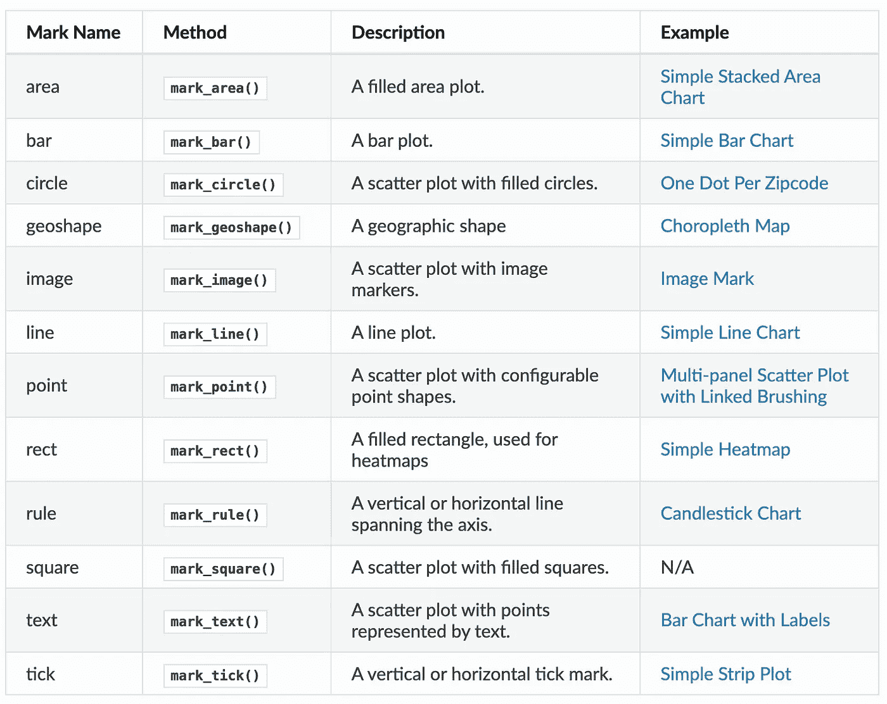

牛郎星基本标志

除基本标记外，它还提供以下复合标记:

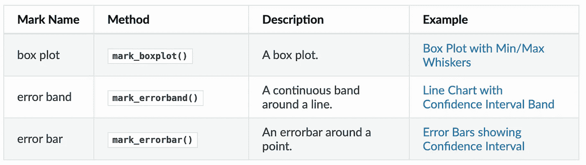

牛郎星复合标志

有了上面的图表对象，我们现在可以指定我们希望数据如何可视化。这是通过`Chart.mark_*`完成的。例如，我们可以使用`mark_point()`将数据显示为一个点。

```
import altair as alt
import pandas as pddata = pd.DataFrame({'a': list('CCCDDDEEE'),
                     'b': [2, 7, 4, 1, 2, 6, 8, 4, 7]})
chart = alt.Chart(data)
**alt.Chart(data).mark_point()**
```

通过执行上面的代码，它应该给你一个图表:


我们获得单点显示的原因是渲染由数据集中每行一个点组成，所有点都绘制在彼此之上，因为我们还没有指定这些点的位置。这将通过**编码**解决。

## 编码

在 Altair 中，编码是数据到视觉属性的映射，比如轴、标记的颜色、标记的形状等等。编码方法`Chart.encode()`定义了图表显示的各种属性，它是创建有意义的可视化的最重要的功能。[官方用户指南](https://altair-viz.github.io/user_guide/encoding.html)提供了一长串受支持的属性。以下是最基本的编码属性，了解它们应该足以让您创建基本的图表。

**位置通道**

*   `x`:x 轴数值
*   `y`:y 轴数值
*   `row`:分面绘图的行
*   `column`:分面绘图的列

**标记属性通道**

*   `color`:标记的颜色
*   `opacity`:标记的不透明度
*   `shape`:标记的形状
*   `size`:标记的大小

**文字频道**

*   `text`:用于标记的文本

**数据类型**

*   `quantitative`:速记码 **Q** ，连续实数值
*   `ordinal`:简写代码 **O** ，离散订购数量
*   `nominal`:简写代码 **N** ，离散订购数量
*   `temporal`:速记代码 **T** ，时间或日期值

为了直观地将这些点从代码中分离出来，我们可以将各种*编码通道*，或者简称为*通道*映射到数据集中的列。例如，我们可以用`x`通道对数据的变量`col-1`进行*编码，该通道代表点的 x 轴位置。这可以通过`[**Chart.encode()**](https://altair-viz.github.io/user_guide/generated/toplevel/altair.Chart.html#altair.Chart.encode)`方法直接完成:*

```
import altair as alt
import pandas as pddata = pd.DataFrame({'**col-1**': list('CCCDDDEEE'),
                     '**col-2**': [2, 7, 4, 1, 2, 6, 8, 4, 7]})
chart = alt.Chart(data)
alt.Chart(data).mark_point()**.encode(
    x='col-1',
    y='col-2'
)**
```

这是输出

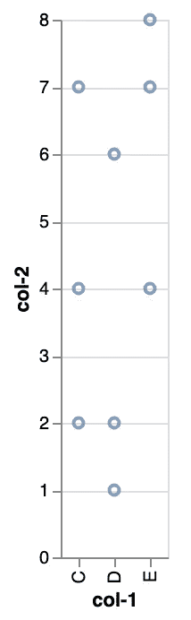

# 让图表互动

除了基本的图表，Altair 的一个独特功能是用户可以与图表进行交互，包括平移、缩放和选择一系列数据等控件。

在主题后面，只需调用`interactive()`模块就可以实现平移和缩放。例如:

```
import altair as alt
import pandas as pddata = pd.DataFrame({'col-1': list('CCCDDDEEE'),
                     'col-2': [2, 7, 4, 1, 2, 6, 8, 4, 7]})
chart = alt.Chart(data)
alt.Chart(data).mark_point().encode(
    x='col-1',
    y='col-2'
)**.interactive()**
```

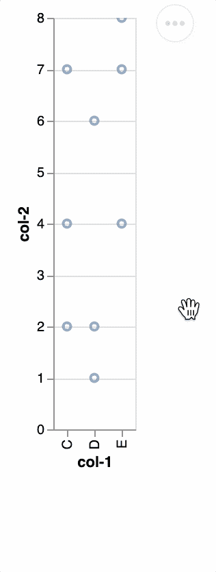

Altair 还提供了用于创建交互式图像的选择 API。在`selection()`功能中，我们可以制作一些更酷的高级功能，比如本文开头所示的 GIF 允许对选定的数据点进行分析并生成实时直方图。

# 逐步构建交互式图表

有了牛郎星的基础知识，我们来做一个互动图。

对于本教程，我们将使用来自 [vega_datasets](https://github.com/altair-viz/vega_datasets) 中示例数据集中的汽车数据，

```
from vega_datasets import datacars = data.cars()
```

首先，我们将使用`[**selection_interval()**](https://altair-viz.github.io/user_guide/generated/api/altair.selection_interval.html#altair.selection_interval)`功能创建一个区间选择:

```
brush = alt.selection_interval()
```

我们现在可以通过设置`selection`属性将这个画笔绑定到我们的图表:

```
alt.Chart(cars).mark_point().encode(
    x='Miles_per_Gallon:Q',
    y='Horsepower:Q',
    color='Origin:N'
)**.add_selection(
    brush
)**
```

上面的结果是一个图表，它允许您单击并拖动来创建一个选择区域，并在创建区域后移动该区域。这很简洁，但是这个选择实际上并没有做任何事情。

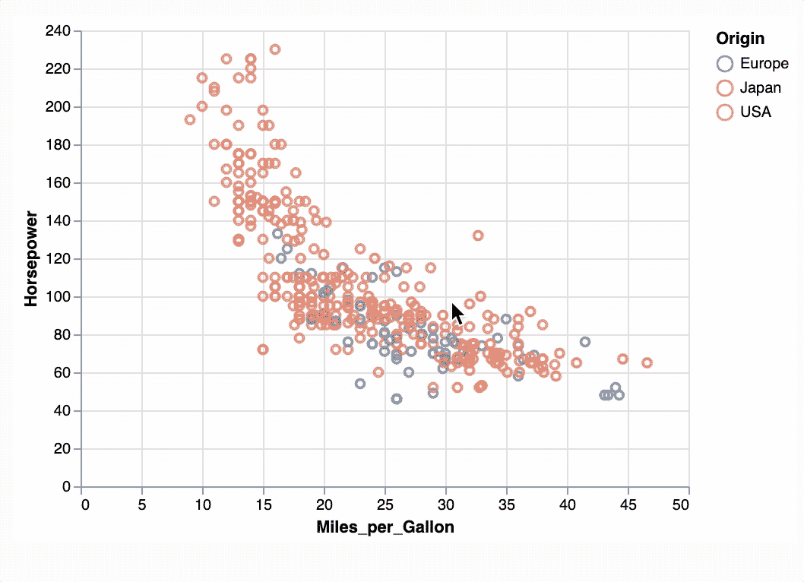

添加选择的结果()

要使用这个选项，我们需要在图表中以某种方式引用它。这里，我们将使用`[**condition()**](https://altair-viz.github.io/user_guide/generated/api/altair.condition.html#altair.condition)`函数来创建一个条件颜色编码:我们将把选择中的点的颜色绑定到`"Origin"`列，并将选择之外的点的颜色设置为`"lightgray"`:

```
alt.Chart(cars).mark_point().encode(
    x='Miles_per_Gallon:Q',
    y='Horsepower:Q',
    **color=alt.condition(brush, 'Origin:N', alt.value('lightgray'))**
).add_selection(
    brush
)
```

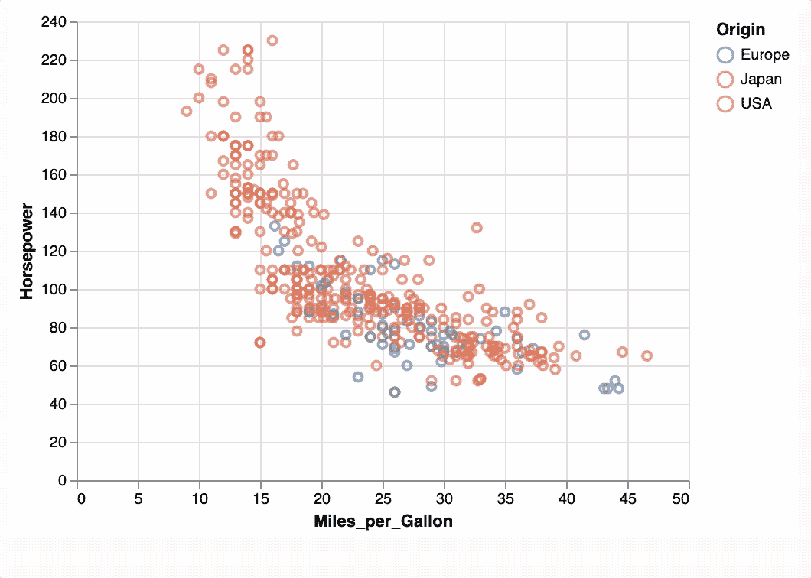

条件()的结果

接下来，我们创建一个`mark_bar()`图表

```
alt.Chart(cars).mark_bar().encode(
    y='Origin:N',
    color='Origin:N',
    x='count(Origin):Q'
)
```

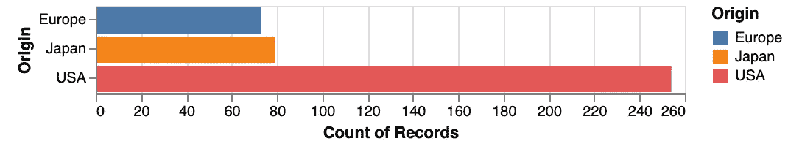

牛郎星条形图

为了将条形图与之前的散点图关联起来，我们需要使用`transform_filter()`并传递同一个`brush`。此外，对于组合多选图表，我们还需要为它们分别创建变量，并使用组合多选`&`。

```
**points =** alt.Chart(cars).mark_point().encode(
    x='Horsepower:Q',
    y='Miles_per_Gallon:Q',
    color=alt.condition(brush, 'Origin:N', alt.value('lightgray'))
).add_selection(
    brush
)**bars =** alt.Chart(cars).mark_bar().encode(
    y='Origin:N',
    color='Origin:N',
    x='count(Origin):Q'
).**transform_filter(
    brush
)****points & bars**
```

而且，就是这样。这是输出


这是完整的代码:

# 学习建议

本文是一个快速教程，主要是给大家展示这个优秀的数据可视化库。学习没有捷径。你必须看文档，源代码，研究相关的例子，并在实践中应用它们。

# 尽情享受吧！

仅此而已。感谢阅读。

关于 Altair 交互式数据可视化的更多内容，您可以看看

[](/interactive-data-visualization-for-exploring-coronavirus-spreads-f33cabc64043) [## 探索冠状病毒传播的交互式数据可视化

### 使用 Altair 创建不到 30 行代码的交互式复合图表

towardsdatascience.com](/interactive-data-visualization-for-exploring-coronavirus-spreads-f33cabc64043)