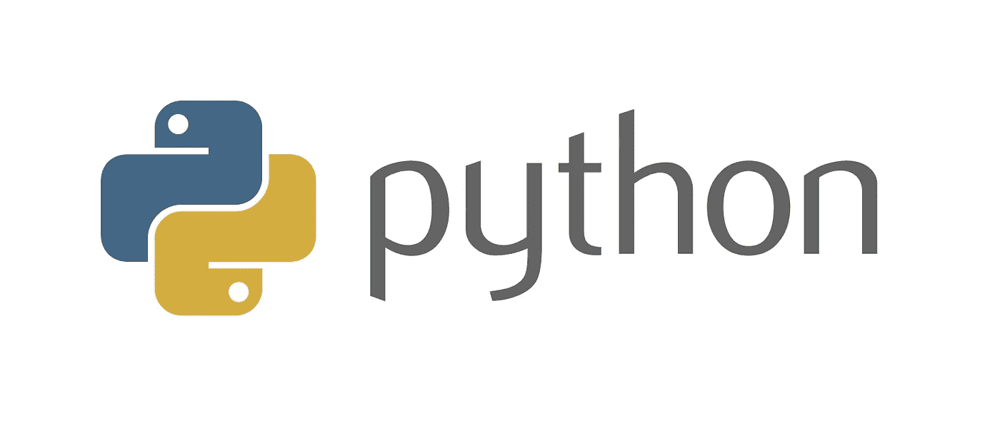
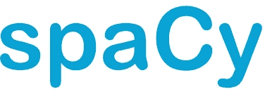
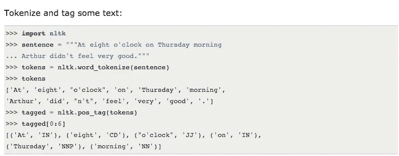
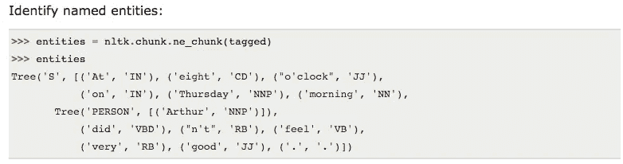
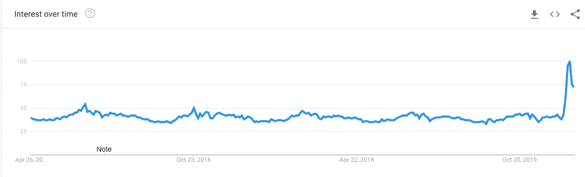

# 用于自然语言处理的 Python 库

> 原文：<https://towardsdatascience.com/python-libraries-for-natural-language-processing-be0e5a35dd64?source=collection_archive---------5----------------------->

## 用于自然语言处理的流行 python 库概述

用于自然语言处理的 Python 库

> “Python 从一开始就是 Google 的重要组成部分，并且随着系统的成长和发展而保持不变。如今，数十名谷歌工程师使用 Python，我们正在寻找更多掌握这种语言的人。”
> 
> **-彼得·诺威格**，**谷歌搜索质量总监**[T5](http://google.com/)

ython 是目前世界上最热门的编程语言之一，因为它可以优雅地与其他编程语言集成，并作为首选编程语言完美地融入大多数新项目理念。

Python 也是人工智能社区中一种非常受好评的语言，这使得它成为人工智能的几个分支的首选编程语言，如**软计算**、**机器学习**、**自然语言处理**等。

随着未来越来越倾向于采用人工智能和智能解决方案，开发不仅能理解我们的命令，还能与我们自然交流的系统的需求越来越高。

# 什么是 NLP？

没有单词和驱动这些单词的语法，任何语言都是不完整的。正如人与人之间的交流需要语言和符号一样，与计算机的互动也是如此。

通过点击选项与计算机进行交互的传统方法正慢慢被一种更无缝的方法淘汰，这种方法包括对话。这种现代的交流方式包括以更自然的方式与计算机交谈，因为我们倾向于用语言与其他人交谈。

> 作为人工智能的一个分支，自然语言处理定义了人类如何更直观地与计算机互动背后的科学。

这样一个领域背后的目的是确定如何让计算机理解和理解除了通常和合理定义的指令集之外的人类常用语言。

作为人工智能的一部分，NLP 在很大程度上依赖于机器学习，NLP 的过程是这样的:

●捕捉人类输入，包括文本输入或语音输入

●将语音数据转换成文本

●使用语法、解析技术、语义和类似方法处理文本，以识别数据的含义

●通过在屏幕上显示或通过音频播放，将处理后的输出传递给人类

# 用于自然语言处理的 Python 库

自然语言处理被认为是制造智能系统的许多关键方面之一。通过使用从现实世界中收集的数据来训练您的解决方案，您可以使其更快、更贴近用户，从而对您的客户群产生重要的洞察力。

在本文中，我们将了解 Python 如何提供一些最有用、最强大的库，以便在项目中利用自然语言处理的能力，以及它们的确切用途。

# ●空间

空间([来源](https://spacy.io/))

> Python 中工业级自然语言处理的开源库。

通常被认为是高级自然语言处理的专业级 [Python 库](/best-python-libraries-for-machine-learning-and-deep-learning-b0bd40c7e8c),[spaCy](https://spacy.io/)擅长处理难以置信的大规模信息提取任务。

spaCy 使用 **Python 和 Cython** 构建，结合了两种语言的优点、Python 的便利性和 Cython 的速度，提供了一流的 NLP 体验。spaCy 是一个简洁的库，旨在通过最大限度地减少花费在日常任务上的时间来完成工作。spaCy 的主要收获是:

●词性标注

●符号化

●依存解析

●句子分割

●实体和句子识别

●与深度学习无缝集成

●清理和规范化文本的方法

## **资源-**

*   [**空间文档**](https://spacy.io/docs/) —官方文档和快速入门指南。
*   [**SpaCy NLP 简介**](https://nicschrading.com/project/Intro-to-NLP-with-spaCy/) —展示 SpaCy 功能的简短教程。

 [## 空间 101:所有你需要知道的空间使用文档

### 最重要的概念，用简单的术语解释，不管你是 spaCy 新手，还是只想温习一些…

空间. io](https://spacy.io/usage/spacy-101/) 

# ● CoreNLP

Stanford CoreNLP 是一套为在你的项目中实现自然语言处理而构建的工具。最初**是用 Java** 编写的，CoreNLP 可以和其他语言一起工作，比如Python、JavaScript 等等。

它提供了几个语言特性，比如表达情感、提取实体之间的关系、标记句子结构、提供单词的基本形式等等。

用更花哨的术语来说，这些功能可以转化为词汇化、词性和词形标注、命名实体识别、标记化和句子拆分等更多功能。

如果您正在寻找一个 NLP 工具包，它是一个现代化的、健壮的、具有各种语法分析工具的工具包，这些工具定期更新并提供高质量的分析，那么它是一个完美的选择。

CoreNLP 的灵活特性允许它与其他语言很好地集成，使它成为满足您需求的平滑可扩展的功能性 NLP 选项。

## **资源-**

*   [**CoreNLP 文档**](http://stanfordnlp.github.io/CoreNLP/index.html) —官方文档和资源汇编。
*   [**CoreNLP 的 Python 包装器列表**](http://stanfordnlp.github.io/CoreNLP/other-languages.html#python) —由斯坦福 NLP 保持最新。

# ● **NLTK — T** 最广为人知的 NLP 图书馆

自然语言工具包的简称，NLTK 是 Python 的领先的和最好的自然语言处理库之一。它有超过 100 个语料库和相关的词汇资源，如 WordNet、Web 文本语料库、NPS Chat、SemCor、FrameNet 等等。

NLTK 的目标是通过**为 NLP 库提供分类、词干、标记、解析、分类语义推理和包装器等特性**，使学习和使用计算语言学变得更加容易。

这是一个免费的开源库，可以在 Windows、Mac OS 和 Linux 上使用，有大量的教程可以让你顺利进入 NLP 的世界。

**使用 NLTK 可以做的事情—**

NLTK —对一些文本进行标记和标记([源](http://www.nltk.org/))

NLTK —识别命名实体([源](http://www.nltk.org/))

**资源—**

*   [**NLTK 书**](http://www.nltk.org/book/) —用 NLTK 完成 Python 自然语言处理教程。
*   [**深入 NLTK**](http://textminingonline.com/dive-into-nltk-part-i-getting-started-with-nltk) —使用 NLTK 进行文本处理的详细 8 部分教程。

# ● Gensim

> [Gensim](https://radimrehurek.com/gensim/) 是用 Python 编写的用于**主题建模**、相似性检索和自然语言处理的库。

由**雷迪姆·řehůřek****于 2009 年开发的** Gensim 旨在擅长两件事，一个是自然语言处理，另一个是信息检索。它处理特定类别的大量数据，并从中提供非常精确的见解。

Gensim 为几种流行的算法提供了独立于内存的实现能力，例如**潜在狄利克雷分配****【LDA】****随机投影(RP)****潜在语义分析(LSA/LSI/LVD)** 和**分层狄利克雷过程(HDP)** 等等。

Gensim 附带了**流畅的 API 支持**，使与其他编程语言的集成变得轻而易举，而**丰富的文档**和**教程则在您的编程之旅中为您提供指导**。使用 Gensim 的先决条件是使用 NumPy 和 Scipy 包。

**资源-**

*   [**gensim 文档**](https://radimrehurek.com/gensim/) —官方文档和教程。教程页面非常有用。

# ● **PyNLPI**

> 关于 FoLiA XML 和许多其他常见 NLP 格式(CQL、Giza、Moses、ARPA、Timbl 等)的广泛功能。).

**读作“** [**菠萝**](https://github.com/proycon/pynlpl)**”**，是 Python 的开源自然语言处理库。PyNLPl 是各种任务的理想选择，包括构建简单模型、提取 n 元语法和频率列表，并支持复杂的数据类型和算法。

它还配备了对标准 NLP 文件格式的支持，如**摩西**、 **Timbl** 、**吉萨**等等。PyNLPl 的库由几个包组成，这些包详细介绍了它所提供的功能。

以下是其中的几个软件包:

● pynlpl.datatypes 增加了额外的数据类型

● pynlpl.formats.giza，用于从 GIZA++单词对齐中读取数据

● pynlpl.formats.tmbl 允许读取 Timbl 数据

● pynlpl.textprocessors 作为简单的标记器和 n-gram 提取

● pynlpl.formats.cgn 用于解析 cgn 词性标签

# ● **图案**

> Web(数据)挖掘/爬行和常见的 NLP 任务。

Pattern 主要是 Python 的一个 web 挖掘模块，包含了用于许多目的的工具，如数据挖掘、自然语言处理、机器学习和网络分析。

专注于模式的 NLP 方面，它很好地配备了任何 NLP 的基本功能，例如词性标记、n-grams、情感分析、WordNet、文本分类和标记化等等。

它完整地记录了超过 350 个单元测试和超过 50 个例子，让你马上开始使用它。对 web APIs 的支持可以轻松地与其他编程语言集成，从而扩展模式的功能。

**谷歌趋势—一段时间内的兴趣模式**

谷歌趋势-模式([来源](https://trends.google.com/trends/explore?date=today%205-y&geo=US&q=TextBlob))

# ●多语言

> 多语种和音译能力。

由 Rami Al-Rfou 开发的 Polyglot 是一个 Python 自然语言处理库，对于必须处理大量语言的应用程序来说是完美的。

由于支持一些传统的自然语言处理功能，如标记化、语言检测、词性标注等，它的每个自然语言处理功能都因支持多种语言而得到进一步增强。

对多种语言的支持使其成为本地化扮演重要角色的可行选择。它附带了详细的文档，简化了任何人的进入过程。

# ● **TextBlob**

Textblob ( [源](https://textblob.readthedocs.io/en/dev/))

Textblob 是另一个开源 Python 库，用于处理基于文本的数据，并通过其 API 提供与其他编程语言的平滑集成。如果您急于执行标准的 NLP 操作，Textblob 可以成为您的救星。它提供了许多自然语言处理库的标准特性，例如:

●词性标注

●情感分析

●分类

●符号化

● n 元语法

●单词变形

● WordNet 集成

●由谷歌翻译支持的语言翻译和检测

●单词和短语频率

●解析

●拼写纠正

●通过扩展添加新的模型或语言

它附带了全面的教程，使新的学习者的学习曲线相对平滑。

**资源-**

*   [**TextBlob 文档**](https://textblob.readthedocs.io/en/dev/index.html) —官方文档和快速入门指南。
*   [**使用 TextBlob 的自然语言处理基础知识**](http://rwet.decontextualize.com/book/textblob/) —使用 TextBlob 的优秀、简短的 NLP 速成班。

# 结论

与任何系统的交互都是基本的行为之一，应该始终关注于让这个过程对用户来说尽可能的无缝。随着对话系统逐渐成为标准，我们的解决方案需要识别我们的日常语言。自然语言处理使我们能够为计算机简化这一点，并创造出比今天更智能的下一代解决方案。在这个不断变化的世界中，Python 已经证明了自己有足够的能力来适应、创新和交付解决方案，以解决过去困扰我们的各种现代计算问题。

# 其他来源—

我希望这篇文章对你有用！如果您有兴趣了解更多信息，以下是附加资源:—

 [## 自然语言处理很好玩！

### 计算机如何理解人类语言

medium.com](https://medium.com/@ageitgey/natural-language-processing-is-fun-9a0bff37854e)  [## 🚀Python 中的自然语言处理速度快 100 倍

### 如何利用空间&快速自然语言处理的一点技巧

medium.com](https://medium.com/huggingface/100-times-faster-natural-language-processing-in-python-ee32033bdced)  [## 用于可解释机器学习的 Python 库

### 4 个用于更好地可视化、解释和诠释模型的库

towardsdatascience.com](/python-libraries-for-interpretable-machine-learning-c476a08ed2c7)  [## 数据科学的 10 大 Python 库

### 为您的数据科学探索提供一些很酷的帮助！

towardsdatascience.com](/top-10-python-libraries-for-data-science-cd82294ec266) 

> ***关于作者***
> 
> ***克莱尔 D*** *。在*[***digital ogy***](https://www.digitalogy.co/)***—****是一个内容制作者和营销人员。这是一个技术采购和定制匹配市场，根据全球各地的特定需求，将人们与预先筛选的&顶尖开发人员和设计师联系起来。连接****Digitalogy****on*[***Linkedin***](https://www.linkedin.com/company/digitalogy)*[***Twitter***](https://twitter.com/DigitalogyCorp)*[***insta gram***](https://www.instagram.com/digitalogycorp)*。***