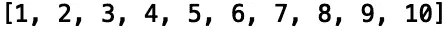
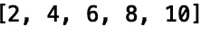
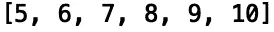
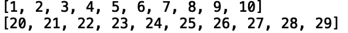
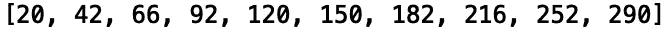
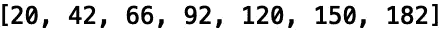

# Python 中的列表理解

> 原文：<https://towardsdatascience.com/python-list-comprehension-938ac36ad528?source=collection_archive---------56----------------------->

## 列表理解简介


[来源](https://unsplash.com/photos/UgA3Xvi3SkA)

Python 提供了列表理解结构，使得定义列表、过滤列表、基于现有列表创建新列表等等变得容易。与传统的“for-loops”相比，list comprehension 是用 python 创建列表的一种更简洁、可读性更强的替代方法。在这篇文章中，我们将讨论如何使用列表理解在 python 中创建列表。我们也将在每个例子中比较列表理解方法和使用传统的“for-loops”。

我们开始吧！

首先，让我们考虑在“for-loop”中生成 1-10 的正整数列表的任务。让我们初始化一个名为“pos_list”的列表:

```
pos_list = []
```

通过在“for-loop”中迭代“range()”方法返回的生成器，我们可以将值追加到该列表中:

```
for i in range(1, 11):
    pos_list.append(i)
```

让我们打印结果列表:

```
print(pos_list)
```



这很简单。现在假设我们想生成一个偶数整数的列表。我们可以添加一个条件来检查元素是否能被 2 整除，并仅在条件为真时追加:

```
even_list = []
for i in range(1, 11):
    if i%2 == 0:
        even_list.append(i)
```

让我们打印结果:

```
print(even_list)
```



虽然使用“for-loop”可以完成工作，但列表理解提供了一种更简单的方法，可以用更少的代码获得相同的结果。首先，让我们看看如何使用列表理解来生成正整数的原始列表:

```
lc_pos_list = [i for i in range(1,11)]
print(lc_pos_list)
```


将这与我们不得不使用“for-loop”的最初三行代码进行比较:

```
for i in range(1, 11):
    pos_list.append(i)
print(pos_list)
```

现在让我们使用列表理解来生成偶数列表:

```
lc_even_list = [i for i in range(1,11) if i%2]
print(lc_even_list)
```


不过，与使用“for-loops”的五行代码相比，这只使用了两行代码:

```
even_list = []
for i in range(1, 11):
    if i%2 == 0:
        even_list.append(i)
print(even_list)
```

我们也可以使用列表理解很容易地过滤列表。让我们考虑使用“for-loop”从正整数列表中过滤小于 5 的值的任务:

```
pos_list_gt_5 = []
for i in pos_list:
    if i >= 5:
      pos_list_gt_5.append(i)
print(pos_list_gt_5)
```



使用列表理解:

```
lc_pos_list_gt_5 = [i for i in pos_list if i >= 5]
print(lc_pos_list_gt_5)
```


如你所见，我们使用了更少的代码。接下来，让我们考虑使用列表理解来迭代多个列表的任务。假设我们有一个从 1 到 10 的整数列表，和另一个从 20 到 30 的整数列表:

```
pos_list2 = []
for i in range(20, 30):
    pos_list2.append(i)
print(pos_list)    
print(pos_list2)
```



让我们编写一个“for-loop ”,对两个列表和进行迭代，并将它们的元素的乘积追加到一个新列表中:

```
multiply_list = []
for i, j in zip(pos_list, pos_list2):
        multiply_list.append(i*j)

print(multiply_list)
```



我们可以使用列表理解来执行相同的操作:

```
lc_multiply_list = [i*j for i,j in zip(pos_list, pos_list2)]
print(lc_multiply_list)
```

我们甚至可以应用条件。让我们将乘积小于 200 的元素的乘积相加:

```
lc_multiply_list_filter = [i*j for i,j in zip(pos_list, pos_list2) if i*j < 200]
print(lc_multiply_list_filter)
```



我就讲到这里，但是我鼓励你自己去研究代码。

# 结论

总之，在这篇文章中，我们将讨论如何使用 python 中的列表理解来构造列表。我们表明，虽然我们可以使用“for-loops”完成相同的任务，但列表理解提供了一种更容易和更易读的方法来构建列表。我希望你觉得这篇文章有用/有趣。这篇文章中的代码可以在 [GitHub](https://github.com/spierre91/medium_code/blob/master/basic_python/list_comprehension.py) 上找到。感谢您的阅读！