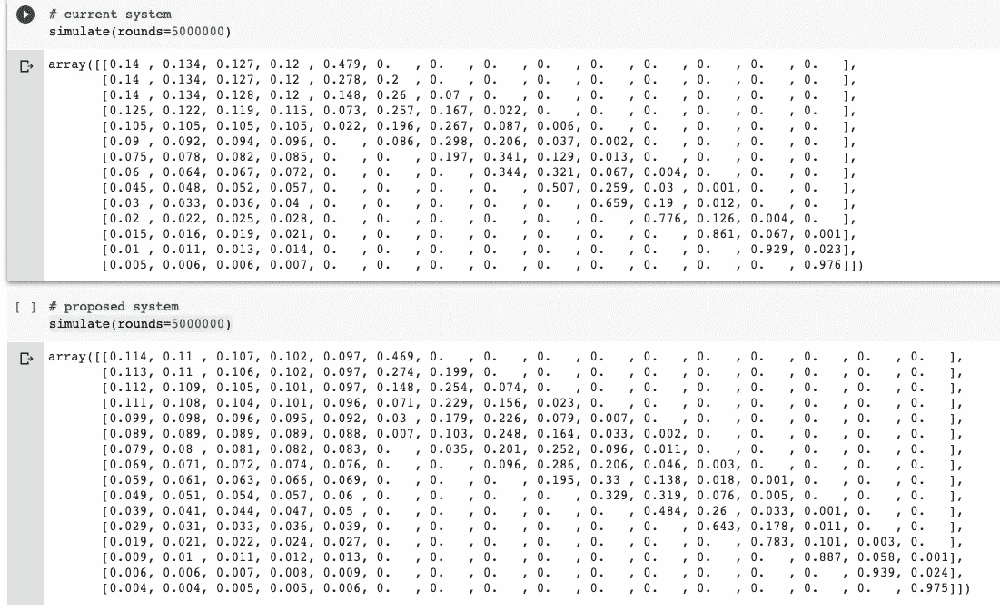

# Python:蒙特卡洛遇上体育分析

> 原文：<https://towardsdatascience.com/python-monte-carlo-meets-sports-analytics-12cf97f1a1d?source=collection_archive---------49----------------------->

## 使用模拟来收敛棘手的概率分布

信用:Pixabay

大约一个月前，当我在研究生院的最后一个学期和找工作的时候，我面试了一家体育分析公司。我的背景是商业分析，特别是在新颖的商业应用中使用 NLP、网络分析和推荐系统。总而言之，我不是理想的候选人。

在进入任何累人的数据科学面试问题之前，我接受了一次带回家的测试；这并不令人吃惊。许多公司知道这个过程可能成功也可能失败。因此存在一些固有的“我们只是在浪费时间”的风险。把测试带回家是公司消除这种风险的好方法；这对每个人都很好，除了求职者。如果你的提交被认为不令人满意，公司已经在你身上浪费了比预期更多的时间，并将立即转向下一个候选人。为您提供高质量的反馈是数据科学团队不必要的负担。在他们的辩护中，一些角色得到了成百上千的申请者。指导每个人如何做得更好是不可行的。尽管如此，作为一名数据科学家，执行大量的带回家测试并不一定能提高你的水平。让你进步的是从你的错误中学习——这是你的责任(*也是你自己的责任*)。)

我搞砸了带回家的考试，花了几个小时绞尽脑汁思考我本可以做得更好的地方，然后完全搁置了这个话题。直到昨晚我突然想到一个主意！不过我言过其实了，还是讨论一下面试问题吧。

## 在这次采访中，我需要(A)重现*当前的* NBA 彩票概率,( B)为修改后的彩票产生*新的*概率。

NBA 彩票的运作方式如下:球队按常规赛表现排名，最好的球队排在最后，最差的球队排在第一。我的意思是，在有限数量的球队被选为第一，第二，…第 n 选秀之后，剩下的*球队将按照他们常规赛表现的(相反)顺序(最好的最后，最差的第一— *希望让接下来的赛季更有趣*。)在实际的 NBA 选秀中，从 14 支球队中选出 4 支球队。在提议的草案系统中，必须从 16 支队伍中挑选出 5 支队伍。*

挑选队伍的方法是从彩票机中取出四个球，并确定球的独特*组合来自哪个队伍。然后球被重新插入(该组合已被使用，但这些相同的球参与了许多更独特的组合网尚未检索)。)每个团队都分配到不同数量的组合。最差的团队组合最多，而最好的团队组合最少。*

我完全不知道如何开始。我的统计知识较少植根于概率论，更多地与机器学习相结合。所以我做了一些谷歌搜索，发现了一篇 2020 平方的文章，以确定性的方式解决了离散概率分布。

 [## NBA 选秀彩票的概率是如何构建的

### 9 月 28 日，NBA 理事会批准了对 NBA 选秀抽签系统的修改。这些变化是…

squared2020.com](https://squared2020.com/2017/09/30/how-nba-draft-lottery-probabilities-are-constructed/) 

注意我说*确定性*的时候。这被证明是我心中的一个定位点。我决心理解这些方法、代码等，并复制我自己的方法。如果你跟随教程，你会注意到第一轮的选择只是，选择的概率(组合数除以总组合数。)第二轮的条件是*任何*其他队伍先被选中。并且这个过程在前四个选秀中重复。然而，一旦我们到了第五轮，我们不再选择队伍，而是简单地将剩下的队伍按照他们当前的顺序添加到被选择的队伍中。(我从来没有通过第四轮选秀！)

确定性地解决这个问题是一场噩梦，也是对一个人掌握概率论的真实证明。这就是我没有被选中参加下一轮面试的原因。

大约一个月后，我坐在沙发上，突然想到——*也许我应该用蒙特卡罗方法从分布中取样？我暂停了在网飞的冒险，开始写代码。结果呢？这是可行的，当彩票设计发生变化时，它比确定性地写这个更具可扩展性。*

## 我的方法

Python 非常适合生成随机数。事实上，您可以从给定概率分布的池中随机选择一个值。给定分配给每个团队的组合数量，确定它们的概率是微不足道的。

我定义了两个不同的函数，*试验*和*模拟*。选拔赛是抽签的一次试运行，根据他们的选择概率选出四名候选人，剩下的队伍被添加到名单中。在我的设计中，当一个给定的团队被选中时，我将他们的值编入索引，并从 pool 和 dist 变量(列表)中与该索引对应的元素中删除。但是，一旦从 dist 变量中删除了一个概率，它的总和就不再是 1。我没有考虑到这一点，但很高兴地得知 python 的随机包将根据需要为您调整这一点！

模拟，有点棘手。给定提供的回合数，试验函数将被执行 x 次，结果将被附加到一个列表中。您将得到一个嵌套列表，其中外部列表包含 x 个元素，每个 x 元素都是长度为 14 的试运行。在这一点上，我们使用列表理解遍历排名的每个*位置*。我们不是查看 1000 个元素的嵌套列表(每个元素包含 14 个值)，而是创建 14 个元素的嵌套列表(每个元素包含 1000 个值。)这是真正的*秘制酱料。*第一份这样的名单将包含*第一次选秀被选中的每支球队*。第二个这样的列表将包含第二次选秀被抽样的每支球队。诸如此类。

使用 Counter 函数(来自 collections)，可以得到一个*的计数，哪个队在哪个地方呆了多少次？*“从这里开始，只需将每个计数除以总和(模拟的总数)就可以得到每个位置的概率分布。你会注意到这个矩阵是面向列的，而 NBA 官方的彩票概率分布是面向行的。我们只需将嵌套列表传递给 numpy 并进行转置。嘣。完成了。但愿我上个月就想到了这一点！

在下面的最终代码中，我注释掉了常规赛变量，并在每行下面定义了一个建议的系统变量。(实际上，它在建议的系统下找到了分布。)经过 5，000，000 次迭代，它收敛于精确值！

结果(提示，与[维基百科](https://en.wikipedia.org/wiki/NBA_draft_lottery)比较)

感谢阅读！如果你认为我的内容没问题，请订阅:)