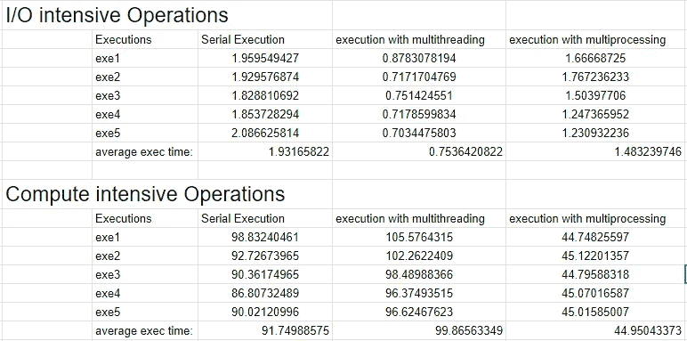

# Python 多线程与多处理

> 原文：<https://towardsdatascience.com/python-multi-threading-vs-multi-processing-1e2561eb8a24?source=collection_archive---------18----------------------->

## 基准测试并发任务执行的两种方法:Python 中的多线程和多处理。


克里斯·里德在 Unsplash.com 的照片

当处理大量要执行的任务时，人们宁愿不要顺序执行任务，因为这是一个漫长、缓慢且相当无聊的过程。相反，我们想要的是我们的程序同时启动所有的任务，这样它们可以并排完成。

并行性或并发任务执行并不是一个新概念，大多数主流语言都支持它。Python 也不例外，它确实提供了一个非常简洁的模块，可以很容易地用来以并行或并发的方式运行任务。我在这篇文章中的目标是提供关于 python 中多线程和多处理如何工作的简要概述，并且我将对两者的性能进行基准测试。本文将涵盖以下主题:

*   并发和并行的区别。
*   Python 中的多线程。
*   Python 中的多处理。
*   多线程和多处理的基准测试。
*   什么样的节目用哪种方法比较好。

# 并发和并行的区别

并发性和并行性是两个经常被混淆的术语，它们虽然相同，但却有着非常不同的含义。

> 并发本质上被定义为**同时处理**大量工作或同一程序的不同工作单元。

在编程环境中，同一程序的不同部分被分配给处理器的不同内核，这些内核独立执行每个部分并相互通信，从而同时完成更多的工作。

另一方面，并行性可以简单地定义为

> **同时做**同一程序的大量工作以加快执行时间。

在编程环境中，同一程序的不同部分并行执行，并且每个部分的执行同时发生，因此加快了程序的执行时间。

# Python 中的多线程

在 Python 中，我们可以使用 **concurrent.futures** 模块实现多线程的功能。它为启动异步任务提供了一个高级 API。 **ThreadPoolExecutor** 类提供了一个启动和管理线程的接口。

```
import concurrent.futures
with concurrent.futures.ThreadPoolExecutor() as executor:
    executor.map(function_name, iterable)
```

我们用上下文管理器创建 executor 对象，并在我们想要并行执行的方法上调用 **map** 函数。 **map** 函数将为输入 iterable 的每个值创建一个线程。

## Python 中多线程的工作原理:

尽管我们说 python 支持多线程，但是幕后发生的事情却非常不同。在 python 中，每个进程都在一个内核上执行。因此，当我们创建同一进程的多个线程时，每个线程都在同一内核上执行，因此**共享资源和内存空间**。为了防止一个线程因为共享相同的资源而改变另一个线程的执行结果，Python 引入了**“全局解释器锁”**的概念。

本质上，它一次只允许一个线程使用共享的内存空间和资源，并在线程之间进行智能上下文切换，因此没有线程可以改变其他线程的工作。因此，在 python 中使用多线程的并行性是一个相当牵强的术语，因为我们并没有以这种方式实现真正的并行性。

# Python 中的多重处理

在 Python 中，我们可以使用同一个 **concurrent.futures** 模块实现多处理的功能。 **ProcessPoolExecutor** 类提供了一个启动和管理多个进程的接口。

```
import concurrent.futures
with concurrent.futures.ProcessPoolExecutor() as executor:
    executor.map(function_name, iterable)
```

就像在多线程中一样，我们用上下文管理器创建 executor 对象，并在我们想要并行执行的方法上调用 **map** 函数。 **map** 函数将为输入 iterable 的每个值创建一个过程。

## Python 中的多处理是如何工作的:

在多处理的情况下，每个进程在不同的内核上运行，具体取决于机器上的内核数量。因此，在进行多重处理时不需要 GIL，因为所有进程都是独立的。因此，多处理实际上为我们提供了 python 中的实际并行性。但它只有在正确的情况下才会起作用。如果我们有 12 个任务和一个 4 核机器，那么每个核心一个进程将是理想的情况，给出我们想要的真正的并行性。如果我们产生的进程多于内核的数量，每个进程将竞争资源，这将导致上下文切换，从而导致并发性而不是并行性。

# Python 中多线程和多处理的基准测试

在这一节中，我将分享我通过两个不同的实验获得的结果，以确定哪种并发执行方法更好，以及适合哪种任务。

大体上，我们将要执行的任务分为涉及 CPU 上大量计算的**计算密集型任务**或涉及大量 I/O 操作的 **I/O 密集型任务**，例如在目录之间移动文件或发出大量 HTTP 请求。

## I/O 密集型任务

以下是我对 I/O 密集型任务的实现。

这个方法执行程序中的 I/O 操作。我们得到一个图像文件名的列表，并一次一个地将它传递给这个方法。它只是打开文件，执行灰度转换，创建图像的缩略图，并将其保存在已处理的目录中。

我们首先通过简单的串行执行来执行这个方法，然后通过多线程和多处理来执行。

## 计算密集型任务

以下是我对计算密集型任务的实现。

调用此方法时，计数变量会随着 9⁹.范围内的每个值而递增

同样，我们首先通过简单的串行执行，然后通过多线程，再通过多处理来执行这个方法。对于每个场景，**compute _ intensive _ process**方法被调用 4 次。

## 基准测试结果

在对 I/O 密集型操作和计算密集型操作执行上述方法后，获得了以下结果:



正如我们所见，在 I/O 密集型操作中，串行执行的性能最差，其次是多处理，多线程执行的性能次之。尽管我们说过多线程实际上并没有实现真正意义上的并行，但在 I/O 操作的情况下，我们并没有使用 CPU 进行大量计算，而是发出 I/O 请求并等待响应。

**为什么多重处理在 I/O 操作的情况下性能很差？**

原因是新进程的产生本身就是一个昂贵的操作，因此增加了创建和执行多个任务的开销。但它的性能仍然优于串行执行。

然而，在计算密集型操作的情况下，我们可以清楚地看到，多处理提供了最佳性能，令人惊讶的是，串行执行提供了第二好的性能，而多线程提供了最差的性能。

如前所述，单个进程在单个内核上执行，因此以并发或并行方式执行。

**为什么多线程的性能不如串行执行？**

这是因为一次只执行一个线程，线程之间的上下文切换会增加开销，从而增加总开销，降低整体性能。例如，如果串行执行需要 100 秒来完成 5 个任务，那么以串行方式执行的多线程需要 100 秒+上下文开销来完成同样的 5 个任务。

# 结论

正如我们在上面看到的，多线程和多处理在完成特定类型的任务时都有自己的优势。对于涉及大量 I/O 操作的任务，最好使用多线程；对于涉及大量 CPU 计算的任务，最好使用多线程。

我的这个特殊用例的完整项目可以在我的 GitHub 简介[这里](https://github.com/furqanshahid85-python/Python-Multi_Threading-Vs-Multi_Processing)找到。

[](https://github.com/furqanshahid85-python/Python-Multi_Threading-Vs-Multi_Processing) [## furqanshahid 85-Python/Python-多线程-Vs-多线程处理

### 在本模块中，我们将对 python 的多线程和多处理进行基准测试。我们正在进行 I/O 操作和计算…

github.com](https://github.com/furqanshahid85-python/Python-Multi_Threading-Vs-Multi_Processing) 

如果你喜欢这篇文章，请在 medium 上关注我，看看我的其他精彩文章。就这些了谢谢:)。