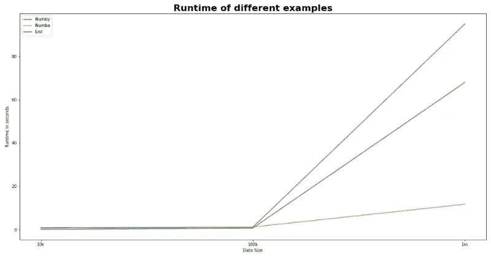

# Python Numba 或 NumPy:理解区别

> 原文：<https://towardsdatascience.com/python-numba-or-numpy-understand-the-differences-b448dabd5b5b?source=collection_archive---------7----------------------->

## 有例子支持的简短描述。


帕特里克·托马索在 [Unsplash](https://unsplash.com/s/photos/books?utm_source=unsplash&utm_medium=referral&utm_content=creditCopyText) 上的照片

N umPy 和 Numba 是两个很棒的用于矩阵计算的 Python 包。这两种方法都可以有效地处理多维矩阵。在 Python 中，列表的创建是动态的。向这样的列表追加值将动态地增加矩阵的大小。NumPy 的工作方式不同。它以固定的大小构建数组对象。添加或删除任何元素都意味着在内存中创建一个全新的数组。在本文中，我们正在寻找一种有效的对象结构来解决一个简单的问题。

要讨论的不仅是如何创建数组对象，还有如何对这些数组应用科学操作，尤其是扫描数组。当我们对它们应用一些昂贵的逻辑时，性能是拥有这些库的主要动机。例如，当我们开发机器学习(ML)模型时，尤其是在生产环境中，我们会花费合理的时间来优化生成训练数据的代码，应用任何所需的数据转换或任何其他 ETL 操作。使用一些编译过的编程语言如 C 或 Fortran 是理想的，但是这需要我们到处构建一些包装器来将管道返回到 Python。

## 在 Python 中实现数组

让我们举一个简单的例子:首先，我们将用 python 创建一个包含一千万个值的简单列表。较大的数字会很容易地突出性能上的差异。

```
# We need to import the random package to fillup the array with some random values.import random
array = []
```

我用的是 IPython 如果你是在 Jupyter 笔记本上运行这段代码，那么我推荐使用内置的 magic (time)。

```
%%time
for i in range(0,10000000):
    val = random.randint(0,1000)
    array.append(val)
```

## 计算频率

让我们在这个列表中搜索有多少行包含值 999？

```
%%time
freq = 0 
for value in array: 
    if value == 999: 
        freq = freq + 1
```

我的机器用了 461 毫秒，这个函数找到了值 999 的 10184 个实例。现在让我们看看如何使用 NumPy 数组完成同样的工作。

```
import numpy as np# We use the same list created earlier: 
np_array = np.array(array)
# To get a sense of the size of the bumpy array, simply call up the function 'shape'
print('The size of the numpy array: ', np_array.shape)
```

搜索 NumPy 数组中包含值 999 的行只有一行代码:

```
%%time
result = np.where(np_array == 999)
```

除了编写一些指令之外，我的机器花了 12.6 ms 来完成与列表数组相同的工作。

请注意，NumPy 数组的索引机制类似于任何普通的 Python 列表。

现在，我们将通过对数组值引入一些数学运算来使这个例子更有趣一些。首先，我们将从原始列表中构造三个向量(X，Y，Z ),然后使用 NumPy 做同样的工作。

```
def apply_operation_list(array): 
    # We need to build an X vector from the original array
    # The math operations in this function represents some random logic.
    x_array = [] 
    for array_v in array: 
        x_array.append(array_v * 2)

    # Building the Y vector
    y_array = []
    for array_v, x_array_v in zip(array, x_array): 
        y_array.append(array_v + x_array_v)

    # Building the Z vector
    z_array = []
    for array_v, x_array_v, y_array_v in zip(array, x_array, y_array):
        if x_array_v == 0: 
            z_array.append(0)
        else: 
            z_array.append((array_v - x_array_v ) + y_array_v)

    return x_array, y_array, z_array%%time
x_array, y_array, z_array = apply_operation_list(array)
```

在列表上应用操作花费了 3.01 秒。

让我们用 **Numpy** 定义同样的函数:

```
def apply_operation_numpy(array): 
    # We need to build an X vector from the original array
    # The math operations in this function represent some random logic.
    x_array = array * 2

    # Building the Y vector
    y_array = array + x_array

    # Building the Z vector
    z_array = ( array - x_array ) + y_array

    return x_array, y_array, z_array
```

使用 Numpy，只用了 132 ms。

# **数字巴**


原始照片由 [Faris Mohammed](https://unsplash.com/@pkmfaris?utm_source=unsplash&utm_medium=referral&utm_content=creditCopyText) 在 [Unsplash](https://unsplash.com/@pkmfaris?utm_source=unsplash&utm_medium=referral&utm_content=creditCopyText) 上拍摄

Numba 与 Python 配合得非常好，它给了你使用你最喜欢的数学库的特权，但是要编译成本机指令[2]。使用 Numba 很简单，不需要您改变编写函数的方式:

```
# Loading the Numba package
# Jit tells numba the function we want to compile
from numba import jit
```

请注意，与上面定义的 Numpy 函数相比，我们需要做的所有更改。

```
[@jit](http://twitter.com/jit)
def apply_operation_numba(array): 
    # We need to build an X vector from the original array
    # The math operations in this function represents some random logic.
    x_array = array * 2

    # Building the Y vector
    y_array = array + x_array

    # Building the Z vector
    z_array = ( array - x_array ) + y_array

    return x_array, y_array, z_array
```

使用 Numba，计算三个向量只需要 71.5 毫秒。

# 选哪个？

> “NumPy 是使用 Python 进行科学计算的基础包。其中包含:一个强大的 N 维数组对象、复杂的(广播)函数、集成 C/C++和 Fortran 代码的工具、有用的线性代数、傅立叶变换和随机数功能”[1]

NumPy 是一个巨大的容器，可以压缩向量空间并提供更有效的数组。最显著的优势是那些容器在执行数组操作时的性能。

另一方面，Numba 旨在提供镜像 python 函数的本机代码。Python 可以被看作 Numba API 代码的包装器。根据我的经验，每当已经提供的 Numpy API 不支持我们在向量上执行的操作时，我们就使用 Numba。如果实现的定制函数在我们的环境中不够快，那么 Numba 可以帮助我们在 Python 解释器中生成函数。这也是来自 Numba [文档](http://numba.pydata.org/numba-doc/0.12/tutorial_numpy_and_numba.html)的建议。

前面提供的例子没有显示出差异有多大？这是真的，因为我们只搜索单个值的频率。让我们通过计算一列中所有值的频率来重复这个实验。

在 Python 中，避免嵌套循环(O^2)的最有效方法是使用函数 *count()* 。只需一行代码，我们就可以计算整列的频率:

```
%%time
count = {x:x_array.count(x) for x in x_array}
```

但是，根据您的处理能力，这个函数可能需要几个小时来完成 1000 万条记录。接下来让我们看看 Numpy 能提供什么:

```
%%time
x_elements_np, x_counts_np = np.unique(x_array_np, return_counts=True)
```

使用 **Numpy** 计算一个百万值列的频率需要 388 毫秒。一个大的性能救济！请注意，该函数仅通过计算不同值的频率来增强。这个例子说明了在大数据环境中使用嵌套循环是多么不现实。

直到最近，Numba 还不支持 np.unique()函数，但如果与 return_counts 一起使用，您仍然不会得到任何好处。这只是为了说明有时 Numpy 可能是最好的选择。

最后，接下来的两个图显示了使用不同数据对象结构的运行时性能。x 轴代表数据大小从 10，000 行到 10 亿行的增量。


下图显示了 Numby with Numba 库的性能。请注意，该数字可能因数据大小而异。图中的数字表示重复实验五次的平均值。


# 更多示例

## 计算奇异值分解

频率示例只是一个可能不足以给人留下深刻印象的应用，所以让我们选择 SVD 作为另一个示例。SVD 是一种众所周知的无监督学习算法。它允许我们将一个大矩阵分解成多个小矩阵的乘积。奇异值分解在最大似然法中有许多应用，用于降低维数。[这里](/svd-8c2f72e264f)是一篇推荐文章，供进一步阅读。

下面的例子只使用了两个维度(列),行数与前面的例子相同。

```
from scipy.linalg import svd# We will consider in this example only two dimensions. 
# m x 2 
# U: m x r 
# s: Diagonal matrix r x r
# VT: n x r
U, s, VT = svd(array_np[:, 0:2])
Sigma = np.zeros((array_np.shape[0], 2))
Sigma[:2, :2] = np.diag(s)
```

如果您尝试运行该代码，您可能会得到与下面的失败类似的错误:“ValueError:需要太大的工作数组—无法使用标准的 32 位 LAPACK 执行计算。”。这是因为 lapack-lite 的内部实现使用`int`作为索引。对于像我们的数组这样的大小，它肯定会导致溢出。我们要么减小向量的大小，要么使用另一种算法。如果 SVD 函数与 Numba 一起使用，我们也不会得到任何明显的好处，因为我们调用的是 LAPACK SVD 函数。

## 矩阵乘法

矩阵乘法是另一个展示 Numba 如何有助于提高处理时间的例子。即使没有 Cuda，我们也可以实现更好的性能。让我们一步步来看这个例子。正如我们之前所做的，我们将使用 Python list 实现一个函数。

```
def matrix_multiplication(A,B):
    row, col_A = A.shape
    col_B = B.shape[1] result = np.zeros((row,col_B)) for i in range(0,row):
        for j in range(0,col_B):
            for k in range(0,col_A):
                result[i,j] += A[i,k]*B[k,j] 
    return result
```

对于 1000 万行，列表处理乘法运算相当快。运行时间只有 1 分 7 秒。使用 Numpy，完成同样的工作需要 95 秒。

```
def matrix_multiplication_numpy(A,B):
    result = np.dot(A,B)
    return result %%time
result = matrix_multiplication_numpy(array_np, array_np)
```

现在用 Numba 代替 Numby，我们用一个简单的函数减少了高成本的乘法运算，结果只用了 68 秒，减少了 28%的时间。

```
[@jit](http://twitter.com/jit)
def matrix_multiplication_numba(A, B, result):
    for i in range(result.shape[0]):
        for j in range(result.shape[1]):
            tmp = 0.
            for k in range(A.shape[1]):
                tmp += A[i, k] * B[k, j]
            result[i, j] = tmp
```

下图显示了使用 Python 列表、Numby 和 Numba 库的矩阵乘法的性能。



本出版物中提供的示例已在 15 英寸 2018 MacBook Pro 上运行，容量为 16 GB，使用 anaconda 发行版。这些例子中使用的代码可以在 [my Github repo](https://github.com/malhamid/Python-useful-tools/blob/master/NumPy_Numba_comparisons.ipynb) 中找到。使用 GPU 环境可以提高性能，但在这次比较中没有考虑到这一点。

# 参考

NumPy 官方网站，可在线访问 https://numpy.org

Numba 官方网站，可在 http://numba.pydata.org[在线访问](http://numba.pydata.org)