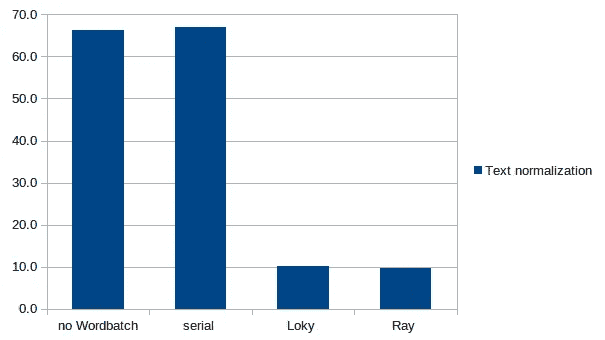
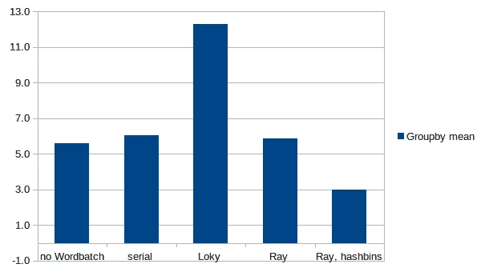
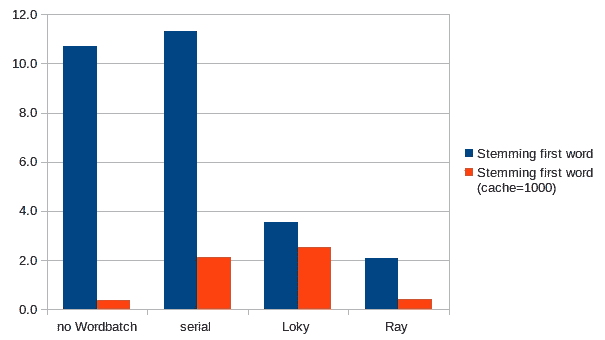
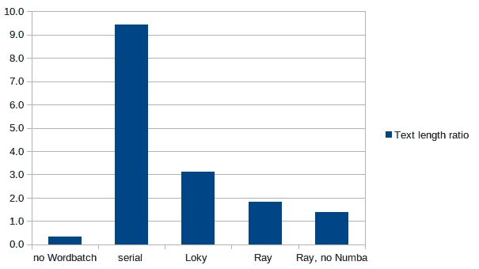

# 使用 Wordbatch Apply 的 Python 单行分布式加速

> 原文：<https://towardsdatascience.com/python-one-liner-distributed-acceleration-with-wordbatch-apply-efccecec22dd?source=collection_archive---------15----------------------->

## *使用 Wordbatch Apply-decorator 通过分布式 Map-Reduce 处理任何函数*


# Python 单行分布式加速

## 并行分布式 Python

由于半导体制造工艺的进步，计算硬件正在经历一个快速发展的时期，64 核消费 CPU 和 80 核服务器 CPU 将于今年上市。在经历了十年的停滞发展后，这给 CPU 性能带来了质的飞跃。

在 Python 程序中利用这种增加的并行计算能力最好是使用多处理库，因为全局解释器锁(GIL)使高效的线程级并行变得复杂。然而，多处理限于单个计算节点，并且设置多处理任务需要为要并行化的每个任务提供额外的样板代码。

最近的分布式 Python 处理框架，如 [Ray](https://github.com/ray-project/ray) 、 [Dask](https://github.com/dask/dask) 和 [Spark](https://github.com/apache/spark) 支持 Python 进程和数据的分布，很像多处理，但跨越了一个工人网络。Wordbatch 是一个工具包，支持将这些框架用作可交换的分布式后端。它提供了 orchestrator 类批处理程序，该程序将处理任务的管道分布在分布式后端或本地后端，如多处理或韩一菲。最基本的管道是 Apply-class，它接受一个输入函数，并在后端将其作为单个 Map-Reduce 操作运行。

## 简单的分布式 Map-Reduce 与应用装饰器

Apply 是一个最小的处理管道，它接受一个函数或方法，并将其作为对任何可迭代数据(如列表、Numpy 数组、Pandas 系列或 DataFrame)的 minibatch Map-Reduce 操作来执行。从 [Wordbatch 1.4.4](https://github.com/anttttti/Wordbatch/releases/tag/1.4.4) 开始，你可以导入一个装饰器包装器来应用，称为 decorator_apply，或者简单地导入为 Apply。Apply 可以用作 Python“@”装饰器，或者在函数上调用它来分发，就像本文中所做的那样。简单来说:

```
**from** wordbatch.pipelines **import** decorator_apply **as** apply
results = apply(function_or_method)(iterable_data)
```

这为列表操作产生了一个单行的 Map-Reduce 约定，可以方便地用于整个计算密集型 Python 程序，特别是人工智能和数据科学管道。

上面的例子使用默认的 Python 多处理后端，所有可用的内核都在计算节点上。我们可以通过传递一个已经用后端初始化的批处理程序对象来选择后端，也可以选择传递用于分布式处理的后端句柄。使用 Ray，这将按如下方式完成:

```
**import** ray
ray.init(redis_address=IP+":"+PORT) # Or ray.init() for local-only
batcher = Batcher(backend="ray", backend_handle=ray)results = apply(function_or_method, batcher)(iterable_data)
```

通过更改 Batcher 的 backend 和 backend_handle 参数，可以很容易地选择后端。事实上，后端是可交换的，因此只需在处理运行之间更改 batcher.backend 和 batcher.backend_handle 属性就可以更改调度程序。

Apply 最初是作为一个基本的最小管道模板添加到 Wordbatch 的。然而，如熟悉 Map-Reduce 框架的人所知，整个数据处理流水线可以作为大型计算节点网络上的 Map-Reduce 操作来执行。除了这篇博文中展示的特性工程管道，Apply 的其他实际任务包括分发:

*   通过数据/参数子集的人工智能模型训练
*   基于数据/参数子集的人工智能模型推理
*   按输入子集划分的一般计算密集型函数
*   通过超参数配置进行超参数优化

以下代码片段改编自[基准测试脚本](https://github.com/anttttti/Wordbatch/blob/master/scripts/decorator_test.py)，该脚本使用不同的后端调度程序运行基准测试。这些例子可以很容易地调整为现实世界的用例。

## 加速全球和本地功能

作为第一个例子，我们可以将一个**全局函数**“normalize _ text”分布在一个可迭代的文本字符串上，并将结果作为列“text”存储在数据帧“df”中:

```
**def** normalize_text(text):
   text= **" "**.join([word **for** word **in** re.compile(**'[\W+]'**).sub(**" "**,text.lower()).strip().split() **if** len(word)>1])
   **return** textdf[**'text'**] = apply(normalize_text, batcher)(texts)
```

对全局函数和变量的引用会自动发送到每个新进程。这使得所有必需对象的序列化变得微不足道，但是对于较长的程序，留在全局命名空间中的不必要变量会增加并行化开销。**局部函数**的用法和全局函数一样，但是标准的 Python 多处理不会序列化局部函数。多重处理的韩一菲分叉和分布式后端将处理本地功能。

## Lambda 函数和对象方法

其他类型的函数也同样容易加速，只是有一些小问题。我们可以加速一个λ函数:

```
df[**'first_word'**] = apply(**lambda** x: x.split(**" "**)[0], batcher)(df[**'text'**])
```

就像本地函数一样，lambda 函数不是由标准 Python 多处理序列化的。有很多解决方法，比如使用韩一菲，或者只是将 lambda 函数定义为一个全局函数。

一个**对象方法**可以用同样的方式加速:

```
**from** nltk.stem.porter **import** PorterStemmer
stemmer= PorterStemmer()df[**'first_word_stemmed'**] = apply(stemmer.stem)(df[**'first_word'**])
```

使用对象方法时，方法调用不会对原始对象进行更新，因为该方法是在并行副本上执行的。如果需要更改，Apply 的基本用法是不够的。在许多情况下，一种变通方法是使用更复杂的管道，既处理已处理的列表数据，又更新并行化的对象。

## 熊猫集团运营部

最后，Pandas GroupBy 聚合是一种非常常见的数据处理操作，经常形成人工智能和数据科学处理管道中的瓶颈，例如特征工程任务。这里有几种使用 Apply 的方法，例如:

```
batcher.minibatch_size = 200
group_ids, groups = zip(*df[[**'first_word_stemmed'**, **'text'**]].groupby(**'first_word_stemmed'**))
res = apply(**lambda** x: x[**'text'**].str.len().agg(**'mean'**), batcher)(groups)
df[**'first_word_stemmed_mean_text_len'**] = df[**'first_word_stemmed'**].map(
   {x: y **for** x, y **in** zip(group_ids, res)})
```

使用 GroupBy 的组 id 将聚集结果映射回原始数据帧。为了清楚起见，操作扩展为三行。Batcher 的 minibatch 大小从默认的 20000 修改为 200，因为与原始 DataFrame 行相比，需要迭代的组数量相对较少。

任何按组并行化的 GroupBy 操作的一个问题是，真实数据的组分布不均匀，通常遵循幂律分布，大多数组只有很少的成员。这通常会抵消并行化带来的任何好处，因为与收益相比，简单的按组操作会导致较大的并行化开销。一个简单的非最优解决方案是通过散列和宁滨来绑定分组变量，以产生一个不太稀疏的分组变量，然后在每个绑定的 GroupBy 内进行原始的 GroupBy 操作，如下所示:

```
batcher.minibatch_size = 10
df[**'first_word_stemmed_hashbin'**] = [hash(x) % 500 **for** x **in** df[**'first_word_stemmed'**]]
_, groups = zip(*df[[**'first_word_stemmed'**, **'text'**, 
**'first_word_stemmed_hashbin'**]].groupby(**'first_word_stemmed_hashbin'**))
res = pd.concat(apply(**lambda** x: x.groupby(**'first_word_stemmed'**).apply(**lambda** z: z[**'text'**].str.len().agg(**'mean'**)), batcher)(groups))
df[**'first_word_stemmed_mean_text_len'**] = df[**'first_word_stemmed'**].map(res)
```

与未绑定的并行 GroupBy 相比,“first_word_stemmed”变量现在是在每个小批内处理的未绑定变量，而“first_word_stemmed_hashbin”是将数据拆分到分布式小批中的已绑定分组变量。这里，500 个箱用于宁滨变量，批次的小批量大小减少到 10，因为每个小批量现在平均有更多的数据。这些的最佳值取决于数据。

# 迷你批处理加速选项:缓存和 Numba 矢量化

Apply 还提供了通过缓存和矢量化实现每迷你批次加速的基本选项。Cache 使用所选大小的 functools.lru_cache 来存储每个已处理的 minibatch 中的结果，并且应该在有多个重复值并且每个函数的计算成本都很高时使用。矢量化使用函数的 Numba 矢量化，可以在输入和输出变量类型事先已知的情况下使用。

以词干提取为例，可以简单地添加缓存:

```
df[**'first_word_stemmed'**] = apply(stemmer.stem, cache=1000)(df[**'first_word'**])
```

运行加速选项、后端和任务的组合揭示了一些需要解决方法的边缘情况。例如，用 lru_cache 缓存不能直接处理数据帧，因为数据帧是可变的，而 lru_cache 只接受不可变的输入数据。

对于基本情况，支持使用 Numba 加速小批量处理。下面显示了一个具有两个输入变量列的示例:

```
**def** div(x, y):
   **return** 0 **if** y==0 **else** x / ydf[**'len_text'**] = df[**'text'**].str.len().astype(int)
df[**'len_text_normalized'**] = df[**'text_normalized'**].str.len().astype(int)#Without Wordbatch, plain zip comprehension
df[**'len_ratio'**] = [div(x, y) **for** x, y **in** zip(df[**'len_text'**], df[**'len_text_normalized'**])]#With Batcher, no Numba
df[**'len_ratio'**] = apply(**lambda** x:div(*x), batcher)(df[[**'len_text'**, 
**'len_text_normalized'**]].values)#With Batcher and Numba vectorization
df[**'len_ratio'**] = apply(div, batcher, vectorize=[float64(int64, int64)])(df[[**'len_text'**, **'len_text_normalized'**]].values)
```

这里，用于向量化“div”函数的 Numba 变量类型被定义为参数“vectorize=[float64(int64，int 64)”]。Float64 定义输出变量类型，int64s 定义输入变量类型。Batcher 的输入通过从 DataFrame 列“len_text”和“len_text_normalized”中选择二维 Numpy 数组来构造。

Numba 的主要警告是，它仍然不是一个完全开发的框架，对于比这个更复杂的例子，需要很好地理解 Numba 的内部结构。例如，对数组输入进行矢量化需要 Numba guvectorize，而不是矢量化装饰器，并且需要进行一些更改。Numba 可以为数字多维数组操作提供超过原生 Python 代码的显著加速，包括使用 Cuda 的 GPU 加速。但是由于这些设置和扩展都很复杂，一个更有前途的小批量加速方法可能是使用用 C、Cython 或 Rust 等完全低级语言编写的 Python 扩展。

# 基准

可以将加速比与没有应用的基线函数进行比较，并与批处理程序的不同调度器后端进行比较。下面的数字是在每个后端分别运行[基准脚本](https://github.com/anttttti/Wordbatch/blob/master/scripts/decorator_test.py)得到的。测试时间来自使用单个 i9–9900k CPU，具有 8 个内核和 16 个线程，所有内核均以 4.9GHz 运行。所有测试都是在来自 Tripadvisor 点评的超过 128 万行文本数据上进行的，除了 GroupBy 聚合之外，还使用了 5000 个小批量的函数。

第一个示例应用于分发全局文本规范化函数。这为每个被处理的字符串做了相对复杂的处理，所以韩一菲和射线后端的加速几乎是核心线性的，射线的加速是 6.9 倍，韩一菲的加速是 6.6 倍。



继续使用 lambda 函数分割每个 textline 的第一个单词，使用 object 方法对第一个单词进行词干处理，我们获得了较小的加速，但仍然比不使用 Wordbatch 或使用单个进程作为后端要快好几倍。对于分割，韩一菲加速了 1.8 倍，雷加速了 3.2 倍。对于词干，韩一菲是 3.1 倍，雷是 5.14 倍。这两种操作仍然相对复杂，因此尽管存在并行化开销，但还是会有所收获。


通过比较 GroupBy 平均聚合，我们得到了第一个并行化没有直接加速的例子。由于大多数分布式组只有几个成员，并且每个组的平均操作非常简单，因此并行化开销决定了简单并行化 GroupBy 的结果。当使用带有 Ray 后端的 binned GroupBy 时，我们仍然比不使用 Batcher 获得了 1.9 倍的加速。如果在每个入库的 GroupBy 中执行更密集的操作列表，加速将再次接近线性。



当应用于词干分析时，缓存似乎有很大的影响。由于输入是高度重复的，并且每个项目的成本很高，因此缓存在这种情况下是可行的。最好的结果是在没有批处理程序的情况下实现的，其中 1000 个项目的 lru_cache 实现了 0.37 秒，而没有缓存时实现了 10.72 秒。在 Ray 后端的每个迷你批处理中应用缓存，我们得到 0.42 秒。如果缓存非常有用，最好不要使用并行化。一些用例可以同时受益于并行化和迷你批处理内缓存。



最后，当在两列之间分配一个简单的除法函数时，我们可以看看 Numba 矢量化工作得如何。在每个 minibatch 中编译 Numba 函数的成本远远超过了并行化这个简单函数的收益。这里的“no Wordbatch”基线额外使用了列表理解，而不是 Numpy 矢量化数组除法，这样会快很多倍。总的来说，分布式 Numba 矢量化仅对更复杂的数学表达式有用，但这些可能会受到当前 Numba 能力的限制。



# 总结想法

这篇博文介绍了 Wordbatch 工具包中最近添加的 apply-decorator 的基本用例。这提供了一个简单的一行调用，它接受任何 Python 函数或方法，并基于 Map-Reduce 将它分布在所选的后端，或者在本地，或者分布在诸如 Ray、Dask 或 Spark 之类的调度器上。正确使用可以使许多处理任务的可用内核数量接近线性加速。

充分利用 apply-decorator 需要对并行化的计算成本和并行化的功能有所了解。如果与并行化开销相比，这些方法在计算上非常简单，那么收益很小。如果相反，那么就接近线性加速。

对于现实世界的人工智能管道，最好在最高级别进行并行化，将整个管道功能分布在大型迷你批处理上。这降低了向进程传输单个数据的并行化成本，并且每个大型小批量都可以用完整的流水线来处理。使用 apply-decorator，可以通过在大型组上分配每个数据帧的函数来实现这一点，如 binned GroupBy 示例所示。或者，Wordbatch 有一个相关的类 ApplyBatch 及其 decorator 函数 decorator_apply_batch。这些功能类似于应用，但将函数直接应用于平均分割的批处理，并且不需要像分箱分组那样设置可变宁滨。我的第一篇[博文](/benchmarking-python-distributed-ai-backends-with-wordbatch-9872457b785c)比较了 Python 分布式 AI 后端给出了一个使用 ApplyBatch 的例子。