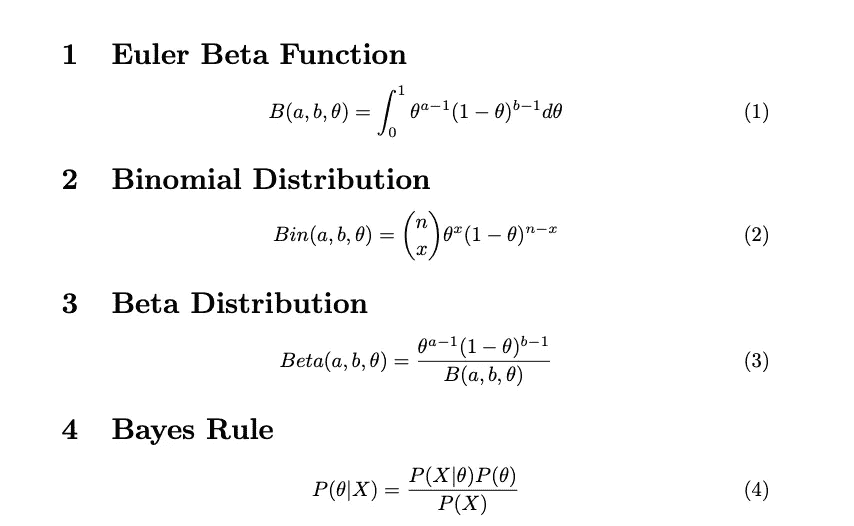
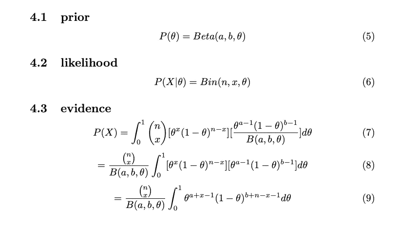
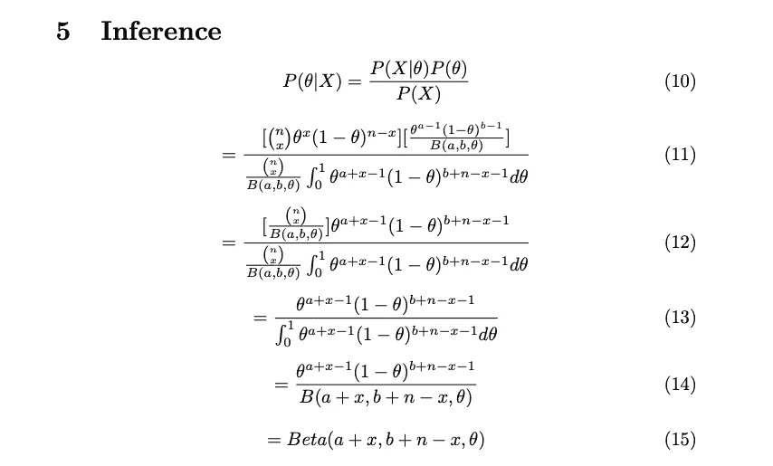
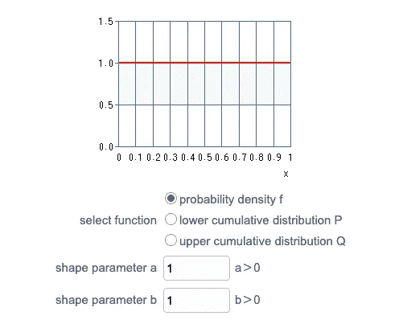
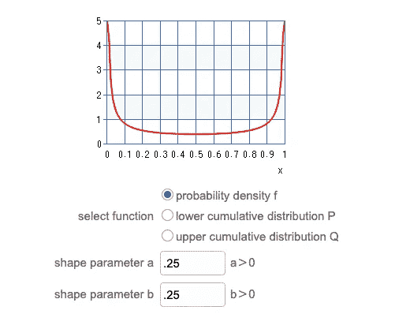
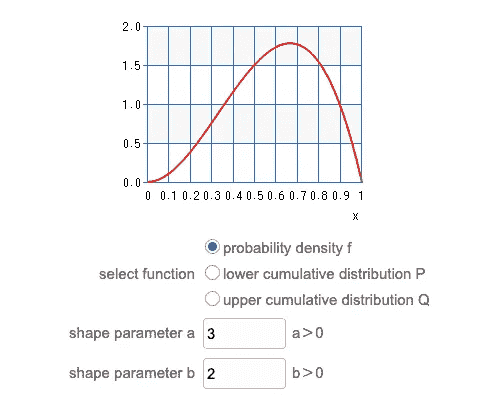
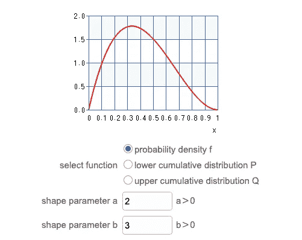
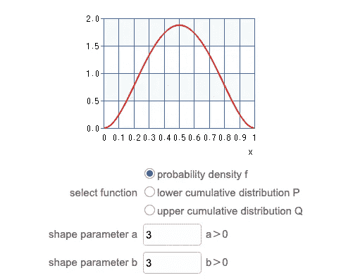
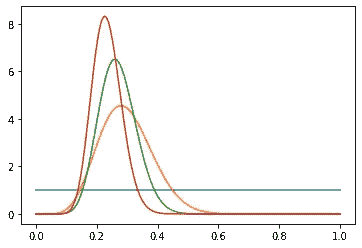
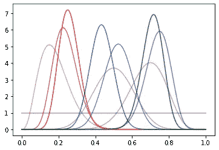

# Python:在线贝叶斯 A/B 测试！

> 原文：<https://towardsdatascience.com/python-online-bayesian-a-b-testing-8a81ccbf4001?source=collection_archive---------28----------------------->

## 针对 A/B 测试的 Beta 分布、二项式可能性和共轭先验的速成课程

信用:Pixabay

## 常客背景

如果你和我一样，早在你对数据科学、机器学习等感兴趣之前，你就已经通过社会科学初步接触了统计学。在心理学、社会学等领域，一项研究通常要进行一段时间(可能是几天、几个月甚至几年)。)在新实验的情况下，收集结果，产生平均值和方差的最大似然估计，并构建置信区间。

或者，如果我们假设事情不像*现任模型(又名零假设)*所描述的那样运行，我们参考现有数据，检查均值、方差和置信区间，通过研究收集数据(从总体中抽取样本)，并将样本均值与置信区间进行比较。如果样本均值是极值，我们拒绝零假设，得出结论，“*在位模型的均值和方差不准确，* ***需要更多的研究*** *。*“或者我们只是*未能拒绝*现任模型的发现。极端是什么意思？这有点主观——这意味着根据现有模型的分布**和任意阈值**，这一发现是极不可能的。(即，给定分布，我们的样本只有 1%的时间被观察到如此之大(或更大)或如此之小(或更小),我们武断地决定，如果这样的发现有 5%的发生几率(或更小的概率),我们将拒绝现有模型。)

**这是频率主义者的范式。**它非常适合这样的情况:我们有足够的时间来收集足够的数据，以便在根据我们的理解采取行动之前，非常确定我们感兴趣的人群的形状和中心趋势。不幸的是，这种方法不适合资源(时间和数据)短缺的情况，我们需要根据目前已知的信息做出最佳决策。

## 输入贝叶斯统计！

在我们进入贝叶斯统计之前，让我们回顾一下频率主义范式的一些关键要素。支配分布的参数是*固定的，*我们只需要收集一个*足够大的*样本用于我们的估计(样本统计)以收敛于真实的总体参数。假设我们的参数是固有的*标量*值(固定数值)，我们通过置信区间来表达我们对这些值的信心(换句话说，根据当前参数的最大似然估计，一个观察值将有多可能)。)

贝叶斯模型拒绝了参数是固定的这一观点，而是将它们视为分布本身。这使得数学变得非常非常不愉快。然而，它允许我们从一个关于参数*(先验)*的信念开始，将这个信念与观察到的数据*(似然)*本身联系起来，考虑所有其他的可能性*(证据)*，并返回新的更新的信念*(后验。换句话说，它是为在线学习而优化的，在线学习的一个广泛应用的例子是 A/B 测试。*

在我们开始编码之前，让我们先谈谈策略——如果你以前谷歌过贝叶斯统计，你可能听说过像马尔可夫链蒙特卡罗(MCMC 方法)这样的术语。发明这些方法是为了从极其难以(*如果不是不可能的话*)分析整合的分布中取样，并且它们很大程度上以*证据为导向。* **见下面第 4 节关于贝叶斯法则的论述。**

贝叶斯法则总结起来就是(A)选取一个*先验*分布；这是你对感兴趣的参数的推断前信念。然后(B)选择一种可能性，以先前的信念为条件，模拟数据有多*令人惊讶*(或不令人惊讶)。最后，(C)将分子与*证据进行比较。*从字面上看，这是在参数可能出现的任何*值*下观察到数据的概率。证据评估为常数值，其 ***缩放*** 分子，使得它是有效的概率分布(积分为 1。)

事实上，你的模型越复杂，计算证据就越痛苦。输入**共轭先验。**如果*后验*(您对参数的更新信念)**与前一个**具有相同的形状(并且通常很容易计算),那么有一些前验和可能性的组合是“彼此共轭的”!)

在这篇文章中，我们将利用共轭先验，以减少计算的复杂性！一个完美的例子是贝塔先验，二项式似然配对，其中贝塔分布描述了后验分布*和*。

首先，欧拉贝塔函数 ***与贝塔分布*** 不同；现在就把这一点记下来，你会省去很多困惑。见下文第 1 节。事实上，欧拉贝塔函数是贝塔分布的分母(见第 3 节。)其目的是缩放分子，使贝塔分布整合为 1 ( *共同主题…* )

二项式分布描述了*伯努利*试验的总和。θ的 x 次方(有多少次成功)乘以 1-θ的 n-x 次方(n 次试验失败)。)第一项，读作“*n choose x”*是在 n 次试验中总共成功出现 x 次的组合数(不考虑顺序)。对于我们的 A/B 测试，我们可以讨论任何二进制的成功/失败(老虎机转化率与网站总点击率等),这是一个合理的可能性选择。

β-二项式共轭证明第 1 部分

我警告过你证据非常非常糟糕，不是吗？请参见下面的第 4.3 节。值得注意的是，我们的策略依赖于将常数从积分中分解出来，即 n-Choose-x 除以欧拉β函数。在此之后，我们可以很容易地组合类似的项，得到看起来非常类似于另一个欧拉贝塔函数(指数值已经改变，但这将被证明是有益的。)

β-二项式共轭证明第二部分

最后，我们把它结合在一起。是的，这有点可怕。请注意，在等式 12 中，我们将 n-Choose-x 和欧拉β函数从分子中剔除。在步骤 13 中，这些值相互抵消。在等式 14 中，我们看到分母(再次)具有与欧拉β函数相同的形式，因此我们相应地替换它。现在，我们看到分子和分母遵循一个友好的模式——*贝塔分布*。这太棒了！我们看到，为了计算我们的后验分布，我们只需要四个元素——A、B、X 和 N，其中 A 和 B 是我们的先验信念，X 是成功的次数，N 是试验的总数。*整齐！*

β-二项式共轭证明第三部分

让我们来探索一下 Beta 发行版有多通用和有用。我鼓励你尝试这个[绘图工具](https://keisan.casio.com/exec/system/1180573226)。这有助于理解为什么 Beta 分布对影响二元结果的参数建模如此有用。

质量均匀分布

具有相等 a 和 b 值(小于 1)的尾部质量的体积

质量的体积偏向 1，a 值越大

b 值越高，质量越偏向 0

质量体积偏向 0.5，a 和 b 值相等(大于 1)

让我们从一个简单的单臂强盗例子开始编码吧！我们将从统一的先验开始，并逐渐收敛到真实参数(25%的成功几率，*对于赌场来说过高。对于那些不知道的人来说，独臂强盗就是一台老虎机。你投入一枚硬币(或指定的费用)拉动手臂，游戏将开始，各种图标旋转图标将对齐(支付！)还是没有(扫兴。)*

## 独臂强盗

独臂强盗贝叶斯更新代码

**好的，那么这段代码在做什么呢？首先，我们做一些常规进口。接下来，我们定义一个名为 beta 的类，它接收`a`和`b`作为参数。我们将这些初始化为 1，每个(又名均匀先验。)然后，我们创建一个列表，其中每个元素基于范围(0，1)中的随机值数组为 1 或 0—如果值低于. 25，则返回 1，否则返回 0。这个列表平均值应该接近 0.25，但是，由于只生成 100 个样本，它可能会有一点变化。接下来，我们定义一个函数，`experiment`，它将这个列表分成大小相等的批次；对于每一批，我们找到成功和失败，并相应地更新我们的 Beta 类实例的`a`和`b`参数。因为我们已经涵盖了上面所有的数学知识，所以这一部分很简单！**

考虑下图。顺序如下:蓝色、橙色、绿色和红色。蓝色是我们的均匀先验，我们对θ接收的任何特定值没有偏见。在 orange 中，我们将 25%的数据输入到模型中；因此，根据可能性，我们对我们的制服先验不太有信心(吃角子老虎机不太可能是完全随机的；事实上，它似乎并不经常得到回报。)用橙色绘制的后验分布成为绿色的先验信念。并且该先验信念同样被更新，收敛于参数的真实值。递归地，前一批的后一批成为新批的前一批。请注意，方差在每次迭代中都在缩小(这一点随着峰值变得更加明显而变得明显——它变得更高、更紧。)

基于均匀先验的贝叶斯更新

我们已经研究了数学，并看到贝叶斯统计如何帮助我们迭代地“聚焦”真实参数，但这不完全是 A/B 测试。*接下来是什么？*

接下来，让我们考虑一下**为什么**这对 A/B 测试如此有利。注意，在每次迭代中，我们更新了我们的信念，缩小了均值的方差。在我们有多个强盗(恰当地命名为多臂强盗或 MAB)的情况下，将一半资金花在两台机器中的第一台上，然后*再*探索第二台机器是一个糟糕的策略。我们必须同时作为科学家和商人来思考。这是“探索马得利”的一个很好的继续如果我们只玩一台机器，我们会将(这台机器的)方差缩小很多——但这并没有回答最根本的问题，*它是不是最好的***机器？同样，如果我们平等地玩所有的机器，我们会对它们的均值和方差有一个很好的了解——但是我们没有利用这些信息。**

*有几种算法可以回答这个问题；例子有 epsilon greedy，UCB1 等。这些主题很好地介绍了强化学习，但是我们有失去焦点的风险。因此，我们将保持简单；我们将在 ***固定顺序*** 中轮换每台机器，并使用与上一次迭代几乎相同的方法更新每个 Beta 类对象的属性。请注意，我做了一些简单的代码修改，例如(A)每个分布都有一个唯一的颜色，以及(alpha(透明度的倒数)从接近 0 开始，并随着每次迭代向 1 增加。我的目标是，你可以(从字面上)看到我们对每台机器的参数的估计是如何集中在它们的实际值上的。*

*MAB 贝叶斯更新代码*

**

*统一先验的 MAB 贝叶斯更新*

## *结论*

*正如你从上面所看到的，红色的估计值每一轮都朝着它的真实值(0.25)增加，而蓝色和绿色的值都*简单地*估计它们的平均值高于真实参数值。这表明，更多的数据总是有助于微调我们对数据的理解，利用*和探索*真的很重要。我以后很可能会在 epsilon-greedy，UCB1 等上面写！我希望这些代码块、(乏味的)证明以及我对直观解释的尝试已经帮助你对 A/B 测试的贝叶斯方法感到更舒服了。*

*如果有任何你希望我在未来写的特定主题，请评论！*

***感谢您的阅读——如果您认为我的内容还可以，请订阅！:)***