# Python OpenCV:构建类似 Instagram 的图像过滤器

> 原文：<https://towardsdatascience.com/python-opencv-building-instagram-like-image-filters-5c482c1c5079?source=collection_archive---------13----------------------->

## 使用图像变换技术构建图像过滤器的 Python OpenCV 教程。

**OpenCV** 是为解决大量计算机视觉任务而构建的库。它包含了大量的基本和高级特性，非常容易掌握，并且可用于多种编程语言。

在这篇文章中，我们将应用一些基本的图像变换技术，以获得图像过滤器。对于那些习惯了所有图像编辑软件的人来说，这些滤镜可能对你来说很基本。但是我认为对于第一次接触 OpenCV 的人来说，它们是很棒的，因为它们允许我们在不编写大量代码的情况下学习一些基本原理。😀


照片由[诺德伍德主题](https://unsplash.com/@nordwood?utm_source=medium&utm_medium=referral)在 [Unsplash](https://unsplash.com?utm_source=medium&utm_medium=referral) 上拍摄

*本文原载于* [*程序员背包博客*](https://programmerbackpack.com/python-opencv-building-instagram-like-image-filters/) *。如果你想阅读更多这类的故事，一定要访问这个博客。*

*更感兴趣？在 Twitter 上关注我，地址是*[*@ b _ dmarius*](https://twitter.com/b_dmarius)*，我会在那里发布每一篇新文章。*

# 介绍

在这一节中，我将解释计算机如何存储和处理 RGB 图像背后的逻辑。如果你已经熟悉这些东西，请跳到下一节，我们将跳到更高级的细节。

图像中的基本单位数据是**像素**。像素只是图像中的一个点，并存储为范围在[0，256]内的数字。RGB 模型代表**红绿蓝**并告诉我们，对于每个像素，我们存储红、绿、蓝的强度(我们将这些*通道称为*)作为一个从 0 到 256 的数字。如果所有 3 个通道都是 256，则像素为白色；如果所有 3 个通道都是 0，则像素为黑色。如果相应的通道是 256 并且所有其他通道是 0，则像素是完全红色/绿色/蓝色的。你明白了，每种颜色都是由这三个通道混合而成的。

所以图像是像素的集合。比方说，如果我们的图像是 300x200，那么我们将把它存储为 300 行 200 列的 2D 数组，其中每个单元是一个像素。但是我们从上面知道，对于每个像素，我们将存储所有 3 个通道的信息，所以这实际上给了我们一个 3D 数组。

# OpenCV 卷积和内核

这是完全由理论组成的最后一部分。如果你想直接跳到实用部分，请见下一节。

现在我们知道了图像是如何作为像素存储的，我们可以学习对这些像素应用变换。

**卷积**是通过将图像分割成称为*窗口*的小部分，并对每个部分应用称为**内核**的操作符来变换图像的操作。

内核通常是一个固定的、包含数字的小型 2D 数组。内核中的一个重要部分是中心，称为**锚点**。

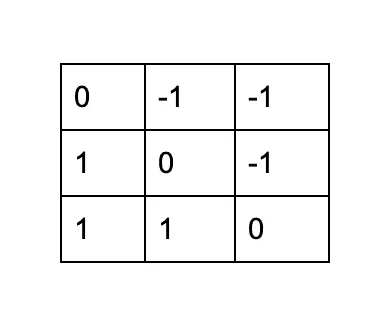

OpenCV 过滤器—内核示例

卷积通过以下步骤执行:

1.  将内核放置在图像的顶部，内核锚点位于预定像素的顶部。
2.  在内核数和被内核重叠的像素值之间执行乘法，对乘法结果求和，并将结果放在锚点下方的像素上。
3.  重复这个过程，在图像上的每个可能的位置滑动图像顶部的内核。

如果你想知道如何选择核的值，请注意最流行的核是图像处理科学家大量研究的结果。你当然可以试着选择你自己的内核，但是对于最基本的转换，我们已经有了很好的内核，可以提供很好的结果。

# 项目设置

我们需要安装 2 个 python 包，然后就可以开始了。

```
pip3 install opencv-python
pip3 install scipy
```

我们将导入单个图像(这是我亲自拍摄的图像)，并且对于每个转换，我们将制作该图像的副本。然后，我们通过一个单独的方法应用转换，这样我们可以保持代码的整洁。最后，我们将把结果保存为一个单独的图像。下面是基本流程:

```
initialImage = cv2.imread("image1.jpg")
blurredImage = gaussianBlur(copy.deepcopy(initialImage))
cv2.imwrite("blurred.jpg", blurredImage)
```

# OpenCV 内核和卷积变换

在这一部分，我们将使用一组预定义的内核来应用卷积，以获得漂亮的效果。对于其他类型的转换，请跳到下一节。对于每一个转换，我将向你们展示内核和代码，在这一节的最后，我将展示一个画廊，展示初始图像和结果。

# 图像锐化

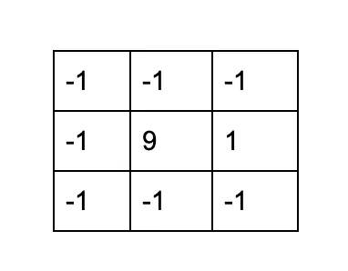

Python OpenCV 滤镜-图像锐化

这是用来锐化图片细节的内核。我们将使用 OpenCV 库中的 *filter2D* 方法，它将为我们执行卷积。

```
def sharpen(image):
    kernel = np.array([[-1, -1, -1], [-1, 9, -1], [-1, -1, -1]])
    return cv2.filter2D(image, -1, kernel)
```

# 棕褐色效果

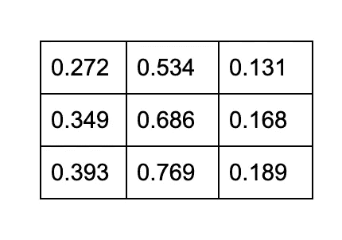

Python OpenCV 滤镜—棕褐色

```
def sepia(image):
    kernel = np.array([[0.272, 0.534, 0.131],
                       [0.349, 0.686, 0.168],
                       [0.393, 0.769, 0.189]])
    return cv2.filter2D(image, -1, kernel)
```

# 模糊效应

为了达到这个效果，我们可以使用一个基本的内核，就像上面所有的一样，但是结果是相当蹩脚的。幸运的是，OpenCV 实现了高斯模糊，它将为我们完成这项工作。我们需要做的就是:

```
def gaussianBlur(image):
    return cv2.GaussianBlur(image, (35, 35), 0)
```

# 浮雕效果

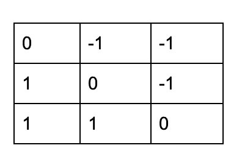

Python OpenCV 滤镜-浮雕

```
def emboss(image):
    kernel = np.array([[0,-1,-1],
                            [1,0,-1],
                            [1,1,0]])
    return cv2.filter2D(image, -1, kernel)
```

这是我们内核转换结果的图库。

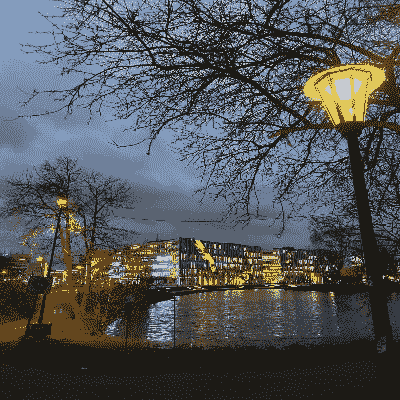

这是最初的图像

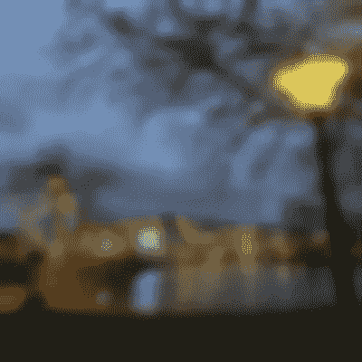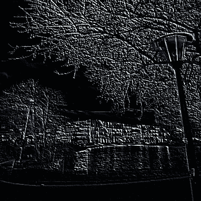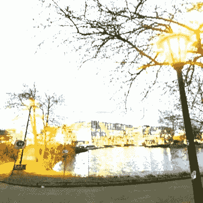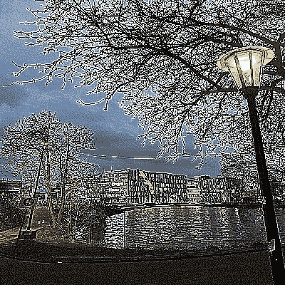

从左到右，从上到下:模糊，浮雕，棕褐色，锐化

# OpenCV —基于像素值的变换

接下来，我们将增加图像的亮度。为此，我们需要做的就是导航到图像的每个像素，然后导航到特定像素的每个通道。然后，我们将每个通道的值增加一个特定的值。这将给我们一个很好的亮度效果。

为了将我们从所有这些代码中解放出来，OpenCV 框架实现了一个方法，可以完全做到这一点。

```
def brightnessControl(image, level):
    return cv2.convertScaleAbs(image, beta=level)
```

这是我们亮度控制方法的结果。

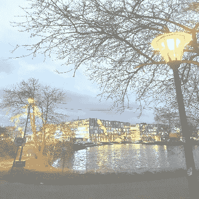

左—明亮的图像，右—原始图像

# OpenCV —查找表转换

我们将使用这种类型的变换来使图像看起来更温暖和更寒冷，但首先让我们看看我们如何使用查找表。

一个**查找表**只是一个简单的值对集合，如下所示:*【值 1，值 2，…。，valueN]，[modifiedValue1，modifiedValue2，…，modifiedValueN]* 这背后的逻辑很简单——我们将获取每个像素值，并用查找表中的相应值替换它(意味着用 *modifiedValue1* 等替换 *value1* )。

现在的问题是，有很多值需要替换(从 0 到 256)，为此创建一个查找表是一个痛苦的过程。但是幸运再次站在我们这边，因为我们有一个工具可以利用它。

来自 **scipy** 包的 ***单变量线*** 平滑方法可以帮助我们。这种方法只取几个参考值，并试图找到一种方法来修改我们提供的参考值范围内的所有其他值。

基本上，我们将定义一个简短的查找表，如下所示

*【0，64，128，256】，【0，80，160，256】*

并应用 *UnivariateSpline* 变换，该变换将填充[0，256]范围内的其余值。

构建好查找表后，我们只需将它们应用于特定的通道。为了获得一个**温暖的图像**，我们将为图像中的所有像素增加红色通道的值，减少蓝色通道的值。为了获得**冷图像**，我们要做相反的事情:增加蓝色通道的值，减少红色通道的值。绿色通道在这两种情况下都不会被触及。

```
def spreadLookupTable(x, y):
  spline = UnivariateSpline(x, y)
  return spline(range(256))def warmImage(image):
    increaseLookupTable = spreadLookupTable([0, 64, 128, 256], [0, 80, 160, 256])
    decreaseLookupTable = spreadLookupTable([0, 64, 128, 256], [0, 50, 100, 256])
    red_channel, green_channel, blue_channel = cv2.split(image)
    red_channel = cv2.LUT(red_channel, increaseLookupTable).astype(np.uint8)
    blue_channel = cv2.LUT(blue_channel, decreaseLookupTable).astype(np.uint8)
    return cv2.merge((red_channel, green_channel, blue_channel))def coldImage(image):
    increaseLookupTable = spreadLookupTable([0, 64, 128, 256], [0, 80, 160, 256])
    decreaseLookupTable = spreadLookupTable([0, 64, 128, 256], [0, 50, 100, 256])
    red_channel, green_channel, blue_channel = cv2.split(image)
    red_channel = cv2.LUT(red_channel, decreaseLookupTable).astype(np.uint8)
    blue_channel = cv2.LUT(blue_channel, increaseLookupTable).astype(np.uint8)
    return cv2.merge((red_channel, green_channel, blue_channel))
```

这里的结果和预期的一样。

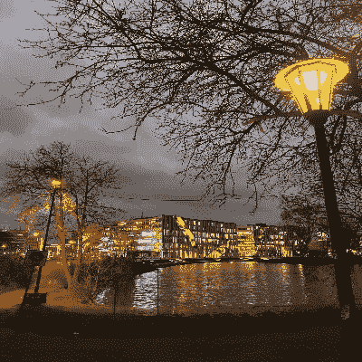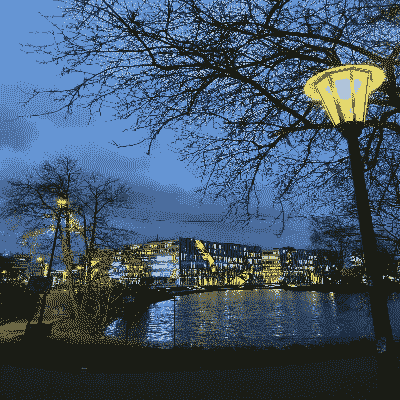

左侧—暖图像，中间—原始图像，右侧—冷图像

这很有趣！我们在这里看到了一点数学，一点代码，学到了很多关于计算机如何存储和处理图像，以及我们如何使用它来获得图像的美丽变换。如果你喜欢这篇文章，并想了解更多，那么请确保你在 Twitter 上关注我，因为不久我将发布另一篇关于使用 OpenCV 构建类似 Instagram 的面具的文章。

*本文原载于* [*程序员背包博客*](https://programmerbackpack.com/python-opencv-building-instagram-like-image-filters/) *。如果你想阅读更多这类的故事，一定要访问这个博客。*

*非常感谢您阅读本文！有兴趣了解更多吗？在 Twitter 上关注我，地址是*[*@ b _ dmarius*](https://twitter.com/b_dmarius)*，我会在那里发布每一篇新文章。*