# Python 操作者从零开始！！！—初学者指南

> 原文：<https://towardsdatascience.com/python-operators-from-scratch-a-beginners-guide-8471306f4278?source=collection_archive---------22----------------------->

## 在本教程中，您将学习 python 中的一个基本且重要的概念——运算符，以及它们的语法和示例。


**来源:**[**oddsockvideogames**](https://play.google.com/store/apps/developer?id=Odd+Sock+Video+Games)**，via**[**apk pure**](https://apkpure.com/counting-for-cavemen/air.CountingforCavemen)**(**[**CCO**](https://creativecommons.org/licenses/by/3.0/)**)**

# 什么是运营商？

运算符是一个**字符**或**字符集**，可以用来对**操作数**执行**期望操作**并产生**最终结果**。

> **最终结果完全取决于所使用的运算符类型。**

例如，假设您想要执行 **5+3** 的数学计算。现在 **5** 和 **3** 都称为**操作数**， **+** 是执行**加法**的**运算符**，最终结果是 **8** 。

只是提醒一下，本教程的完整代码可以在下面我的 [**GitHub 资源库**](https://github.com/Tanu-N-Prabhu/Python/blob/master/Python_Operators.ipynb) 中找到:

[](https://github.com/Tanu-N-Prabhu/Python/blob/master/Python_Operators.ipynb) [## 塔努-北帕布/Python

### permalink dissolve GitHub 是超过 5000 万开发人员的家园，他们一起工作来托管和审查代码，管理…

github.com](https://github.com/Tanu-N-Prabhu/Python/blob/master/Python_Operators.ipynb) 

# 运算符的类型

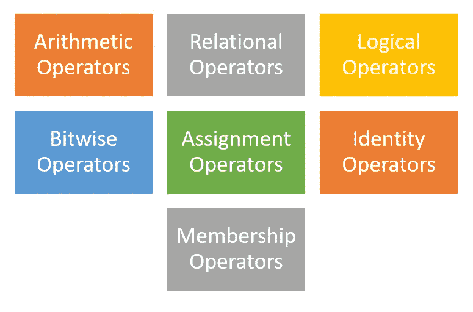

塔努·南达·帕布拍摄的照片

Python 支持的不同类型的运算符如下:

1.  **算术运算符**
2.  **关系运算符**
3.  **逻辑运算符**
4.  **按位运算符**
5.  **赋值运算符**
6.  **身份运算符**
7.  **隶属操作符**

# 算术运算符

算术运算符用于执行数学运算，如**加、减、乘、除、模、底除和指数**。

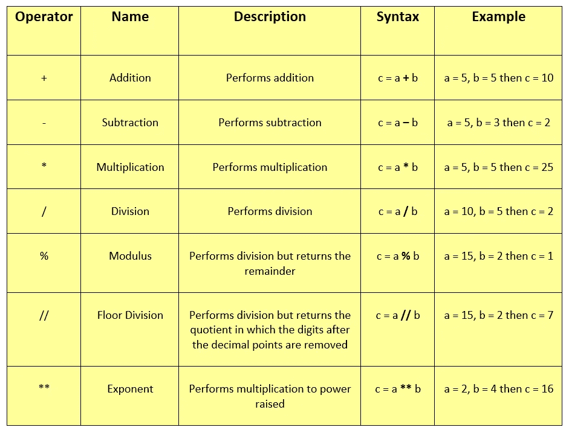

塔努·南达·帕布拍摄的照片

## 例子

下面是一个简单的 python 代码片段，可以作为参考:

```
**# Assigning values to variables** a = 10
b = 5**# Addition** print('a + b =', a + b)**# Subtraction**
print('a - b =', a - b)**# Multiplication**
print('a * b =', a * b)**# Division**
print('a / b =', a / b)**# Modulus**
print('a % b =', a % b)**# Floor Division**
print('a // b =', a // b)**# Exponent**
print('a ** b =', a ** b)
```

当您运行上述 python 脚本时，您将得到以下输出提示

```
a **+** b = **15** 
a **-** b = **5** 
a ***** b = **50** 
a **/** b = **2.0** 
a **%** b = **0** 
a **//** b = **2** 
a ****** b = **100000**
```

## 重要注意事项

*   如果你用任何一个数字除以 **0** ，你会得到一个错误提示`**ZeroDivisionError**`。不要用零(0)除任何东西。
*   除法运算符生成的结果将始终是**浮点数**(用小数点表示)。
*   **底数除法**返回去掉小数点后位数的商(答案或**除法**的结果)。但是，如果操作数(被除数和除数)之一是负的，则结果是 floored，即，远离零舍入(意味着，朝向无穷大的负数)。

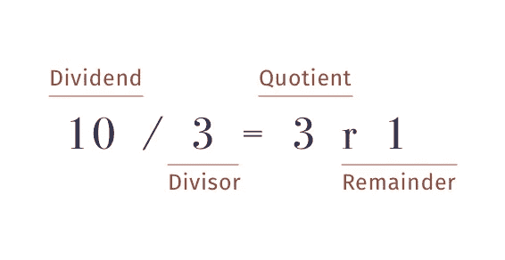

**出处:** [**菲尔优**](https://blog.tecladocode.com/author/phil/) **，via** [**泰克拉多**](https://blog.tecladocode.com/pythons-modulo-operator-and-floor-division/)**(**[**CCO**](https://creativecommons.org/licenses/by/3.0/)**)**

# 关系运算符

顾名思义，关系运算符或比较运算符用于比较值。这些运算符的返回类型不是`**True**` 就是`**False**`。不同的比较运算符是**大于、大于或等于、小于、小于或等于、等于和不等于**。

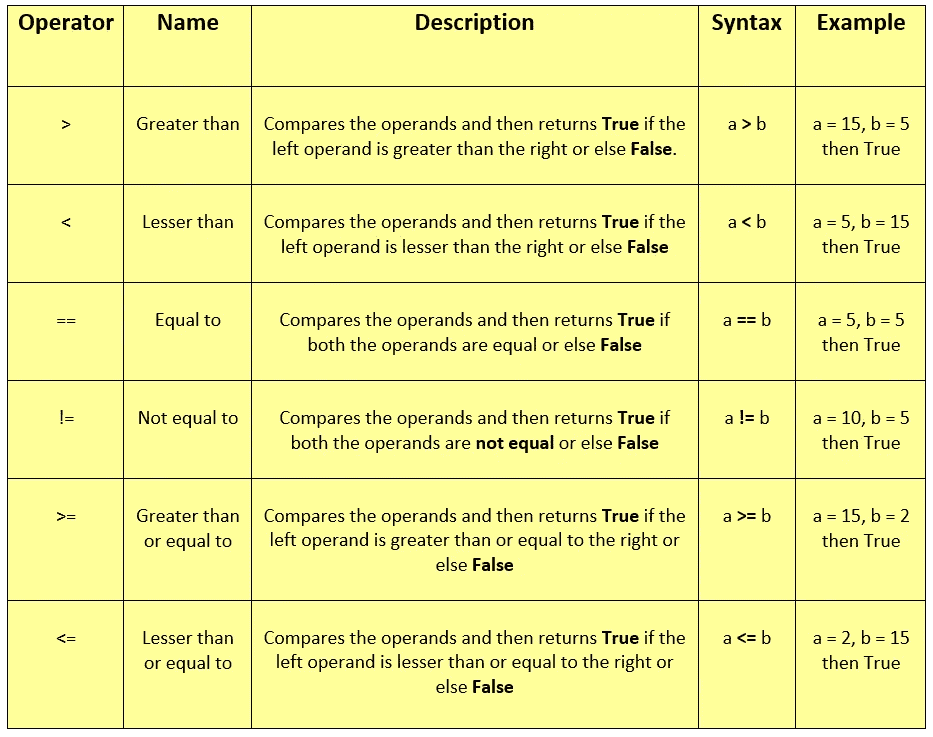

**塔努·南达·帕布拍摄的照片**

## 例子

下面是一个简单的 python 代码片段，可以作为参考:

```
**# Assigning values to variables** a = 10
b = 5**# Greater than** print('a > b =', a > b)**# Lesser than** print('a < b =', a < b)**# Equal to** print('a == b =', a == b)**# Not equal to** print('a != b =', a != b)**# Greater than or equal to** print('a >= b =', a >= b)**# Lesser than or equal to** print('a <= b =', a <= b)
```

当您运行上述 python 脚本时，您将得到以下输出提示

```
a **>** b = **True** 
a **<** b = **False** 
a **==** b = **False** 
a **!=** b = **True** 
a **>=** b = **True** 
a **<**= b = **False**
```

## 重要注意事项

*   关系运算符也称为**比较运算符。**
*   比较运算符可用于比较两个以上的值。例如`5 **>** 3 **<** 1`将导致`**False**`。
*   这些也被称为**关系运算符**，因为它比较值，然后决定它们之间的关系。比如`5 **>** 4`关系是这样的 **5 大于 4** 答案是`**True**`。这里的关系是**大于**。

# 逻辑运算符

逻辑运算符用于**评估操作数之间的条件**。不同类型的操作员有`**and**`、`**or**`和`**not**`。

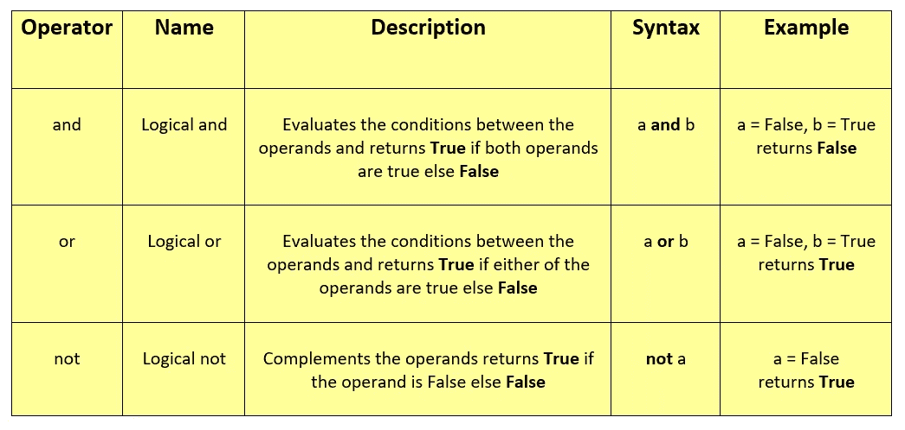

**塔努·南达·帕布拍摄的照片**

为了使事情更清楚，您可以参考下面给出的逻辑运算符的真值表:

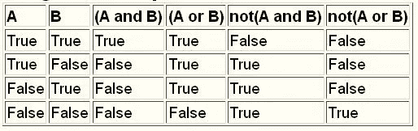

**来源:** [**理查德鲍德温**](https://www.dickbaldwin.com/) **，via**[**openstax**](https://cnx.org/contents/B4rg31nD@1/Scr0360-Logical-Operators-in-Scratch-2-0)**(**[**CCO**](https://creativecommons.org/licenses/by/3.0/)**)**

## 例子

下面是一个简单的 python 代码片段，可以作为参考:

```
**# Assigning values to variable** a = True
b = False**# Logical and** print('a and b is',a and b)**# Logical or** print('a or b is',a or b)**# Logical not** print('not a is',not a)
```

当您运行上述 python 脚本时，您将得到以下输出提示

```
a **and** b is **False** 
a **or** b is **True** 
**not** a is **False**
```

## 重要注意事项

*   逻辑运算符也被称为**布尔运算符**。
*   如果操作数不是布尔值，那么它将自动转换为布尔值进行计算。
*   逻辑运算符可以应用于任何类型的值。例如，它们可以应用于如下所示的**琴弦**。在这种情况下，**和**运算符返回第一个假值，如果有空值或假值，则返回最后一个值。**或**返回第一个真值，否则返回最后一个值。

**字符串上的逻辑“与”运算符**

```
a = ""
b = "Python"
a **and** b**''**
```

**字符串上的逻辑“或”运算符**

```
a = ""
b = "Python"
a **or** b'**Python**'
```

*   在`**and**`、`**or**`两种情况下，评估都是从**左**到**右**进行的。

# 按位运算符

按位运算符在二进制级别上对操作数进行运算。这意味着按位运算符直接查看整数的二进制数字或二进制位。因此得名按位(逐位操作)。不同类型的按位运算符有**按位与、或、非、异或、右移和左移**。

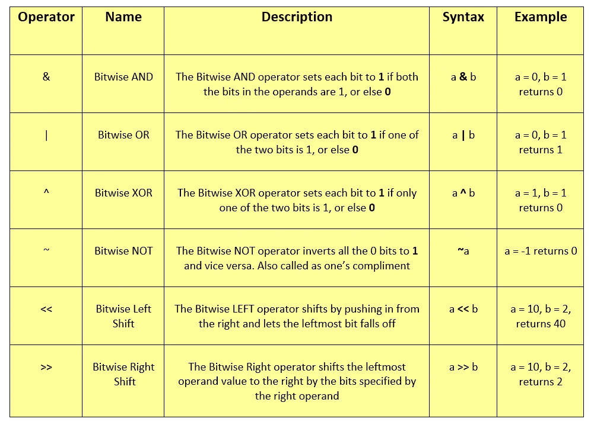

**塔努·南达·帕布拍摄的照片**

## 例子

下面是一个简单的 python 代码片段，可以作为参考:

```
**# Assigning values to variables** a = 10
b = 11**# Bitwise AND** print('a & b is',a & b)**# Bitwise OR** print('a | b is',a | b)**# Bitwise XOR** print('a ^ b is',a ^ b)**# Bitwise NOT** print('~a is',~a)**# Bitwise Left Shift** print('a << b is',a << b)**# Bitwise Right Shift** print('a >> b is',a >> b)
```

当您运行上述 python 脚本时，您将得到以下输出提示

```
a **&** b is **10** 
a **|** b is **11** 
a **^** b is **1** 
**~**a is **-11** 
a **<<** b is **20480** 
a **>>** b is **0**
```

## 重要注意事项

*   逐位运算符对**位**进行运算，并对操作数执行逐位**运算。**
*   无论传递的操作数是什么类型，按位运算符都会分别将其转换为一系列二进制数字。例如，如果一个操作数是 **2** ，那么它的二进制格式就是 **10** ，同样， **9** 将被渲染为 **1001** 等等。下面是不包括左移和右移运算符的位运算符的**真值表。**

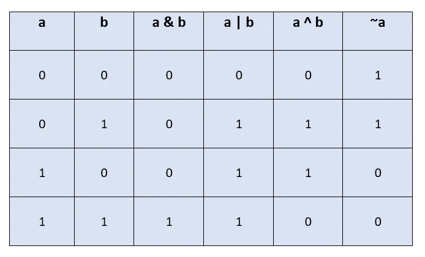

**塔努·南达·帕布拍摄的照片**

# 赋值运算符

顾名思义，赋值操作符用来给变量赋值。让我给你举个简单的例子。

```
a = 5
```

很多时候，人们在阅读上面一行代码时会犯错误。人们说“ **a 等于 5** ”，这听起来可能是正确的，但从程序上来说是不正确的。正确的做法是:

> **值 5 被分配给变量‘a’**

因为赋值操作符的工作方式是把右边的值赋给左边的变量。所以记住它的**从右到左**。

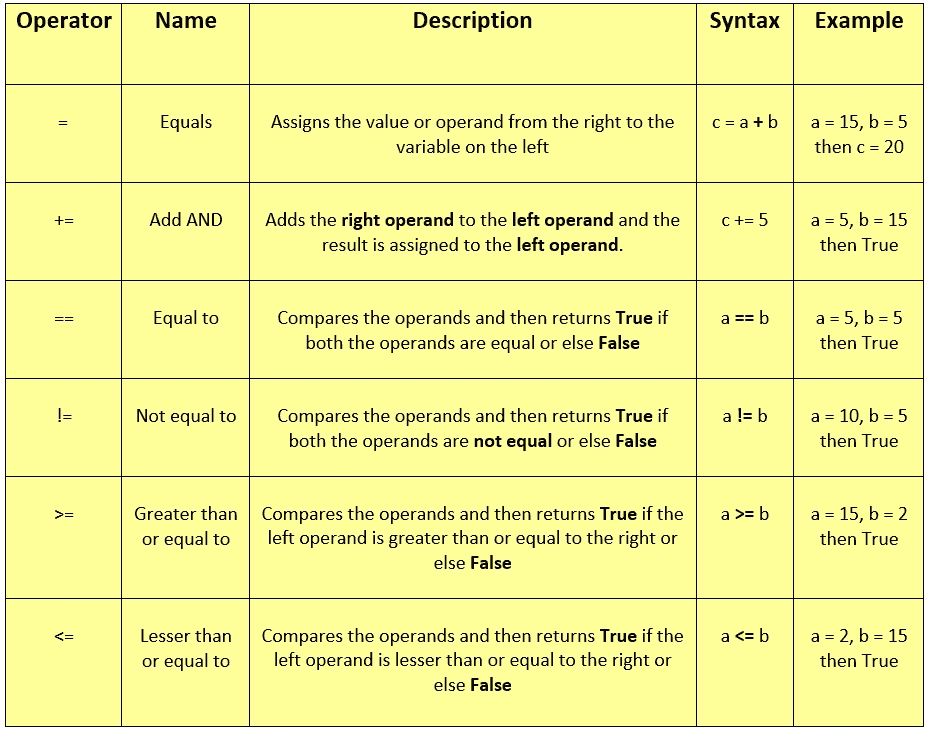

**塔努·南达·帕布拍摄的照片**

## 例子

下面是一个简单的 python 代码片段，可以作为参考:

```
**# Assigning the values to variables** a = 15
b = 5**# Simple assignment operator** b = a
print('b = a: ',b)**# ADD AND operator** b += a
print('b += a: ', b)**# SUBTRACT AND operatpr** b -= a
print('b -= a: ', b)**# MULTIPLICATION AND operator** b *= a
print('b *= a: ', b)**# DIVISION AND operator** b /= a
print('b /= a: ', b)**# FLOOR AND operator** b //= a
print('b //= a: ', b)**# MODULUS AND operator** b %= a
print('b %= a: ', b)**# EXPONENT AND operator** b **= a
print('b **= a: ', b)**# LESS THAN AND operator** b <= a
print('b <= a: ', b)**# GREATOR THAN AND operator** b >= a
print('b >= a: ', b)**# BINARY AND operator** a &= 5
print('a &= 5: ', a)**# BINARY OR operator** a |= 5
print('a |= 5: ', a)
```

当您运行上述 python 脚本时，您将得到以下输出提示

```
b **=** a:   **15** 
b **+=** a:  **30** 
b **-=** a:  **15** 
b ***=** a:  **225** 
b **/=** a:  **15.0** 
b **//=** a: **1.0** 
b **%=** a:  **1.0** 
b ****=** a: **1.0** 
b **<=** a:  **1.0** 
b **>=** a:  **1.0** 
a **&=** 5:  **5** 
a **|=** 5:  **5**
```

## 笔记

*   我们可以为更多的操作符扩展赋值操作符，比如`**-, /, *, //, %, <<, >>, &, |, **, ^**`。例如:`**a **= 5**`，将是`**a = a**5**`，答案将是`**298023223876953125**`。确保您编写的**操作符**后跟**赋值操作符**。

# 特殊操作员

python 编程语言中有两种特殊运算符，如下所示:

## 标识运算符

顾名思义，identity 操作符比较两个或更多 python 对象的 **id (identity)** ，比如变量、值等等。换句话说，别人说同样可以用恒等运算符**比较两个对象的内存位置**。有两种类型的恒等运算符，即`**is**` 和`**is not**`。

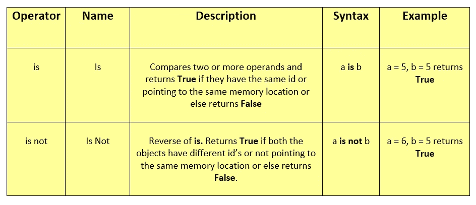

**塔努·南达·帕布拍摄的照片**

## 例子

下面是一个简单的 python 代码片段，可以作为参考:

```
**# Assigning values to variables** a = 10
b = 11**# Identity is operator** print('a is b is',a is b)**# Identity is not operator**
print('a is not b is',a is not b)
```

当您运行上述 python 脚本时，您将得到以下输出提示

```
a **is** b is **False** 
a **is not** b is **True**
```

## 重要注意事项

*   通常，标识运算符不比较值或对象本身。相反，它会比较 **id(身份**)。下面是一个例子:

```
**# Assigning the values to variables** a = 5
b = 5
c = a**# Getting the id of the variables** print(id(a))
print(id(b))
print(id(c))**# Comparing the id of a and c** print(a is c)
```

要比较 id，您可以使用 python 中的`**id**` 函数。它返回内存位置的 **id** 。

```
id of a is: **10914624** 
id of b is: **10914624** 
id of c is: **10914624** 
**True**
```

## 成员运算符

成员运算符用于**验证特定元素**是否是序列的**部分。现在一个序列可以是一个**列表、字符串、集合、字典和元组**。这两个成员操作符是`**in**` 和`**not in**`。**

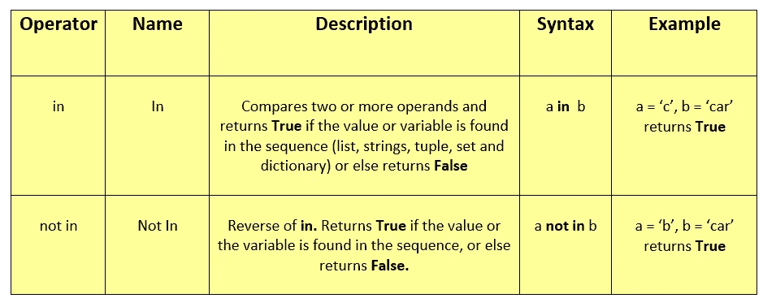

塔努·南达·帕布拍摄的照片

## 例子

下面是一个简单的 python 代码片段，可以作为参考:

```
**# Assigning a string value to a variable** a = "Python"**# Type of the variable** print(**type**(a))**# Checking whether 'y' is present in the variable a or not** print('y' **in** a)**# Checking whether 'P' is present in the variable a or not** print('p' **not in** a)
```

当您运行上述 python 脚本时，您将得到以下输出提示

```
<class '**str**'> 
**True
True**
```

## 重要注意事项

*   虽然我们可以在字典上使用成员运算符，但是有一件事你应该知道，即我们只能测试**键的存在，而不能测试值**的存在，如下所示:

```
**# Dictionary with key as 1, 2 and values as 'A' and 'B'** a = {1: "A", 2: 'B'}**# Using 'in' operator** print(2 **in** a)**# Using 'not in' operator** print(3 **not in** a)
```

因此，上面的输出将是:

```
**True** 
**True**
```

干得好，干得好伙计们，你们已经到达教程“ **Python 操作者从头开始”的结尾了！！！—初学者指南**”。我希望读完这篇教程后，你对 python 操作符有了更深的了解。如果你对教程有任何疑问，请通过下面的评论区告诉我。我试着尽快回答。好的，下次见，祝你愉快，注意安全。