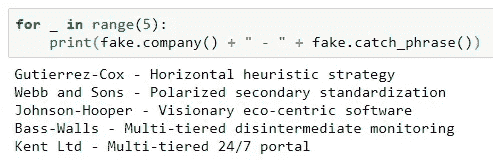
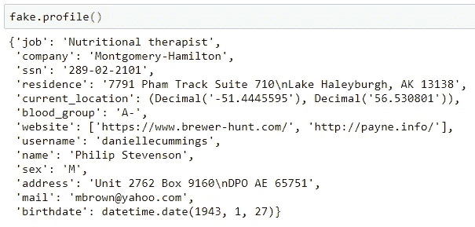
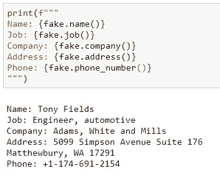
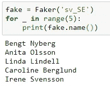
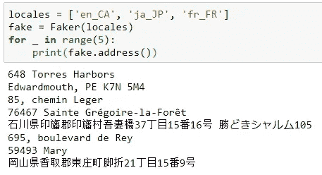

# Python 包焦点:Faker

> 原文：<https://towardsdatascience.com/python-package-focus-faker-7a1ccb1074ad?source=collection_archive---------49----------------------->

## 为任何情况生成测试数据的简单方法。


马库斯·斯皮斯克在 [Unsplash](https://unsplash.com?utm_source=medium&utm_medium=referral) 上的照片

有如此多的 Python 包，对于正在学习这门语言的人来说，知道有哪些工具可供您使用可能会让人不知所措。我希望发现一些鲜为人知但功能强大且有用的包，以帮助您踏上 Python 之旅。

## 那么，Faker 是什么？

根据他们的[文档](https://faker.readthedocs.io/en/master/)，Faker 是一个‘为你生成虚假数据的 Python 包’。“无论你是需要引导数据库、创建好看的 XML 文档、填充持久性以对其进行压力测试，还是匿名化来自生产服务的数据，Faker 都适合你。”

这立即吸引了我，因为它对学生、寻求建立文件夹/项目工作的专业人员，或者任何想要修补各种其他库但缺乏适当数据集的人来说都有很大的价值。在我自己的工作中，我经常想建立某种仪表板，但需要确保我使用的数据可以安全地共享。Faker 替我处理这些，因为我可以快速生成项目所需的几乎任何数据集。

## 安装和入门

这就像用 pip 安装一样简单:

```
pip install Faker
```

在那里，我们创建了一个 Faker“生成器”,我们将对生成的数据进行多次调用:

```
from faker import Faker
fake = Faker()
```

Faker 有许多所谓的内置提供者——从伪造的条形码、公司名称、电话号码、文件名等等。标准提供商的完整列表可在[这里](https://faker.readthedocs.io/en/stable/providers.html)找到。利用它们非常简单！例如，假设我们正在构建一个测试数据库，并想要一个公司名称及其口号的列表。为此，我们将运行以下代码:



如果我们想要一些公司人员的数据——姓名、地址、职位等，会怎么样？使用 fake.profile()可以生成一个字典配置文件:



这是一个相当广泛的列表，但是如果您想要构建一些更具体的东西呢？您可以从标准提供商那里构建自己的配置文件:



## 播种

如果您正在进行测试，那么在您的生成器上设置一个种子来从相同的数据集进行提取可能会有所帮助。
这和使用 seed()方法一样简单:

```
from faker import Faker
fake = Faker()
Faker.seed(1234)
```

## 本地化

Faker 的另一个非常酷的特性是能够改变生成的数据集的本地化。默认情况下，它是英语美国，但有一大堆其他选项。例如，如果我们想生成一堆假的瑞典名字会怎么样？没问题！



当您创建 Faker 生成器时，只需将 locale 作为参数传递就可以了。通过向生成器传递一个区域设置列表，您甚至可以使用多个区域设置:



在上面的示例中，每个名称都是从 3 个区域列表中随机选择的。但是，您可以使用权重来创建符合您需求的分布。

总的来说，Faker 是一个非常通用和实用的库，我个人认为它有巨大的使用价值。
我鼓励您访问他们的[文档](https://faker.readthedocs.io/en/stable/index.html)以查看所有可用的可能提供商，因为这只是一个简短的概述。


照片由[克里斯杨](https://unsplash.com/@chrisyangchrisfilm?utm_source=medium&utm_medium=referral)在 [Unsplash](https://unsplash.com?utm_source=medium&utm_medium=referral) 上拍摄