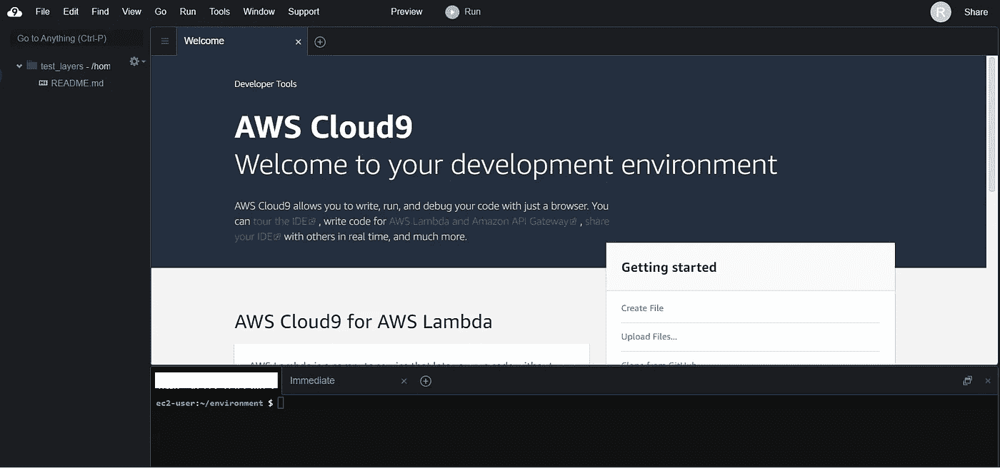
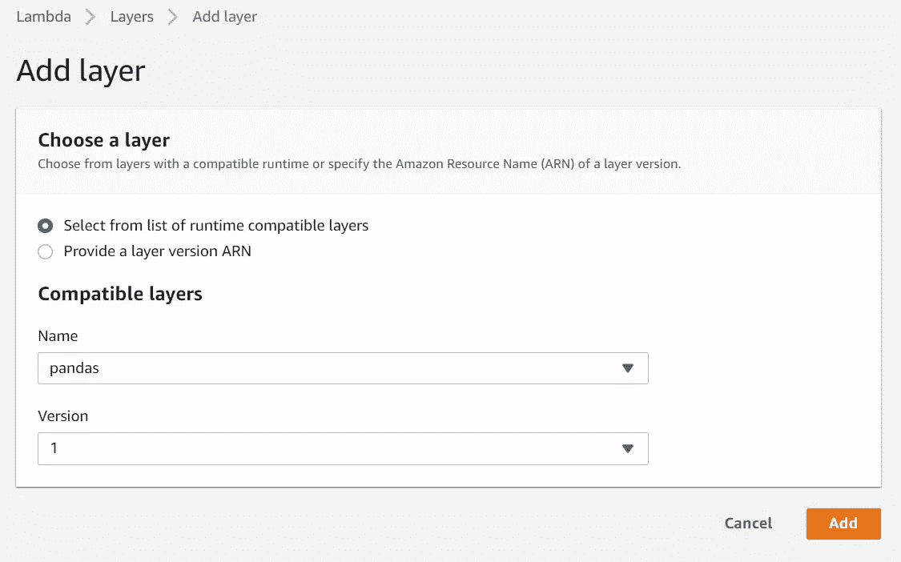
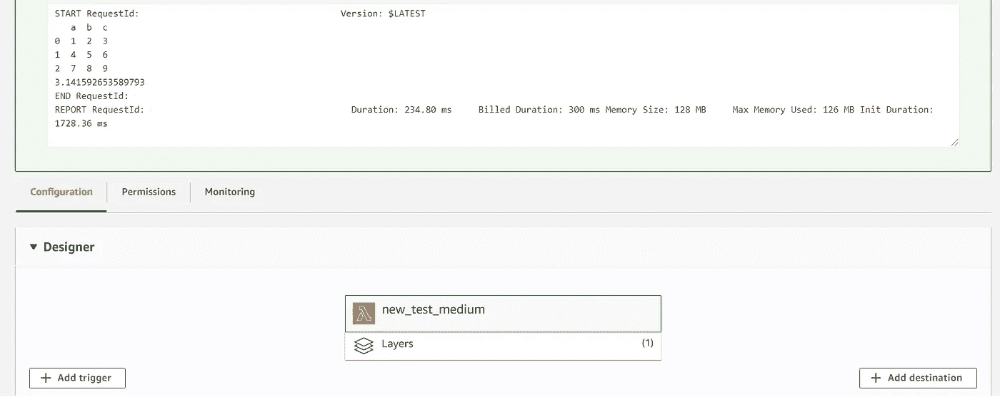

# AWS Lambda 中的 Python 包变得简单

> 原文：<https://towardsdatascience.com/python-packages-in-aws-lambda-made-easy-8fbc78520e30?source=collection_archive---------3----------------------->

## 创建自己的 Lambda 层的简单指南，这样你就可以在 Lambda 函数中使用任何 Python 包

AWS Lambda 是一个多功能的无服务器工具。有了 Lambda，你几乎可以运行任何你喜欢的东西——只需编写代码并上传到 Lambda。您每使用 100 毫秒就要付费，因此您只需为消耗的计算时间付费。

Lambda 支持 Python，如果你有使用它的经验，这是一个很好的选择。然而，Lambda 的一个缺点是默认情况下你不能导入你信任的包，比如熊猫。

我将向您展示导入 Lambda 函数所需的任何包的最简单方法。我将以熊猫为例，但是同样的方法也可以用于其他的包。


## 步骤 1:在 AWS 中启动一个 Cloud9 Linux 实例

*   在 AWS 服务中搜索 Cloud9
*   点击“创建环境”
*   将您的环境命名为您喜欢的名称(例如 python_package_test ),然后单击下一步
*   保持环境默认设置(为环境创建一个新的 EC2 实例；t2.micro 亚马逊 Linux 等..)并点击下一步
*   点击“创建环境”,您就可以开始了



## 步骤 2:创建你的熊猫 Lambda 层

*   在底部的终端中逐行键入以下代码。pip install pandas 命令可以替换为您选择的软件包。您也可以安装多个软件包*。

```
mkdir folder
cd folder
virtualenv v-env
source ./v-env/bin/activate
pip install pandas
deactivate
```

*   然后逐行输入以下代码来创建图层

```
mkdir python
cd python
cp -r ../v-env/lib64/python3.7/site-packages/* .
cd ..
zip -r panda_layer.zip python
aws lambda publish-layer-version --layer-name pandas --zip-file fileb://panda_layer.zip --compatible-runtimes python3.7
```

## 步骤 3:添加熊猫层到 Lamda 函数中

*   转到 AWS Lambda 服务并单击“创建函数”
*   命名您的函数，将运行时设置为“Python 3.6”，然后单击“创建函数”
*   点击功能设计器中的“层”，然后点击“添加层”
*   在名称下拉列表中，你应该看到你的熊猫层。点击“添加”。



*   让我们用下面的脚本来测试这一点。*注意，我也可以导入 numpy，因为它是熊猫包的依赖项:*

```
import numpy as np
import pandas as pddef lambda_handler(event, context):
    df2 = pd.DataFrame(np.array([[1, 2, 3], [4, 5, 6], [7, 8, 9]]),columns=["a", "b", "c"])
    number = np.pi
    print(df2)
    print(number)
```



**成功了！**我们可以看到熊猫数据帧输出和 pi 的数字，证明 numpy 和熊猫已经成功导入。

*限制:一个 Lambda 函数一次最多可以使用 5 层，但是，该函数和所有层的总解压缩大小不能超过 250 MB。