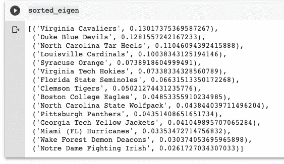
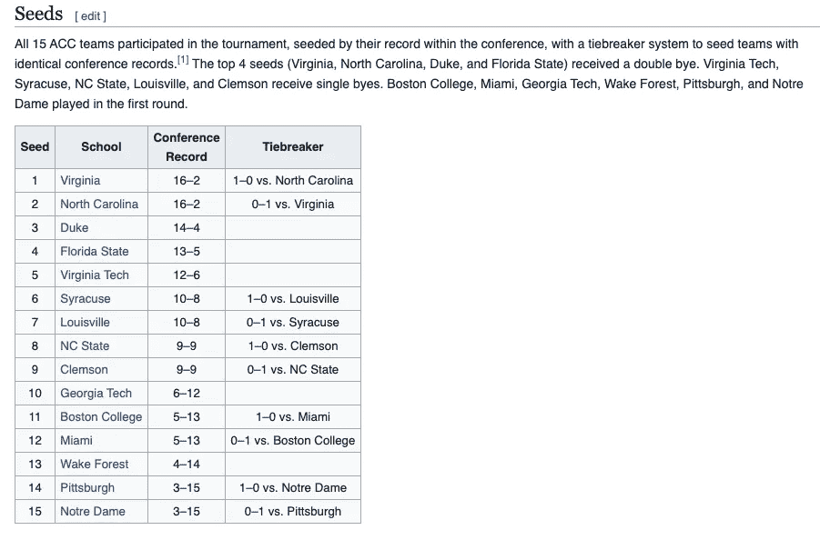
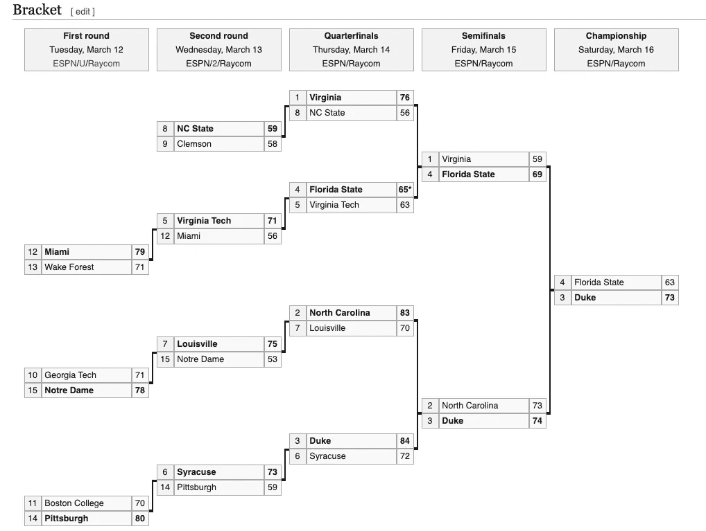

# Python: Pagerank 遇上体育分析

> 原文：<https://towardsdatascience.com/python-pagerank-meets-sports-analytics-28e4d395af57?source=collection_archive---------36----------------------->

## 重新利用一万亿美元的运动队排名算法

信用:Pixabay

前几天我发表了一篇关于使用蒙特卡罗模拟来收敛彩票概率分布的文章。名义上，它比我以前的一些文章更快地获得了关注。这可能意味着(A)读者对蒙特卡洛方法非常感兴趣，或者(B)读者对体育分析非常感兴趣。我敢打赌，体育分析是这里的主导因素，这篇文章将作为一个实验！(*我很 meta，我知道。*)

# 概观

这完全是一个“端到端”的项目，首先通过 SQLite 访问数据库数据，通过 Pandas 进行数据清理/管理，通过 NetworkX 进行网络建模，最后将我们的结果与官方的“种子”进行比较。

但是我想得太多了。我们的数据来自 NCAA(美国全国大学生体育协会)2019 年男子篮球常规(和后)赛季(s)，仅限于 ACC(大西洋海岸会议)。我们的目标是挖掘输赢模式的数据，根据赢得联盟冠军的可能性对球队进行排名。

最后，让我们讨论一下“*万亿美元算法。*“22 年前，谷歌在加州门洛帕克成立，为庞大的信息网络带来了秩序和相关性。这个算法 *Pagerank* ，是对一个已建立的网络度量——特征向量中心性的改编。该算法期望接收一个转换矩阵作为参数；这个转移矩阵量化了网页之间的链接。当一个页面链接到另一个页面时，它与另一个页面共享部分可信度。很大程度上，共享的数量取决于(首先讨论的)节点有多少个出站链接。迭代执行该算法，直到特征向量收敛。这个特征向量*就是*page rank；换句话说，它包含了每个页面相对于其他页面的排名。Pagerank 已经被应用到学术期刊的网络中，在那里一篇非常受欢迎的文章链接到一篇祖父文章或开创性的文章。高人气的文章与开创性的文章分享了它的大部分可信度。由此可以得出结论，尽管许多文章没有引用这篇开创性的文章，但它们通过这篇高人气文章间接受到了这篇文章的影响。这才是 pagerank 真正的美好和强大。

我们需要对数据进行预处理，以便 Pagerank 可以将其作为参数接收。考虑两个团队，一个几乎整个赛季都没有输过，另一个几乎整个赛季都输了——但是——失败的团队碰巧打败了胜利的团队。在体育运动中，这通常被称为冷门。并且 Pagerank 将能够提取该事件的意义和全球背景。我们只需要一种有效的方法将输赢模式编码成一个矩阵。没有绝对正确或错误的答案，但有些方法比其他方法更好；我鼓励你集思广益，找出改进这种方法的方法，亲自实施，并将结果与 NCAA ACC 官方种子进行比较。

# 方法

在我的方法中，我迭代了每一场常规赛，并找到了分差。比如甲队赢乙队 20 分；*ergo B 队给****20 点可信度给****a 队*图可以是有向的，也可以是无向的。在我们的例子中，我们希望 ***引导*** 节点(团队)之间的边(关系),这样就有了一个单向关系。B 队给 A 队 20 分，不是 A 队给 B 队 20 分。网络可以在两个给定节点之间有多条边(多重图),也可以在两个给定节点之间有一条边(简单图)。)我已经简化了网络，这样，在两个给定的队相互比赛两次的情况下，同一个队赢了两次，连接他们的边将是他们获胜的平均值。

我将让你来决定这个方法是否可以改进。例如，如果 A 队以 90–80 击败 B 队，则*差值*为 10 分。然而，如果 A 队以 20 比 10 击败 B 队，那么差距仍然是 10 分。我们应该对此做些什么吗？我将让读者来决定、实现和评估:)

# 密码

存储库可以在[这里找到](https://github.com/jdmoore7/ncaa_pagerank)，数据库等等。

但是为了简单起见，我也做了一个 GitHub 要点:

我的结果是:

NCAA ACC 常规赛排名

我们和官方种子相比如何？

鸣谢:维基百科

总的来说，我们做得不错！我们的结果和 NCAA 官方的种子不一样；这是由于(当然)他们使用了完全不同的算法。值得注意的是，我们将杜克大学列为第二名，而 NCAA 将他们列为第三名——最终杜克大学赢得了联盟冠军(万岁)。然而，我们种子选手佛罗里达州立大学比我们低得多，他们进入了最后一轮。

我想知道我们能做些什么来改善我们的结果！还记得我们讨论过 90–80 和 20–10 都反映了 10 的增量吗？也许答案就在那里。我鼓励你探索这种可能性，并分享你的成果。

感谢阅读！如果你认为我的内容没问题，请订阅:)