# Python 熊猫和 SQLite

> 原文：<https://towardsdatascience.com/python-pandas-and-sqlite-a0e2c052456f?source=collection_archive---------2----------------------->

## 使用 SQLite 存储您的熊猫数据帧为您提供了一个持久存储，并提供了一种轻松选择和过滤数据的方法


马库斯·温克勒在 [Unsplash](https://unsplash.com?utm_source=medium&utm_medium=referral) 上的照片

SQLite 数据库是 Python 的内置特性，而且非常有用。它不是 SQL 的完整实现，但是它具有个人数据库甚至数据驱动网站后端所需的所有特性。

和熊猫一起用很简单，真的很有用。您可以将数据帧永久存储在一个表中，并在需要时将它们直接读入一个新的数据帧。

但不仅仅是存储方面如此有用。您可以使用简单的 SQL 命令来选择和过滤数据:这样您就不必处理数据帧本身。

我将使用 SQLite 演示一些简单的技术，并使用我最喜欢的伦敦天气数据集演示熊猫。它来自英国气象局的公共领域数据，你可以从我的 Github 账户下载。

这里的所有代码都是用 Jupyter 笔记本写的，但是作为一个独立的 Python 程序也应该运行得很好。

让我们从导入库开始:

```
import sqlite3 as sql
import pandas as pd
import matplotlib.pyplot as plt
```

显然，我们需要 SQLite 和 Pandas 库，我们还会得到 matplotlib，因为我们要绘制一些图形。

现在我们来获取数据。在一个 csv 文件中有大约 70 年的温度、降雨量和日照数据。我们是这样下载的:

```
weather = pd.read_csv('https://github.com/alanjones2/dataviz/raw/master/londonweather.csv')
```

这是它看起来的样子。记录一年中每个月的数据。气温以摄氏度为单位，降雨量以毫米为单位，“太阳”是一个月的总日照时数。

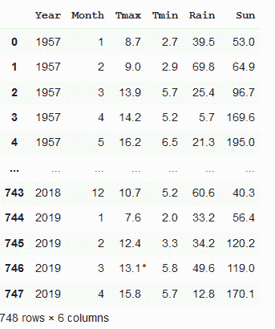

现在我们要将数据帧保存在 SQLite 数据库中。

首先，我们打开一个到新数据库的连接(如果数据库不存在的话，这将创建一个数据库)，然后在数据库中创建一个名为*天气的新表。*

```
conn = sql.connect('weather.db')
weather.to_sql('weather', conn)
```

除非原始数据发生变化，否则我们不需要再次运行这段代码，事实上，我们不应该这样做，因为如果已经存在同名的表，SQLIte 将不允许我们在数据库中创建新表。

让我们假设我们已经运行了上面的代码一次，并且我们有我们的数据库，*天气，*和表，也被称为*天气*。我们现在可以启动一个新的笔记本或 Python 程序来完成本教程的其余部分，或者简单地注释掉代码来下载和创建数据库。

所以，我们有一个数据库，里面有我们的天气数据，现在我们想把它读入一个数据帧。下面是我们如何将数据库表加载到数据帧中。

首先，我们像以前一样连接到数据库。然后我们使用 Pandas 的 sql_read 方法读入数据。但是要做到这一点，我们必须发送

对数据库的查询:

```
SELECT * FROM weather
```

这是你能做的最简单的 SQL 查询。这意味着从名为 weather 的表中选择所有列并返回数据。下面是代码(查询作为字符串传递)。

```
conn = sql.connect('weather.db')
weather = pd.read_sql('SELECT * FROM weather', conn)
```

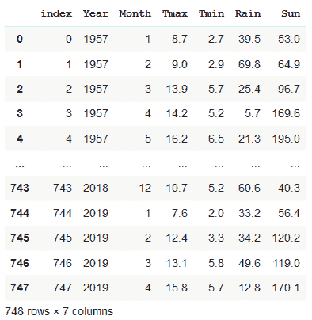

当然，这只是复制原始数据帧，所以让我们使用 SQL 的强大功能来加载数据的一个子集。

我们将获得相隔 50 年的几年的数据，并比较它们，看看是否有任何明显的差异。

让我们从获取 2010 年的数据开始。

我们将像以前一样使用 read_sql 创建一个名为 *y2010* 的新数据帧，但是查询略有不同。我们添加一个 WHERE 子句。这只选择关键字 where 后的条件为真的数据。因此，在这种情况下，我们只获得 year 列中的值为“2010”的数据行。

```
y2010 = pd.read_sql('SELECT * FROM weather WHERE Year == 2010', conn)
```

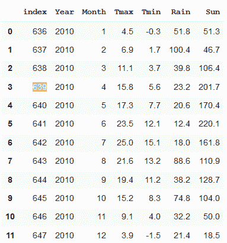

您可以看到，唯一返回的数据是 2010 年的。

这是 Tmax 的线图。

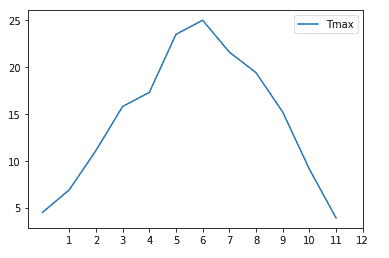

现在让我们再来一次，但是是 50 年前的 1960 年

```
y1960 = pd.read_sql('SELECT * FROM weather WHERE Year == 1960', conn)
```

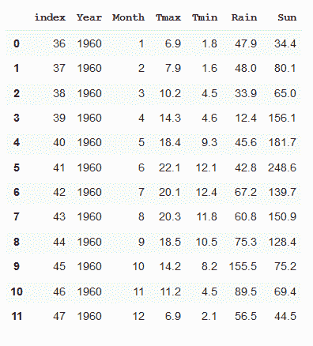

现在让我们画出这两年的 *Tmax* 。

```
ax2010 = y2010.plot(y='Tmax')
ax = y1960.plot(y='Tmax',color = 'red', ax=ax2010)
ax.legend(['2010','1960'])
```

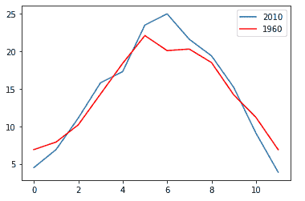

有趣的是，2010 年似乎比 1960 年更热也更冷。天气越来越极端了吗？我们需要做更多的分析来得出这个结论。

也许我们可以从找出最热的年份开始，比如温度超过 25 度的年份。

我们通过使用带有条件的 WHERE 子句来实现这一点， *Tmax > 25* ，即选择 Tmax 大于 25 度的行

但是，由于我们只对最高温度感兴趣，我们将只选择我们感兴趣的列。我们通过修改 SQL 查询中的 SELECT 子句来做到这一点。

我们没有选择*(即所有列)，而是列出了我们想要返回的列:Year、Month 和 Tmax。

```
high = pd.read_sql('SELECT Year,Month,Tmax FROM weather WHERE Tmax > 25', conn)
```

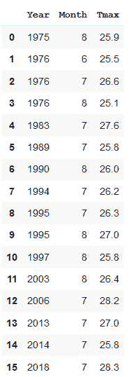

那是按年份顺序的。也许按温度顺序排会更有意思。

我们也可以用 SQL 做到这一点。我们加上 ORDER BY 子句，并给出应规定顺序的列。DESC 的意思是降序(省略它，您将得到默认的升序)。

```
high = pd.read_sql('SELECT Year,Month,Tmax FROM weather WHERE Tmax > 25 ORDER BY Tmax DESC', conn)
```

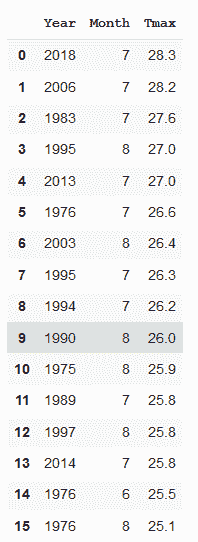

因此，2018 年高居榜首，2006 年紧随其后。但是 1983 年和 1995 年分别排在第三和第四位，所以这里没有明显的模式显示温度随着时间的推移而变热。

有一点我们可以看到，最热的月份是在夏天！(谁会想到呢。)但为了确保万无一失，让我们绘制一个直方图。

```
high.plot.hist(y='Month', xticks=high['Month'])
```

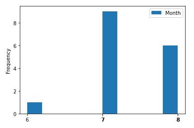

是的，最热的月份往往是七月。所以，如果我们在寻找一种趋势，为什么我们不看看几十年来的七月，看看气温是如何变化的。

这是另一个查询:

```
july = pd.read_sql('SELECT Year,Month,Tmax FROM weather WHERE month == 6', conn)
```

这给了我们一个所有年份的温度表，但只有当月份等于 6 时，即 7 月。

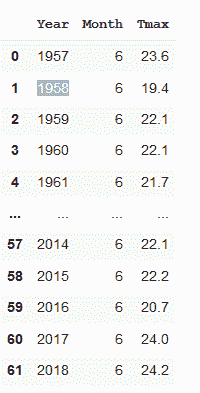

现在，我们将绘制一个 Tmax 值随时间变化的条形图。

```
july.plot.bar(x='Year', y='Tmax', figsize=(20,5));
```

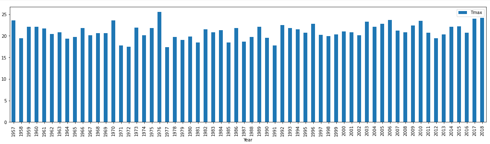

我们可以做一个回归图，看看是否有任何趋势，但坦率地说，看看这个条形图，没有明显的趋势。

因此，通过对伦敦气温数据的这种极其有限的分析，我们无法得出气候变化是否正在影响伦敦人的任何结论(但从个人经验来看，我可以说那里最近感觉相当温暖)。

但是我希望我已经展示了 SQLite 在与 Pandas 一起使用时是一个有用的工具，并且如果您以前没有使用过 SQL，您可以看到如何，即使是我在这里使用的很小一部分，可能会使您的数据分析受益。

一如既往，感谢阅读。如果你想知道我什么时候发表新文章，请考虑在这里注册一个电子邮件提醒。

如果你不是一个媒体订阅者，那就注册吧，这样你就可以每月花 5 美元阅读尽可能多的文章。在这里注册，我将赚取一小笔佣金。

## 获取代码

你可以在我的 [Github 页面](https://alanjones2.github.io/Alan-Jones-article-code/)上找到这篇文章和其他文章的样本代码。