# Python 熊猫数据帧到 Google Sheets for Tableau 公共直播

> 原文：<https://towardsdatascience.com/python-pandas-dataframe-to-google-sheets-for-tableau-desktop-live-cc1f86982bca?source=collection_archive---------27----------------------->

## 博客的第二部分—
[实时画面公共可视化的自动化 ETL](/automated-etl-for-live-tableau-public-visualizations-54f2b8652224)


[https://public.tableau.com/profile/eklavya.saxena#!/viz home/CoronavirusCOVID-19 cases world wide/新冠肺炎 _Country](https://public.tableau.com/profile/eklavya.saxena#!/vizhome/CoronavirusCOVID-19CasesWorldwide/COVID-19_Country)

T 他的博客是【LIVE Tableau 公共可视化自动化 ETL 的一部分，分为三个部分，即:

1.  启用 Google Sheets API 并创建凭证
2.  将 Python 连接到 Google Sheets 并导出数据帧
3.  使用 Google Sheets 启用 Tableau 公共直播

# 1.启用 Google Sheets API 并创建凭证


[https://console.developers.google.com/](https://console.developers.google.com/)

访问您的 [Google API 控制台](https://console.developers.google.com/)是连接 python 脚本和 google sheets 的第一步。循序渐进地启用 google sheets API 并创建所需的凭证。

## 1.1 创建一个项目

1.  点击左上角下拉菜单中的*选择一个项目*，将会打开一个弹出窗口
2.  在弹出窗口的右上角，点击'*新建项目*，这将带您进入一个新窗口
3.  给你的项目取一个合适的名字(例如:covid-viz-data)。您可以保持'*位置** '字段不变，并点击'*创建*

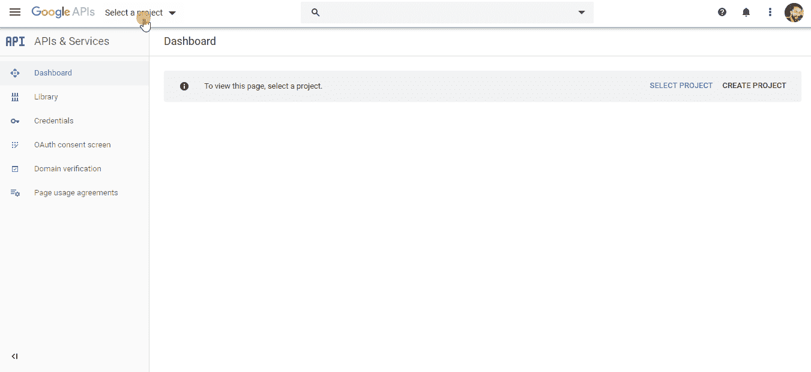

1.1 GIF 创建项目

## **1.2 启用 Google Sheets API 和** Google Drive API

1.  从左侧窗格中选择'*库*'(在'*仪表板*'下)，这将把您重定向到' *API 库*'窗口，其中有一个搜索 API 和服务的选项
2.  在字段' [*中键入 Google Sheets API*](https://developers.google.com/sheets/api) '并从结果中选择它，这将重定向到 Google Sheets API 窗口
3.  点击*启用*，为您在上一步中创建的项目启用它

类似地，启用 [Google Drive API](https://developers.google.com/drive) ，因为稍后导入的 python 库可能会使用上述两个 API 的功能。


启用 Google Sheets API 的 1.2 GIF

## 1.3 创建访问 API 的凭证

您可以在 Google Sheets API 窗口的右侧选择“*创建凭证*，或者如果您在仪表板上，从步骤 1 开始。

1.  从左侧窗格中选择“*凭证*”(在“*库*”下)。这将在右侧向您显示'*凭证*窗格
2.  点击顶部的“*创建凭证*”选项，这将显示一个下拉菜单
3.  单击下拉菜单中的“*帮助我选择*选项，这将重定向到标题为“*将凭证添加到您的项目*”的窗格
4.  在这个'*将凭证添加到您的项目中*'窗格中跟随:

    步骤 1: ' *找出您需要哪种凭证* '
    您正在使用哪个 API？— **Google Sheets API**
    你会从哪里调用这个 API？— **Web 服务器** 您将访问哪些数据？— **应用数据** 您打算将此 API 与 App Engine 或 Compute Engine 一起使用吗？— **不，我现在没有使用它们** ，单击“*我需要什么凭证？*根据我们输入的建议

    步骤 2:*创建服务帐户*
    服务帐户名称— **(例如:covid-data-update)**
    角色— **编辑器**(从下拉列表中选择“*项目*，然后选择“*编辑器*”)
    服务帐户 ID —自动创建的
    密钥类型—
    这将要求您保存凭证。允许访问您的云资源的 json 文件— ***因此安全地存储它*** 。

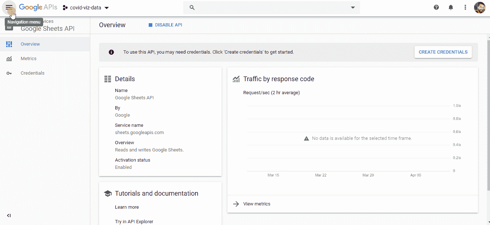

1.3 GIF 到 1.3 创建访问 API 的凭证

## 1.4 在中与客户电子邮件共享谷歌表单。json 凭证文件

现在我们有了访问 API 的秘密凭证(保存在。json 格式)，我们需要确保目标 google sheet 与以该格式生成的客户端电子邮件共享。json 文件。

1.  从中的“ *client_email* ”键复制电子邮件地址值。json 文件
2.  创建一个新的 google 工作表，用于导出数据
3.  打开表单后，点击右上角的*共享*
4.  粘贴复制的电子邮件地址，并授予其“Can e *dit* ”访问权限

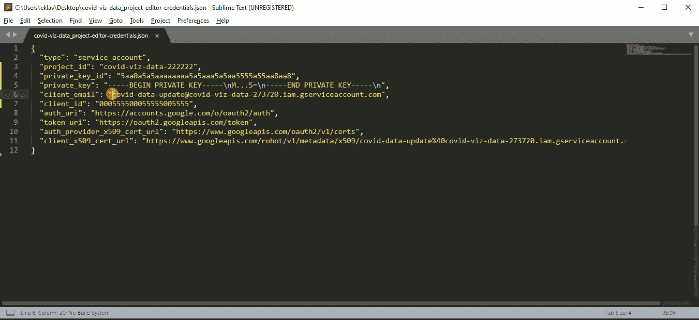

1.4 GIF 与客户端电子邮件共享谷歌表。json 凭证文件

恭喜你！我们已经成功地从 [Google API 控制台](https://console.developers.google.com/)启用了 [Google Sheets API](https://developers.google.com/sheets/api) ，并创建了通过 python 脚本访问该 API 的凭证。现在，让我们进入第二部分。

# 2.将 Python 连接到 Google Sheets 并导出数据帧

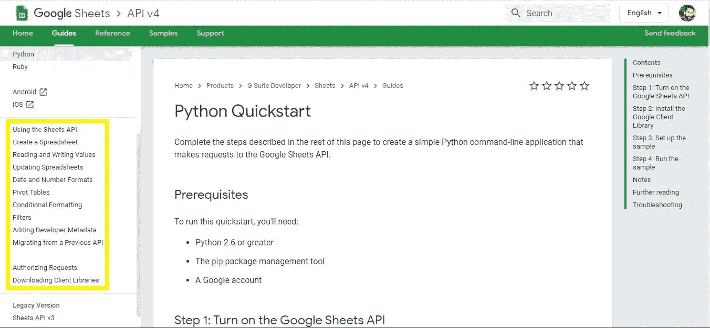

[https://developers.google.com/sheets/api/quickstart/python](https://developers.google.com/sheets/api/quickstart/python)

虽然 Google 创建了 Google Sheets API，但是他们当然没有留下来为 [Python QuickStart](https://developers.google.com/sheets/api/quickstart/python) 创建一个精美的指南。我强烈推荐参考它，因为额外的文档/指南提供了使用 Google Sheets 的巨大可能性。

**那为什么是这个博客呢？**
快速入门要求你安装 3 个库，分别是*Google-API-python-client*、 *google-auth-httplib2* 、 *google-auth-oauthlib* 。但是，从大量的 python 库来看，我们有:

> [pyg Sheets](https://pygsheets.readthedocs.io/en/stable/)——一个简单、直观的 python 库，通过 google Sheets API v4 访问 Google 电子表格

这一部分将利用 pyghseets 导出数据框架到谷歌表。让我们开始吧:

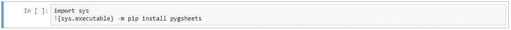

```
import sys
!{sys.executable} -m pip install pygsheets
```

为什么我没有使用`!pip install pyghseets`？在 Jupyter 中，上面的代码确保您运行的是与当前 Python 内核相关联的 pip 版本。另外，仅供参考，shell 环境和 Python 可执行文件是断开的。点击此处了解更多信息。

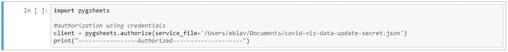

```
import pygsheetsclient = pygsheets.authorize(service_file='/Users/eklav/**credentials.json**')
print("-----------------Authorized--------------------")
```

安装完成后，下一步当然是导入库。然后，使用`[authorize](https://pygsheets.readthedocs.io/en/stable/reference.html#authorization)`功能创建一个变量`client`,用 google 帐户认证 python 脚本(或应用程序)。

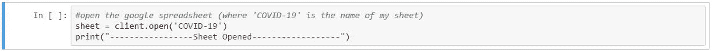

```
sheet = client.open('COVID-19')
print("-----------------Sheet Opened------------------")
```

现在，使用`[open](https://pygsheets.readthedocs.io/en/stable/reference.html#pygsheets.client.Client.open)`功能按标题(例如:*新冠肺炎*’)返回电子表格(在上一部分创建)，并将其赋给变量`sheet`。

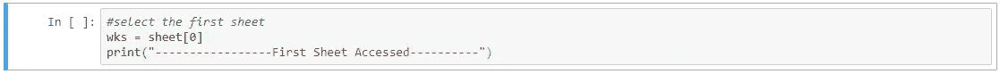

```
wks = sheet[0]
print("-----------------First Sheet Accessed----------")
```

为了访问第一个工作表，将工作表`sheet`的第*0*个索引分配给变量`wks`。

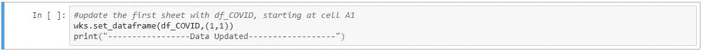

```
wks.set_dataframe(df_COVID,(1,1))
print("-----------------Data Updated------------------")
```

现在，使用工作表`wks`的`.set_dataframe`功能将' *df_COVID* '*和' *(1，1)* '分别赋值给' ***df*** '和' ***start*** '参数。
值“ *(1，1)* ”是指电子表格的 A1 单元格。

> 要了解 dataframe ' **df_COVID** 是如何策划的，请参考博客[的第一部分—**从 GitHub 提取数据并自动运行或调度 Python 脚本**](/automated-etl-for-live-tableau-public-visualizations-54f2b8652224)。

这就把我们带到了这一部分的结尾。我们启用了 API 和凭证，使用它们将 Python 连接到 Google Sheets——您的免费云存储。

# 3.使用 Google Sheets 启用 Tableau 公共直播

正如在母博客中提到的，最终是时候打破 Tableau Public 不能拥有实时数据的神话了。到目前为止，我们已经有了一个由 Windows 任务调度器自动运行的 Python 脚本，它反过来更新 Google 工作表。这张表将成为我们在 Tableau Public 上发布的仪表盘或可视化数据的来源。

## 3.1 将 Tableau 连接到 Google Sheet

我将不再详述一个众所周知的步骤——从 Tableau 起始页中选择一个数据源。如果需要，请遵循下面的 GIF:

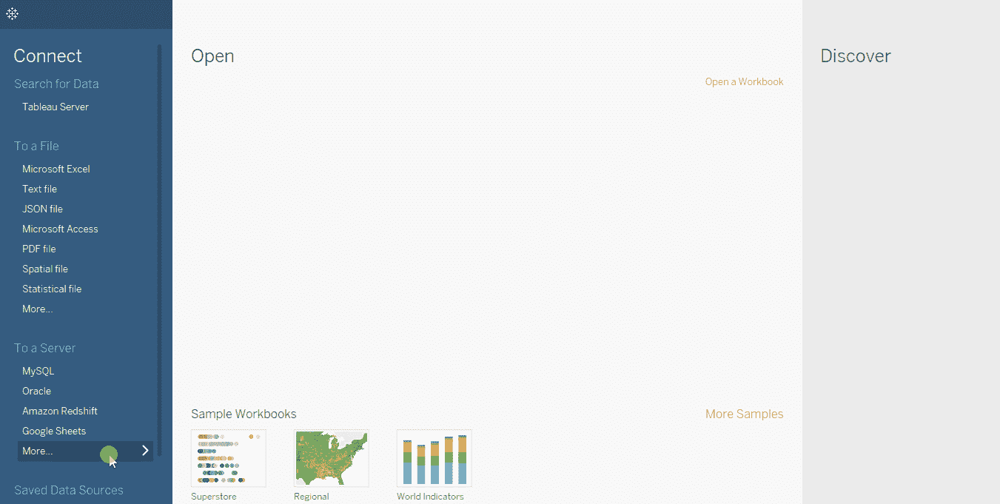

3.1 GIF 将 Tableau 连接到 Google Sheet

好了，现在你可以根据需要用来自你的 Google Sheets 的实时数据创建可视化了

## 3.2 在 Tableau Public 上发布工作簿

虽然你有一个与谷歌工作表的实时连接，它必须直接发布工作簿。登录[https://public.tableau.com](https://public.tableau.com)服务器，分享即可。

但是，问题就在这里！将弹出以下错误:

> 您要发布到的 Tableau 服务器要求对数据源启用提取。使用数据菜单启用以下数据源的提取:
> 
> 需要数据提取"

现在的问题是— **数据提取？？？**

从 Google Sheets 获取数据的全部意义在于拥有实时连接。这就是我们认为 Tableau Public 只处理摘录的地方。

但是，Tableau 还有更多的服务——不要眨眼，直接连接到“ *Extract* ”。现在，当您共享时，勾选显示以下内容的复选框并保存:

> “保持我的数据与 Google 工作表同步，并嵌入我的 Google 凭据”

点击“*保存*”按钮后，您将被重新定向到 Tableau Public，您的仪表板已发布。向下滚动并注意到“*请求更新*按钮。此按钮用于强制更新仪表板，从 Google 工作表中访问最新数据。不然不然我经历的 Tableau 每天自动刷新仪表盘。

答对了。

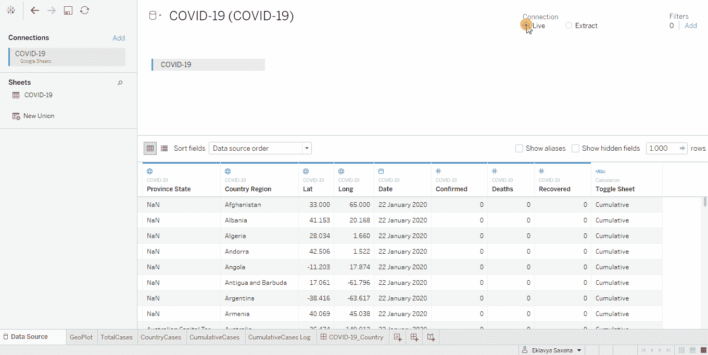

3.2 在 Tableau Public 上发布工作簿的 GIF

# 参考

*   [Google Sheets API 简介](https://developers.google.com/sheets/api/guides/concepts)
*   [使用 Python 读写 Google 电子表格，作者 Erik Rood](https://erikrood.com/Posts/py_gsheets.html)
*   [关于 pygsheets Python 库的文档](https://pygsheets.readthedocs.io/en/stable/)

感谢您的阅读！我希望这个博客揭示了 Tableau 公共有趣的一面。继续下去，让你的可视化生活。如果这篇文章是有帮助的，分享它。

请在评论中告诉我:

1.  如果你觉得这有用或没用，或者
2.  如果您想了解 Tableau 可视化中使用的不同功能的*如何使用*

[](https://github.com/eklavyasaxena/COVID-19) [## eklavyasaxena/新冠肺炎

### 来自 JHU CSSE GitHub Repo 的 ETL 创建 Tableau 可视化。ETL: Extract 中执行的步骤。GitHub 中的 csv 文件…

github.com](https://github.com/eklavyasaxena/COVID-19) [](https://www.linkedin.com/in/eklavyasaxena/) [## Eklavya Saxena -印度|职业简介| LinkedIn

### 精通数据的分析师和有抱负的数据科学家，拥有 2 年以上的销售或客户行业经验…

www.linkedin.com](https://www.linkedin.com/in/eklavyasaxena/)