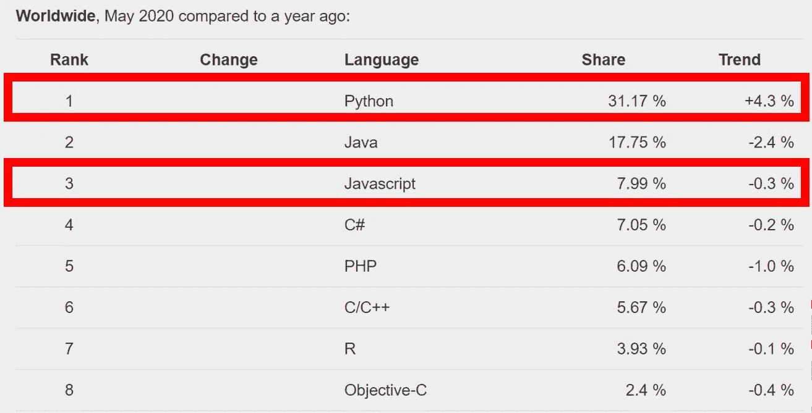
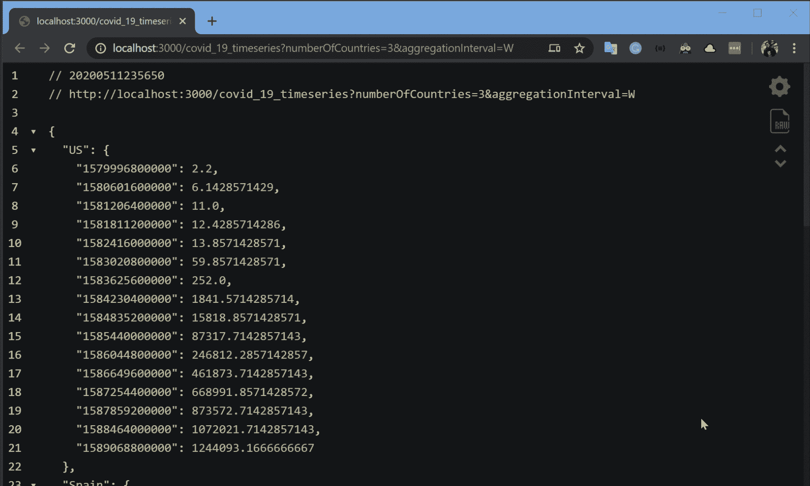
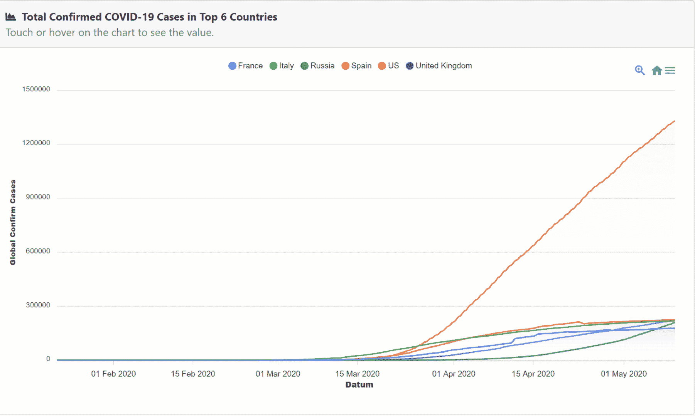
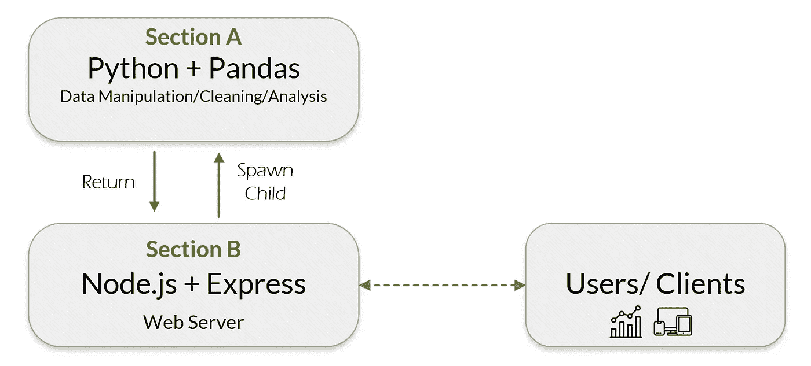
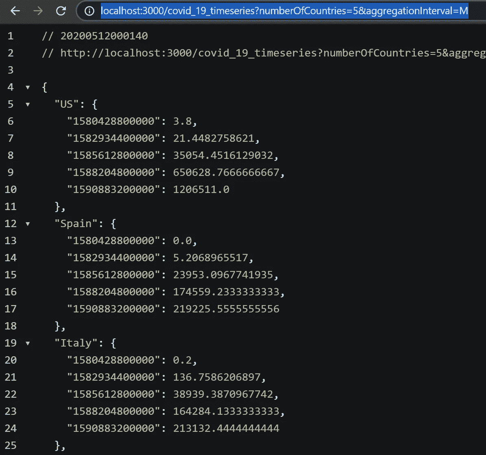

# Node.js 应用程序中的 Python 和 Pandas

> 原文：<https://towardsdatascience.com/python-pandas-in-node-js-application-47a76ae42a2a?source=collection_archive---------9----------------------->

## 使用 Python-Pandas 和 node . js-Express 的新冠肺炎时间序列聚合器 API 示例


NodeJS 和 Python 插图作者 [Chaeyun Kim](https://medium.com/@chaeyunkim)

在数据科学领域，我们都知道 **Python** 是处理数据管理、分析、可视化、ML 等等的最佳工具之一。同样， **Node.js** 是用于服务器端的 **JavaScript** 运行时环境，根据其经济效益、快速响应时间等，它是最流行的 web 架构工具之一。从编程语言流行指数看(PYPL): **Python** 和 **JavaScript** 是前 1 & 3 大流行语言。



**编程语言流行 2020 年 5 月**(截图来自[http://pypl.github.io/PYPL.html](http://pypl.github.io/PYPL.html)作者)

从我的经验来看，我看到大多数 Python 爱好者都试图用 Python 写所有东西。大多数 Node.js Volk 试图用 JavaScript 进行数据清理和操作…(对于所有的回调有点痛苦…)互联网上的一些博客试图比较 Node.js 和 Python，发现 Node.js 在 Web 开发方面很棒，Python 在数据科学方面很棒。实际上，我们不需要总是坚持使用同一种编程语言，因为有很多方法可以一起使用它们。在本文中，我将向您展示一个如何从 Node.js web 应用程序中使用 Python 脚本的示例。

# 示例:

## 让我们用 Node.js & Pandas 构建新冠肺炎时间序列聚合器 API

在本文中，我将展示一个如何创建一个简单的 API web 应用程序的示例，在该应用程序中，用户可以使用 Node.js 和 Express 框架请求新冠肺炎数据集和时间序列聚合间隔。有趣的是，我们将把 Python 和 Pandas 完成的时间序列聚合也集成到应用程序中。



**支持时序聚合的新冠肺炎快速 API 的简单节点(启用**)

随后，开发人员可以使用这样的 API 应用程序，通过任何 JavaScript 库在 web 应用程序中轻松呈现图表/地图/仪表板；如 *Apexchart.js* 、 *Highchart.js* 或 *Chart.js* 。下图显示了对每日新冠肺炎数据集使用简单 Apexchart 的示例。



**用 Apexchart.js 展示新冠肺炎确诊病例演示**(作者)

下图显示了该应用程序的整体结构:



**本例的系统架构**(作者)

# A 部分:Python 和 Pandas 用于时间序列分析

首先，让我们从 Python 应用程序开始，我将从我的关于用 Python 对[新冠肺炎时间序列进行分析的文章中选取一个例子。简而言之，我们将使用一个简单的 Python 脚本来读取和分析从 JHU CSSE 到熊猫数据帧的新冠肺炎数据集。然后，按“国家/地区”级别对数据集进行分组，转置数据帧，将日期/时间列设置为索引列，对确诊新冠肺炎病例最多的国家进行排序，并根据输入的国家编号选择排名靠前的国家。之后，用输入的时间间隔对数据集进行重采样，并返回*。json* 输出给用户。以下脚本显示了整个脚本:](https://medium.com/swlh/intro-to-time-series-analysis-with-pandas-in-python-d795da784501)

[**covid 19 aggregator . py**](https://gist.github.com/JoeThunyathep/28d9d404aa80d59ada69278e9c8de6b9)(作者示例脚本)

这个脚本有两个参数；第一个参数(arg1)是确诊新冠肺炎病例最多的国家数量，第二个参数(arg2)是累计时间间隔。例如，如果我们想要获得来自前三个国家的已确认的新冠肺炎病例和每月的汇总数据，那么我们可以使用以下命令运行 Python 脚本:

```
**$ python covid19aggregator.py 3 'M'**
```

然后，您将获得以下结果(截至 2020 年 5 月 10 日):

**执行带有 3/‘M’个参数**的[**covid 19 aggregator . py**](https://gist.github.com/JoeThunyathep/28d9d404aa80d59ada69278e9c8de6b9)**的示例结果(作者的示例结果)**

您可以看到时间索引被写成了时间戳，我们将这样保存它，因为它便于以后在基于 web 的可视化工具中使用。

# B 部分:带有 Express 应用程序的 Node.js

在这一部分中，我们将从创建一个简单的 Node.js & Express 应用程序开始。您可以使用以下命令启动项目并安装 express:

```
**$ npm init
$ npm install express --save**
```

然后，使用下面的示例脚本为 Node.js web 服务器创建一个`server.js`文件。如果你是新来的快递，请看这里的文档。在第 1 部分中，我们在端口 3000 上创建了一个简单的 express 应用程序。你可以换到任何你喜欢的港口。在第 2 部分中，我们定义了一个 GET 请求路由到“*http://localhost:3000/covid _ 19 _ time series*”，并使用`child_process`生成 Python 子进程，还将 URL 查询参数`‘numberOfCountries’`和`‘aggregationInterval’`传递给 Python 进程。您可以在这里看到完整的 Node.js 服务器脚本:

[**NodeJS 服务器**](https://gist.github.com/JoeThunyathep/ea0713caa129208d7e1a029a35dd44ae) **。js 与衍生**[**covid 19 aggregator . py**](https://gist.github.com/JoeThunyathep/28d9d404aa80d59ada69278e9c8de6b9)**Python 进程**(作者示例脚本)

完成了！现在，这个 Node.js 服务器已经完成，当用户调用以获取 COVID 19 数据时，它会生成 Python 子流程。让我们通过运行一个服务器来测试它:

```
**$ node server.js** server running on http://localhost:3000
```

让我们在 web 浏览器上查看结果:
(在这里，您可以传递任意数量的国家/聚合间隔)

```
[**http://localhost:3000/covid_19_timeseries?numberOfCountries=5&aggregationInterval=M**](http://localhost:3000/covid_19_timeseries?numberOfCountries=5&aggregationInterval=M)
```



网络浏览器上的示例结果。(作者截图)

所以，大概就是这样。现在，您已经有了一个用 Node.js 和 Python 构建的简单 API 应用程序。请注意，这个示例是为了展示将它们集成在一起的概念，可以在 Node.js 中改进这些脚本以获得更好的 API 路由结构，在 Python 中改进这些脚本以获得更复杂的数据操作工作流。

## 结论

本文展示了一个示例，说明如何使用 NodeJS 通过 Pandas 生成一个 Python 进程，并将结果直接返回给 API 调用。通过这种方式，我们可以灵活地将所有很酷的数据 Python 脚本与流行的 JavaScript web 框架集成在一起。我希望你喜欢这篇文章，并发现它对你的日常工作或项目有用。如果您有任何问题或意见，请随时给我留言。

关于我&查看我所有的博客内容:[链接](https://joets.medium.com/about-me-table-of-content-bc775e4f9dde)

安全**健康**健康**！💪**

**感谢您的阅读。📚**