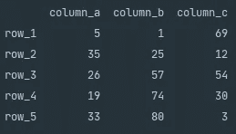
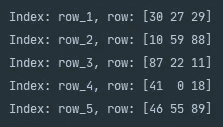
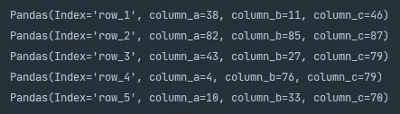

# Python 熊猫迭代数据帧

> 原文：<https://towardsdatascience.com/python-pandas-iterating-a-dataframe-eb7ce7db62f8?source=collection_archive---------5----------------------->

## 了解使用 Python 迭代熊猫数据帧的不同方法

由 [Maicol Santos](https://unsplash.com/@maicol_santos?utm_source=medium&utm_medium=referral) 在 [Unsplash](https://unsplash.com?utm_source=medium&utm_medium=referral) 上拍摄

# 介绍

作为一名数据科学家，我们有时会遇到低质量的数据。为了取得成功，我们需要能够在任何分析之前有效地管理数据质量问题。谢天谢地，有几个强大的开源库，我们可以利用它们来有效地处理数据，比如 [Pandas](https://pandas.pydata.org/pandas-docs/stable/index.html) 。今天我们将看看我们可以循环访问一个[数据帧](https://pandas.pydata.org/pandas-docs/stable/reference/frame.html)并访问其值的不同方法。迭代数据帧可以被合并到初始探索性数据分析之后的步骤中，以开始清理原始数据。

# 入门指南

## 熊猫是什么？

对于那些刚接触数据科学或不熟悉 Pandas 的人来说，Pandas 是一个用 Python 编写的开源库。它提供了易于使用的现成功能来接收和分析关系数据。Pandas 支持多种文件类型的消费，例如 CSV、Excel、JSON、XML、HTML 和 SQL 等等。

## 安装熊猫

安装 Pandas 最简单的方法是使用 [PyPI](https://pypi.org/) ，它通过在终端运行命令`pip install pandas`使用`pip`从源代码安装 Pandas。具体操作系统的详细安装说明可以在 Pandas [入门](https://pandas.pydata.org/pandas-docs/stable/getting_started/install.html)页面上找到，或者如果您正在使用 [PyCharm](https://www.jetbrains.com/pycharm/) 说明可以在[学习 Pandas Profiling](/learning-pandas-profiling-fc533336edc7) 中找到。

## 熊猫数据框

对于大多数人来说，Pandas 将数据收集到两个对象中的一个:

*   **系列**:系列是一维 [ndarry](https://numpy.org/doc/stable/reference/generated/numpy.ndarray.html) 对象。
*   **数据帧**:数据帧是一个二维数据结构，包含带标签的行和列。

显示系列和数据帧的构造函数的 Python 代码片段。

# 迭代数据帧

对于本例，我们已经创建了一个带有明确命名的行和列的 DataFrame，以帮助您入门并演示数据结构。通常，我们只命名列，并允许行索引自动生成一个数值范围。

Python 代码片段将生成一个 3 列 5 行的熊猫数据帧。

控制台输出显示了上述 Python 代码片段的结果。

执行完 Python 代码片段后，您应该会收到类似上面的输出。在这里，您可以清楚地看到 Pandas DataFrame 对象是如何使用一系列行和列来构造的。

## DataFrame.iterrows()

遍历数据帧的第一种方法是使用 Pandas `.iterrows()`，它使用索引行对遍历数据帧。

展示如何使用熊猫的 Python 片段。iterrows()内置函数。

控制台输出显示了使用。iterrows()。

在 DataFrame 上调用了`.iterrows()`之后，我们就可以访问作为行标签的`index`和代表行本身值的序列`row`。上面的代码片段利用了`Series.values`,它为被引用的行返回每列中所有值的 n 数组。

在`.iterrows()`中，`row`变量是 Series 类型，这意味着我们可以通过数据帧的指定列来访问值。例如，如果我们只对`column_a`感兴趣，我们可以使用下面的代码片段只返回那些值。

Python 代码片段显示了如何在使用？iterrows()。

上面的代码片段还演示了一种通过`row.get('column_name', default_value)`而不是`row['column_name']`来检查行中的列的更安全的方法。如果我们在寻找一个不存在的列,`row['column_name']`会引发一个`KeyError`异常。

## DataFrame.itertuples()

迭代数据帧的下一个方法是`.itertuples()`，它返回一个迭代器，包含代表列名和值的名称元组。

显示熊猫语法的 Python 片段。itertuples()内置函数。

显示调用结果的控制台输出。数据帧上的 itertuples()。

这个方法仍然提供了通过语法`row.column_name`隔离单个列的能力。如果我们只需要返回一个元组，我们可以将`name=None`和`index=False`传递给`.intertuples()`，这将从每一行中删除指定的列和索引。

# 最佳实践

虽然能够使用`.iterrows()`和`.itertuples()`迭代数据帧很方便，但一般来说，建议不要这样做，因为对于较大的数据帧，性能会很慢。通常，当人们想要迭代一个数据帧时，需要添加一个计算列或者重新格式化一个现有的列。Pandas 通过其内置函数`.apply()`提供这种类型的功能。`.apply()`函数为更新数据帧提供了更有效的方法。[熊猫申请权力用户](/pandas-apply-for-power-users-f44d0e0025ce)深入了解熊猫`.apply()`。

# 摘要

Pandas 提供了几种方法，我们作为数据科学家可以使用这些方法来迭代数据帧，比如`.iterrows()`和`.itertuples()`。`.iterrows()`和`.itertuples()`都提供了强大的安全方法来访问数据帧行值。虽然许多具有编程背景的新数据科学家可能倾向于熟悉数据帧上的循环，但 Pandas 通过内置的 apply 函数提供了一种更有效的方法。

感谢您花时间阅读我们的故事，我们希望您发现它有价值！