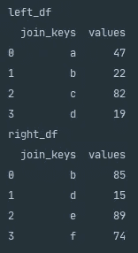
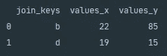
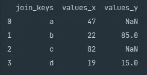
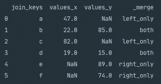

# Python 熊猫合并数据帧

> 原文：<https://towardsdatascience.com/python-pandas-merging-dataframes-aebbf898a9ff?source=collection_archive---------50----------------------->

## 在 Python 中合并熊猫数据帧的快速操作指南

[milkoví](https://unsplash.com/@milkovi?utm_source=medium&utm_medium=referral)在 [Unsplash](https://unsplash.com?utm_source=medium&utm_medium=referral) 上拍摄的照片

# 介绍

作为数据科学家，我们经常会发现我们需要同时分析来自多个数据源的数据。为了成功实现这一点，我们需要能够使用各种方法有效地合并不同的数据源。今天我们将看看如何使用 Pandas 内置的`.merge()`函数，通过几种不同的连接方法来连接两个数据源。

# 入门指南

对于那些刚刚接触数据科学或者还没有接触过 Python Pandas 的人，我们建议首先从 [Pandas 系列& DataFrame Explained](/pandas-series-dataframe-explained-a178f9748d46) 或 [Python Pandas 迭代 DataFrame](/python-pandas-iterating-a-dataframe-eb7ce7db62f8) 开始。这两篇文章都将为您提供安装说明和今天文章的背景知识。

# 熊猫合并

Pandas 内置函数`.merge()`提供了一个强大的方法，使用数据库风格的连接来连接两个数据帧。

## 句法

上面的 Python 片段显示了熊猫的语法。merge()函数。

## 因素

*   `right` —这将是您要加入的数据框架。
*   `how` —在此，您可以指定两个数据框的连接方式。缺省值是`inner`，但是，对于左外连接，您可以通过`left`，对于右外连接，您可以通过`right`，对于全外连接，您可以通过`outer`。
*   `on` —如果两个数据帧都包含一个共享列或一组共享列，那么您可以将它们作为键传递给`on`进行合并。
*   `left_on` —在此，您可以指定一列或一列标签，您希望将这些标签加入左侧数据框。当您希望在两个数据框架中连接的列的名称不同时，此参数非常方便。
*   `right_on` —与`left_on`相同的条件适用于右侧数据帧。
*   `left_index` —如果您想使用索引连接左侧数据框，则通过`True`。
*   `right_index` —如果您想使用索引连接正确的数据帧，则通过`True.`
*   `sort` —如果你希望连接的键按字典顺序排序，你可以在这里输入`True`。
*   `suffixes` —如果两个数据框架共享列标签名，则可以指定要应用于重叠的后缀类型。左侧默认为`_x`，右侧默认为`_y`。
*   `indicator` —如果您想标记行的来源，您可以将该参数设置为`True`。该标志将指示行关键字是只出现在左数据帧中，还是出现在右数据帧中，还是同时出现在两个数据帧中。
*   `validate` —在这里，您可以查看数据帧是如何连接的，以及键之间的关系。您可以通过下面的`1:1`来检查左右数据帧中的键是否唯一，`1:m`来检查合并的键是否只对左数据帧唯一，`m:1`来检查合并的键是否只对右数据帧唯一。

# 实际应用

下面我们将通过几个例子来学习如何使用合并功能。下面提供的代码片段将帮助您创建两个数据帧，我们将在故事的剩余部分使用它们。

上面的 Python 片段创建了两个数据帧，您可以使用它们来继续下面的示例。

上面的控制台输出显示了执行 Python 片段创建两个数据帧的结果。

## 内部连接

内部连接方法是 Pandas merge default。当您传递`how='inner'`时，返回的数据帧将只包含来自两个数据帧之间共有的连接列的值。

上面的 Python 片段演示了如何使用内部连接来连接两个数据帧。

上图显示了内部连接两个数据帧后的控制台输出。

从上面控制台输出的屏幕截图中，我们可以看到内部连接对两个数据帧的影响。由于值`a`、`c`、`e`和`f`不在两个数据帧之间共享，因此它们不会出现在控制台输出中。输出还演示了在处理两个数据帧之间的共享列标签时的默认后缀应用程序。

## 左连接

Pandas left join 的功能类似于 SQL 中的 left outer join。返回的数据帧将包含来自左侧数据帧的所有值，以及在来自右侧数据帧的合并期间匹配连接键的任何值。

上面的 Python 片段显示了使用左连接合并两个数据帧的语法。

上面的屏幕截图显示了使用左连接合并两个数据帧的控制台输出。

如果右边的数据帧与合并列`NaN`中的值不匹配，则将在返回的数据帧中插入*而不是数字*。

## 右连接

熊猫右连接执行与左连接类似的功能，但是连接方法应用于右数据帧。

上面的 Python 代码片段显示了使用 Pandas right join 合并两个数据帧的语法。

上面的屏幕截图显示了使用右连接合并两个数据帧的结果。

如上所述，在左侧数据帧中，右侧不存在的任何键都将插入一个`NaN`值。

## 外部连接

Pandas 外部连接合并了两个数据帧，实质上反映了左右外部连接的组合结果。外部连接将从左右两个数据帧返回所有值。当 Pandas 在合并数据帧中找不到值时，将使用`NaN`来代替。

上面的 Python 片段显示了使用外部连接来连接两个数据帧的语法。

上面的屏幕截图显示了使用外部连接合并两个数据帧的结果。

当使用外部连接合并两个数据帧时，了解新数据帧中的记录来自何处有时会很有用。您可以通过将`indicator=True`作为参数传递给`.merge()`函数来查看记录的来源，该函数将创建一个名为`_merge`的新列。

# 摘要

要想成为一名成功的数据科学家，您需要经常同时熟练地处理来自多个数据源的数据。我们经常需要组合数据源，有时是为了丰富数据集或在当前数据中合并历史快照。Pandas 使用内置的`.merge()`函数为连接数据集提供了一个强大的方法。Pandas `.merge()`函数在连接类型方面提供了灵活性，您可以创建这些类型来实现所需的输出。

感谢您花时间阅读我们的故事，我们希望您发现它有价值！