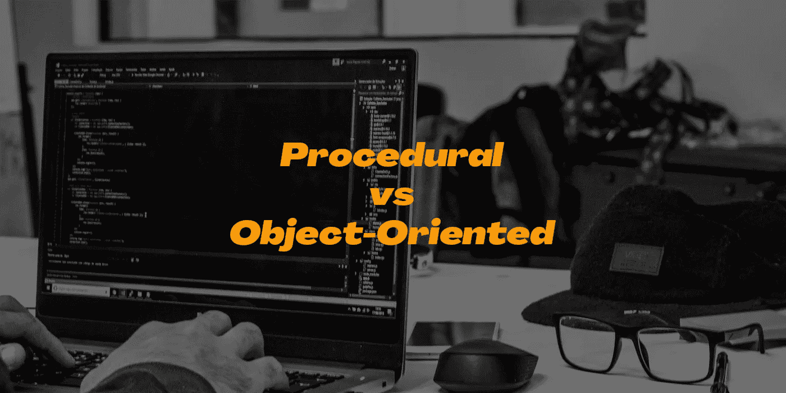
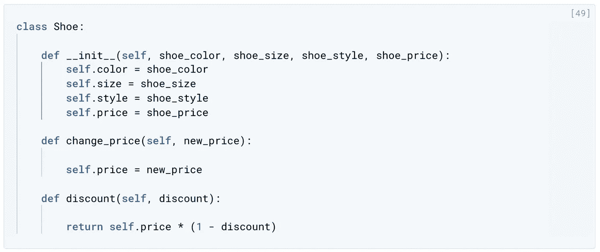

# Python:过程化编程还是面向对象编程？

> 原文：<https://towardsdatascience.com/python-procedural-or-object-oriented-programming-42c66a008676?source=collection_archive---------2----------------------->



Python:是过程化编程还是面向对象编程？戴维·兰格尔在 [Unsplash](https://unsplash.com/s/photos/python-programming?utm_source=unsplash&utm_medium=referral&utm_content=creditCopyText) 上的照片

## 数据科学和机器学习

## 过程化和面向对象之间有点争议，我们为什么要关心它？

> 谁不知道 Python？
> 大多用于数据科学和机器学习。
> 让我们多讨论一下吧！

当你第一次学习一个程序时，你似乎在使用一种叫做**过程化编程**的技术。程序性程序通常是一系列指令，从一行的顶部开始一个接一个地执行。另一方面，**面向对象的程序**是围绕 well 对象构建的。你可以把物体想象成现实世界中存在的东西。例如，如果你要建立一个鞋店，商店本身就是一个对象。商店中的商品，例如靴子和凉鞋，也可以是对象。收银机会是一个对象，甚至一个售货员也会是一个对象。

与过程式编程相比，面向对象编程有几个优点，过程式编程是您最先学习的编程风格。

*   面向对象编程使您能够开发大型的、模块化的程序，这些程序可以随时扩展。
*   面向对象的程序对最终用户隐藏了实现。

> 面向对象的程序将关注每个对象的具体特征以及每个对象能做什么。

一个对象有两个基本部分，**特征和动作**。例如，销售人员的几个特征包括姓名、地址、电话号码和时薪，以及销售人员能做什么。这可能涉及出售一件物品或从仓库中取走物品。作为另一个例子，鞋子的特征可以是颜色、尺寸、样式和价格。鞋子可以做什么动作？鞋子是一个没有生命的物体，但是它可以，比如说，改变它的价格。

```
**In terms of English grammar:**A characteristic would be a noun. 
An action would be a verb.Real-world example: a dog. Some of the characteristics could be:
* weight
* colour
* breed
* height -> These are all nouns.What actions would a dog take? 
* bark
* run
* bite
* eat -> These are all verbs.
```

**一个对象有特性和动作**。特征有特定的名称。它们被称为**属性**，动作被称为**方法**。在鞋子的例子中，颜色、尺码、款式和价格被称为属性。改变价格的行为是一种方法。还有另外两个术语，分别是**对象和**类。

一个对象可以是一只特定的鞋子，例如，一只美国尺码为 7.5 的棕色鞋子，以及鞋子示例中价格为 110 美元的运动鞋款式。这只棕色鞋子可能会改变它的价格。另一个对象可能是一双美国尺码为 4.5 的白色鞋子和一双售价为 80 美元的人字拖鞋子。这只白鞋也可以改变它的价格。

你注意到棕色鞋子和白色鞋子有什么特别吗？它们都有相同的属性。换句话说，它们都有颜色、尺寸、样式和价格。他们也有同样的方法。就好像它们来自一个蓝图，一个包含所有属性和方法的普通鞋子。对象的这种通用版本称为类。

你只需要对这个蓝图进行一次分类，然后你就可以一次又一次地从这个类中创建特定的对象。换句话说，你可以使用鞋子的蓝图，来制作你想要的任意多的鞋子，任何尺寸、形状、颜色、样式和价格。**这些是面向对象编程中的基本术语。**

```
**Object-Oriented Programming (OOP) Vocabulary****Class**
a blueprint which is consisting of methods and attributes.**Object**
an instance of a class. It can help to think of objects as something in the real world like a yellow pencil, a small dog, a yellow shoe, etc. However, objects can be more abstract.**Attribute**
a descriptor or characteristic. Examples would be colour, length, size, etc. These attributes can take on specific values like blue, 3 inches, large, etc.**Method**
an action that a class or object could take.
```

## 语法

如果您以前没有使用过类，语法可能会很复杂。



图一。鞋类

在图 1 中，写的是一个鞋类。该类具有颜色、大小、样式和价格属性。它还有一个改变价格的方法，以及一个输出折扣价的方法。在 shoe 类中，一些代码展示了如何实例化 Shoe 对象的例子，这样你就可以看到如何在程序中使用一个类。记住一个类代表一个蓝图。因此，我们正在设置普通鞋的颜色、尺码、款式和价格。

```
**Two things about this might seem a bit odd:*** __init__ ---> Python built-in function
* self -------> variable
```

Python 使用`**__init__**`创建一个特定的鞋子对象。另一方面，`**self**`变量在开始时可能很难理解。`**self**`保存颜色、大小等属性，使这些属性在整个 Shoe 类中可用。`**self**`本质上是一个保存所有属性和属性值的字典——检查 change price 方法，看看`**self**`如何工作。

我们可以将`**self**`作为第一个方法输入来访问价格。`**self**`中存储了价格，以及颜色、大小和样式等其他属性。如果你想访问属性，T7 总是你的方法的第一个输入。

还要注意，变更价格和折扣方法类似于一般的 Python 函数。例如，Python 函数不需要返回任何东西，所以像在 change price 方法中一样，它不返回任何东西。它只改变价格属性的值。然而，贴现方法确实返回了一些东西，它返回的是贴现价格。

```
**Additional: Function vs Method**A function and method seem very similar; both of them use the same keyword. They also have inputs and return outputs. The contrast is that a ***method is inside a class***, whereas a ***function is outside of a class.***
```

## 深入“自我”变量

如果定义两个对象，Python 如何区分两个对象？这就是`**self**`发挥作用的地方。如果在`**shoe_one**`上调用`**change_price**`方法，Python 怎么知道改变`**shoe_one**`的价格而不是`**shoe_two**`的价格？

```
def change_price(self, new_price): 
    self.price = new_priceshoe_one = Shoe('brown', '7.5', 'sneaker', 110) 
shoe_two = Shoe('white', '4.5', 'flip-flop', 80)shoe_one.change_price(125)
```

`**self**`告诉 Python 在计算机内存的什么地方寻找`**shoe_one**` 对象，然后 Python 改变`**shoe_one**`对象的价格。当你调用`**change_price**`方法时，`**shoe_one.change_price(125)**`，`**self**`被隐式传入。

`**self**`这个词只是一个约定。实际上你可以使用任何其他的名字，只要你始终如一；然而，你应该总是使用`**self**`而不是其他的词，否则你可能会让人混淆。

## 关于面向对象编程的一些注意事项

现在，我们将编写一个使用 shoe 类代码的单独的 Python 脚本。在同一个文件夹中，您需要创建另一个名为 **project.py** 的文件。在这个文件中，我们想要使用 shoe 类。首先，您需要通过键入`**from shoe import Shoe**`来导入 shoe 类。小写的 shoe 指的是 **shoe.py** 文件，大写的 shoe 指的是这个文件内部定义的类。

shoe.py 文件

project.py 文件

你可以指定你想要的文件和类。它们不必是相同的。我们这样做只是为了方便。现在，在**project . py***中可以使用鞋类了。如果你注意到了，代码现在是模块化的。您将编写一些使用 shoe 类的代码。*

*鞋类有一个方法来改变鞋的价格。在**的 project.py** 文件中**、**可以看到第 9 行的`**shoe_two.change_price(90)**`。在 Python 中，您还可以使用以下语法更改属性的值:`**shoe_one.color = ‘blue’**`、`**shoe_one.size = 5.0**`和`**shoe_one.price = 78**`。与编写访问和显示属性的方法相比，直接访问属性有一些缺点。*

```
*In terms of object-oriented programming, 
Python’s rules are a bit looser than in other programming languages. In some languages like C++, you can explicitly state whether an object should be permitted to change or access an attribute value directly. Python does not have this option.* 
```

> *为什么用方法改变值比直接改变值更好？*

*从长远来看，通过一个方法改变值会给你更多的灵活性。但是，如果计量单位被替换，例如，商店最初是以美元服务的，现在必须以欧元工作。如果你像在第 14 行那样直接改变了一个属性，如果突然你不得不使用欧元，你将不得不手动修改它。无论您在哪里直接访问价格属性，都必须这样做。*

*另一方面，如果您想使用一个像 change price 方法这样的方法，那么您所要做的就是进入 shoe 类，将原来的方法更改一次。我们要乘以，比如说，0.81，来把一切从美元转换成欧元。如果您返回到 **project.py** ，一个类似于数字 9 的行，您不必手动将价格从美元更改为欧元，因为转换会在鞋类中为您完成。*

## *遗产*

*本文还将讨论一个面向对象的主题，继承。我们认为使用一个真实世界的对象，比如前面的鞋子例子，继承会更容易理解。鞋子有四个属性，颜色、尺码、款式和价格。鞋子也有两种方法:一种是改变价格的方法，另一种是计算折扣价的方法。*

*随着商店的扩张，它可能会储存其他类型的鞋子，如高跟鞋、踝靴和拖鞋。这些鞋子与鞋子对象有一些共同的属性和方法。它们可能都有颜色、尺寸、样式和价格，它们都可以使用函数来改变价格和计算折扣。*

*当每双新鞋有如此多的共同点时，为什么要为它们编写单独的类呢？或者，您可以编写外观鞋类，然后高跟鞋、踝靴和骡子类可以继承鞋类的属性和方法。*

*这看起来像一个家谱，鞋子是父母，高跟鞋，踝靴和拖鞋是孩子。一个好处是，当你添加更多像芭蕾舞鞋这样的鞋类时，你可以很容易地添加一个继承自鞋类的新类。如果您想添加一个新的属性，如材料，来表示鞋是由合成材料、橡胶还是泡沫制成的呢？现在，你要做的就是，给鞋子类添加一个材质属性，所有子类自动继承新属性。编写和维护代码变得更加高效。*

## *结论*

> *Python 被认为是面向对象的编程语言，而不是过程化编程语言。*

*它是通过查看像 **Scikit-learn** 、**熊猫**和 **NumPy** 这样的 Python 包来识别的。这些都是用面向对象编程构建的 Python 包。例如，Scikit-learn 是一个用面向对象编程构建的相对全面和复杂的包。这个软件包随着最新的功能和新的算法的出现而不断发展。*

*当你用 Scikit-learn 训练一个机器学习算法时，你不需要知道任何关于算法如何工作或者它们是如何编码的。你可以直接专注于建模。*

*到目前为止，我们已经了解了 Python 中面向对象编程语言的核心:*

*   *类别和对象*
*   *属性和方法*
*   *遗产*

*了解了这些话题，就足够你开始写面向对象的软件了。然而，这些只是面向对象编程的基础。**您可以通过访问下面的高级主题了解更多信息。**另外，本文的源代码可以在我的 **GitHub⁴** 上找到。*

```
***Other Interesting Articles**#1 [Function Arguments: Default, Keyword, and Arbitrary](/function-arguments-default-keyword-and-arbitrary-9588b5eaaef3)#2 [Scope of Variable and LEGB Rule](/scope-of-variable-and-legb-rule-4d44d4576df5)#3 [Writing Your Own Functions](/writing-your-own-functions-40d381bd679)#4 [Data Science with Python: How to Use NumPy Library](/data-science-with-python-how-to-use-numpy-library-5885aa83be6b)#5 [Do you have the Software Engineer and Data Scientist skills?](/do-you-have-the-software-engineer-and-data-scientist-skills-probably-not-7e8fb069e067)*
```

## *关于作者*

***Wie Kiang** 是一名研究人员，负责收集、组织和分析意见和数据，以解决问题、探索问题和预测趋势。*

*他几乎在机器学习和深度学习的每个领域工作。他正在一系列领域进行实验和研究，包括卷积神经网络、自然语言处理和递归神经网络。*

**连接上*[*LinkedIn*](https://linkedin.com/in/wiekiang)*

```
***References**#1 [Scikit-learn](https://github.com/scikit-learn/scikit-learn)
#2 [pandas](https://pandas.pydata.org/)
#3 [NumPy](http://www.numpy.org/)
#4 [Source code on GitHub](https://github.com/wiekiang/python-oop)**Advanced Python Object-Oriented Programming Topics*** [class methods, instance methods, and static methods](https://realpython.com/instance-class-and-static-methods-demystified/)
* [class attributes vs instance attributes](https://www.python-course.eu/python3_class_and_instance_attributes.php)
* [multiple inheritance, mixins](https://easyaspython.com/mixins-for-fun-and-profit-cb9962760556)
* [Python decorators](https://realpython.com/primer-on-python-decorators/)*
```