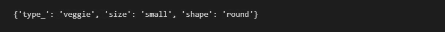

# 让我的代码高效的 Python 编程概念！

> 原文：<https://towardsdatascience.com/python-programming-concepts-that-made-my-code-efficient-68f92f8a39d0?source=collection_archive---------6----------------------->

沙哈达特·拉赫曼在 [Unsplash](https://unsplash.com?utm_source=medium&utm_medium=referral) 上拍摄的照片

## 使用这些神奇的命令来增强您的 Python 类！

Python 是广泛使用和采用的语言之一，尤其是在机器学习领域。毫无疑问，Python 是最通用的语言。它不仅可以用来处理后端数据，还可以用来做前端 UI。Python 拥有可以施展魔法的工具。然而，他们中许多人的目标总是实现目标，而不考虑最佳实践和效率。

为了实现这个目标，我们最终编写了 ***n*** 个将被调用并完成工作的函数。其中一些相互关联的功能可以使用一个*类*来定义。幸运的是，Python 是面向对象编程(OOP)，可以通过创建对象来解决问题。因为 Python 是 OOP，使用可复用的代码，避免冗余是最大的优势。

写 Python 代码时的口头禅

## 班级

从真正使其面向对象的最重要的组件开始，定义 c*class*。c *lass* 基本上就是一个创建对象的模板。想一个披萨类，会告诉食材，种类，大小等等。一个简单的类应该是这样的:

上面代码的输出

## __init__

*__init__* 是初始化方法，我们一调用这个类，它就会运行。这里，类一初始化，type_ variable 就被赋值为“veggie”。

上面代码的输出

假设我们创建了一个打印所请求的比萨饼的方法。这被称为实例方法，因为它们在实例对象 *obj* 上被调用。最佳实践是在该方法下定义一个变量，这样就可以在类内的任何地方访问它。Python 并不*要求*应该在类中的什么位置定义实例属性。

## __ 呼叫 _ _

*__call__* 一调用方法就运行。一旦对象被初始化，它就采取行动。 *__call__* 在一个实例需要经常改变状态的时候很有用。

上面代码的输出

我们可以看到 shape 的默认值是‘圆形’。然而，我可以在初始化后通过向对象传递一个值来改变形状。尝试传递空括号并检查输出！

## __repr__

*__repr__* 主要用于查看赋给我们变量的值。它可以定义如下:

上面代码的输出

尽管 __repr__ 被认为是对象的“正式”字符串表示，但它主要用于调试，主要由开发人员使用。

## __str__

*__str__* 与上面的 *__repr__* 颇为相似。 *__str__* 可以被覆盖，并允许更多的定制，除非像 repr 不能。

上面代码的输出

如上图，除非像 *__repr__* 一样，需要将对象传递给 *print* 函数来显示变量。 *__str__* 与 *__repr__* 相反，被认为是对象的“非正式”字符串表示。它主要用于为普通用户创建输出。

## __ 词典 _ _

Python 有一个名为 *__dict__* 的内部字典，保存所有的内部变量。这是检查变量内部细节的简单方法。

上面代码的输出

也可以使用 *__dict__* 属性直接更改变量，如下所示:

上面代码的输出

## __ 插槽 _ _

*__slots__* 和上图的 *__dict__* 很像。这是**最好的特性之一，**通常不被 Python 社区使用。如果数据被传递给 *__init__* 并且主要用于存储数据， *__slots__* 可以帮助优化类的性能。下面是如何使用它:

再深入一点细节， *__dict__* 浪费了很多 RAM。这是告诉 Python 不要使用 *__dict__* 而只使用一组固定属性的好方法。对于繁重的 RAM 工作，有些人已经看到通过使用 *__slots__* 减少了 40–50%的 RAM 使用[2]。

## 静态方法:

我们简要地看到了如何创建方法来完成特定的任务。有些方法，不一定需要修改或传递任何类参数，就可以使用。他们成为类的一部分而不是类的对象是有意义的。换句话说，他们对*类*状态一无所知。这种方法被称为*静态方法*。下面是一个小例子:

上面代码的输出

正如我们上面看到的，我们可以直接使用*静态方法*，甚至不用初始化类。我们使用@staticmethod 定义这样的方法。我们主要用来创建效用函数。

## 类方法:

*类方法*不同于*静态方法*。这里，*类方法*可以访问或修改*类*的状态。当调用方法时，我们将 *cls* 作为指向类而不是对象实例的参数传递。

上面代码的输出

正如我们在上面看到的，一个人可以单独使用这个方法，但是它需要它所属的类所期望的所有参数。根据输入的数字，大小被确定为“中等”。我们使用@classmethod 定义它们。

## 结论:

这些是我在一段时间里学到的一些重要的方面。如果想真正写出更好的 Python 代码，理解并实现这些“最佳实践”是很重要的。一开始可能很难理解，但是你越是编码和尝试使用它们，你就会越清楚地理解它们的重要性。最佳实践有助于代码库的长期可维护性。集成良好设计原则的良好基础不仅会使未来的开发更容易，还会帮助其他用户/团队成员使用相同的代码进行重用或改进。

## 参考资料:

1.  [www.programiz.com](https://www.programiz.com/python-programming/object-oriented-programming)

[2。https://book.pythontips.com/en/latest/__slots__magic.html](https://book.pythontips.com/en/latest/__slots__magic.html)

> 如果你认为我遗漏了什么概念，应该补充，请随时评论！欢迎评论！

*想成为* [*中等会员*](https://pratikkgandhi.medium.com/membership) *享受无限制阅读文章的乐趣，请注册成为会员。Medium 将与我分享一部分给使用以上链接注册的成员！谢了。*