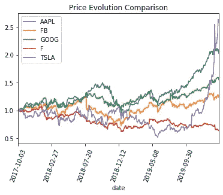
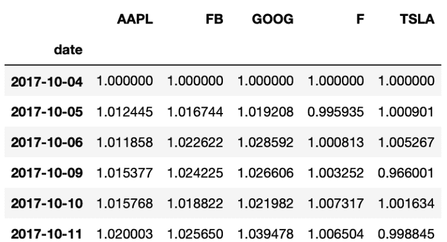

# 面向金融的 Python 股票价格趋势分析

> 原文：<https://towardsdatascience.com/python-python-for-finance-stock-price-trend-analysis-9111afc29259?source=collection_archive---------7----------------------->

## 构建一个强大的 Python 工具来执行股票价格趋势分析

在本文中，我们将构建一个非常强大的 Python 工具来执行**股票价格趋势分析**。一旦脚本准备就绪，Python 将为我们生成下图，显示不同股票随时间的价格趋势。



用于金融股票价格分析的 Python

这个用于金融分析的很酷的**Python**脚本将股票列表作为输入，然后它将:

*   **下载每家所需公司近年来的每日股票价格**。
*   将所有股票价格合并到一个单一的熊猫数据框架中。
*   以基准日期(即我们获得数据的第一天)的百分比显示结果。
*   **使用 Matplotlib 绘制每家公司的股价走势图**。

# 设置 Python for Finance 脚本

为了开始构建我们的**股价趋势分析**脚本，我们需要导入几个包。

首先，我们将向一个免费的财务 API 发出 http 请求，在那里我们将获得股票每日价格。然后，我们将使用 [Pandas](https://pandas.pydata.org/pandas-docs/stable/index.html) 合并 API 返回的财务数据，并将它们合并到一个 Pandas 数据框架中。最后，我们将使用 [matplotlib](https://matplotlib.org/) 将我们的数据转换成图形。

在导入所有必需的包之后，我们将有一个我们想要检索价格的每家公司的[股票](https://en.wikipedia.org/wiki/Ticker_symbol) [报价器](https://en.wikipedia.org/wiki/Ticker_symbol)列表。作为一个想法，你也可以使用 Python 获得标准普尔 500 指数中所有公司的股票列表，并将其作为你分析的基础，而不是手动输入股票代码。你可以在我的另一篇文章中找到答案。

```
import requests
import pandas as pd
import matplotlib.pyplot as plt

#Enter the ticker of the companies that you want to analyse
companies = ['AAPL','FB','GOOG','F','TSLA']#empty list to add each of the companies
listofdf = []
```

现在我们有了初始设置，我们可以进入有趣的部分了。我们的最初目标是发送一个 *http* 请求到 [API 端点来下载每日股票价格](https://financialmodelingprep.com/api/v3/historical-price-full/aapl?serietype=line)。

```
#API end point request
requests.get(f"https://financialmodelingprep.com/api/v3/historical-price-full/aapl?serietype=line")

#outcome
{
"symbol": "AAPL",
"historical": [
{
"date": "1989-09-19",
"close": 1.54
},
{
"date": "1989-09-20",
"close": 1.59
},
{
"date": "1989-09-21",
"close": 1.6
},
```

正如你在上面的 url 中看到的，我们传递了 ***aapl*** 作为*参数*(即在上面的例子中是 *aapl* 是苹果的股票代码)。该参数向 API 指示我们正在请求哪只股票的股价数据。因此，通过将 url 参数 *appl* 更改为任何其他公司股票，我们将获得其他公司的价格。

通过查看响应，我们看到列表中的每个元素都是一个字典，包含一天的股票价格。

```
for item in companies:
    histprices = requests.get(f"https://financialmodelingprep.com/api/v3/historical-price-full/{item}?serietype=line")
#convert response to json
    histprices = histprices.json()

#Parse the API response and select only last 600 days of prices
    histprices = histprices['historical'][-600:]

#Convert from dict to pandas datafram
    histpricesdf = pd.DataFrame.from_dict(histprices)

#rename column from close to the name of the company
    histpricesdf = histpricesdf.rename({'close': item}, axis=1)

#append all dfs to list
    listofdf.append(histpricesdf)
```

**For 循环将让我们遍历*公司*列表中的每个**公司。这样，在每次循环迭代中，我们将为列表中包含的每只股票发出一个新的 http 请求。

注意，我们将单词 ***item*** 作为 url 的参数传递，该单词表示股票代码，并将随着每次循环迭代而改变。

然后，我们对熊猫数据帧进行切片，只保留最近的 600 天。最后，我们可以使用 [***pd。data frame . from _ dict()***](https://pandas.pydata.org/pandas-docs/stable/reference/api/pandas.DataFrame.from_dict.html)to**将我们的字典**与股票价格和日期转换成一个熊猫数据框架。

现在我们有了一个名为 listofdf 的列表。列表中的每个元素都包含每只股票的熊猫数据帧。然而，将我们所有的股票放在不同的熊猫数据框架中对我们的分析没有太大的帮助。因此，**我们将使用 Pandas 类方法 [*pd.concat*](https://pandas.pydata.org/pandas-docs/stable/reference/api/pandas.concat.html) 将**合并为一个。

```
#set index of each DataFrame by common column before concatinatinghtem
dfs = [df.set_index('date') for df in listofdf]

histpriceconcat = pd.concat(dfs,axis=1)
```

太好了，现在我们将所有股票价格合并到一个熊猫数据框架中:

在开始绘制每只股票的价格趋势之前的最后一步，我们将**将数据框中的每一行除以第一行。**这将允许跨股票比较，因为所有股票价格将显示为一段时间内的百分比差异。



面向金融的 Python 股票价格

低于 1 的值表示与基准日(即 2017-10-04)相比，股价有所下跌。大于 1 的值表示价格上涨。


由[奥斯汀·迪斯特尔](https://unsplash.com/@austindistel?utm_source=unsplash&utm_medium=referral&utm_content=creditCopyText)在 [Unsplash](https://unsplash.com/s/photos/analysis?utm_source=unsplash&utm_medium=referral&utm_content=creditCopyText) 上拍摄的照片

# 绘制股票价格趋势

我们的脚本几乎准备好了，唯一悬而未决的部分是 Python **图** **显示股票价格随时间的趋势**。我们可以使用 matplotlib 轻松实现这一点。

首先，我们将循环遍历每个串联的熊猫数据帧，以便**绘制每个列**。然后，我们可以通过**添加标题**、**旋转棒并显示图例**来稍微改变一下图表的布局:

```
for i, col in enumerate(histpriceconcat.columns):
    histpriceconcat[col].plot()

plt.title('Price Evolution Comparison')

plt.xticks(rotation=70)
plt.legend(histpriceconcat.columns)

#Saving the graph into a JPG file
plt.savefig('foo1.png', bbox_inches='tight')
```


用于金融股票价格分析的 Python

# 包扎

就这样，我们构建了一个很好的 Python 脚本来执行**股票价格趋势分析**。由于价格显示为第一个数据点的百分比，该图对于比较不同公司的价格趋势特别有用。例如，我们可以看到 ***特斯拉*** 在过去几周经历了大幅增长，而**苹果股价**自 2017 年以来一直在稳步上涨。

随意改变绘图天数和公司数量。为了您的方便，请参阅下面的整个脚本。

好好享受吧！

```
import requests import pandas as pd import matplotlib.pyplot as plt companies = ['AAPL','FB','GOOG','F','TSLA'] listofdf = [] for item in companies: histprices = requests.get(f"https://financialmodelingprep.com/api/v3/historical-price-full/{item}?serietype=line") histprices = histprices.json() #Parse the API response and select only last 600 days of prices histprices = histprices['historical'][-600:] #Convert from dict to pandas datafram histpricesdf = pd.DataFrame.from_dict(histprices) #rename column histpricesdf = histpricesdf.rename({'close': item}, axis=1) #append all dfs to list listofdf.append(histpricesdf) #set index of each DataFrame by common column before concatinatinghtem dfs = [df.set_index('date') for df in listofdf] histpriceconcat = pd.concat(dfs,axis=1) #divide all dataframe by first line of data to enable comparison histpriceconcat = histpriceconcat/histpriceconcat.iloc[0] for i, col in enumerate(histpriceconcat.columns): histpriceconcat[col].plot() plt.title('Price Evolution Comparison') plt.xticks(rotation=70) plt.legend(histpriceconcat.columns) plt.savefig('foo1.png', bbox_inches='tight')
```

*原载于 2020 年 2 月 25 日 https://codingandfun.com**T21*[。](https://codingandfun.com/python-for-finance-stock-price-trend-analysis/)

```
import requests
import pandas as pd
import matplotlib.pyplot as plt

companies = ['AAPL','FB','GOOG','F','TSLA']
listofdf = []
for item in companies:
    histprices = requests.get(f"https://financialmodelingprep.com/api/v3/historical-price-full/{item}?serietype=line")
    histprices = histprices.json()

#Parse the API response and select only last 600 days of prices
    histprices = histprices['historical'][-600:]

#Convert from dict to pandas datafram

    histpricesdf = pd.DataFrame.from_dict(histprices)

#rename column
    histpricesdf = histpricesdf.rename({'close': item}, axis=1)

#append all dfs to list
    listofdf.append(histpricesdf)

#set index of each DataFrame by common column before concatinatinghtem
dfs = [df.set_index('date') for df in listofdf]

histpriceconcat = pd.concat(dfs,axis=1)

#divide all dataframe by first line of data to enable comparison
histpriceconcat = histpriceconcat/histpriceconcat.iloc[0]

for i, col in enumerate(histpriceconcat.columns):
    histpriceconcat[col].plot()

plt.title('Price Evolution Comparison')

plt.xticks(rotation=70)
plt.legend(histpriceconcat.columns)
plt.savefig('foo1.png', bbox_inches='tight')
```