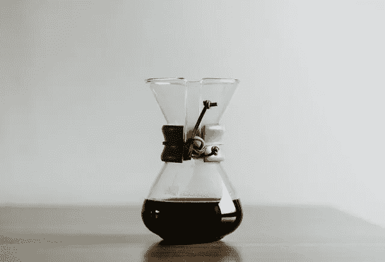
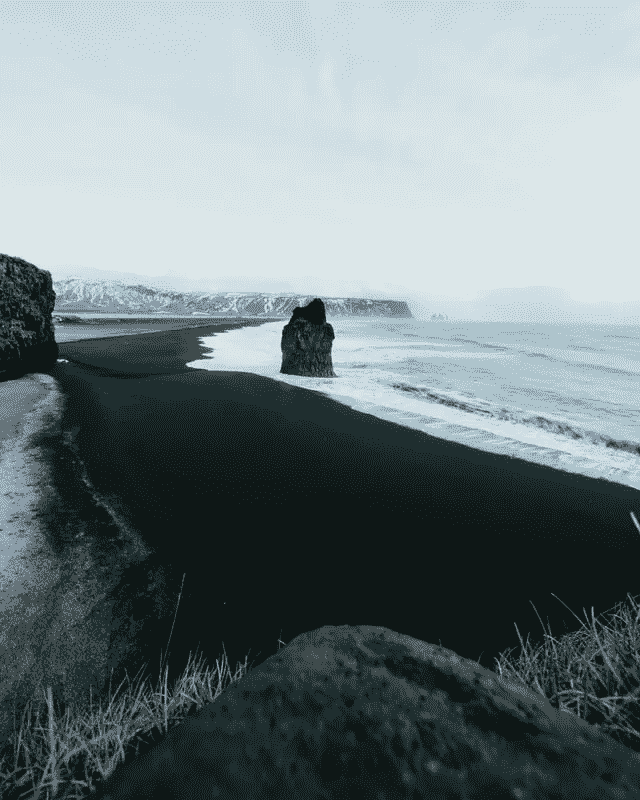

# Python Rest API 示例

> 原文：<https://towardsdatascience.com/python-rest-api-example-10c802e8ff24?source=collection_archive---------33----------------------->

## 使用 Flask 分享你的想法，Flask 是**数据科学家**最流行的框架



由[扎拉克汗](https://unsplash.com/@zarakvg?utm_source=unsplash&utm_medium=referral&utm_content=creditCopyText)在 [Unsplash](https://unsplash.com/s/photos/flask?utm_source=unsplash&utm_medium=referral&utm_content=creditCopyText) 上拍摄的照片

让我们假设我们非常擅长创建机器学习模型，我们可以创建许多不同的有趣的项目。下一步是什么？我们如何与他人分享我们的知识？答案是做一个 API。

根据[维基百科](https://en.wikipedia.org/wiki/Application_programming_interface),**应用编程接口** ( **API** )是[客户端和](https://en.wikipedia.org/wiki/Client%E2%80%93server_model)服务器之间的[接口](https://en.wikipedia.org/wiki/Interface_(computing))或[通信协议](https://en.wikipedia.org/wiki/Communication_protocol)，旨在简化客户端软件的构建。听起来很复杂，但事实并非如此。

在本教程中，我们将把这个算法转换成一个 API。

让我们看看代码。

```
import PIL
from PIL import Image
import requests
from io import BytesIO
import webcolors
import pandas as pd

import webcolors

def closest_colour(requested_colour):
    min_colours = {}
    for key, name in webcolors. CSS3_HEX_TO_NAMES.items():
        r_c, g_c, b_c = webcolors.hex_to_rgb(key)
        rd = (r_c - requested_colour[0]) ** 2
        gd = (g_c - requested_colour[1]) ** 2
        bd = (b_c - requested_colour[2]) ** 2
        min_colours[(rd + gd + bd)] = name
    return min_colours[min(min_colours.keys())]

def top_colors(url, n=10):
    # read images from URL
    response = requests.get(url)
    img = Image.open(BytesIO(response.content))

    # convert the image to rgb
    image = img.convert('RGB')

    # resize the image to 100 x 100
    image = image.resize((100,100))

    detected_colors =[]
    for x in range(image.width):
        for y in range(image.height):
            detected_colors.append(closest_colour(image.getpixel((x,y))))
    Series_Colors = pd.Series(detected_colors)
    output=Series_Colors.value_counts()/len(Series_Colors)
    return(output.head(n).to_dict())
```

所以“ **top color** ”函数所做的是给定一个图像的 URL，它可以返回前 10 种主色。点击[此处](https://predictivehacks.com/most-dominant-color-of-an-image/)了解更多信息。

我们必须在工作目录中用上面的代码创建一个 **colors.py** 文件，这样我们就可以将函数导入到我们的 flask 代码中。

我们的 API，**的输出不能是熊猫数据帧。所以我们会把它转换成 JSON。一个简单的方法是将数据帧作为字典返回，然后在我们的 flask 代码中，使用 flask 的 Jsonify 函数，我们可以将其转换为 JSON。这就是我们使用。 **top_colors** 函数中的 to_dict()方法。**

# Python Rest API Flask 脚本

现在我们有了我们的函数，下一步是创建我们的 Flask 代码。在我们的工作目录中，我们必须用以下代码创建一个 **main.py** 文件:

```
from flask import Flask, jsonify, request

app=Flask(__name__)

#we are importing our function from the colors.py file
from colors import top_colors

[@app](http://twitter.com/app).route("/",methods=['GET','POST'])
def index():
    if request.method=='GET':
#getting the url argument       
        url = request.args.get('url')
        result=top_colors(str(url))
#the jsonify function is converting the dictionary to JSON
        return jsonify(result)
    else:
        return jsonify({'Error':"This is a GET API method"})

if __name__ == '__main__':
    app.run(debug=True,host='0.0.0.0', port=9007)
```

您不必理解整个脚本，只需将它作为您的 API 项目的基础。

首先我们必须从 **colors.py** 文件中导入我们的函数 **top_colors** 。使用**url = request . args . get(' URL ')**我们得到参数 **"url"** 的值，在我们的例子中是一个图像的 URL。

然后，我们将这个值传递给我们的函数，并使用 **jsonify 库**将它转换成一个 JSON 返回结果，正如我们上面所说的。

**if** 语句是为那些调用 API 作为 POST 方法的人准备的，这样它就可以返回一个警告。最后，端口由您决定，我们使用的是 **9007** 。

最后，我们可以运行 **main.py** 文件在本地进行测试。只需在您的终端中运行以下命令:

```
 python main.py
```

输出将是这样的:

```
* Serving Flask app "main" (lazy loading)
 * Environment: production
   WARNING: Do not use the development server in a production environment.
   Use a production WSGI server instead.
 * Debug mode: on
 * Restarting with stat
 * Debugger is active!
 * Debugger PIN: 220-714-143
 * Running on http://0.0.0.0:9007/ (Press CTRL+C to quit)
```

这意味着我们的 API 运行在使用 9007 端口的本地主机上。

现在我们可以用浏览器来测试它。要在 API 的 URL 中添加我们的变量(图片 URL)，我们必须把它添加在末尾，如下所示**？变量=。**在我们的示例中，我们的 API 的 URL 如下:

`http://localhost:9007/` **？URL =[[图片的 URL]]**。

例如，我们想从 Unsplash 中获取以下图像的主色:



由[Á·萨·斯泰纳斯多蒂尔](https://unsplash.com/@asast?utm_source=unsplash&utm_medium=referral&utm_content=creditCopyText)在 [Unsplash](/?utm_source=unsplash&utm_medium=referral&utm_content=creditCopyText) 上拍摄的照片

[https://images . unsplash . com/photo-1615479865224-b 07 bb 46 a 5 f 56？ixid = mxwxmja 3 fdb 8 mhxwag 90 by 1 wywdlfhx 8 fgvufdb 8 fhw % 3D&ixlib = r b-1 . 2 . 1&auto = format&fit = crop&w = 1000&q = 80](https://images.unsplash.com/photo-1615479865224-b07bb46a5f56?ixid=MXwxMjA3fDB8MHxwaG90by1wYWdlfHx8fGVufDB8fHw%3D&ixlib=rb-1.2.1&auto=format&fit=crop&w=1000&q=80)

我们在浏览器中点击了以下 URL

```
[http://localhost:9007/?url=](http://localhost:9007/?url=https://image.shutterstock.com/z/stock-photo-at-o-clock-at-the-top-of-the-mountains-sunrise-1602307492.jpg:)[https://images.unsplash.com/photo-1615479865224-b07bb46a5f56?ixid=MXwxMjA3fDB8MHxwaG90by1wYWdlfHx8fGVufDB8fHw%3D&ixlib=rb-1.2.1&auto=format&fit=crop&w=1000&q=80](https://images.unsplash.com/photo-1615479865224-b07bb46a5f56?ixid=MXwxMjA3fDB8MHxwaG90by1wYWdlfHx8fGVufDB8fHw%3D&ixlib=rb-1.2.1&auto=format&fit=crop&w=1000&q=80)
```

然后，我们将得到以下输出:

```
{'black': 0.2843,
 'gainsboro': 0.2812,
 'darkslategray': 0.1889,
 'lavender': 0.0668,
 'lightsteelblue': 0.0448,
 'lightgray': 0.0405,
 'darkgray': 0.0189,
 'darkolivegreen': 0.0172,
 'dimgray': 0.0144,
 'lightslategray': 0.0129}
```

成功了，我们得到了那个图像的主色！下一步是在服务器上部署它。

## 结论

构建 API 是数据科学家必须掌握的知识。迟早你会被要求为你的模型创建一个 API 来与开发者或项目的其他人分享，所以开始尝试吧！

以后我会写更多初学者友好的帖子。[在媒体上关注我](https://medium.com/@billybonaros)或[访问我的博客](https://predictivehacks.com/)了解他们。

我欢迎提问、反馈和建设性的批评，你可以通过推特(Twitter)或社交网站(Instagram)联系我。

*原载于 2020 年 1 月 29 日 https://predictivehacks.com**[*。*](https://predictivehacks.com/python-rest-api-example/)*