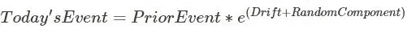
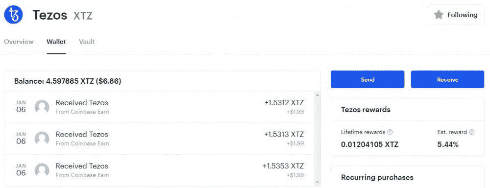
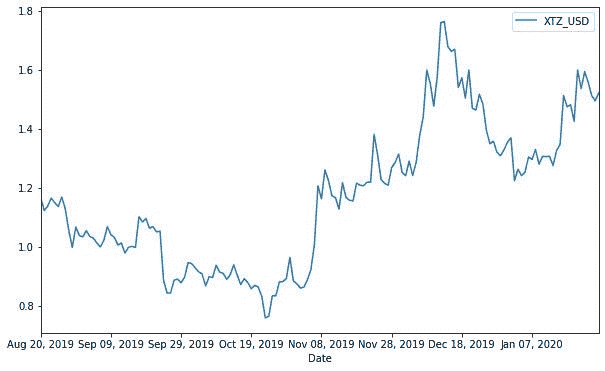
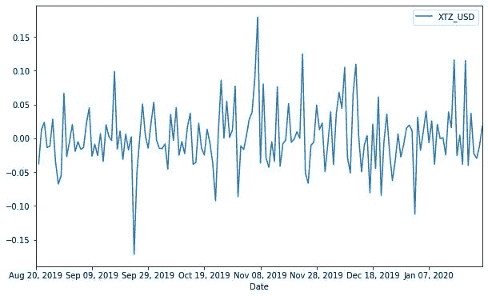
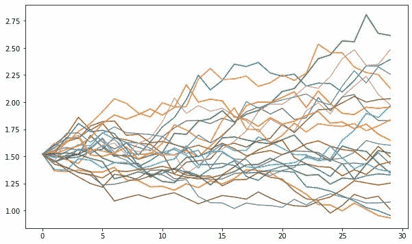
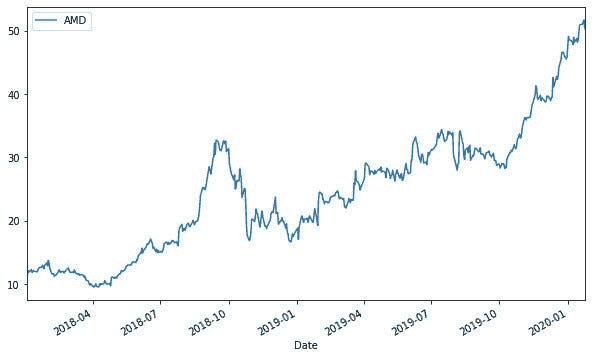
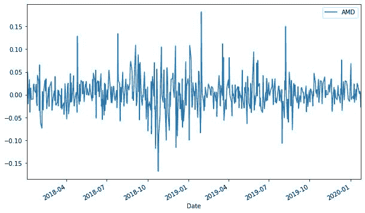
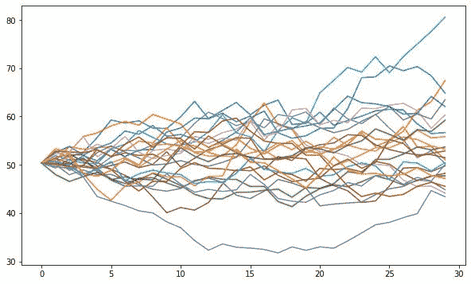

# Python 风险管理:蒙特卡罗模拟

> 原文：<https://towardsdatascience.com/python-risk-management-monte-carlo-simulations-7d41c891cb5?source=collection_archive---------7----------------------->

## 看到更多可能性的介绍


特别感谢 [Daria Sannikova](https://www.pexels.com/photo/slot-machines-3021120/) 。

在这篇文章中，我们将回顾蒙特卡罗模拟，它可以用来提供对未来事件建模的见解。这篇文章的全部思想来自两个因素的结合。第一个是我正在进行的期权交易实验，旅程可以在[这里](https://medium.com/gradient-growth/options-100k-challenge-6-months-to-6-figures-part-2-2cbc03a48864)找到。第二是另一篇关于 Kelly Criterion 的 Python 风险管理文章非常受欢迎，所以我想扩展一下这个话题，这篇文章的原文可以在[这里](/python-risk-management-kelly-criterion-526e8fb6d6fd)找到。事不宜迟，让我们开始讨论资产定价的蒙特卡罗模拟吧！

# 蒙特卡罗模拟概述

教授蒙特卡罗模拟的一个常见方法是思考任何形式的机会，因此有了老虎机的形象。在任何给定时间，基于一个动作的下一个时间步中可能发生多个事件。现在，我相信先学习简单的例子来理解复杂的例子，所以让我们来考虑扔一个公平的六面骰子。我们都知道骰子从 1 到 6 有 6 种可能的机会。但是，为了通过实验计算出多少，我们必须滚动几次骰子并记录结果。有了蒙特卡罗模拟，我们可以在模拟中进行任意数量的试验。

在更专业的定义中，蒙特卡洛取自概率分布，以提供风险的多元模型或呈现多个假设事件[1]。蒙特卡洛的基本公式可以归结为:



基本上，该配方由 3 个主要成分组成。首先，是我们所关注的资产在一段时间内的数据。在我们的文章中，它将是加密货币 Tezos 和股票代码 AMD。下一部分是漂移，这是资产在过去移动的方向。第三个分量是从分布中抽取的随机分量。在我们的例子中，我们将使用正态分布来模拟资产波动。波动性通常被视为一只股票在通常情况下的疯狂运动，看起来有点随机。

# 投资者/交易者如何应用蒙特卡罗

如前所述，蒙特卡罗是一个很好的方法来规划一个有多种可能结果的问题。在金融领域，尤其是金融市场，一项资产在未来可能会有多个不同的价格水平。除了资产定价，蒙特卡罗模拟还可以应用于预测财务项目，如现金流[2]。

# 蒙特卡洛的加密货币——Tezos

Tezos 是另一种应用类似 Etherium [3]的智能合约的加密货币。我只是对它感到好奇，因为它有一个有趣的特性。至少在我持有的比特币基地 Tezos 股票中，它实际上为持有它支付了大约 5%的回报(Tezos 奖励)，这类似于股票的股息收益率——如下图:



在完成了比特币基地的介绍和一些 Tezos 奖励后，我的 Tezos 钱包。

只是提醒一下，我在比特币基地了解到 Tezos 是免费的，注册这个[附属链接](https://www.coinbase.com/join/leong_o5)你可以得到 10 美元。要获得 Tezos 的收入，您必须向下滚动您的仪表板，应该会看到一个收入页面。只要完成教程，你应该会看到奖励。加密 EOS 的一个例子可以在这个[附属链接](https://coinbase.com/earn/eos/invite/t9c17ndk)中找到。关于 Tezos 蒙特卡洛模拟的例子，每日数据取自 investing.com:

```
#Import Libraries
import numpy as np  
import pandas as pd  
import pandas_datareader as wb  
import matplotlib.pyplot as plt  
from scipy.stats import norm
%matplotlib inline

#Settings for Monte Carlo asset data, how long, and how many forecasts 
ticker = 'XTZ_USD' # ticker
t_intervals = 30 # time steps forecasted into future
iterations = 25 # amount of simulations#Acquiring data
data = pd.read_csv('XTZ_USD Huobi Historical Data.csv',index_col=0,usecols=['Date', 'Price'])
data = data.rename(columns={"Price": ticker})#Preparing log returns from data
log_returns = np.log(1 + data.pct_change())#Plot of asset historical closing price
data.plot(figsize=(10, 6));
```



2019 年 8 月至 2020 年 1 月 Tezos 对美元的收盘价。

```
#Plot of log returns
log_returns.plot(figsize = (10, 6))
```



记录 Tezos 对美元的正常回报。

```
#Setting up drift and random component in relation to asset data
u = log_returns.mean()
var = log_returns.var()
drift = u - (0.5 * var)
stdev = log_returns.std()daily_returns = np.exp(drift.values + stdev.values * norm.ppf(np.random.rand(t_intervals, iterations)))#Takes last data point as startpoint point for simulation
S0 = data.iloc[-1]
price_list = np.zeros_like(daily_returns)
price_list[0] = S0#Applies Monte Carlo simulation in asset
for t in range(1, t_intervals):
    price_list[t] = price_list[t - 1] * daily_returns[t]

#Plot simulations
plt.figure(figsize=(10,6))
plt.plot(price_list);
```



25 个 Tezos 回报的蒙特卡罗模拟，最长 30 天。

需要注意的一点是这些模拟中的巨大波动性。从今天的 1.50 美元的价格来看，Tezos 可能会从 1.00 美元波动到 2.75 美元！从这些少量的模拟中，我可以看出为什么有些人喜欢在比特币和类似的密码上冒险，因为它们有略微有利的上行潜力。

# AMD 上的蒙特卡洛

我刚刚决定做 AMD，由于我的其他职位交易 AMD 期权发现[这里](https://medium.com/gradient-growth/options-100k-challenge-6-months-to-6-figures-part-2-2cbc03a48864)。现在，让我们来看看高级微器件蒙特卡罗模拟。

```
#Import Libraries
import numpy as np  
import pandas as pd  
import pandas_datareader as wb  
import matplotlib.pyplot as plt  
from scipy.stats import norm
%matplotlib inline

#Settings for Monte Carlo asset data, how long, and how many forecasts 
ticker = 'AMD' # stock ticker
t_intervals = 30 # time steps forecasted into future
iterations = 25 # amount of simulations#Acquiring data
data = pd.DataFrame()
data[ticker] = wb.DataReader(ticker, data_source='yahoo', start='2018-1-1')['Adj Close']#Preparing log returns from data
log_returns = np.log(1 + data.pct_change())#Plot of asset historical closing price
data.plot(figsize=(10, 6));
```



AMD 2018-2020 年收盘价。

```
#Plot of log returns
log_returns.plot(figsize = (10, 6))
```



记录 AMD 从 2018 年到 2020 年的正常回报。

从上面的收盘价来看，对数回报看起来相当不错。现在开始设置漂移和随机成分。

```
#Setting up drift and random component in relatoin to asset data
u = log_returns.mean()
var = log_returns.var()
drift = u - (0.5 * var)
stdev = log_returns.std()daily_returns = np.exp(drift.values + stdev.values * norm.ppf(np.random.rand(t_intervals, iterations)))#Takes last data point as startpoint point for simulation
S0 = data.iloc[-1]
price_list = np.zeros_like(daily_returns)
price_list[0] = S0#Applies Monte Carlo simulation in asset
for t in range(1, t_intervals):
    price_list[t] = price_list[t - 1] * daily_returns[t]

#Plot simulations
plt.figure(figsize=(10,6))
plt.plot(price_list);
```



未来 30 天 AMD 的 25 次蒙特卡洛模拟

从蒙特卡洛模拟来看，AMD 的整体趋势是上升的，这是一个好迹象，因为我在挑战时持有看涨的头寸！

# 结论

蒙特卡洛模拟允许投资者和交易者将投资可能性转化为决策。蒙特卡洛的优势在于它能够将不同可能事件的质量范围考虑在内。同样，这也是它最值得注意的缺点，即它有时无法准确衡量极端事件。例如，在大熊危机期间，多次蒙特卡洛模拟失败。因此，这个模型和其他模型一样，受到所应用的数据和设置的限制。针对这一弱点的一个可能的解决方案是对模拟的随机分量采用非正态概率分布。

— — — — — — — — — — — — — — — — — — — — — — — — — —

**参考文献**

[1]斯坦默斯，R. (2020 年 1 月 3 日)。如何使用蒙特卡罗分析来估计风险？检索自[https://www . investopedia . com/articles/financial-theory/08/Monte-Carlo-variable-model . ASP](https://www.investopedia.com/articles/financial-theory/08/monte-carlo-multivariate-model.asp)

[2]阿加瓦尔，K. (2019，11 月 18 日)。蒙特卡洛模拟能为你的投资组合带来什么？检索自[https://www . investopedia . com/articles/investing/112514/Monte-Carlo-simulation-basics . ASP](https://www.investopedia.com/articles/investing/112514/monte-carlo-simulation-basics.asp)

[3]比特币基地。(2019).赚 Tezos。从 https://www.coinbase.com/earn/tezos[取回](https://www.coinbase.com/earn/tezos)

— — — — — — — — — — — — — — — — — — — — — — — — — —

要进入比特币基地，点击这个[附属链接](https://www.coinbase.com/join/leong_o5)，这样我们都可以得到 10 美元。

这篇文章是由于 [Options $100k Challenge](https://medium.com/gradient-growth/options-100k-challenge-6-months-to-6-figures-part-2-2cbc03a48864) 而创作的。

*免责声明:本文陈述的所有内容均为我个人观点，不代表任何雇主。投资有很大的风险，所有投资决定都要咨询你的投资顾问。我可能会积极交易本文中提到的资产。这篇文章包含附属链接。*