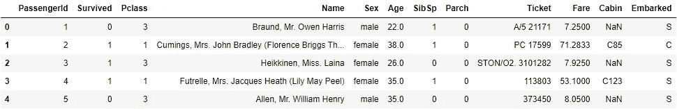
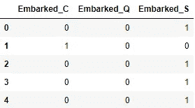
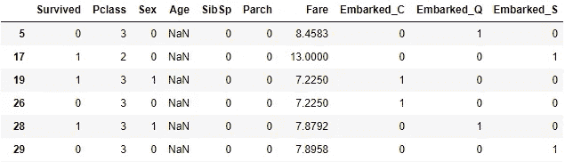
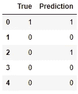
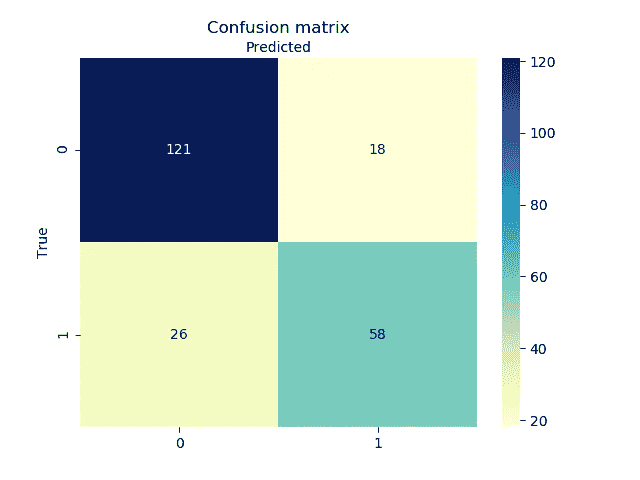

# Python (Scikit-Learn):逻辑回归分类

> 原文：<https://towardsdatascience.com/python-scikit-learn-logistic-regression-classification-eb9c8de8938d?source=collection_archive---------18----------------------->

## 通过使用 Python 中的 scikit-learn 包，了解如何将逻辑回归应用于二元分类


照片由 Pietro Jeng 在 Unsplash 上拍摄

使用预测技术区分分类数据的过程称为**分类**。最广泛使用的分类技术之一是**逻辑回归**。关于逻辑回归的理论基础，请看我之前的[文章](https://medium.com/@maurizio.s/logistic-regression-discover-the-powerful-classification-technique-d60c0ae4d3b1)。

在本文中，我们将利用 Python 编程语言中可用的 **scikit-learn (sklearn)** 包，将逻辑回归应用于一个**二元分类**问题。

# 泰坦尼克号数据集

我们将使用泰坦尼克号数据集(可在 [Kaggle](https://www.kaggle.com/c/titanic/data) 上获得)，目标是预测泰坦尼克号上的幸存者。也就是说，基于数据集中包含的特征(解释变量)，我们希望预测某个特定的人是否在泰坦尼克号沉船事故中幸存。

# 加载数据

我们从导入所需的包和加载 titanic 数据集开始。

```
import pandas as pd
import numpy as np
import matplotlib.pyplot as plt
import seaborn as sns

from sklearn import metrics
from sklearn.linear_model import LogisticRegression
from sklearn.model_selection import train_test_split

titanic = pd.read_csv(".../Titanic/train.csv")

titanic.head()
```



在这里，我们可以看到数据集中包含的不同变量。让我们简要描述一下每个变量:

*   **PassengerId** :乘客的 ID；
*   **幸存**:目标变量；该人是在海难中幸存(1)还是没有在海难中幸存(0)；
*   **Pclass** :乘客在船上所处的等级(1、2 或 3)；
*   **姓名**:乘客姓名；
*   **性别**:乘客的性别；
*   **年龄**:乘客的年龄；
*   **SibSp** :船上兄弟姐妹和配偶人数；
*   **Parch** :船上父母/子女人数；
*   **车票**:车票号码；
*   **票价**:车票的票价；
*   **舱室**:舱室编号；
*   **登船**:登船港(C =瑟堡，Q =皇后镇，S =南汉普顿)。

# 预处理

当应用任何预测算法时，我们可以*永远不要*在没有对数据进行任何**预处理**的情况下立即使用它。这一步极其重要，绝不能忽视。对于该数据集，我们执行以下预处理步骤:

**1。删除那些似乎不会给我们的模型增加任何价值的功能**

```
titanic.drop(['PassengerId', 'Name', 'Ticket', 'Cabin'], axis=1, inplace=True)
```

这里，我们从数据集中删除了 PassengerId、姓名、机票和客舱特性。其原因是，这些不能为我们的模型提供任何预测能力。

**2。为登船口创建分类模型**

```
ports = pd.get_dummies(titanic.Embarked, prefix='Embarked')
ports.head()
```



我们从分类装载特征创建了三个二元特征，因为模型不能处理原始分类变量中的字符串名称。

```
titanic = titanic.join(ports)
titanic.drop(['Embarked'], axis=1, inplace=True)
```

**3。将性别名称转换为二进制**

```
titanic.Sex = titanic.Sex.map({'male': 0, 'female': 1})
```

通过映射将“男性”和“女性”名称转换为二进制(0 和 1)。

**4。替换丢失的值**

```
titanic[pd.isnull(titanic).any(axis=1)]
```



请注意，所有缺失值(nan)都出现在年龄要素中。为了解决这些缺失值，让我们用数据中的平均年龄来填充缺失值。

```
titanic.Age.fillna(titanic.Age.mean(), inplace=True)
```

# 训练和测试分割

既然我们已经预处理了数据，我们可以提取 X 中的解释变量和 y 中的目标变量:

```
y = titanic.Survived.copy()
X = titanic.drop(['Survived'], axis=1)
```

接下来，我们将数据分成训练集和测试集。**训练集**用于训练逻辑回归模型。该模型从训练集中包括的特征中学习。**测试集**用于验证逻辑回归模型的性能。对于测试集中的每个观察值，我们预测该人是否幸存，并将预测值与真实值进行比较。

我们拆分数据，使训练集包含 75%的数据，测试集包含 25%的数据。我们使用 scikit-learn 包的`train_test_split`模块。

```
X_train, X_test, y_train, y_test = train_test_split(X, y, test_size=0.25, random_state=123)
```

# **逻辑回归模型**

通过使用 scikit-learn 包中的`LogisticRegression`模块，我们可以使用 X_train 中包含的特性将逻辑回归模型拟合到训练数据。

```
model = LogisticRegression()
model.fit(X_train, y_train)
```

接下来，现在我们已经根据训练数据训练了逻辑回归模型，我们能够使用该模型来预测测试集中包括的人是否在海难中幸存:

```
y_pred = pd.Series(model.predict(X_test))y_test = y_test.reset_index(drop=True)
z = pd.concat([y_test, y_pred], axis=1)
z.columns = ['True', 'Prediction']
z.head()
```



这里，我们看到，对于测试集的前五个观察值，逻辑回归模型正确预测了 5 个中的 4 个。

为了评估整个测试集，我们可以使用 scikit-learn 包中的`metrics`模块。

```
print("Accuracy:", metrics.accuracy_score(y_test, y_pred))
print("Precision:", metrics.precision_score(y_test, y_pred))
print("Recall:", metrics.recall_score(y_test, y_pred))
```

输出:

```
Accuracy: 0.8026905829596412
Precision: 0.7631578947368421
Recall: 0.6904761904761905
```

也就是说，逻辑回归模型导致 80.3%的准确性。这么简单的车型绝对不差！

当然，可以通过例如进行进一步的预处理、特征选择和特征提取来进一步提高模型性能。然而，这个模型形成了一个坚实的基线。

可视化模型结果的一个好方法是利用**混淆矩阵**。这里，我们使用`matplotlib`和`seaborn`来创建一个漂亮的混淆矩阵图。

```
cnf_matrix = metrics.confusion_matrix(y_test, y_pred)

labels = [0, 1]
fig, ax = plt.subplots()
tick_marks = np.arange(len(labels))
plt.xticks(tick_marks, labels)
plt.yticks(tick_marks, labels)
# create heatmap
sns.heatmap(pd.DataFrame(cnf_matrix), annot=True, cmap="YlGnBu", fmt='g')
ax.xaxis.set_label_position("top")
plt.title('Confusion matrix', y=1.1)
plt.ylabel('True')
plt.xlabel('Predicted')
```



在混淆矩阵中，我们看到 121 名海难幸存者被正确预测为未幸存，18 名海难幸存者被错误预测为海难幸存者，26 名海难幸存者被错误预测为海难幸存者，最后，58 名海难幸存者被正确预测。

# 逻辑回归的利与弊

**优点:**

*   不需要很高的计算能力；
*   易于实现；
*   简单易懂。

**缺点:**

*   容易过度拟合；
*   无法解决非线性问题；
*   无法处理大量的分类特征。

# 感谢阅读！

希望在阅读完本文后，您现在能够通过使用 Python 中的 scikit-learn 包来自己使用逻辑回归技术。祝你在自己的项目中使用它好运！