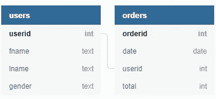

# Python SQLite 教程-终极指南

> 原文：<https://towardsdatascience.com/python-sqlite-tutorial-the-ultimate-guide-fdcb8d7a4f30?source=collection_archive---------11----------------------->

## 入门所需的一切！


让我们了解一下开始使用 Python 中的 SQLite3 所需要的一切！资料来源:Nik Piepenbreier

SQL 和 Python 已经迅速成为任何从事严肃数据分析的人的必备技能！本 Python SQLite 教程是您在 Python 中使用 SQLite 的唯一指南。在本帖中，我们将介绍:

*   正在加载库
*   创建并连接到您的数据库
*   创建数据库表
*   添加数据
*   查询数据
*   删除数据
*   还有更多！

SQLite3(我们称之为 SQLite)是标准 Python 3 包的一部分，所以您不需要安装任何东西。如果你没有运行 Python 3，请点击[链接](https://www.python.org/downloads/)开始。

如果你想开始学习 SQL，可以看看我的完整的[初级 SQL 教程](https://datagy.io/sql-beginners-tutorial/)，其中包括免费下载的 PDF 和其他赠品。

# 你会创造什么

学习完本教程后，您将使用 Python 在 SQLite 中创建了一个数据库。具体来说，这篇文章将指导您完成创建数据库的所有步骤，该数据库涵盖了下表，包括所有关系:


我们将创建的数据库的概述。资料来源:Nik Piepenbreier

# SQLite for Python 中可用的数据类型

SQLite for Python 提供的数据类型比其他 SQL 实现少。这可能有点限制。然而，正如您将看到的，SQLite 使许多其他事情变得更容易。让我们快速看一下可用的数据类型:

*   **空值** —包括一个空值
*   **整数** —包括一个整数
*   **实数** —包括一个浮点(十进制)值
*   **正文**。—包括文本
*   **斑点**。—包括完全作为输入存储的二进制大对象

从这个列表中，您可能会注意到一些缺失的数据类型，如日期。不幸的是，在使用 SQLite 时，您只能使用这些数据类型。

# Python 中的 SQLite 入门


准备好了吗？我们开始吧！资料来源:Nik Piepenbreier

让我们从加载库开始本教程。我们可以通过使用以下命令来实现这一点:

```
import sqlite3
```

让我们开始实际创建我们的数据库。

# 用 Python 创建 SQLite 数据库

在 Python SQLite 教程的这一部分，我们将探索使用 SQLite 在 Python 中创建数据库的不同方法。为此，我们将创建一个代表数据库的 ***连接*** 对象。这个对象是使用 SQLite 的 connect()函数创建的。

让我们首先创建一个. db 文件，因为这是实际维护 SQLite 数据库的一种非常标准的方式。我们将使用名为 *conn* 的变量来表示连接。我们将创建一个名为 *orders.db* 的文件。

```
conn = sqlite3.connect('orders.db')
```

通过这行代码，我们创建了一个新的*连接*对象，以及一个名为 *orders.db* 的新文件，该文件位于您正在工作的目录中。如果您想指定一个特定的目录，您可以写:

```
conn = sqlite3.connect(r'PATH-TO-YOUR-DIRECTORY/orders.db')
```

如果文件已经存在，那么*连接*功能将简单地连接到该文件。

**注意**:注意我们在包含这个路径的字符串前包含了字母“r”。这让 Python 知道我们正在处理一个原始字符串，这意味着“/”不会用于转义字符。你可以通过[查看此链接](https://docs.python.org/3/reference/lexical_analysis.html)了解更多关于原始字符串的信息。

*connect* 函数创建一个到 SQLite 数据库的连接，并返回一个对象来表示它。

# 内存数据库

使用 Python 中的 SQLite 生成数据库的另一种方法是在内存中创建数据库*。这是生成可用于测试目的的数据库的好方法，因为它们只存在于 RAM 中。*

```
conn = sqlite3.connect(:memory:)
```

然而，出于本教程的目的，对于您将遇到的大多数用例，您将使用我们前面描述的方法。

# 创建光标对象

现在我们已经创建了一个数据库连接对象，我们的下一个任务是创建一个 ***光标*** 对象。简单地说，游标对象允许我们对数据库执行 SQL 查询。我们将创建一个变量 *cur* 来保存光标对象:

```
cur = conn.cursor()
```


游标对于 Python 中的 SQLite3 至关重要。资料来源:Nik Piepenbreier

现在我们有了一个 cursor 对象，我们可以使用它以下面的方式运行 SQL 查询:

```
cur.execute("YOUR-SQL-QUERY-HERE;")
```

注意，我们用引号将 SQL 查询括起来，这很重要。不管我们使用单引号、双引号还是三引号。对于较长的查询，通常最好使用三重引号，因为它们允许我们编写多行查询。

# 在 SQLite for Python 中创建我们的表

在 Python SQLite 教程的这一点上，让我们使用 Python 中的 SQLite 创建我们的第一个表！现在我们有了一个连接对象( *conn* )和一个光标对象( *cur* )，我们可以创建我们的第一个表了。按照我们之前展示的数据库模式:



快速提醒一下我们的数据库是什么样子的。资料来源:Nik Piepenbreier

我们将从用户表开始。

```
cur.execute("""CREATE TABLE IF NOT EXISTS users(
   userid INT PRIMARY KEY,
   fname TEXT,
   lname TEXT,
   gender TEXT);
""")
conn.commit()
```

在上面的代码中，我们做了很多事情:

1.  使用游标对象上的 execute 函数执行 SQL 查询
2.  使用 SQL 生成一个名为*用户*的表
3.  如果不存在，那么*将在重新连接到数据库时帮助我们。该查询将允许我们检查该表是否存在，如果存在，则没有任何改变。*
4.  我们创建四列:*用户 id* 、*名字*、*名字*和*性别*。*用户标识*被指定为主键。
5.  我们通过在连接对象上使用*提交*函数来提交更改。


准备好桌子了吗？资料来源:Nik Piepenbreier

要创建我们的另一个表，我们可以遵循类似的模式并编写以下命令:

```
cur.execute("""CREATE TABLE IF NOT EXISTS orders(
   orderid INT PRIMARY KEY,
   date TEXT,
   userid TEXT,
   total TEXT);
""")
conn.commit()
```

执行这两个脚本后，您的数据库将有两个表。我们现在准备开始添加数据！

# 在 Python 中使用 SQLite 添加数据

让我们看看如何用 Python 中的 SQLite 向我们刚刚创建的数据库添加数据。与表生成查询类似，添加数据的查询使用 cursor 对象来执行查询。

```
cur.execute("""INSERT INTO users(userid, fname, lname, gender) 
   VALUES('00001', 'Nik', 'Piepenbreier', 'male');""")conn.commit()
```

通常，当我们在 Python 中工作时，我们会有保存值的变量。例如，我们可能有一个包含用户信息的元组，可能如下所示:

```
user = ('00002', 'Lois', 'Lane', 'Female')
```

如果我们想将这些数据加载到数据库中，我们将使用不同的约定:

```
cur.execute("INSERT INTO users VALUES(?, ?, ?, ?);", user)
conn.commit()
```

我们在这里做的是用问号替换所有的值，并添加一个包含我们希望添加的值的附加参数。

这里需要注意的是，SQLite 期望值是元组格式的。但是，变量可以包含列表，只要列表项是元组。例如，我们可以使用变量添加更多用户:

```
more_users = [('00003', 'Peter', 'Parker', 'Male'), ('00004', 'Bruce', 'Wayne', 'male')]
```

在这种情况下，我们不想使用 execute 函数，而是希望使用 executemany 函数:

```
cur.executemany("INSERT INTO users VALUES(?, ?, ?, ?);", more_users)conn.commit()
```

如果我们在 cursor 对象上使用了 execute 函数，该函数会假设我们将两个条目(两个元组)直接传入表中，而不是两组，每组四个条目！幸运的是，在这种情况下，这个函数可能会失败，但是要小心使用哪个函数！

# SQLite 和防止注入攻击

顺便说一下，使用(？, ?，…)我们上面提到的方法也有助于抵御 SQL 注入攻击。因此，建议使用这种方法，而不是前面提到的方法。也更容易打出来，所以是双赢！

# 一些加载更多数据的脚本

如果您正在学习 Python SQLite 教程，让我们加载更多的数据，使下面的部分更有意义。下面是一些脚本，您可以复制并粘贴这些脚本，将一些示例数据插入到这两个表中:

如果您正在跟进，也加载这些数据文件！资料来源:Nik Piepenbreier

您可以使用以下查询来加载此数据:

```
cur.executemany("INSERT INTO users VALUES(?, ?, ?, ?);", customers)
cur.executemany("INSERT INTO orders VALUES(?, ?, ?, ?);", orders)
conn.commit()
```

# 使用 Python 在 SQLite 中选择数据

接下来，在这个 Python SQLite 教程中，我们将看看如何在 Python 中使用 SQLite 选择数据！我们将遵循与上面执行查询类似的结构，但是我们也将向其中添加另一个元素。


有许多方法可以返回数据。资料来源:Nik Piepenbreier

# 通过 Python 在 SQLite 中使用 fetchone()

让我们从使用 fetchone()函数开始。我们创建了一个变量 *one_result* 来只提取结果

```
cur.execute("SELECT * FROM users;")
one_result = cur.fetchone()
print(one_result)
```

这将返回:

```
[(1, 'Nik', 'Piepenbreier', 'male')]
```

# 通过 Python 在 SQLite 中使用 fetchmany()

假设我们想要返回不止一个结果，我们可以使用 fetchmany()函数。让我们运行一个不同的脚本来生成 3 个结果:

```
cur.execute("SELECT * FROM users;")
three_results = cur.fetchmany(3)
print(three_results)
```

这将返回以下内容:

```
[(1, 'Nik', 'Piepenbreier', 'male'), (2, 'Lois', 'Lane', 'Female'), (3, 'Peter', 'Parker', 'Male')]
```

# 通过 Python 在 SQLite 中使用 fetchall()

类似地，我们可以使用 fetchall()函数返回所有结果。如果我们运行以下命令，将返回所有结果:

```
cur.execute("SELECT * FROM users;")
all_results = cur.fetchall()
print(all_results)
```

# 用 Python 删除 SQLite 中的数据


让我们也学习一下如何删除数据！资料来源:Nik Piepenbreier

现在，我们来看看如何在 Python 中使用 SQLite 删除数据。我们可以使用与上面类似的结构来实现这一点。假设我们想要删除姓“Parker”的任何用户，我们可以写:

```
cur.execute("DELETE FROM users WHERE lname='Parker';")
conn.commit()
```

当我们运行下面的查询时:

```
cur.execute("select * from users where lname='Parker'")
print(cur.fetchall())
```

这将打印出一个空列表，确认记录已被删除。

# 在 Python 中用 SQLite 连接表

最后，让我们看看如何用更复杂的查询连接数据。假设我们想要生成一个查询，其中包含每个订单上每个客户的名字和姓氏。

为了实现这一点，我们编写以下代码:

```
cur.execute("""SELECT *, users.fname, users.lname FROM orders
    LEFT JOIN users ON users.userid=orders.userid;""")
print(cur.fetchall())
```

类似地，您可以应用一些其他的 SQL 技巧。关于 SQL 的完整介绍，[点击这里查看我的完整初学者指南](https://datagy.io/sql-beginners-tutorial/)。

# 结论:Python SQLite 教程

在这篇 Python SQLite 教程中，我们探索了开始使用 Python 中的 SQLite 所需要知道的一切。我们从如何加载库开始，探索了如何创建数据库和表，如何添加数据，如何查询表，以及如何删除数据。


非常感谢您抽出时间！你真的真的很棒！资料来源:Nik Piepenbreier