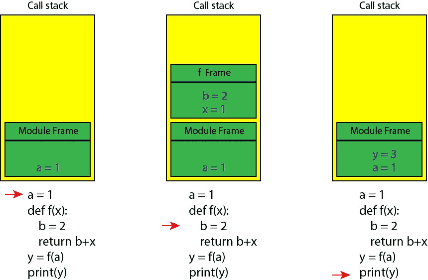
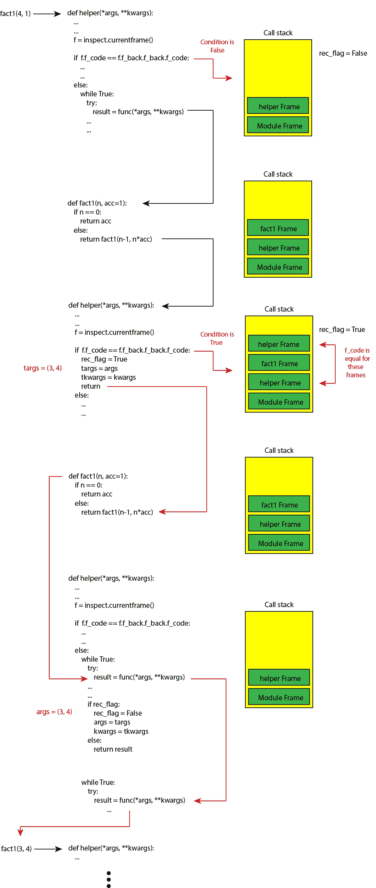

# Python 堆栈框架和尾部调用优化

> 原文：<https://towardsdatascience.com/python-stack-frames-and-tail-call-optimization-4d0ea55b0542?source=collection_archive---------10----------------------->

## 使用尾递归避免 Python 中的堆栈溢出


计算机科学中的递归是一种解决问题的方法，在这种方法中，函数从自己的代码中调用自己。这种方法非常有用，可以应用于许多类型的问题，但是，它有一个限制。函数使用堆栈来保存它们的局部变量，堆栈的大小是有限的。因此，如果递归太深，最终会耗尽堆栈空间，这被称为堆栈溢出。然而，一些编译器实现了[尾调用优化](https://en.wikipedia.org/wiki/Tail-call_optimization)，允许无限递归发生而不会出现堆栈溢出。在本文中，我将首先讨论 Python 堆栈框架，然后解释尾调用优化的概念，并向您展示如何在 Python 中实现它。

**堆叠帧**

堆栈是一种采用 LIFO(后进先出)顺序的数据结构，它有两个主要操作:

*   *push:将一个元素添加到堆栈中*
*   *弹出:删除最近添加的元素*

因此，添加或推入堆栈的最后一个元素是要移除或弹出的第一个元素。使用堆栈存储数据的优点是内存是为您管理的。从堆栈中读取和写入非常快，但是堆栈的大小是有限的。Python 解释器使用调用栈来运行 Python 程序。当在 Python 中调用一个函数时，一个新的*帧*被推送到调用栈上用于它的本地执行，并且每次函数调用返回时，它的帧被弹出调用栈。程序运行的模块有最底层的框架，称为*全局框架*或*模块框架*。这些帧保存了函数本地执行所需的数据，即函数参数及其本地变量。

例如，考虑以下源代码:

```
# Listing 1
a = 1
def f(x):
    b = 2
    return b+x
y = f(a)
print(y)
```

运行该程序的模块在调用堆栈中有一个最底层的框架，即模块框架。全局变量`a`存储在该帧中。当我们调用`f(a)`时，`f`的一个新框架被推到调用栈顶，并且`f`的参数和它的局部变量`b`被存储在那里。当`f`返回它的值时，这个帧被弹出调用堆栈(图 1)。



图 1

在 Python 中，可以很容易地访问这些帧。Python 将调用栈中每个帧的所有信息存储在一个 frame 对象中。frame 对象包含帧地址、它所属文件的名称、源代码中访问该帧的行号以及它所属函数的名称。我们可以使用`inspect`模块来检查帧。

我们可以使用`inspect.**stack(context=1)**`来获取当前存在于调用堆栈中的所有帧。可选参数`context`指定要返回的*代码* *上下文*的行数，其中一些是源代码中以*当前行*为中心的代码行。当前行是源代码中访问或检查该帧的行，*当前行号*是源代码中该行的编号。当程序执行时，调用栈中的帧是动态变化的，知道栈在哪一行被检查是很重要的。功能:

`inspect.**stack(context=1)**`

返回名为元组的[列表:](https://docs.python.org/3/glossary.html#term-named-tuple)

`FrameInfo(frame, filename, lineno, function, code_context, index)`

其中`frame`是框架对象，`filename`是该框架所属文件的名称，`lineo`是源代码中的当前行号，`function`是该框架所属函数的名称，`code_context`是源代码中上下文行的列表，`index`是该列表中当前行的索引。

现在我们来试试这个函数。如果你跑步:

```
>>>import inspect
>>>inspect.stack()
```

在 Python 控制台中，您将获得:

```
[FrameInfo(frame=<frame at 0x000001A97248EAD8, file ‘<stdin>’, line 1, code <module>>, filename=’<stdin>’, lineno=1, function=’<module>’, code_context=None, index=None)]
```

所以返回的列表只有一个名为 tuple 的`FrameInfo`元素。因为我们在模块级，所以我们在调用栈上只有模块级，并且这个列表只有一个元素对应于模块框架。元组的第一个元素是帧对象:

```
<frame at 0x000001A97248EAD8, file ‘<stdin>’, line 1, code <module>>
```

帧地址在那里，文件名是`stdin`。因为我们只有一行代码，所以该帧是在第 1 行被访问的，很明显该帧属于`<module>`。值得注意的是，如果您从像 Anaconda 这样的 Python 平台上运行这段代码，您可能会得到更长的输出。您会注意到在模块框架下有更多的框架，这些是 Anaconda 自己正在执行的模块，我们不需要担心它们。Python 控制台为`code_context`返回`None`，为`index`。要获得它们的值，您应该在终端中将这段代码作为 Python 脚本运行。例如，您可以在 Python 脚本中存储以下代码:

```
import inspect
print(inspect.stack())
```

并在终端中运行它。输出将是:

```
[FrameInfo(frame=<frame at 0x000002A7EEBFE9F8, file ‘t1.py’, line 2, code <module>>, filename=’t1.py’, lineno=2, function=’<module>’, code_context=[‘print(inspect.stack())\n’], index=0)]
```

由于`stack()`中参数`context`的默认值是 1，所以只显示检查该帧的代码行及其索引也是`0`。

如前所述，该列表的第一个元素与调用堆栈顶部的当前框架相关。我们可以通过`inspect.stack()[0]`访问它。`Inspect`模块也为此提供了特定的功能:

```
inspect.**currentframe**()
```

它给出了列表中第一个元素(当前帧)的 frame 对象。所以相当于`inspect.stack()[0][0]`。

现在让我们在清单 1 的源代码中尝试这个函数:

```
# Listing 2
import inspect
a = 1
print(inspect.stack()[0], "\n")
def f(x):
    b=2
    print(inspect.stack()[0:2], "\n")
    return x+b
y = f(a)
print(inspect.stack(3)[0])
print(y)
```

输出将是:

```
FrameInfo(frame=<frame at 0x000001FDB52AC908, file '<ipython-input-34-3128af912523>', line 3, code <module>>, filename='<ipython-input-34-3128af912523>', lineno=3, function='<module>', code_context=['print(inspect.stack()[0], "\\n")\n'], index=0) 

[FrameInfo(frame=<frame at 0x000001FDB520E1C8, file '<ipython-input-34-3128af912523>', line 6, code f>, filename='<ipython-input-34-3128af912523>', lineno=6, function='f', code_context=['    print(inspect.stack()[0:2], "\\n")\n'], index=0), FrameInfo(frame=<frame at 0x000001FDB50C4938, file '<ipython-input-34-3128af912523>', line 8, code <module>>, filename='<ipython-input-34-3128af912523>', lineno=8, function='<module>', code_context=['y = f(a)\n'], index=0)] 

FrameInfo(frame=<frame at 0x000001FDB52AFD88, file '<ipython-input-34-3128af912523>', line 9, code <module>>, filename='<ipython-input-34-3128af912523>', lineno=9, function='<module>', code_context=['y = f(a)\n', 'print(inspect.stack(3)[0])\n', 'print(y)\n'], index=1)
3
```

最初，我们在模块级添加了`inspect.stack()[0]`(因为我在 Anaconda 中运行它，所以我只获得了返回列表的一部分，没有显示模块框架下的 Anaconda 框架)。`inspect.stack()`返回的列表头显示当前帧的`FrameInfo`元组，当前帧是模块帧。

接下来，我们在函数`f`中添加了`print(inspect.stack()[0:2], "\n")`。当`f`被调用时，`f`的一个新框架被推到模块框架的顶部，因此显示在列表顶部的当前框架对应于该功能:

```
[FrameInfo(frame=<frame at 0x00000240610678E0, file '<ipython-input-237-6d513e166f46>', line 7, code f>, filename='<ipython-input-237-6d513e166f46>', lineno=7, function='f', code_context=['    print(inspect.stack()[0:2], "\\n")\n'], index=0), FrameInfo(frame=<frame at 0x00000240610B2378, file '<ipython-input-237-6d513e166f46>', line 9, code <module>>, filename='<ipython-input-237-6d513e166f46>', lineno=9, function='<module>', code_context=['y = f(a)\n'], index=0)]
```

框架对象和`FrameInfo`都显示`f`的名称。这个框架下面是模块框架，所以它是列表的下一个元素。

最后，我们放置`print(inspect.stack(3)[0])`以在调用函数后获取当前帧的`FrameInfo`。现在函数框架从调用堆栈中弹出，所以当前框架又是模块框架。这里我们用了`stack()`中的`context=3`。所以输出是:

```
FrameInfo(frame=<frame at 0x000002405E787678, file '<ipython-input-237-6d513e166f46>', line 10, code <module>>, filename='<ipython-input-237-6d513e166f46>', lineno=10, function='<module>', code_context=['y = f(a)\n', 'print(inspect.stack(3)[0])\n', 'print(y)\n'], index=1)
```

现在我们有 3 行代码用于代码上下文，带有`index=1`的中间一行是检查当前帧的代码。

**框架对象属性**

框架对象有一些有用的属性，这里我们只讨论其中的一部分(你可以查看`[inspect](https://docs.python.org/3/library/inspect.html)` [模块网页](https://docs.python.org/3/library/inspect.html)查看全部):

`f_back`:这个属性给出了下一个外部框架对象(它是这个框架的调用者，在调用堆栈中位于它的下面)

`f_code`:该帧中正在执行的代码对象

`f_locals`:这个框架看到的本地命名空间。它是一个字典，给出了这个框架中存在的所有局部变量的名称和值。这包括该帧所属的函数的自变量)。如果这是模块框架，那么所有的全局变量都将包含在内。

例如，如果我们将清单 2 改为:

```
# Listing 3
a = 1
def f(x):
    b=2
    print(inspect.currentframe().f_code, "\n")
    print(inspect.currentframe().f_back, "\n")
    print(inspect.currentframe().f_locals)
    return x+b
y = f(a)
```

我们得到:

```
<code object f at 0x00000240610A4D20, file "<ipython-input-236-6a2fc4ce42af>", line 3> 

<frame at 0x000002405E556C28, file '<ipython-input-236-6a2fc4ce42af>', line 9, code <module>> 

{'x': 1, 'b': 2}
```

所以`f_code`返回`f`的代码对象，`f_back`返回它的调用方框架，也就是模块框架。最后，`f_locals`返回一个字典，其中包含函数的参数(`x`)及其本地值`b`以及它们在帧被检查时的值。

现在使用这些属性，我将定义一个新的函数`print_frames`来打印帧的局部范围:

该函数获取`FrameInfo`元组列表(由`inspect.stack()`返回)并打印当前帧及其下所有帧的局部范围，直到它到达模块帧，我们将使用该函数在接下来的部分中检查这些帧。下面是使用该函数的一个示例:

```
# Listing 4
a = 1
def f(x):
    b=2
    print_frames(inspect.stack())
    return b*x
def g(x):
    return 2*f(x)
y = g(a)------------------------------------------------------------
Output:
  [Frame 2 'f': {'x': 1, 'b': 2}]
  [Frame 1 'g': {'x': 1}]
  [Frame '<module>']
```

如你所见，当`g`调用`f`时，当前帧属于`f`，而`g`和`module`的帧在它的下面。

**在闭包中堆叠框架**

如清单 4 所示，当一个函数调用另一个函数时，它的框架保持在被调用函数的框架之下。对于闭包来说，这是不正确的。闭包是由外部函数返回的内部函数。它还有一个扩展的范围，包含了外部函数的非局部变量(你可以参考这篇[文章](/closures-and-decorators-in-python-2551abbc6eb6)来了解更多关于闭包的知识)。所以当一个闭包被调用时，调用者函数的框架已经从调用栈中弹出。让我给你举个例子:

```
# Listing 5
def f(x):
    def g(y):
        def h(z):
            print_frames(inspect.stack())
            return x+z
        print_frames(inspect.stack())
        return h
    print_frames(inspect.stack())
    return g
```

这里我们在`f`中有两个闭包定义。现在如果我们写:

```
f(1)(2)(3)
```

输出将是:

```
 [Frame 1 'f': {'g': <function f.<locals>.g at 0x00000240610617B8>, 'x': 1}]
  [Frame '<module>'] [Frame 1 'g': {'y': 2, 'h': <function f.<locals>.g.<locals>.h at 0x00000240610F1158>, 'x': 1}]
  [Frame '<module>'] [Frame 1 'h': {'z': 3, 'x': 1}]
  [Frame '<module>']4
```

所以当`f`返回`g`时，`f`的框架被弹出调用堆栈，而`g`的框架被推到`module`框架的顶部。`g`的框架不仅存储其参数(`y`)，还存储`x`，它是`f`的参数，也是`g`的一个非局部变量。类似地，当调用`h`时，`g`的帧已经被弹出调用堆栈。`h`的框架也存储了非局部变量`x`。

**使用系统模块**检查堆栈框架

到目前为止，我们使用了`inspect`模块来检查堆栈框架。我们也可以使用`sys`模块来做同样的事情。功能:

```
 sys.**_getframe**(*depth=0*)
```

从调用堆栈返回一个 frame 对象。如果给定了可选的整数*深度*，它将返回堆栈顶部以下许多调用的框架对象。例如，`depth=1`返回当前帧下面的下一个外框对象。*深度*的默认值为零，它返回位于调用堆栈顶部的当前帧。所以我们可以使用这个函数重写清单 3:

```
# Listing 6
import sys
a = 1
def f(x):
    b=2
    print(sys._getframe().f_code, "\n")
    print(sys._getframe().f_back, "\n")
    print(sys._getframe().f_locals)
    return x+b
y = f(a)
```

并获得与清单 3 相同的输出。此外，代替`sys._getframe().f_back`，我们可以写`sys._getframe(1)`来获得下一个外部框架对象。

**递归函数**

在递归函数中，函数从自己的代码中调用自己。这里有一个简单的例子。一个数 *n* 的阶乘可以定义为:

*阶乘(n) = n × (n-1) × (n-2) × … × 1*

我们可以定义一个递归函数来计算阶乘:

```
# Listing 7
def fact(n):
    if n==0:
        return 1
    else:
        return n*fact(n-1)
```

函数`fact(n)`通过将`n`乘以`n-1`的阶乘来计算`n`的阶乘。当`n`等于 1 时，它简单地返回 1，因此`n=1`定义了递归函数的*基本情况*。基本情况是返回值，而不进行任何后续的递归调用。

现在我们可以将`print_frames`添加到这个函数中，看看堆栈帧是如何生成的。

```
# Listing 8
def fact(n):
    if n==0:
        print("fact({}) called:".format(n))
        print_frames(inspect.stack())
        print("fact({}) returned {}".format(n, 1))
        return 1
    else:
        print("fact({}) called:".format(n))
        print_frames(inspect.stack())
        result = n*fact(n-1)
        print_frames(inspect.stack())
        print("fact({}) returned {}".format(n, result))
        return result
```

我们也想看到函数的返回值，所以先把返回值存储在`result`里，打印出来，然后由函数返回。来试试`n=3`:

```
fact(3)
-----------------------------------------------------------------
Output:fact(3) called:
  [Frame 1 'fact': {'n': 3}]
  [Frame '<module>']

fact(2) called:
  [Frame 2 'fact': {'n': 2}]
  [Frame 1 'fact': {'n': 3}]
  [Frame '<module>']

fact(1) called:
  [Frame 3 'fact': {'n': 1}]
  [Frame 2 'fact': {'n': 2}]
  [Frame 1 'fact': {'n': 3}]
  [Frame '<module>']

fact(0) called:
  [Frame 4 'fact': {'n': 0}]
  [Frame 3 'fact': {'n': 1}]
  [Frame 2 'fact': {'n': 2}]
  [Frame 1 'fact': {'n': 3}]
  [Frame '<module>']

fact(0) returned 1
  [Frame 3 'fact': {'n': 1, 'result': 1}]
  [Frame 2 'fact': {'n': 2}]
  [Frame 1 'fact': {'n': 3}]
  [Frame '<module>']

fact(1) returned 1
  [Frame 2 'fact': {'n': 2, 'result': 2}]
  [Frame 1 'fact': {'n': 3}]
  [Frame '<module>']

fact(2) returned 2
  [Frame 1 'fact': {'n': 3, 'result': 6}]
  [Frame '<module>']

fact(3) returned 66
```

如你所见，每次函数调用自己时，`f`的一个新帧被推到前面的帧之上，直到它到达递归的底部(`fact(0)`)。然后基础用例返回`1`，它的框架被弹出调用堆栈。然后`fact(1)`返回`1×1`，弹出其框架。剩余的`fact`帧被逐个弹出，直到`fact(3)`返回最终值(`6`)并被弹出调用栈。因此很明显，对于`fact(3)`,我们将 4 个框架放在模块框架的顶部，以达到基本情况。一般来说，为了计算`fact(n)`，最多会将`n+1`帧推到堆栈顶部。但是如果`n`变成 5000 这样的大数字会怎么样呢？

如前所述，调用堆栈的大小是有限的。因此，通过增加`n`的值，我们最终达到了调用堆栈的极限，并且不能在此基础上推进更多的帧。这被称为*堆栈溢出*，这意味着我们用尽了内存来保存调用堆栈中的帧。为了避免堆栈溢出，Python 为调用堆栈可以容纳的总帧数设置了限制。限制是 999(调用堆栈可以容纳的最大帧数)。现在记住`fact(n)`需要`n+1`帧。此外，还应包括模块框架。所以，其实我们需要`n+2`帧。因此，我们可以使用的`n`的最大值是 997，需要 999 帧。现在我们来试试`n=998`。如果我们将清单 9 存储在 Python 脚本中，并在终端中运行它:

```
# Listing 9
def fact(n):
    if n==0:
        return 1
    else:
        return n*fact(n-1)
print(fact(998))
```

我们得到这个错误:

```
Traceback (most recent call last):
  File "fact.py", line 6, in <module>
    print(fact(998))
  File "fact.py", line 5, in fact
    return n*fact(n-1)
  File "fact.py", line 5, in fact
    return n*fact(n-1)
  File "fact.py", line 5, in fact
    return n*fact(n-1)
  [Previous line repeated 995 more times]
  File "fact.py", line 2, in fact
    if n==0:
RecursionError: maximum recursion depth exceeded in comparison
```

这意味着我们已经超过了极限。在像 Anaconda 这样的平台中，您可能对总帧数有更高的限制。比如在我的系统里，是 3000。

您也可以更改此限制，以便拥有更多帧。功能:

```
sys.**getrecursionlimit()**
```

给出递归和函数的当前限制

```
sys.**setrecursionlimit(limit)** 
```

用于设置调用堆栈可以容纳的最大帧数的限制。

请注意，最大递归深度的限制只是防止程序进入堆栈溢出，并不改变调用堆栈的实际大小。所以更改限制应该小心，因为过高的限制会导致 Python 崩溃。

另一个解决方案是减少递归函数需要推送的帧数，并使其表现得像非递归函数一样。这样，函数永远不会达到那个极限，无论输入数据有多大，都不会出现堆栈溢出。正如您将在下一节中看到的，这可以通过使用尾部递归和尾部调用优化来实现。

**尾递归**

当递归调用是函数执行的最后一件事时，递归函数是尾递归的。例如，清单 7 中的函数`fact(n)`不是尾递归的。在这个函数中，递归调用是`fact(n-1)`。然而，这并不是这个函数在返回结果之前做的最后一件事。它将`fact(n-1)`乘以`n`，然后返回结果。所以乘以`n`不允许它是尾递归的。

可以将`fact(n)`修改为尾递归。清单 10 显示了`fact`的尾递归版本:

```
# Listing 10
def fact1(n, acc=1):
    if n == 0:
        return acc
    else:
        return fact1(n-1, n*acc) fact1(4, 1)
```

这个函数有第二个参数`acc`，它扮演累加器的角色。当我们调用`fact1`时，我们用 1 初始化它。在`fact1`的每次调用中，`n`乘以`acc`，当到达基例时，只需要返回`acc`。现在我们可以将`print_frames`添加到这个函数中，看看帧是如何生成的。我们还将返回值存储在`result`中，并打印出来以查看函数的返回值。

```
# Listing 11
def fact1(n, acc=1):
    if n == 0:
        print("fact1({},{}) called:".format(n, acc))
        print_frames(inspect.stack())
        print("fact1({0},{1}) returned {1}".format(n, acc))
        return acc
    else:
        print("fact1({},{}) called:".format(n, acc))
        print_frames(inspect.stack())
        result = fact1(n-1, n*acc) 
        print_frames(inspect.stack())
        print("fact1({},{}) returned {}".format(n, acc, result))
        return result
```

你应该注意到这不是一个真正的尾递归函数，因为递归调用不是函数执行的最后一件事。实际上，在执行递归调用`fact1(n-1, n*acc)`后，我们将其返回值赋给`result`，然后调用`print_function`和`print`，最后返回`result`。然而，我们只是出于调试的目的添加它们，以展示这个函数是如何工作的，并且我们在递归调用之后不改变`result`的值，所以对返回值没有计算。因此，这个函数给出了与清单 10 中尾递归函数相同的结果。

现在，如果我们执行`fact1(3,1)`，输出将是:

```
fact1(3,1) called:
  [Frame 1 'fact1': {'n': 3, 'acc': 1}]
  [Frame '<module>']

fact1(2,3) called:
  [Frame 2 'fact1': {'n': 2, 'acc': 3}]
  [Frame 1 'fact1': {'n': 3, 'acc': 1}]
  [Frame '<module>']

fact1(1,6) called:
  [Frame 3 'fact1': {'n': 1, 'acc': 6}]
  [Frame 2 'fact1': {'n': 2, 'acc': 3}]
  [Frame 1 'fact1': {'n': 3, 'acc': 1}]
  [Frame '<module>']

fact1(0,6) called:
  [Frame 4 'fact1': {'n': 0, 'acc': 6}]
  [Frame 3 'fact1': {'n': 1, 'acc': 6}]
  [Frame 2 'fact1': {'n': 2, 'acc': 3}]
  [Frame 1 'fact1': {'n': 3, 'acc': 1}]
  [Frame '<module>']

fact1(0,6) returned 6
  [Frame 3 'fact1': {'n': 1, 'acc': 6, 'result': 6}]
  [Frame 2 'fact1': {'n': 2, 'acc': 3}]
  [Frame 1 'fact1': {'n': 3, 'acc': 1}]
  [Frame '<module>']

fact1(1,6) returned 6
  [Frame 2 'fact1': {'n': 2, 'acc': 3, 'result': 6}]
  [Frame 1 'fact1': {'n': 3, 'acc': 1}]
  [Frame '<module>']

fact1(2,3) returned 6
  [Frame 1 'fact1': {'n': 3, 'acc': 1, 'result': 6}]
  [Frame '<module>']

fact1(3,1) returned 66
```

你可以看到，当这个递归函数达到它的基本情况时，`acc`等于*阶乘(3)* 。然后相同的值被返回给调用者函数 fact1(1，6)，fac1(2，3) …最后`fact1(3,1)`返回`acc`作为这个函数的最终结果。所以当它到达基本用例时，它不需要将结果返回给前面的调用方，函数执行可以通过返回`acc`来终止。

这与清单 8 中的输出`fact(n)`完全不同。那个函数不是尾递归的，所以当它到达基本情况(`f(0)`)时，它只得到基本情况返回值`1`。这个值需要返回给调用者`f(1)`乘以 1，然后返回给`f(2)`乘以 2，依此类推。1,2, ...是`f`的参数，并且存储在它的框架中，所以当我们想要将这些参数乘以函数的返回值时，我们需要前面的框架能够访问这些参数。

在尾递归的`fact1`中，我们不需要在调用栈中保存之前的帧。我们只需要当前帧，直到我们到达基本情况，然后我们可以终止函数。因此尾递归函数不需要其当前帧下面的帧。然而，正如输出所示，Python 仍然像递归函数一样执行它，并保留所有帧。当尾部递归函数调用自身时，我们需要 Python 丢弃前一帧。

**尾音优化**

尾调用优化是一种允许尾递归函数无限递归而不发生堆栈溢出的方法。尾部调用优化将递归调用转换为循环。递归调用被替换为以下代码:

*   首先用递归调用的相应参数值替换函数的参数
*   跳回到函数的开头。

尾调用优化只能用于尾递归函数。原因是新代码在递归调用后跳回到函数的开头，并忽略其后的任何语句。

让我用一个例子来展示它。假设我们想对清单 10 中的`fact1`函数应用尾调用优化。我们可以使用清单 12 中的伪代码来实现。

```
# Listing 12
def fact1(n, acc=1):
    START: 
    if n == 0:
        return acc
    else:
        #  return fact1(n-1, n*acc) is replaced with:
        acc = n * acc
        n = n -1
        goto START
```

这里我们用一个新的代码替换递归调用`fact1(n-1, n*acc)`。如果`n`不等于零，函数`n`和`acc`的参数将被替换为递归调用`n-1`、`n*acc`的相应参数的值，然后跳转到函数的开头。这是一个伪代码，因为 Python 没有`goto`关键字。然而，我们可以使用一个`while`循环来实现它:

```
# Listing 13
def fact2(n, acc=1):
    while True:
        if n == 0:
            return acc
        else:
            acc = n * acc
            n = n - 1
```

Python 中不支持尾部调用优化，但是我们可以通过更改函数内部的代码来应用它，然而，我们更喜欢使用装饰器自动完成它，而不更改函数的代码。我们可以用两种不同的方法来做这件事，这将在下一节中解释。

**使用堆栈帧进行尾部调用优化**

第一种方法使用`inspect`模块并检查堆栈帧以防止递归和新帧的创建。清单 14 显示了一个装饰器，它可以将尾调用优化应用到目标尾递归函数:

现在我们可以用`tail_rec`来装饰`fact1`:

```
@tail_rec
def fact1(n, acc=1):
    if n == 0:
        return acc
    else:
        return fact1(n-1, n*acc)

fact1(4)
```

让我解释一下这个装饰器是如何工作的。当我们用`tail_rec`修饰`fact1`时，变量`rec_flag`、`targs`和`tkwargs`被初始化。现在`fact1`指的是`helper`的定义。所以当我们调用`fact1(4)`时，`helper`被调用(这里我们称之为第一个`helper`)。变量`rec_flag`、`targs`和`tkwargs`是`helper`的非局部变量，所以它可以访问它们。`helper`首先获取当前帧。然后检查`f.f_code`是否等于`f.f_back.f_back.f_code`。如前所述，属性`f_code`指的是框架中正在执行的代码对象，它指示哪个函数创建了这个框架。所以`f.f_code`指的是当前帧的编码对象，也就是`helper`的编码对象。另外，`f.f_back.f_back`是指比当前帧低两级的帧(当前帧的祖辈)。

最初，`helper`的帧在`module`帧的上面，`module`帧是最下面的帧，所以当前帧的祖辈是`None`并且`if`块中的测试失败。(在 Anaconda 这样的平台中，祖父不是`None`，但是它的代码对象与`helper`不同，所以测试再次失败)。所以它进入`else`块并执行`while`循环。在`while`循环中`func(*args, **kwargs)`被调用。`func`是指`fact1`的定义。所以`fact1(4)`被执行，因为它是一个递归函数，它调用`fact1(3, 4)`。

但是，`fact1`是修饰函数，所以引用的是`helper`。所以调用`fact1(3, 4)`再次执行`helper`，如图 2 所示(我们称之为第二个`helper`)。这次当前帧属于第二个`helper`，当前帧的祖辈是第一个`helper`。因此两个帧具有相同的代码对象(属于相同的函数)并且`if`部分中的条件为真。现在，helper 的参数存储在非局部变量`targs`和`tkwargs`中。此外，标志`rec_flag`被设置为`True`。

事实上，`if`语句通过检查帧的代码对象来检测目标函数中递归的开始。当检测到递归的开始时，应该抑制附加帧的创建。因此，第二个`helper`存储递归调用的参数，并更改`rec_flag`以通知递归调用的存在，然后返回`None`。它的调用者是`fact1`,它将同样的内容返回给第一个`helper`函数，它的框架也被弹出调用堆栈(图 2)。

在第一个`helper`中，`if`语句的条件为真，所以它将`targs`和`tkwargs`的值赋给`args`和`kwargs`。while 循环再次调用`func(*aregs, **kwargs)`,因此`fact1(3, 4)`会用它最后一次递归调用的参数再次被调用。然而，这不是递归调用。事实上，当调用`fact1(3, 4)`时，调用堆栈中没有先前的`fact1`帧。



图 2

这个过程继续下去，每次当`fact1`试图递归调用自己时，`helper`就把它变成一个具有相同参数的非递归调用。最后，当我们到达基本情况(`n=0`)时，将不会有递归调用，`fact1`返回存储在`while`循环内的`result`中的`acc`。因为没有递归调用发生，`rec_flag`保持`False`。当`rec_flag`为`Fasle`时，执行`else`块，`helper`返回`result`。

让我们看看如果我们使用一个非尾部递归函数和这个装饰器会发生什么。例如，我们可以使用清单 7 中的 factorial 函数:

```
@tail_rec
def fact(n):
    if n==0:
        return 1
    else:
        return n*fact(n-1)
print(fact(3))
```

您将得到以下异常输出:

```
**Exception**: It is possible that the decorated function is not tail recursive
```

因此，如果您修饰一个函数，对递归调用的返回值进行一些计算，它可以检测到它。语句`result=func(*args,**kwargs)`位于捕获`TypeError`异常的`try`块内。如果用这个装饰器来装饰一个非尾部递归函数，将会引发一个`TypeError`异常。原因是当`helper`检测到递归时，它返回`None`，所以在`fact`的最后一行，`fact(n-1)`也返回`None`。当该函数试图将`n`乘以`None`时，会引发`TypeError`。当然，有可能在函数的其他地方有一个`TypeError`,所以得到这样一个异常并不一定意味着你有一个非尾递归的函数。

重要的是要注意，如果你使用的函数不是尾递归的，但是对递归调用的返回值不做任何计算，装饰器不会抱怨。例如，它可用于正确修饰以下函数:

```
# Listing 15
def fact2(n, acc=1):
    if n == 0:
        return acc
    else:
        result = fact2(n-1, n*acc)
        return result
```

这个装饰器有一个不同的版本，其中递归的检测是通过引发一个异常来发出信号的，并且在装饰器中没有使用非局部变量。然而，在这种情况下，如果您对非尾递归函数使用装饰器，它将不会检测到它，而是返回错误的结果。

**使用字节码注入的尾部调用优化**

我们还可以通过改变函数的字节码来防止递归(如果你不熟悉字节码注入，可以参考这篇[文章](/understanding-python-bytecode-e7edaae8734d))。还记得清单 12 中的伪代码吗，我们用新代码替换了递归调用。新代码首先用递归调用的相应参数的值替换函数的参数，然后跳回到函数的开头。我们可以用类似的方式编写一个装饰器来改变目标函数的字节码。让我们看看清单 10 中`fact1`的字节码是什么样子的。我们使用`dis`模块来反汇编这个函数的字节码:

```
import dis
dis.dis(fact1)
```

输出是:

```
 2           0 LOAD_FAST                0 (n)
              2 LOAD_CONST               1 (0)
              4 COMPARE_OP               2 (==)
              6 POP_JUMP_IF_FALSE       12

  3           8 LOAD_FAST                1 (acc)
             10 RETURN_VALUE

  5     >>   12 LOAD_GLOBAL              0 (fact1)
             14 LOAD_FAST                0 (n)
             16 LOAD_CONST               2 (1)
             18 BINARY_SUBTRACT
             20 LOAD_FAST                0 (n)
             22 LOAD_FAST                1 (acc)
             24 BINARY_MULTIPLY
             26 CALL_FUNCTION            2
             28 RETURN_VALUE
             30 LOAD_CONST               0 (None)
             32 RETURN_VALUE
```

在第 5 行，函数调用自己。使用`LOAD_GLOBAL`将`fact1`的可调用对象推送到堆栈上。然后将函数的参数一个接一个地推到堆栈上，最右边的参数放在最上面。最后，使用`CALL_FUNCTION`调用该函数。它的 oparg(它的参数是`2`)表示位置参数的数量。它首先将所有参数和可调用对象弹出堆栈，然后用这些参数调用可调用对象，最后将返回值推到堆栈顶部。指令`RETURN_VALUE`将栈顶返回给函数的调用者。

现在我们应该用一些新的字节码指令替换`CALL_FUNCTION`和`RETURN_VALUE`。新代码应该从堆栈中弹出递归调用的所有参数，并将它们存储在当前函数的参数中，然后跳回到函数的开头。所以它应该是这样的:

```
 2     >>    0 LOAD_FAST                0 (n)
              2 LOAD_CONST               1 (0)
              4 COMPARE_OP               2 (==)
              6 POP_JUMP_IF_FALSE       12

  3           8 LOAD_FAST                1 (acc)
             10 RETURN_VALUE

  5     >>   12 LOAD_GLOBAL              0 (fact1)
             14 LOAD_FAST                0 (n)
             16 LOAD_CONST               2 (1)
             18 BINARY_SUBTRACT
             20 LOAD_FAST                0 (n)
             22 LOAD_FAST                1 (acc)
             24 BINARY_MULTIPLY
             26 STORE_FAST               1 (acc)
             28 STORE_FAST               0 (n)
             30 POP_TOP
             32 JUMP_ABSOLUTE            0
             34 LOAD_CONST               0 (None)
             36 RETURN_VALUE
```

此处`CALL_FUNCTION 2`在偏移量 26 处被移除。此时，递归调用的所有参数都在栈顶。所以用`STORE_FAST`把它们一个一个弹出来，存储在`fact1`的参数里。然后使用`POP_TOP`将它们下面的函数的可调用对象弹出堆栈，因为我们不再需要它了。之后，使用`JUMP_ABSOLUTE 0`跳回到偏移量 0 处的函数开始处。所以递归调用被转换成一个循环。

清单 16 中的装饰器采用了一个尾递归函数，并以类似的方式更改了它的字节码。

它使用在名为`tailrec`的模块中定义的两个函数`disassemble_to_list`和`assemble`(这些函数已经在本文[中详细讨论过了](/understanding-python-bytecode-e7edaae8734d))。`disassemble_to_list`取函数的代码对象，将字节码反汇编成一些人性化的指令。它返回一个列表，其中每个元素显示一个字节码指令及其参数。这个列表可以很容易地用新指令替换字节码指令。修改指令后，`assemble`将这个列表转换成字节码。带有这个新字节码的新代码对象被创建并分配给目标函数。

在装饰器内部，有一个 while 循环，它搜索字节码列表以找到所有的递归调用。事实上，它搜索的是后面跟有`RETURN_VALUE`的`CALL_FUNCTION`或`CALL_FUNCTION_KW`指令。`CALL_FUNCTION_KW`用于有关键字参数的函数。在这种情况下，堆栈顶部的元素包含一组关键字参数名，它们是由之前的指令推入的。下面是关键字参数，下面是位置参数，最右边的参数在最上面。参数下面是要调用的可调用对象。

当它发现一个递归调用时，它会添加`STORE_FAST`指令，将递归调用参数存储在函数的参数中。它使用代码对象的`co_varnames`属性来获取函数参数的名称。然后将添加一个`JUMP_ABSOLUTE 0`以跳回到函数的开头。因为我们在原始函数中添加了更多的字节码指令，所以我们也应该更新具有相对或绝对跳转目标的指令(它们的操作码在`dis.**hasjrel**`或`dis.**hasjabs**`中),并且我们应该修正它们跳转目标的偏移量。

这个装饰器还可以检测一个非尾递归的函数，并引发一个异常。然而，与清单 14 中的装饰器不同，该函数应该是真正的尾递归，并且在递归调用之后不允许任何指令。所以清单 15 中的函数不能用这个装饰器来装饰，并引发了一个异常。

尾调用优化可以使用这两种装饰器中的任何一种来完成，但是第二种要快得多。我们来比较一下他们的表现。我们首先定义两个设置函数`s1`和`s2`来使用每个装饰器计算`15`的阶乘。

```
@tail_rec
def fact_1(n, acc=1):
    if n == 0:
        return acc
    else:
        return fact_1(n-1, n*acc)

@tail_recursion
def fact_2(n, acc=1):
    if n == 0:
        return acc
    else:
        return fact_2(n-1, n*acc)def s1():
    return fact_1(15)def s2():
    return fact_2(15)
```

现在我们可以使用`timit`模块比较这些设置的运行时间:

```
import timeit
t1 = timeit.timeit(s1, number=100000)
t2 = timeit.timeit(s2, number=100000)
print("Running time (tail-call optimization using stack frames)=", t1)
print("Running time (tail-call optimization using bytecode injection)=", t2)
```

输出是:

```
Running time (tail-call optimization using stack frames)= 6.038
Running time (tail-call optimization using bytecode injection)= 0.367
```

正如你看到的，使用字节码注入的装饰器快了 10 倍以上。原因是它消除了函数调用，用一个循环代替了它们。

我希望你喜欢阅读这篇文章。本文的所有代码清单都可以从以下网址下载:

【https://github.com/reza-bagheri/tail-rec 