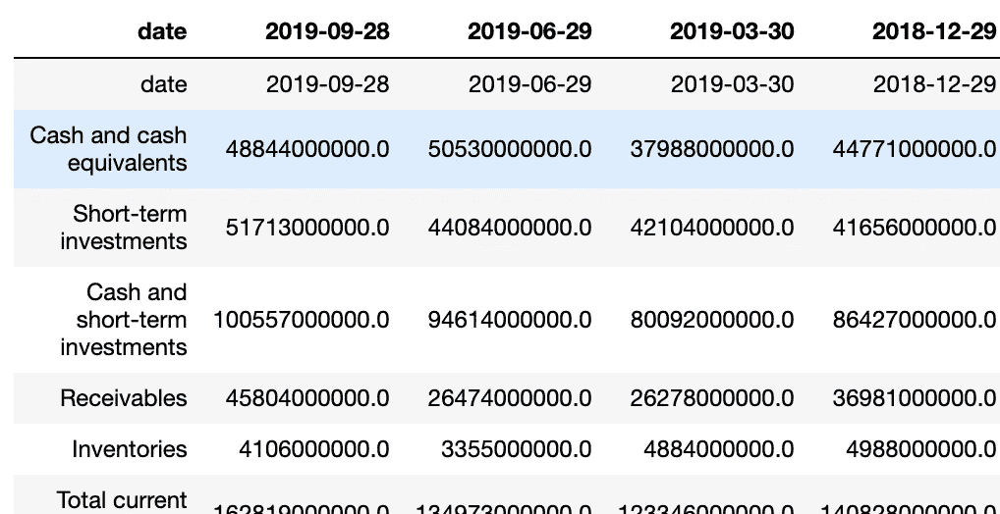
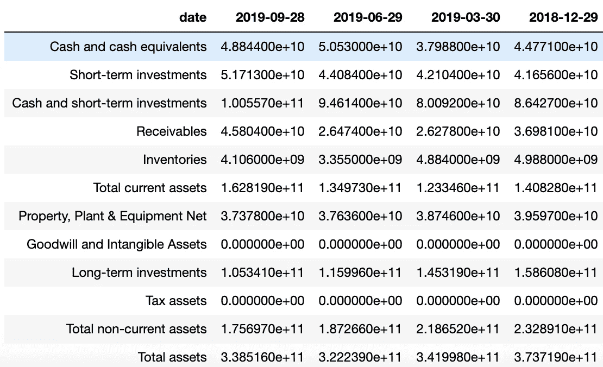
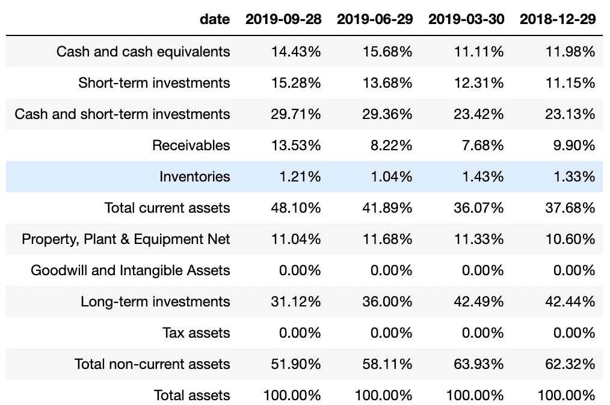

# Python 股票分析-资产负债表趋势分析

> 原文：<https://towardsdatascience.com/python-stock-analysis-balance-sheet-trend-analysis-18e6eb63cdc?source=collection_archive---------13----------------------->

为了分析我感兴趣的任何公司的股票，我曾经在 Excel 中预先构建了大量的 Excel 模板。我的旧流程简单但效率低下，我会选择一些公司，查看年度报告，或者在最好的情况下，查看雅虎财经，以获取我的 Excel 模板所需的所有输入。最终，这是一个非常耗时的手动过程。

## 手动收集财务数据需要大量的工作，这使我无法在分析部分花费更多的时间。这是学习 Python 和 Pandas 的原因之一，并且尽可能地自动化所有的数据收集过程。


来源:Pixabay，via Pexels

在我能够完全自动化我所有的股票分析之前，我花了几个月的时间达到 Python 和 Pandas 的良好水平。然而，这完全值得。现在，我只需写下我想分析的任何公司的名称，几秒钟后，结果就显示在我眼前。

现在，我想与你分享所有这些分析，并希望你能从中受益。在这篇文章中，我将向你展示如何用 Python 进行资产负债表趋势分析。

> 资产负债表趋势分析将显示每个资产负债表项目占总资产的百分比。这是比较资产负债表项目变化和分析长期趋势的非常有用的工具。

除了中等的故事，我在 Youtube 上还有一个视频教程系列( [Python for Finance](https://www.youtube.com/playlist?list=PLnzr8Oa9VylaswbINaepu7_IaY2phKb1S) )，在那里我一行一行地解释如何为一些分析开发代码。如果对下面分享的代码有什么不清楚的地方，请随时访问 Youtube 上的视频教程:

现在让我们来看代码。下面的脚本非常简单，只需要我们几分钟就可以写完。我们将使用 Pandas、Requests 和 Json 库。我们将从名为[金融建模准备](https://financialmodelingprep.com/developer/docs/)的 API 中提取数据。它是一个免费的 API，拥有丰富的财务数据。

我们首先导入 *Pandas、request 和 JSON* ，并对*财务建模准备 API 端点*进行 *get* 调用，这将返回我们通过 get 请求传递的任何公司的资产负债表信息。在这个例子中，我们将通过传递苹果公司的股票代码从苹果公司获取数据。然后，我们将数据转换成 Json 格式:

```
import pandas as pd
import requests
import jsonbs = requests.get(f'https://financialmodelingprep.com/api/v3/financials/balance-sheet-statement/AAPL?period=quarter')bs = bs.json()
```

接下来，我们需要解析存储在变量 *bs 中的字典。*所需数据包含在一个名为 *financials 的字典中。*然后，我们使用*Pandas DataFrame . from _ dict*方法将我们的字典转换成 Pandas data frame。因为我们希望 Pandas 数据框架将数据资产负债表项目显示为行项目，所以我们将转置它。

```
bs = bs[‘financials’]bs = pd.DataFrame.from_dict(bs)bs = bs.Tbs.columns = bs.iloc[0]
```



Python for Finance —检索资产负债表

现在，我们的熊猫数据框看起来和上面的图片一模一样。我们还需要再写几行代码来清理它，并显示资产负债表中每个项目占总资产的百分比。

让我们用下面的代码来做这件事。首先，我将所有的列存储在一个名为 *cols* 的变量中。然后，我删除重复的第一行，仅保留 4 列和 12 行(即，前 4 列是 4 个最近的财务季度，并将删除第 12 行之后的负债和权益)。

最后，我们将列从*对象*转换为*浮动*，以便能够执行数学运算。你可以随时参考上面的 Youtube 视频，以防万一。

```
cols = bs.columnsbs = bs.iloc[1:,]bs = bs.iloc[:12,:4]cols = bs.columnsbs[cols] = bs[cols].apply(pd.to_numeric, errors=’coerce’)
```

我们的熊猫数据框架开始变得更好看了。我们拥有苹果公司过去 4 个季度的所有资产:



为了完成我们的脚本，我们只需要将一个季度的每个资产负债表项目除以该季度的总资产。让我们快点做那件事。

首先，我们使用 *iloc[row，col]从每个季度提取*总资产*数字。然后，我们创建一个名为 *allassets 的列表。*最后，我们将资产负债表的每个项目除以总资产再乘以 100，以百分比的形式显示出来:*

```
assetsQ1 = bs.iloc[11,0]assetsQ2 = bs.iloc[11,1]assetsQ3 = bs.iloc[11,2]assetsQ4 = bs.iloc[11,3]allassets = [assetsQ1,assetsQ2,assetsQ3,assetsQ4]bs[cols] = (bs[cols] / allassets)*100pd.options.display.float_format = ‘{:.2f}%’.format
```

最后，我们的分析完全自动化。现在，通过查看资产负债表趋势分析，我们可以很快看到，苹果去年一直在积累现金。从 6 月到 9 月，应收账款几乎翻了一番，长期投资有所减少。你可以根据这个趋势得出自己的结论。



用 Python 进行资产负债表趋势分析

**请注意，我们可以为任何其他公司重用该分析，只需在代码开头将传递给 get 请求的 url 中的 url ticker 从 *AAPL* 替换为任何其他公司。**