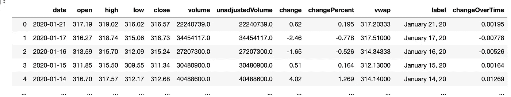
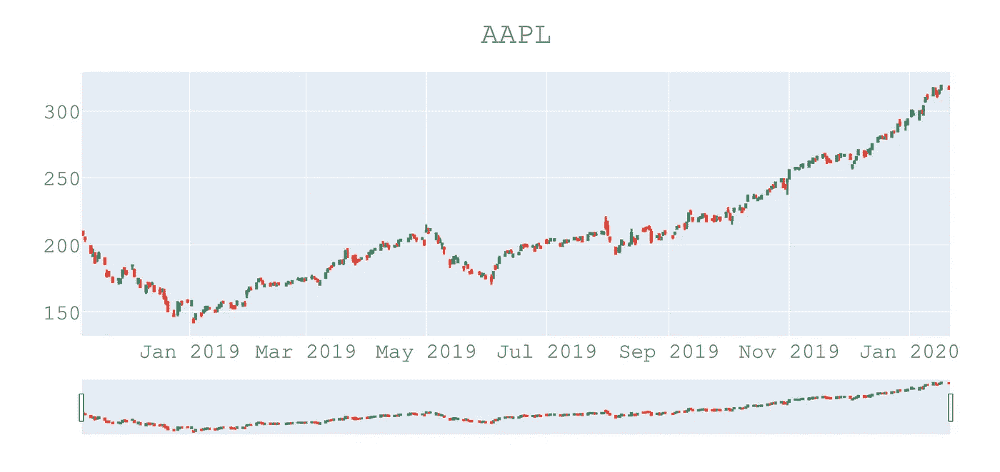

# Python 股票分析—使用 Python 和 Plotly 的蜡烛图

> 原文：<https://towardsdatascience.com/python-stock-analysis-candlestick-chart-with-python-and-plotly-e619143642bb?source=collection_archive---------9----------------------->

蜡烛图是一种非常常见和有用的股票价格表示法。通过查看蜡烛图，我们可以直观地看到任何给定股票的开盘价、收盘价、最低价和最高价。

> 在本文中，我将向您展示如何使用 Python、Pandas 和 Plotly 来构建您自己的蜡烛图。


[M. B. M.](https://unsplash.com/@m_b_m?utm_source=unsplash&utm_medium=referral&utm_content=creditCopyText) 在 [Unsplash](https://unsplash.com/photos/3Tf1J8q9bBA?utm_source=unsplash&utm_medium=referral&utm_content=creditCopyText) 上的照片

我们将从导入所有需要的包开始。我们将需要*熊猫*、 *Plotly* 、 *Json* 和*请求。需要 Requests 和 Json* 从免费的金融 API F[financialmodelingprep](https://financialmodelingprep.com/)中检索股票信息。

```
import plotly.express as px
import plotly.graph_objects as go
import pandas as pd
import requests
import jsonquote = 'AAPL'days = 300def candlestick(quote,days):
    r =     requests.get(f'[https://financialmodelingprep.com/api/v3/historical-  price-full/{quote}?timeseries={days}'](https://financialmodelingprep.com/api/v3/historical-price-full/{quote}?timeseries={days}')) r = r.json() return r
```

我们将 API 端点 url 作为 get 函数的一个参数进行传递，该 URL 存储在一个名为 *r* 的变量中。然后，我们把 API 响应转换成 Json，这样我们 Python 就可以很容易地用 Python 操纵它了。变量 *r* 将包含我们传递给函数*烛台*的任何股票的历史价格数据。在上面的例子中，我们传递了函数' *AAPL* '(即苹果)和 *300* 天作为参数。因此，结果是，我们得到一个代表 300 个数据点的列表。**列表中的每个元素都是一个字典，包含**我们的蜡烛图所需要的信息，即**的*开市、*的**高、低和**的*收市*和**的。

```
“symbol” : “AAPL”, “historical” : [ { “date” : “2015–01–20”, “open” : 107.84, “high” : 108.97, “low” : 106.5, “close” : 108.72, “volume” : 4.98999E7, “unadjustedVolume” : 4.98999E7, “change” : -0.88, “changePercent” : -0.816,....
```

如果可能的话，我总是喜欢把我的数据转换成熊猫数据框架，因为它让我以一种非常容易和方便的方式处理、操作和清理我的数据。这就是我们用下面两行代码实现的。

首先，我们解析变量 *r* 来提取与*历史*键相关的值，并将其存储在名为 *stockdata* 的变量中。通过这种方式，我们保留了一个字典列表。每个字典包含一天的股票价格数据。然后，我们可以简单地将 stockdata 列表转换成 Pandas 数据帧。

```
stockdata = r[‘historical’]
stockdata_df = pd.DataFrame(stockdata)
```

如果我们打印出我们的 Pandas data frame*stock data _ df，*我们会得到类似下面的内容，其中每行代表一天，每列为我们提供股票价格信息:



到目前为止一切顺利。现在，让我们进入有趣的部分。我们可以开始用 [Plotly](https://plot.ly/python/) 构建我们的图表。Plotly 是一个非常强大的图形库。非常容易使用 Python 和熊猫。

首先，我们需要创建一个包含数据点的 fig 对象。在我们的数字中，我们定义了我们的日期，开盘价、最高价、最低价和收盘价。每个数据点都将是我们的*股票数据 _df* 熊猫数据框架中的一列。例如，open 将包含我们的 Pandas 数据框架中包含的每个日期的开盘价。因为，我们在函数中传递了 300 天，open 将包含*苹果*最近 300 天的公开股票价格。

我们还可以使用 Plotly *fig.update_layout* 命令更新图表的布局，为图表添加一些漂亮的标题，更改字体，并确保文本位于图表区域的顶部中央。

最后，我们可以使用 *fig.show()* 来显示蜡烛图:

```
fig = go.Figure(data=[go.Candlestick(x=stockdata_df['date'],
                open=stockdata_df['open'],
                high=stockdata_df['high'],
                low=stockdata_df['low'],
                close=stockdata_df['close'])])fig.update_layout(
    title= {
        'text': quote,
      'y':0.9,
        'x':0.5,
        'xanchor': 'center',
        'yanchor': 'top'},
      font=dict(
        family="Courier New, monospace",
        size=20,
        color="#7f7f7f"
    )
    )fig.show()
```

现在神奇的是，或者说是因为我们的编码技能，一个令人印象深刻的烛台图表显示在我们面前，包括一个滑块来放大和缩小任何特定的时间段。自己尝试一下吧！



用 Python 和 Plotly 制作的烛台图

我已经包括了下面的整个脚本供您参考。只需替换*报价*和*天数*变量*和*来选择想要的股票和你想在图表中显示的天数。

注意:如果您在运行下面的代码时遇到任何问题，请确保您已经安装了所有必需的库。

```
import plotly.express as px
import plotly.graph_objects as go
import pandas as pd
import requests
import jsonquote = ‘AAPL’
days = 300def candlestick(quote,days):
  r = requests.get(f’[https://financialmodelingprep.com/api/v3/historical-price-full/{quote}?timeseries={days}'](https://financialmodelingprep.com/api/v3/historical-price-full/{quote}?timeseries={days}'))
  r = r.json()

  stockdata = r[‘historical’]
  stockdata_df = pd.DataFrame(stockdata)

  fig = go.Figure(data=[go.Candlestick(x=stockdata_df[‘date’],
  open=stockdata_df[‘open’],
  high=stockdata_df[‘high’],
  low=stockdata_df[‘low’],
  close=stockdata_df[‘close’])]) fig.update_layout(
    title= {
     ‘text’: quote,
     ‘y’:0.9,
     ‘x’:0.5,
     ‘xanchor’: ‘center’,
     ‘yanchor’: ‘top’},
   font=dict(
    family=”Courier New, monospace”,
    size=20,
    color=”#7f7f7f”
 )) fig.show()

candlestick(quote,days)
```