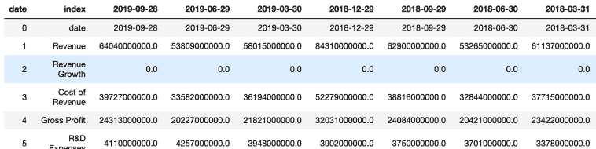
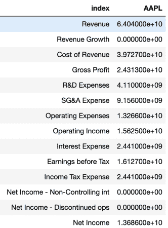
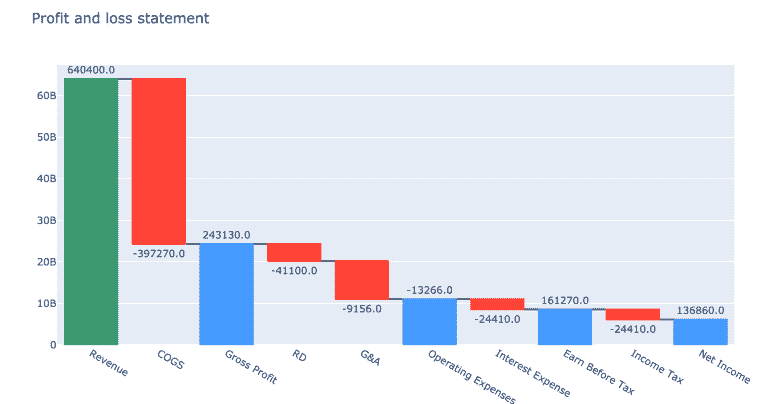

# Python 股票分析-损益表瀑布图

> 原文：<https://towardsdatascience.com/python-stock-analysis-income-statement-waterfall-chart-ffb7f9a4687f?source=collection_archive---------13----------------------->

## 在这篇文章中，我展示了如何使用 Python、Pandas 和 Plotly 以瀑布图的形式显示损益表。

在这篇文章中，我将向你展示如何使用 Python、Pandas 和 Plotly 以瀑布图的形式显示损益表。

> *一个* ***瀑布图*** *是一种表示数据的方式，以便可视化不同项目的累积效果。在我们的例子中，我们将能够看到每一个收益表行从收入到净收入的影响。*


照片由 [**Pixabay**](https://www.pexels.com/@pixabay?utm_content=attributionCopyText&utm_medium=referral&utm_source=pexels) 来自 [**像素**](https://www.pexels.com/photo/cascade-cliff-clouds-dawn-356831/?utm_content=attributionCopyText&utm_medium=referral&utm_source=pexels)

我将文章分为两部分，在第一部分，我们将从免费的财务 API[Financialmodelingprep](https://financialmodelingprep.com/)中检索我们感兴趣的任何公司的损益表数据。然后，我们将使用 Pandas 来清理数据并执行一些基本操作。

在文章的第二部分，我们将使用 Plotly 将损益表转换成一个**漂亮的瀑布图**表示。

如果你跟随这篇文章并和我一起编码，你将能够为你感兴趣的任何上市公司建立瀑布图。


瀑布图形式的损益表— Python for Finance

好了，让我们开始编码第一部分。我们需要导入 *json* 和*请求*库，以便向 API 端点发出 *GET* 请求。我们还导入 *Pandas* 来将请求的数据转换成 *Pandas DataFrame* ，最后，我们将导入 *Ploty* ，这是我们将用来创建图表的库。

对于所有不熟悉 [Plotly](https://plot.ly/python/) 的人来说，这是一个免费的 Python 图形库，它提供了创建非常有吸引力的交互式图表的可能性。

```
import plotly.express as px
import plotly.graph_objects as go
import pandas as pd
import requests
import json
```

导入所需的包后，我们开始创建我们的函数 *selectquote* ，我们将在其中添加将我们的数据转换成 Pandas 数据帧的逻辑。我们发出一个 *http* 请求，并将数据转换成 *Json* ，这样我们就可以用 *Python* 和 *Pandas* 轻松处理它。

然后，从通过 API 检索的信息中，我们将关键字 *financials* 的值存储到 *stock* 变量中。Financials 包含一个字典列表，其中每个字典代表一个季度的损益表。

接下来，我们从*股票*字典中创建一个 Pandas 数据框架，并对其进行转置，以便将损益表项目作为行，将日期作为标题。

```
def selectquote(quote): 
   r= requests.get(f"https://financialmodelingprep.com/api/v3/financials/income-statement/{quote}?period=quarter")    r = r.json() 
   stock = r['financials'] stock = pd.DataFrame.from_dict(stock) 
   stock = stock.T   
   stock.columns = stock.iloc[0]
   stock.reset_index(inplace=True) 
   return  stock selectquote('AAPL')
```

到目前为止，如果我们打印出我们的库存熊猫数据帧，我们会得到类似于下面的*苹果*的结果，因为我们已经将 *AAPL* 传递给了我们的*选择报价*函数。**请注意，我们需要作为参数传递股票的代码，而不是全名**。



在我们创建图表之前，还有一些东西需要清理。

首先，我们将*熊猫数据框*切片，只保留上一季度的损益表。然后，我们将列名重命名为股票名称，而不是日期。最后，我们将损益表信息(即列)转换成一个数字。

```
stock = stock.iloc[:,0:2]stock.rename(columns={ stock.columns[1]: quote }, inplace = True)cols = stock.columns.drop('index')stock[cols] = stock[cols].apply(pd.to_numeric, errors='coerce')stock = stock.iloc[1:,]
```

重新运行我们的代码后，我们可以看到苹果公司最新的季度收入报表:

```
incomeStatement = selectquote('AAPL')
print(incomeStatement)
```



Python for Finance —损益表

**我们还需要提取******收入、销货成本等的价值。从我们的库存熊猫数据框架**以便在瀑布图中使用。我们可以很容易地用 iloc 找到损益表项目的价值。我们将费用乘以 *-1* ，使其符合负号约定:**

```
Revenue = incomeStatement[incomeStatement['index'] == 'Revenue'].iloc[0][1]COGS = incomeStatement[incomeStatement['index'] == 'Cost of Revenue'].iloc[0][1]*-1grossProfit = incomeStatement[incomeStatement['index'] == 'Gross Profit'].iloc[0][1]RD = incomeStatement[incomeStatement['index'] == 'R&D Expenses'].iloc[0][1]**-1**GA =* incomeStatement*[*incomeStatement*['index'] == 'SG&A Expense'].iloc[0][1]**-1operatingExpenses = incomeStatement[incomeStatement['index'] == 'Operating Expenses'].iloc[0][1]**-1**interest =* incomeStatement*[*incomeStatement*['index'] == 'Interest Expense'].iloc[0][1]**-1EBT = incomeStatement[incomeStatement['index'] == 'Earnings before Tax'].iloc[0][1]incTax = incomeStatement[incomeStatement['index'] == 'Income Tax Expense'].iloc[0][1]*-1netIncome = incomeStatement[incomeStatement['index'] == 'Net Income'].iloc[0][1]
```

**太好了，我们已经完成了代码的第一部分。现在，**让我们进入有趣的部分，我们将创建一个瀑布图**。**

**首先，我们将创建一个*图* *对象*，它将包含构建图表所需的数据点。**对于瀑布图**，我们将需要一个度量列表，其中我们将指出每个变量是相对*度量还是总*度量。这将影响图表的构建方式。例如，毛利将是一个总的衡量标准，它将从图表的底部开始。****

**然后，我们将有我们的 ***x*** 轴，它将包含损益表项目的名称，最后，我们的 *y* 将包含与每个 x 相关联的值。此外，我们将有一个文本列表，其中包含我们希望在图表中显示的每个项目的值。**

**我们将文本除以 100，000 来表示以百万计的数字。**

```
fig = go.Figure(go.Waterfall(name = "20", orientation = "v",measure = ["relative", "relative", "total", "relative", "relative", "total","relative","total","relative","total"],x = ["Revenue", "COGS", "Gross Profit", "RD", "G&A", "Operating Expenses","Interest Expense", "Earn Before Tax","Income Tax","Net Income"],textposition = "outside",text = [Revenue/100000, COGS/100000, grossProfit/100000, RD/100000, GA/1000000, operatingExpenses/1000000,Interest/100000, EBT/100000,incTax/100000, NetIncome/100000],y = [Revenue, COGS, grossProfit, RD, GA, operatingExpenses, Interest,EBT, incTax, NetIncome], connector = {"line":{"color":"rgb(63, 63, 63)"}}, )) fig.update_layout( 
title = "Profit and loss statement",
showlegend = **True** ) fig.show()
```

**现在，如果我们运行代码，我们可以看到苹果公司的收益表是一个瀑布图:**

****

**自己尝试使用不同的股票，只需将所需公司的股票代码作为参数传递给 *selectquote* 函数。**

**下面看到完整的代码供你参考。请注意，您需要安装教程中使用的所有库。否则，代码将不起作用。**

```
import plotly.express as px
import plotly.graph_objects as go
import pandas as pd
import requests
import json

def selectquote(quote):
     r= requests.get(f"https://financialmodelingprep.com/api/v3/financials/income-statement/{quote}?period=quarter")
     r = r.json()
    stock = r['financials']
    stock = pd.DataFrame.from_dict(stock)
    stock = stock.T
    stock.columns = stock.iloc[0]
    stock.reset_index(inplace=True)
    stock = stock.iloc[:,0:2]
    stock.rename(columns={ stock.columns[1]: quote }, inplace = True)
    cols = stock.columns.drop('index')
    stock[cols] = stock[cols].apply(pd.to_numeric, errors='coerce')
    stock = stock.iloc[1:,]
    return stock

incomeStatement = selectquote('AAPL')Revenue = incomeStatement[incomeStatement['index'] == 'Revenue'].iloc[0][1]COGS = incomeStatement[incomeStatement['index'] == 'Cost of Revenue'].iloc[0][1]*-1grossProfit = incomeStatement[incomeStatement['index'] == 'Gross Profit'].iloc[0][1] RD = incomeStatement[incomeStatement['index'] == 'R&D Expenses'].iloc[0][1]*-1 GA = incomeStatement[incomeStatement['index'] == 'SG&A Expense'].iloc[0][1]*-1operatingExpenses = incomeStatement[incomeStatement['index'] == 'Operating Expenses'].iloc[0][1]*-1 interest = incomeStatement[incomeStatement['index'] == 'Interest Expense'].iloc[0][1]*-1EBT = incomeStatement[incomeStatement['index'] == 'Earnings before Tax'].iloc[0][1]incTax = incomeStatement[incomeStatement['index'] == 'Income Tax Expense'].iloc[0][1]*-1netIncome = incomeStatement[incomeStatement['index'] == 'Net Income'].iloc[0][1] 

fig = go.Figure(go.Waterfall(
    name = "20", orientation = "v", measure = ["relative", "relative", "total", "relative", "relative", "total","relative","total","relative","total"],

    x = ["Revenue", "COGS", "Gross Profit", "RD", "G&A", "Operating Expenses","Interest Expense", "Earn Before Tax","Income Tax","Net Income"], textposition = "outside",

    text = [Revenue/100000, COGS/100000, grossProfit/100000, RD/100000, GA/1000000, operatingExpenses/1000000,Interest/100000, EBT/100000,incTax/100000, NetIncome/100000],

     y = [Revenue, COGS, grossProfit, RD, GA, operatingExpenses, Interest,EBT,incTax,NetIncome],

    connector = {"line":{"color":"rgb(63, 63, 63)"}},

fig.update_layout(
         title = "Profit and loss statement",
         showlegend = True
 )))

fig.show()
```

**我创建了下面的 Youtube 视频，我一步一步地建立瀑布图。如果您在理解本文中的代码时遇到困难，这是值得一查的。**

**损益表的瀑布图— Python for Finance**

***原载于*【https://codingandfun.com】**