# Python 字符串插值

> 原文：<https://towardsdatascience.com/python-string-interpolation-829e14e1fc75?source=collection_archive---------19----------------------->

## 了解用 Python 实现字符串插值的方法。

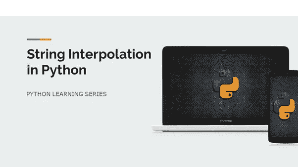

字符串插值是将值注入字符串文字中的占位符(占位符只是一个变量，您可以稍后将数据/值赋给它)的过程。它有助于以一种更好的方式动态格式化输出。Python 支持多种格式化字符串文字的方式。所有字符串插值方法总是返回新值，并且不处理原始字符串。

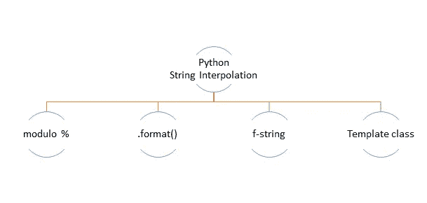

作者图片

## **使用%(模)运算符**

除了其正常的计算用法， *%* 运算符在 str 类中被重载以执行字符串格式化，它将各种类类型插入到字符串文字中。下面是一些常用的格式说明符，

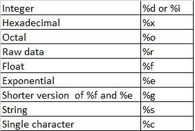

作者图片

使用 *%* 的一般格式为:

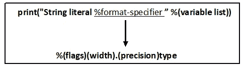

作者图片

这里， *%* 表示使用 Python 的字符串格式化功能时*字符串*的转换类型。

使用%的字符串插值

```
Output:
-------
Result of calculation is 4.38

Hey! I'm Emma, 33 years old and I love Python Programing

Hey! I'm Emma and I'm 33 years old.
```

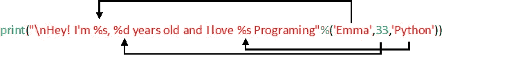

作者图片

在上面的例子中，我们使用了两个 *%s* 和一个 *%d* 格式说明符，它们只是元组 *('Emma '，33，' Python')* 值的占位符。 *%* 只接受一个参数，因此元组用于多值替换。请注意，元组的值是按照指定的顺序传递的。如果一个值的类型和对应的格式说明符的类型不匹配，Python 会抛出 [*类型错误*](https://docs.python.org/3/library/exceptions.html) 异常。

在下面的代码中， *%d* 是字符串的第一个值 *'Emma'* 的格式说明符，因此引发了 *TypeError* 异常。

```
print("\nHey! I'm **%d**, %d years old and I love %s Programing"%('**Emma**',33,'Python')) **--------------------------------------------------------------------**
**TypeError**                                 Traceback (most recent call last)
<ipython-input-5-f2e9acc11cdb> in <module>
      1 
----> 2 print("\nHey! I'm **%d**, %d years old and I love %s Programing"%(**'Emma'**,33,'Python'))  

**TypeError**: %d format: a number is required, not str
```

尽管 *%* -formatting 在 Python 中从一开始就是可用的，但是当单个字符串中有多个替换时，它就显得笨拙了。

## **使用。format()方法**

Str.format()用于位置格式化，这允许重新排列字符串中占位符的顺序，而不改变它们的排列顺序。格式()。{ }用作占位符，并且是方法传递的唯一值。format()将被替换为{ }，其余的字符串文字将在输出中保持不变。

位置格式可以通过在占位符中使用索引或关键字来实现。如果它们都没有被指定，对象将按照它们在中被提到的顺序被注入。默认情况下，格式为()。

字符串插值使用。格式( )

```
Output:
-------
Hey! I'm Emma, 33 years old, and I love Python Programming.

33 years old Emma loves Python programming.

Emma loves Python programming and she is 33 years old.
```

使用索引/关键字或者保持黑色，你不能将它们混合在一起，因为 Python 会抛出 [*值错误*](https://docs.python.org/3/library/exceptions.html) 异常*。*在下面的代码中，两个占位符保持空白，一个具有索引“2”引用，因此引发了异常。

```
name="Emma"
age=33
lan="Python"print("**{}** years old **{2}** loves **{}** programming.".format(age,lan,name))**--------------------------------------------------------------------**
**ValueError**                                Traceback (most recent call last)
<ipython-input-15-b38087c9c415> in <module>
      5 lan="Python"
      6 
----> 7 print("**{}** years old **{2}** loves **{}** programming."**.**format**(**age**,**lan**,**name**))**
      8 

**ValueError**: cannot switch from automatic field numbering to manual field specification
```

。format()方法是通用的，可以很容易地用于所有的数据结构。

字符串插值使用。格式( )

```
Output:
-------
Hey! My name is Emma, I'm 33 years old, currently living in UK and love Python programming

Person info from List: Emma from UKPerson info from Tuple: Emma 33 UK

Person info Set: 33 Python Emma
```

如上面的代码所示，从 dictionary *person_dict* 接收的值将*键值*作为字符串中的占位符。 ***(双星号)*用于解包映射到*键值*的字典值。

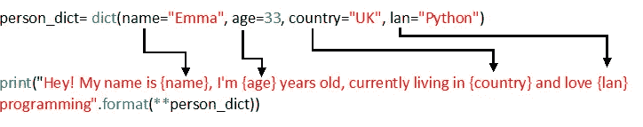

作者图片

对于列表和元组，在占位符中使用了索引。

## **使用 f 字符串格式**

f-string 或格式化字符串文字提供了一种使用最小语法格式化字符串的方法。(在 Python 3.6 中引入)。代码可读性很高，因此它通常是格式化字符串的首选方式。“F”或“F”用作前缀，{}用作占位符。不像。format()，f-string 不允许空括号{}。f 字符串表达式在运行时计算。

string 比两种最常用的字符串格式化机制更快，%-formatting 和。格式( )

使用 f 弦的字符串插值

```
Output:
-------
Emma is 33 years old currently living in UK and loves Python programming.
33 years old  Emma lives in UK and loves Python programming
'Emma' is a python developer from UK

Date in default format: 2020-06-04 17:01:31.407452 
Date in custom format: 04/06/20
```

如上面的代码所示，我们只需在字符串的开头附加' f ',并将变量名直接放入占位符{ }。f-string 格式可以无缝地用于类及其对象。

```
Output:
-------
Person Details: Emma is 33 years old Python developer.

[Name: Emma, Age: 33, Programming_language: Python]
```

这里，我们在 *Person* 类中定义了两个方法。开头附加“f ”,类/对象引用变量放在{ }中。

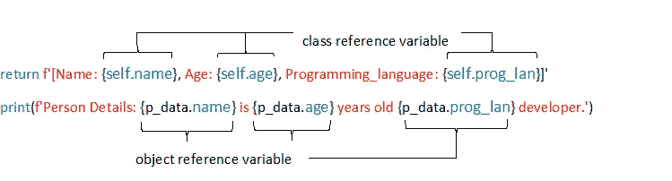

作者图片

干净精准！

## **使用模板类**

字符串模块的模板类有助于字符串插值的另一种方式。它允许您使用映射对象替换字符串。这里，前面带有符号' $ '的有效 python 标识符被用作占位符。

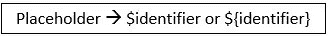

作者图片

基本上，我们可以使用模板类对象定义一个字符串文字，然后通过 substitute()或 safe_substitute()方法映射占位符的值。

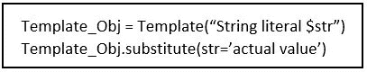

作者图片

$ '符号执行实际的替换，标识符用于映射方法 substitute()或 safe_substitute()中指定的替换关键字。

*substitute( )* —如果没有提供相应占位符的值，则会引发错误。

*safe_substitute( )* —当用户提供的数据可能不完整时，此选项更合适。(当数据丢失时，占位符保持不变。)

使用模板类的字符串插值

```
Output:
-------
Emma is 33 years old and loves Python programming!

$age years old Emma loves Python programming

$age years old Harry loves Java programming
```

在上面的例子中，我们已经创建了保存字符串的*模板*类的对象 *person_info* 。然后使用 *substitute( )* 方法注入实际值，它将值映射到占位符名称。

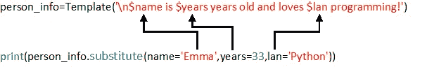

作者图片

如果没有提供相应占位符的值，substitute( ) 将引发错误。这里， *substitute( )* 中没有提供 *$years* 的值，因此它引发 [*KeyError*](https://docs.python.org/3/library/exceptions.html) 异常。

```
person_info=Template('\n$name is $years years old and loves $lan programming!')   
print(person_info.substitute(name='Emma',lan='Python'))**--------------------------------------------------------------------**
**KeyError**                                  Traceback (most recent call last)
<ipython-input-7-2b10997fef23> in <module>
      4 #creating object of Template class
      5 person_info=Template('\n$name is $years years old and loves $lan programming!')
----> 6 print(person_info.substitute(name='Emma',lan='Python'))  #substitute()
      7 
      8 

~\Anaconda3\lib\string.py in substitute(*args, **kws)
    130             raise ValueError('Unrecognized named group in pattern',
    131                              self.pattern)
--> 132         return self.pattern.sub(convert, self.template)
    133 
    134     def safe_substitute(*args, **kws):

~\Anaconda3\lib\string.py in convert(mo)
    123             named = mo.group('named') or mo.group('braced')
    124             if named is not None:
--> 125                 return str(mapping[named])
    126             if mo.group('escaped') is not None:
    127                 return self.delimiter

**KeyError**: 'years'
```

在同一个示例中，我们还使用了 safe_substitute()，其中我们没有为占位符 *$age* 分配任何值，因此它在输出中保持不变，不会引发任何异常。

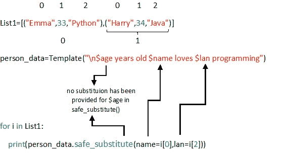

作者图片

```
**$age** years old Emma loves Python programming

**$age** years old Harry loves Java programming
```

该方法被考虑用于复杂的定制字符串操作；但是，str 最大的局限性。模板类是，它只接受字符串参数。

## **结论**

我个人大部分时间使用 f-string，因为它简洁，编写非常方便，同时代码可读性很高。该主题的一些重要资源是，

*   [PEP 498 —字符串插值](https://www.python.org/dev/peps/pep-0498/)
*   [格式化的字符串文字](https://docs.python.org/3/reference/lexical_analysis.html#formatted-string-literals)

本文中使用的代码可以从我的 [GitHub 库](https://github.com/PhoenixIM/Pure_Python/blob/master/string_interpolation.ipynb)中获得。