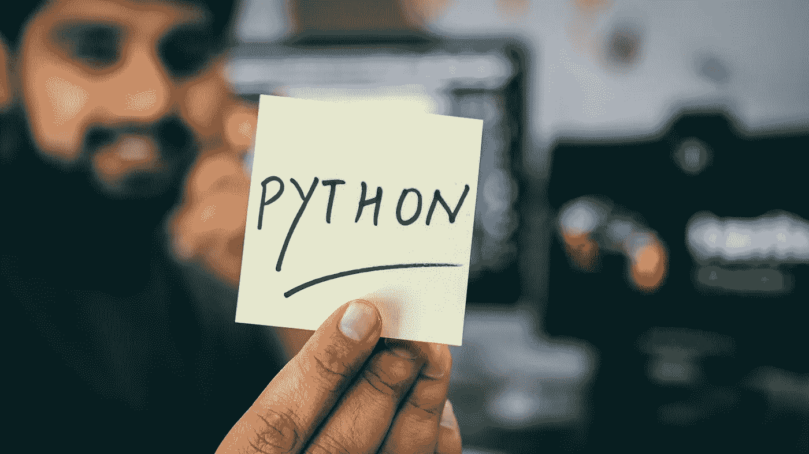

# Python 字符串方法

> 原文：<https://towardsdatascience.com/python-string-methods-7ac76ed7590b?source=collection_archive---------40----------------------->

## 看看最常用的操作 Python 字符串的内置方法



在 [Unsplash](https://unsplash.com/s/photos/python-programming?utm_source=unsplash&utm_medium=referral&utm_content=creditCopyText) 上由 [Hitesh Choudhary](https://unsplash.com/@hiteshchoudhary?utm_source=unsplash&utm_medium=referral&utm_content=creditCopyText) 拍摄的照片

# 什么是字符串，什么是字符串方法？

在 Python 中，文本形式的数据被称为字符串。要将数据指定为字符串，文本必须用单引号(')或双引号(" ")括起来。名字，地点，物体，句子，甚至数字都可以是字符串，只要用引号括起来。一旦你有了一个字符串，你就可以使用所谓的“方法”来操作这个字符串。要使用一个方法，您只需编写字符串，后跟。【方法】()。例如，要对字符串“pizza”运行 *upper()* 方法，只需编写“pizza”即可。upper()；如果将“pizza”设置为一个变量，您应该使用 variable.upper()。一些方法接受所谓的“参数”，这些参数放在括号中，进一步定义了该方法将做什么。Python 语言有很多内置的方法，比如 *upper()* ，允许你轻松地改变字符串。

## upper()、lower()、title()和大写()

这些方法都在字符串上执行简单的操作，并且不带*参数*。

**upper()** 方法将字符串中的每个字母转换成大写:

```
Syntax: *string*.upper()'pizza'.upper() --> 'PIZZA'
```

**lower()** 方法将字符串中的每个字母转换成小写:

```
Syntax: *string*.lower()'PIZZA'.lower() --> 'pizza'
```

**title()** 方法将字符串中每个单词的首字母大写，就像标题一样:

```
Syntax: *string*.title()'i love to eat pizza'.title() --> 'I Love To Eat Pizza'
```

**capital()**方法类似于 title()方法；但是，只有字符串中第一个单词的第一个字母大写，就像一个句子:

```
Syntax: *string*.capitalize()'i love to eat pizza'.capitalize() --> 'I love to eat pizza'
```

***记住，所有这些例子也可以用变量来写:***

```
food = 'pizza'
food.upper() --> 'PIZZA'
```

## 拆分()

方法将一个字符串转换成一个列表。该方法可以带*两个可选参数*。第一个参数是分隔符，它告诉代码如何拆分字符串。默认情况下，字符串在任何空格处被分割，但是如果您选择，您可以决定用任何字符来分割字符串。第二个参数指定要完成的最大拆分次数。默认情况下，该数字设置为-1，即所有事件。

```
Syntax: *string*.split(*separator, maxsplit*)'I like to eat pizza'.split() --> 
['I', 'like', 'to', 'eat', 'pizza']'I like to eat pizza'.split('e') -->
['I lik', ' to ', 'at pizza']'I like to eat pizza'.split('e', 1) -->
['I lik', ' to eat pizza']
```

## 分区()

与 split()类似， **partition()** 方法按照指定的字符分割字符串。但是，使用这种方法，字符串被分割成一个由三项组成的元组:匹配之前的所有内容、匹配本身和匹配之后的所有内容。通过使用 partition()而不是 split()，您可以保留用来拆分字符串的字符。这个方法使用了*一个必需的参数——*分隔符，它告诉代码你希望如何分割字符串。如果在字符串中没有找到分隔符，仍然返回一个包含三项的元组；但是，它由整个字符串、一个空字符串和另一个空字符串组成。

```
Syntax: *string*.partition(*value*)'I like to eat pizza'.partition(' to ') 
--> ('I like', ' to ', 'eat pizza')'I like to eat pizza'.partition(' drink ')
--> ('I like to eat pizza', '', '')
```

## 加入()

**join()** 方法用于将 *iterable* (列表、字典、元组、集合，甚至另一个字符串)中的所有项目连接到一个字符串。该方法使用一个必需的参数，即 iterable。在应用该方法之前使用的字符串被输入到 iterable 中的每一项之间。通常，仅由一个空格(' "或" ")组成的字符串与 join()方法一起使用，在 iterable 中的单词之间创建空格。

```
Syntax: *string*.join(*iterable*)' '.join(['I', 'like', 'to', 'eat', 'pizza']) 
--> 'I like to eat pizza''x'.join(['I', 'like', 'to', 'eat', 'pizza'])
--> 'Ixlikextoxeatxpizza''yummy'.join({'food':'Pizza', 'topping': 'pepperoni'})
--> 'foodyummytopping'
```

## 替换()

**replace()** 方法允许你用另一个值替换一个字符串的指定值。这个方法有三个参数，其中前两个是必需的。第一个参数是您希望替换的字符串的值，第二个参数是将取代它的值。第三个参数是一个整数，指定要替换的值的出现次数，默认为所有出现次数。

```
Syntax: *string*.replace(*oldvalue, newvalue, count*)'I like to eat pizza'.replace('pizza', 'burgers')
--> 'I like to eat burgers''I really really like to eat pizza'.replace('really', 'kind of', 1)
--> 'I kind of really like to eat pizza'
```

## 条状()

方法从一个字符串的开头或结尾删除你选择的任何字符。该方法可以带*一个可选参数*。默认情况下，任何前导空格或尾随空格都将从字符串中删除，但是如果您将所选的任何字符作为参数包含在字符串中，您也可以选择删除这些字符。

```
Syntax: *string*.strip(*characters*)'   pizza   '.strip() --> 'pizza''..rjq,,pizza.rq,j.r'.strip('rjq.,') --> 'pizza'
```

## startswith()和 endswith()

如果字符串以指定的值开始，则 **startswith()** 方法返回 True，否则返回 False。endswith() 方法以同样的方式工作，但是使用了字符串的结尾。这些方法有三个参数，第一个是必需的，后两个是可选的。第一个参数是您要查看字符串是否以此开头/结尾的值。第二个参数是一个整数值，指定要从哪个索引开始搜索，第三个参数是要结束搜索的索引的值。

```
Syntax: *string*.[starts/ends]with(*value, start, end*)'I like to eat pizza'.startswith('I like') --> True'I like to eat pizza'.endswith('drink pizza') --> False'I like to eat pizza'.startswith('to', 7, 18) --> True'I like to eat pizza'.endswith('eat', 7, 18) --> False
```

## 计数()

方法告诉你一个指定的值在一个字符串中出现了多少次。这个方法需要*三个参数*，其中第一个是必需的。第一个参数是要在字符串中搜索的值。第二个和第三个参数分别是希望开始和结束搜索的位置。默认情况下，第二个参数是 0，即字符串的开头，第三个参数是-1，即字符串的结尾。

```
Syntax: *string*.count(*value, start, end*)'I really really like to eat pizza'.count('really') --> 2'I really really like to eat pizza'.count('really', 8, 20) --> 1
```

## 查找()和索引()

**find()** 和 **index()** 方法几乎完全相同，因为它们都返回指定值的第一个匹配项的索引(如果给定值是多个字符，则返回指定值的第一个字符的索引)。两者之间的唯一区别是，如果在字符串中没有找到该值，find()方法将返回-1，而如果该值没有出现，index()方法将导致错误。两种方法都有三个参数*，其中第一个是必需的。与 count()方法一样，第一个参数是要在字符串中搜索的值，第二个和第三个参数分别是要开始和结束搜索的位置。默认情况下，第二个参数是 0，即字符串的开头，第三个参数是-1，即字符串的结尾。*

```
Syntax: *string*.[find/index](*value, start, end*)'I really really like to eat pizza'.find('really') --> 2'I really really like to eat pizza'.index('really') --> 2'I really really like to eat pizza'.find('really', 8, 20) --> 9'I really really like to eat pizza'.index('really', 8, 20) --> 9'I really really like to eat pizza'.find('hamburger') --> -1'I really really like to eat pizza'.index('hamburger') --> ERROR
```

现在你知道了。使用上述这些方法，您应该能够执行 Python 字符串上的大多数操作。要查看所有可用的字符串方法，请确保查看 [w3schools 列表](https://www.w3schools.com/python/python_ref_string.asp)。

快乐编码，请务必查看我的博客，下面列出了 Python 方法！

[](/python-list-methods-fa7c53010300) [## Python 列表方法

### Python 中最常用列表方法的总结

towardsdatascience.com](/python-list-methods-fa7c53010300) 

## 参考资料:

[](https://www.w3schools.com/python/python_ref_string.asp) [## Python 字符串方法

### Python 有一组内置的方法，可以用在字符串上。注意:所有的字符串方法都返回新值。他们确实…

www.w3schools.com](https://www.w3schools.com/python/python_ref_string.asp)