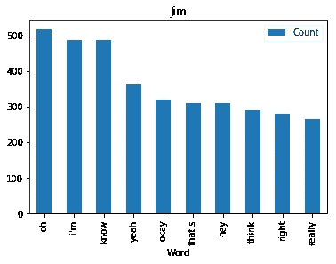

# 用 Schrutepy 包进行 Python 文本分析

> 原文：<https://towardsdatascience.com/python-text-analysis-with-the-schrutepy-package-234bc70f3916?source=collection_archive---------13----------------------->

## 这个新的 python 包让文本分析变得有趣

By: ***布拉德·林德布拉德***
[LinkedIn](https://www.linkedin.com/in/bradlindblad/)|[Github](https://github.com/bradlindblad/)|[博客](https://technistema.com/) | [推特](https://twitter.com/brad_lindblad)


随着 [{schrute} R 包](https://bradlindblad.github.io/schrute/index.html)的成功，许多请求都是针对移植到 Python 的同一个数据集。 **schrute** 和 **schrutepy** 包只有一个目的:从[Office](https://www.imdb.com/title/tt0386676/)加载整个脚本，这样你就可以用这个有趣的数据集执行自然语言处理、文本分析或其他什么。

# 快速启动

使用 pip 安装软件包:

```
pip install schrutepy
```

然后将数据集导入数据框架:

```
from schrutepy import schrutepy df = schrutepy.load_schrute()
```

就是这样。现在你准备好了。

# 长示例

现在，我们将快速学习一些常见的基本文本分析功能。

```
**from** schrutepy **import** schrutepy
**from** wordcloud **import** WordCloud, STOPWORDS, ImageColorGenerator
**import** matplotlib.pyplot **as** plt
**from** matplotlib.pyplot **import** figure
**import** nltk
**from** nltk.corpus **import** stopwords
**from** PIL **import** Image
**import** numpy **as** np
**import** collections
**import** pandas **as** pd
```

用 load_schrute 函数加载整个脚本

```
df = schrutepy.load_schrute()
```

有些唱片没有对白

```
df = df.dropna()
```

为整个系列中的所有文本创建一个单词云

```
text = " ".join(review for review in df.text)print ("There are {} words in the combination of all review.".format(len(text)))#There are 3001517 words in the combination of all review.# Create stopword list:
nltk.download(**'stopwords'**)
stopWords = **set**(stopwords.words(**'english'**))

# Generate a word cloud image
wordcloud = WordCloud(stopwords=stopWords, background_color=**"white"**).generate(text)

# Display the generated image:
# the matplotlib way:
plt.figure(figsize=[**30**,**15**])
plt.imshow(wordcloud, interpolation=**'bilinear'**)
plt.axis(**"off"**)
plt.show()
```


让我们对一些角色做同样的事情。函数会有所帮助。

```
**def** plotDunder(character, df):
    mydf = df[df.character == character]
    text1 = **" "**.join(review **for** review in mydf.text)
    # Generate a word cloud image
    wordcloud = WordCloud(stopwords=stopWords, background_color=**"white"**).generate(text1)

    # Display the generated image:
    # the matplotlib way:
    plt.figure(figsize=[**15**,**7**])
    plt.imshow(wordcloud, interpolation=**'bilinear'**)
    plt.title(character)
    plt.axis(**"off"**)
    plt.show()fav = [**"Michael"**, **"David Wallace"**, **"Dwight"**, **"Jim"**, **"Pam"**, **"Oscar"**, **"Phyllis"**, **"Creed"**, **"Ryan"**,]for i in fav: 
  plotDunder(i, df)
```


让我们做一个德怀特大头的形状

```
dwight_mask = np.array(Image.open("schrutepy.png"))# Create a word cloud image
wc = WordCloud(background_color=**"white"**, max_words=**1000**, mask=dwight_mask,
               stopwords=stopWords, contour_width=**1**, contour_color=**'grey'**)

# Generate a wordcloud
wc.generate(text)

# show
plt.figure(figsize=[**30**,**15**])
plt.imshow(wc, interpolation=**'bilinear'**)
plt.axis(**"off"**)
plt.show()

wc.to_file(**"final_schrute.png"**)
```


现在让我们找出并画出我最喜欢的角色最常用的单词

```
**def** commonWord(character, df):
    mydf = df[df.character == character]
    text = **" "**.join(review **for** review in mydf.text)
    wordcount = {}
    # To eliminate duplicates, remember to split by punctuation, and use case demiliters.
    **for** word in text.lower().split():
        word = word.replace(**"."**,**""**)
        word = word.replace(**","**,**""**)
        word = word.replace(**":"**,**""**)
        word = word.replace(**"\""**,**""**)
        word = word.replace(**"!"**,**""**)
        word = word.replace(**"“"**,**""**)
        word = word.replace(**"‘"**,**""**)
        word = word.replace(**"*"**,**""**)
        **if** word not in stopWords:
            **if** word not in wordcount:
                wordcount[word] = **1**
            **else**:
                wordcount[word] += **1**

    # Print most common word
    n_print = **int**(**10**)
#     print("\nOK. The {} most common words are as follows\n".format(n_print))
    word_counter = collections.Counter(wordcount)
    **for** word, count in word_counter.most_common(n_print):
        **pass**
    # Close the file
    # Draw a bar chart
    lst = word_counter.most_common(n_print)
    df = pd.DataFrame(lst, columns = [**'Word'**, **'Count'**])
    df.plot.bar(x=**'Word'**,y=**'Count'**, title=character)for i in fav: 
  commonWord(i, df)
```



如果你喜欢这个包，就在 [Github](https://github.com/bradlindblad/schrutepy) 上开始吧，这样更多的人可以从中得到乐趣。

***想要更多这样的内容？*** [订阅此处](https://technistema.com/contact/)

*原载于 2020 年 1 月 18 日 https://technistema.com*[](https://technistema.com/posts/python-text-analysis-with-the-schrutepy-package/)**。**