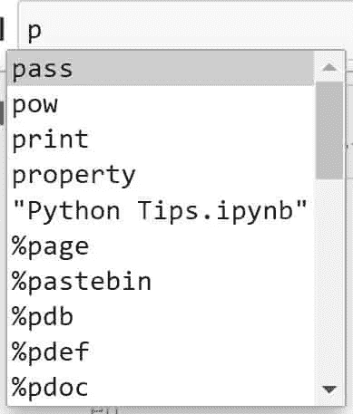

# 给初学者的 10 个有用的 Python 技巧和窍门

> 原文：<https://towardsdatascience.com/python-tips-and-tricks-for-beginners-62473d569d0a?source=collection_archive---------24----------------------->

## 有了实际例子


来源:[像素](https://www.pexels.com/photo/man-riding-bike-2389134/)

在这篇文章中，我们想和你分享 10 个对初学者有用的 Python 技巧和窍门。

Python 是数据科学家最需要的[技能之一](https://www.justintodata.com/in-demand-skills-for-data-scientists/)。除了为初学者提供免费的 [Python 课程](https://www.justintodata.com/learn-python-free-online-course-data-science/)之外，我们还总结了这 10 个提示和技巧，应该可以帮助你完成日常的数据科学任务。

通过本初学者教程，您将学会如何:

*   格式化字符串
*   使用枚举、排序函数
*   从函数中返回多个值
*   使用 lambda 表达式，列出理解
*   更多！

如果你想让你的 Python 编码更高效，不要错过这些技巧/窍门！

我们开始吧。

# 提示#1:显示方法/功能

Python 如此强大，有许多不同的方法和函数。对于初学者来说，要记住所有内容尤其困难。

我们如何找出 Python 对象的可用方法/函数？

针对初学者的第一个 Python 技巧是关于两种快速实现这一点的方法。

## 方法 1:代码完成特性

许多 ide(集成开发环境)或 Python 的代码编辑应用程序可以在您键入时自动完成代码。这个特性有助于加速编程。

例如，在 Jupyter Notebook 中，你可以输入一个函数/文件的前几个字符，等等。，然后按下**标签的**键填写剩余的项目。下面的屏幕截图显示了以字母“p”开头的可用自动完成选项。



## 方法 2: dir 函数

[dir](https://docs.python.org/3/library/functions.html#dir) 函数在其参数中返回对象的有效属性列表，这意味着我们可以用它来返回对象的方法。

例如，让我们运行下面的 Python 代码，将 dir 应用于 string 对象。

这将返回一长串名字。

忽略列表开头带' __ '的那些特殊方法，可以找到一些有趣的方法，比如大写、查找、lower。

```
['__add__', '__class__', '__contains__', '__delattr__', '__dir__', '__doc__', '__eq__', '__format__', '__ge__', '__getattribute__', '__getitem__', '__getnewargs__', '__gt__', '__hash__', '__init__', '__init_subclass__', '__iter__', '__le__', '__len__', '__lt__', '__mod__', '__mul__', '__ne__', '__new__', '__reduce__', '__reduce_ex__', '__repr__', '__rmod__', '__rmul__', '__setattr__', '__sizeof__', '__str__', '__subclasshook__', 'capitalize', 'casefold', 'center', 'count', 'encode', 'endswith', 'expandtabs', 'find', 'format', 'format_map', 'index', 'isalnum', 'isalpha', 'isascii', 'isdecimal', 'isdigit', 'isidentifier', 'islower', 'isnumeric', 'isprintable', 'isspace', 'istitle', 'isupper', 'join', 'ljust', 'lower', 'lstrip', 'maketrans', 'partition', 'replace', 'rfind', 'rindex', 'rjust', 'rpartition', 'rsplit', 'rstrip', 'split', 'splitlines', 'startswith', 'strip', 'swapcase', 'title', 'translate', 'upper', 'zfill']
```

**注意** : `[dir](https://docs.python.org/3/library/functions.html#dir)`只提供了一组有趣的名字，而不是完整的名单。但是当你不能回忆起一个你意识到的方法时，使用起来很方便。
除了 dir，还可以试试[帮助](https://docs.python.org/3/library/functions.html#help)功能。例如，help(str)将打印出关于 string 对象的帮助页面，其中包含了比 dir 更多的方法细节。

# 技巧#2:格式化字符串

打印字符串是数据科学项目中的一项常见任务。str 的 [format](https://docs.python.org/3.4/library/functions.html#format) 方法可以把多个变量和字符串拼凑在一起，用特定的方式格式化。

让我们看一个例子。

我们将定义三个变量*价格*、*已付*和*变更*(=已付—价格)。如果我们想打印出一个包含这些变量的完整句子，格式为美元呢？

我们可以使用下面的格式方法。

```
The item cost $11.29\. I paid $20.00\. I received $8.71 in change
```

# 技巧 3:枚举函数

当迭代一个对象，比如一个列表、字典或文件时， [enumerate](https://docs.python.org/3/library/functions.html#enumerate) 是一个有用的函数。该函数返回一个元组，其中包含通过迭代对象获得的值和循环计数器(从 0 的起始位置开始)。当您想根据索引编写代码时，循环计数器尤其方便。

让我们看一个例子，我们可以为第一个和最后一个元素做一些特殊的事情。

我们用 enumerate 方便地打印了指示第一个和最后一个元素的字符串。

```
0: J
The first element!
1: u
2: s
3: t
4:  
5: I
6: n
7: t
8: o
9:  
10: D
11: a
12: t
13: a
The last element!
```

枚举功能也可以用于文件。

在下面的例子中，我们可以在跳出循环之前打印出 csv 文件的前 10 行。由于结果太长，我们就不在这里复制了。但是你可以在你所有的文件上试试。

# 技巧 4:在一个函数中返回多个值

在定义函数时，我们经常希望返回多个值。在这个 Python 技巧/窍门中，我们将在下面介绍三种常见的方法。

## 方法 1:返回一个元组

首先，我们来看看最方便的方法:返回一个元组。我们通常只在有 2 或 3 个值要返回时使用这种方法。当值的数量更多时，很容易忘记元组中值的顺序。

下面是一个示例函数 get_employee，它根据雇员的 ID 号，以元组的形式返回雇员的名和姓。

如果我们调用值为 0 的函数，您可以看到该函数返回具有两个值的元组:“Jane”和“Doe”。

```
first_name: Jane, last_name: Doe
```

这很好，但是当有更多的值要返回时，我们该怎么办呢？

让我们继续下一个方法。

## 方法 2:返回一个字典

第二种方法是返回字典。字典可以被认为是键:值对，所以我们可以命名返回的值，这比元组更清楚。

下面的例子与上一个相似。但是我们要求函数返回一个字典。

我们可以调用 id_num = 0 的函数。有了作为字典的结果，用它的键调用特定的值就更容易了。

```
first_name: Jane,
last_name: Doe,
title: Data Scientist,
department: A,
date_joined: 20190808
```

## 方法 3:返回一个命名的元组

我们讨论的最后一种方法是返回一个命名的元组。命名元组是具有命名字段的元组。它们像元组一样是不可变的，但也像字典一样提供命名。

> 命名元组为元组中的每个位置赋予意义，并允许更具可读性、自文档化的代码。它们可以在使用正则元组的任何地方使用，并且它们增加了通过名称而不是位置索引来访问字段的能力。
> 
> [Python 文档](https://docs.python.org/3/library/collections.html#collections.namedtuple)

与字典相比，命名元组的主要优势是字段保证在对象中。对于字典，我们不确定是否所有的键:值对都在那里。

让我们看一个命名元组的例子。

我们必须在使用 namedtuple 对象之前定义它。在下面的代码中，我们创建了一个名为*雇员*的 namedtuple 对象，然后用它来保存值。

我们可以再次调用 id_num = 0 的函数来返回命名元组。

```
first_name: Jane,
last_name: Doe,
title: Data Scientist,
department: A,
date_joined: 20190808
```

我们还可以仔细检查返回对象的变量类型，即前面定义的 Employee namedtuple。

```
__main__.Employee
```

# 技巧 5: Lambda 表达式

[λ表达式](https://docs.python.org/3/reference/expressions.html#lambda)用于创建匿名函数，通常是单行的。

下面的例子展示了 lambda 如何缩短创建简单函数的代码。

下面两种方法返回相同的结果。

```
0     first
1    second
2     third
3     first
4     third
5     first
Name: address, dtype: object
```

# 技巧 6:排序函数

在这篇 Python 技巧文章中，我们将介绍有用的[排序](https://docs.python.org/3/library/functions.html#sorted)函数，以及列表和字典的例子。这是一项常见的任务，因为我们经常希望看到数据集中的顶部/底部值。

## 排序列表

让我们看一个使用 sorted 函数的列表的简单例子。

```
[1, 3, 5, 5, 8, 9]
```

**注意**:还有 list.sort()方法，但是我们更喜欢 sorted，因为它更通用并且创建一个新的列表。参见 [Python 文档](https://docs.python.org/3/howto/sorting.html)中更详细的比较。

## 分类词典

对于字典，排序稍微复杂一些，因为有键和值。

我们可以将 sorted 函数直接应用于字典，它将对字典的键进行排序。

```
['A', 'B', 'G', 'Q', 'T']
```

或者将字典的值排序如下。

```
[0, 3, 7, 8, 9]
```

或者按照下面 Python 代码中的键或值对整个字典进行排序。

```
{'A': 9, 'B': 8, 'G': 0, 'Q': 7, 'T': 3}
{'G': 0, 'T': 3, 'Q': 7, 'B': 8, 'A': 9}
```

# 技巧 7:条件表达式

如果你学过 Python 的基础知识，你应该熟悉 if-else 语句。当逻辑简单时，我们也可以在一行中使用[条件表达式](https://docs.python.org/3/reference/expressions.html#conditional-expressions)(或者三元运算符)。

让我们看一个基于下面布尔变量 is_raining 的例子。

下面的 Python 代码展示了这样做的传统方式。

```
Stay at home
```

然而，我们也可以使用下面的表达式。短多了！

> 表达式`*x if C else y*`首先计算条件，C 而不是 x，如果 C 为真，则计算 x 并返回其值；否则，计算 y 并返回其值。
> 
> [Python 文档](https://docs.python.org/3/reference/expressions.html#conditional-expressions)

# 技巧 8:列出理解

我们可以使用列表理解来创建列表，这比传统的方法要简洁得多。当新列表中的每个元素都是对另一个 iterable 对象的元素的一些操作的结果时，通常会使用它。

> 列表理解由括号组成，括号包含一个表达式，后跟一个`*for*`子句，然后是零个或多个`*for*`或`*if*`子句。结果将是一个新的列表，该列表是通过在表达式后面的`*for*`和`*if*`子句的上下文中评估该表达式而得到的。
> 
> [Python 文档](https://docs.python.org/3/tutorial/datastructures.html#list-comprehensions)

这个例子展示了如何使用它来计算字符串中单词的长度，并将结果作为一个列表。

下面两种方法返回相同的结果，而列表理解代码要短得多。

```
[3, 3, 3, 3, 6, 2, 3, 3, 3, 2, 5, 2, 2, 3, 2, 3, 5, 3, 4, 5, 5, 3, 4, 1, 3, 5, 4, 6, 2, 3, 6, 2, 4, 3, 1, 5, 4, 1, 4, 2, 3, 9, 2, 4, 3, 3, 2, 2, 3, 3, 3, 4, 2, 4, 5, 2, 2, 3, 2, 3, 6, 2, 3, 7, 2, 4, 2, 3, 2, 5, 2, 3, 2, 4, 4, 4, 4, 3, 2, 3, 3, 4, 3, 3, 3, 6, 4]
```

# 技巧 9:所有/任何功能

我们还想涵盖 Python 中的[所有](https://docs.python.org/3/library/functions.html#all)和[任何](https://docs.python.org/3/library/functions.html#any)函数。在进行多重比较时，它们很方便。

如果 iterable 对象的任何元素为 true，则 any 函数返回 True。下面的例子显示了它如何使编码更简单。

```
Toronto, Ontario
```

同样，如果 iterable 对象的所有元素都为 true(或者 iterable 为空)，all 函数返回 True。下面是一个比较 all 函数和常用方法的例子。

```
Just Into Data
```

# 技巧#10:使用虚拟环境

如果您同时从事多个数据科学项目，学习和使用虚拟环境至关重要。

Python 的虚拟环境有哪些？

> 虚拟环境是一种 Python 环境，其中安装的 Python 解释器、库和脚本与其他虚拟环境中安装的解释器、库和脚本以及(默认情况下)安装在“系统”Python(即作为操作系统的一部分安装的系统)中的任何库相隔离。
> 
> [Python 文档](https://docs.python.org/3/library/venv.html#:~:text=A%20virtual%20environment%20is%20a,part%20of%20your%20operating%20system.)

可以使用 [Anaconda(康达环境)](https://docs.conda.io/projects/conda/en/latest/user-guide/tasks/manage-environments.html)、 [virtualenv](https://pypi.org/project/virtualenv/) 、 [pipenv](https://pypi.org/project/pipenv/) 等工具创建和管理虚拟环境。

虚拟环境允许每个项目使用不同的 Python 环境，因此我们可以使用不同版本的 Python 和/或不同的库。

例如，假设我们使用 plotly 版本 3 在项目中创建图表。几个月后，plotly 版本 4 推出了新功能。由于该项目的代码在生产中运行良好，我们可以继续使用 Plotly 版本 3。但是对于任何新项目，我们希望使用 Plotly 版本 4 中的新功能。

在这种情况下，我们可以分别使用 plotly v3 和 v4 创建两个虚拟环境，并将它们用于旧项目和新项目。

问题解决了！

就是这样！希望这些 Python 提示和技巧对初学者有用。

你想先试试这篇文章中的哪个技巧？

请留下您的任何问题或任何其他问题的评论。

**相关资源**:

对于 Python 初学者，请查看我们的 pandas 和 numpy 教程继续学习:

[](https://www.justintodata.com/learn-python-pandas-for-data-science-tutorial/) [## 学习 Python 熊猫数据科学:快速教程-数据入门

### 这是一本帮助你快速学习和使用 Python 熊猫进行数据科学、机器学习的指南。熊猫是最…

www.justintodata.com](https://www.justintodata.com/learn-python-pandas-for-data-science-tutorial/) [](https://www.justintodata.com/python-numpy-tutorial-basics-for-data-science/) [## Python NumPy 教程:数据科学实用基础——深入数据

### 在本 Python 教程中，我们将向您展示数据科学和机器学习的 NumPy 基础知识。NumPy 是…

www.justintodata.com](https://www.justintodata.com/python-numpy-tutorial-basics-for-data-science/) 

或者查看我们最近为初学者撰写的其他数据科学文章:

[](https://www.justintodata.com/data-science-pipeline-steps/) [## 成功的数据科学管道的 7 个步骤——直接进入数据

### 在本指南中，我们将讨论在实践中构建数据科学管道的步骤。数据科学有助于…

www.justintodata.com](https://www.justintodata.com/data-science-pipeline-steps/) [](https://www.justintodata.com/machine-learning-algorithm-types-for-beginners-overview/) [## 初学者的机器学习:算法类型概述——数据

### 在这个初学者教程中，我们将解释机器学习算法的类型和一些流行的算法。机器…

www.justintodata.com](https://www.justintodata.com/machine-learning-algorithm-types-for-beginners-overview/) 

要获得更多有用的数据科学文章，[注册我们的简讯](https://www.justintodata.com/)！