# Python 交易工具箱:回溯测试的温和介绍

> 原文：<https://towardsdatascience.com/python-trading-toolbox-05-backtesting-84266edb1d59?source=collection_archive---------8----------------------->

## [交易工具箱](https://towardsdatascience.com/tag/trading-toolbox)

## 从头开始测试交易策略


照片由[米卡·鲍梅斯特](https://unsplash.com/@mbaumi?utm_source=medium&utm_medium=referral)在 [Unsplash](https://unsplash.com?utm_source=medium&utm_medium=referral) 上拍摄

我们通过引入一些基于价格的指标开始了这个系列。我们的目标是使用指标、价格和交易量来做出投资决策:选择何时买入或卖出金融资产。在我们的投资决策过程中，我们可以用不同的方法来整合价格、交易量和指标。第一种，也是最传统的一种，是以任意的方式解释他们的模式，就像技术分析的追随者所做的那样。指标也可以在一个更量化的方法中使用，作为交易系统的组成部分，消除投资过程中的人为判断。[算法交易](https://en.wikipedia.org/wiki/Algorithmic_trading)尤其是一种基于交易策略的方法，这种方法在没有人工干预的情况下自行建立金融工具的头寸。我们还可以使用价格、交易量和指标作为更复杂的机器学习模型的一部分来进行投资决策。

> 一个明显的免责声明:这个帖子的内容仅用于教育目的。这里的所有例子都是作为学习练习提出的，它们绝不应该作为投资建议。

无论我们选择以何种方式使用我们的指标，我们都需要回答一个重要的问题:我们的指标或指标组合对我们的投资决策有多好？换句话说，使用任何指标会比根本不使用它们产生更好的结果吗？

可以帮助我们回答这个问题的过程被称为 [**回溯测试**](https://www.investopedia.com/terms/b/backtesting.asp) 。通过回溯测试，我们将交易或投资策略应用于历史数据，以生成假设的结果。然后，我们可以分析这些结果，以评估我们战略的盈利能力和风险。

这个过程有其自身的缺陷:不能保证在历史数据上表现良好的策略在现实交易中也会表现良好。真实的交易涉及很多因素，这些因素无法用历史数据来模拟或测试。此外，由于金融市场持续快速发展，未来可能会出现历史数据中没有的模式。然而，如果一个策略不能在回溯测试中证明自己是有效的，它很可能永远不会在真实交易中发挥作用。回溯测试至少可以帮助我们剔除那些没有价值的策略。

几个框架使得使用 Python 回溯测试交易策略变得很容易。两个流行的例子是[](https://www.zipline.io/)**和 [**Backtrader**](https://www.backtrader.com/) 。像 *Zipline* 和 *Backtrader* 这样的框架包含了设计、测试和实现算法交易策略所需的所有工具。他们甚至可以自动将真实订单提交给执行经纪人。**

**在这篇文章中，我们采用了一种不同的方法:我们想研究如何使用 Python、 *pandas、*和 NumPy 作为我们仅有的工具，从头开始构建和测试一个交易系统。我们为什么要这么做？首先，从头开始构建回溯测试是一个很好的练习，有助于详细理解策略是如何工作的。此外，我们可能会发现自己需要实现现有框架中没有的解决方案。或者，您可能想要开始创建自己的回溯测试框架的旅程！**

# **回溯测试我们的第一个系统**

**我们可以使用 Python 和 NumPy 以及 *pandas* 创建一个基本的回溯测试。举个例子，我们将使用在纽约证券交易所交易的金宝汤公司股票的价格。我从雅虎下载了五年的交易历史。财务:文件在[这里](https://raw.githubusercontent.com/stebas101/TradingToolbox/master/data/CPB.csv)有。**

**我们首先设置我们的环境，并将价格系列加载到数据框中:**

```
import pandas as pd
import numpy as np
import matplotlib.pyplot as plt
pd.plotting.register_matplotlib_converters()# This is needed if you're using Jupyter to visualize charts:
%matplotlib inlinedatafile = 'data/CPB.csv'
data = pd.read_csv(datafile, index_col = 'Date')
# Converting the dates from string to datetime format:
data.index = pd.to_datetime(data.index)data
```

**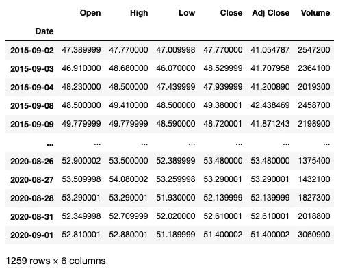**

**原始数据帧**

## **基本策略**

**在我们的例子中，我们将测试一个基本的**移动平均线交叉系统**，该系统基于每日收盘价的 20 天指数移动平均线(EMA)和 200 天简单移动平均线(SMA)(在本例中使用*调整收盘价*)。只要 20 日均线从下方穿过 200 日均线，我们就会买入该股(持有*多头仓位*)。**

**我们将带有移动平均线的列添加到数据框中:**

```
df = data.copy()sma_span = 200
ema_span = 20df['sma200'] = df['Adj Close'].rolling(sma_span).mean()
df['ema20'] = df['Adj Close'].ewm(span=ema_span).mean()df.round(3)
```

**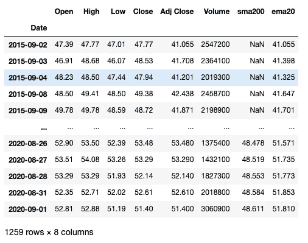**

**增加了 sma200 和 ema20**

**正如我们所看到的，通过使用 200 天的 SMA，我们在相应列的前 199 行中获得了 **NaN** 值。这只是一个练习，我们可以删除这些行来执行回溯测试。在实际操作中，我们可以考虑使用不同的指标来避免丢失大量数据。清除 *NaN* 值:**

```
df.dropna(inplace=True)df.round(3)
```

**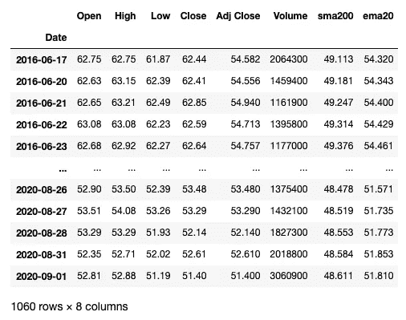**

**移除了 NaN 行**

**让我们看看图表中的数据:**

```
plot_system1(df)
```

**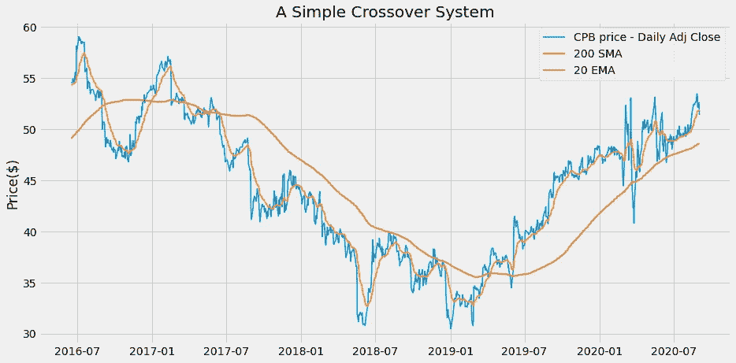**

**移动平均价格**

**为了跟踪我们在数据框中的头寸，我们添加了一列，每一行都包含有多头头寸时的数字 **1** 和没有头寸时的数字 **0** :**

```
# Our trading condition:
long_positions = np.where(df['ema20'] > df['sma200'], 1, 0)
df['Position'] = long_positionsdf.round(3)
```

**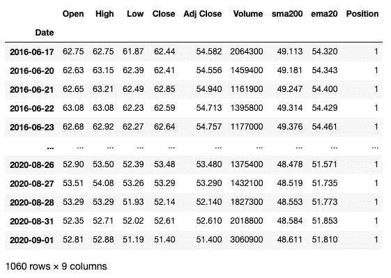**

**添加了位置列**

**无论我们试图实现什么规则，检查我们的信号**是一个好主意**以确保一切按预期工作。讨厌的错误喜欢隐藏在这种计算中:开始测试一个系统，然后发现我们没有正确地实现我们的规则，这太容易了。特别是，我们需要警惕引入任何形式的**前瞻偏差**:当我们在交易规则中包含在规则评估时实际不可用的数据时，就会出现这种情况。如果系统回溯测试产生的结果好得令人难以置信，那么前瞻偏差是最有可能的罪魁祸首。**

**我们可以通过检查数据框中的数字变量并在图表上绘制信号来检查信号。**

**要选择触发交易信号的日期:**

```
buy_signals = (df['Position'] == 1) & (df['Position'].shift(1) == 0)df.loc[buy_signals].round(3)
```

**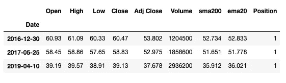**

**信号被触发时的行**

**在这种情况下，我们只有三个信号。为了确保我们正确应用交叉交易规则，我们可以在选择中包括信号之前的日子:**

```
buy_signals_prev = (df['Position'].shift(-1) == 1) & (df['Position'] == 0)df.loc[buy_signals | buy_signals_prev].round(3)
```

**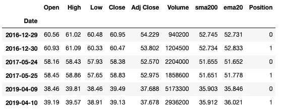**

**包括信号触发前的几天**

**到目前为止，一切看起来都很好:在信号出现之前的日子里，`ema20`在`sma200`下方，在信号出现的日子里，它在上方交叉。我们可以对退出我们头寸的信号进行类似的检查:我把这个练习留给你。**

**我们可以在图表上标出信号的标记:**

```
plot_system1_sig(df)
```

**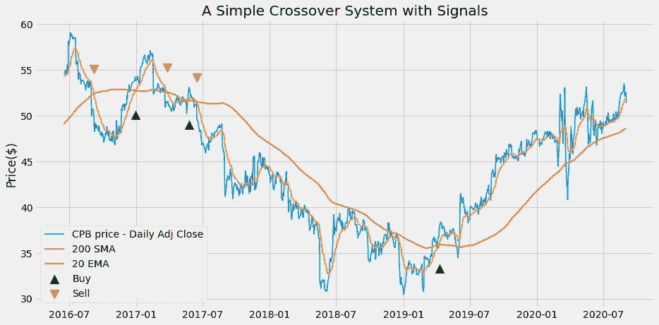**

**带信号标记的图表**

**从图表中，我们可以看到，买和卖的信号是不匹配的。第一个信号是卖出(没有买入),因为我们从系列开始时的多头头寸开始。最后一个信号是买入(没有卖出)，因为我们在系列结束时保持多头头寸。**

## **战略回报**

**我们现在可以用初始投资的百分比来计算我们策略的回报，并将其与*买入并持有*策略的回报进行比较，后者只是在期初买入我们的股票，并一直持有到期末。**

**我们将用来计算回报的价格序列是**调整收盘价格**:通过使用调整后的价格，我们可以确保在我们的计算中考虑到股息、股票分割和其他[公司行为](https://www.investopedia.com/articles/03/081303.asp)对回报的影响。**

```
# The returns of the Buy and Hold strategy:
df['Hold'] = np.log(df['Adj Close'] / df['Adj Close'].shift(1))# The returns of the Moving Average strategy:
df['Strategy'] = df['Position'].shift(1) * df['Hold']# We need to get rid of the NaN generated in the first row:
df.dropna(inplace=True)df
```

**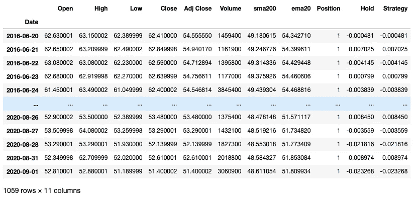**

**添加了返回列**

**整个周期的回报只是每日对数回报的总和(我将在后面解释数学原理):**

```
returns = np.exp(df[['Hold', 'Strategy']].sum()) - 1print(f"Buy and hold return: {round(returns['Hold']*100,2)}%")
print(f"Strategy return: {round(returns['Strategy']*100,2)}%")
```

**输出:**

```
Buy and hold return: -5.83%
Strategy return: 10.3%
```

**这些回报涉及 1060 天的时间。如果我们想将它们与其他时期的回报进行比较，我们需要**将它们按年计算**:**

```
n_days = len(df)# Assuming 252 trading days in a year:
ann_returns = 252 / n_days * returnsprint(f"Buy and hold annualized return: {round(ann_returns['Hold']*100,2)}%")print(f"Strategy annualized return:{round(ann_returns['Strategy']*100,2)}%")
```

**输出:**

```
Buy and hold annualized return: -1.39%
Strategy annualized return: 2.45%
```

**除非你熟悉对数回报，否则你可能想知道为什么以及如何在回报计算中使用**对数**。这里有一点数学来解释这一点，如果你听起来很陌生的话。否则，请随意跳到下一部分。**

**在定量金融学中，使用对数来计算回报是很常见的:它们使得一些计算更容易处理。如果日收益率 *R_t* 定义为:**

**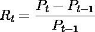**

**其中 *P_t* 是𝑡日的价格，对数收益𝑟_𝑡定义为:**

****

**通过应用一些基本代数，可以将每日日志回报计算为:**

**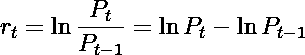**

**为什么对数回归如此方便？如果我们有一系列的日收益，我们需要计算整个周期的收益，用对数收益我们可以把它们加起来。相比之下，对于定期回报，我们需要一个乘法:**

**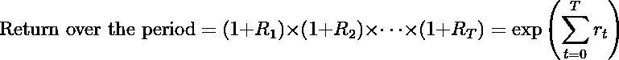**

**其中 *T* 是我们考虑的时间段的天数。计算年化回报率也变得更加容易。**

# **更复杂的策略**

**我们刚刚测试的策略只有两种可能的头寸:我们要么*多头*(持有股票)要么*空头*(仅持有现金)。尝试和测试一种增加空头头寸可能性的策略(卖出借入的股票，并在退出头寸时买回)会很有趣。为了建立这个策略的例子，我们包括两个简单的移动平均线，一个是日高点，一个是日低点。我们还添加了 15 天指数移动平均线。我们根据以下规则建立头寸:**

*   **当均线高于较高的均线时(加上 2%的偏移)，我们做多(买入)**
*   **当均线低于较低的均线时(减去 2%的偏移)，我们做空(卖空)**
*   **在所有其他情况下(均线和均线之间)，我们不参与市场**

**我将失调添加到 SMAs 中，以减少错误信号的数量。让我们准备一个新的数据框:**

```
df2 = data.copy()sma_span = 40
ema_span = 15df2['H_sma'] = df2['High'].rolling(sma_span).mean()
df2['L_sma'] = df2['Low'].rolling(sma_span).mean()
df2['C_ema'] = df2['Close'].ewm(span=ema_span).mean()df2.dropna(inplace=True)df2.round(3)
```

**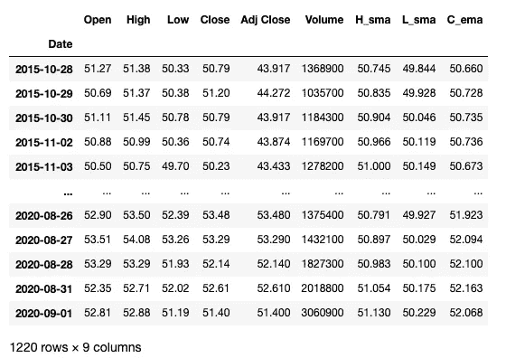**

**添加移动平均线**

**在这里，除了收盘价之外，我们还利用了最高价和最低价。为了在图表上绘制这些值，使用[**或**烛台****](/trading-toolbox-03-ohlc-charts-95b48bb9d748) **是个好主意。为此，我们将使用 **mplfinance** 库。如果您还没有这样做，您可以使用以下命令轻松安装 *mplfinance* :****

****`pip install --upgrade mplfinance`****

****为了将烛台图表与我们现有的样式相结合，我将应用 [*外部轴方法*](https://github.com/matplotlib/mplfinance/blob/master/markdown/subplots.md#external-axes-method) 的 *mplfinance* :****

```
**plot_system2(df2)**
```

****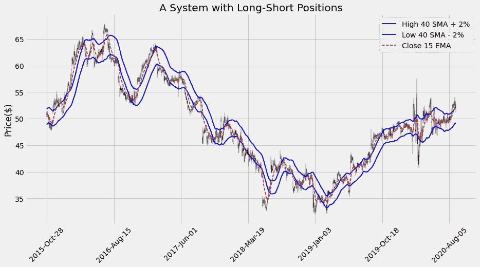****

****带移动平均线的蜡烛图****

****我们可以更详细地检查任何特定的日期范围:****

```
**plot_system2(df2['2019-07-01':'2019-12-31'])**
```

********

****日期范围详细信息****

****然后，我们应用我们的交易规则并添加头寸列:****

```
**offset = 0.02
long_positions = np.where(df2['C_ema'] > df2['H_sma']*(1+offset), 1, 0)
short_positions = np.where(df2['C_ema'] < df2['L_sma']*(1-offset), -1, 0)
df2['Position'] = long_positions + short_positionsdf2.round(3)**
```

****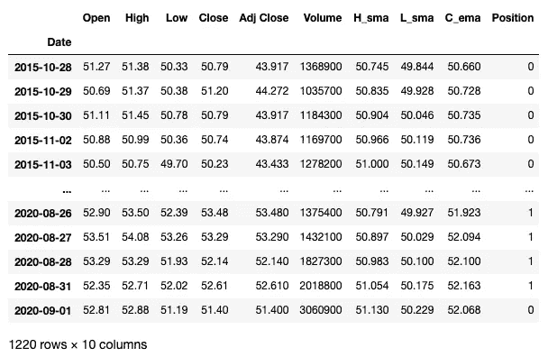****

****添加了位置列****

****我们可以在图表上标出我们的信号:****

```
**plot_system2_sig(df2)**
```

****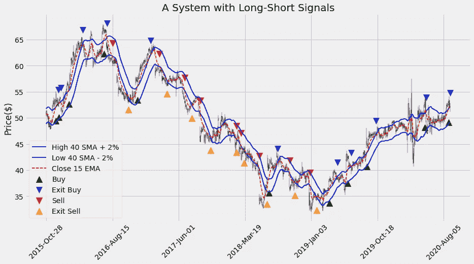****

****带信号标记的图表****

****这个系统比前一个系统有更多的信号，图表看起来很拥挤。我们可以详细查看任何日期范围:****

```
**plot_system2_sig(df2['2018-12-01':'2019-05-30'])**
```

****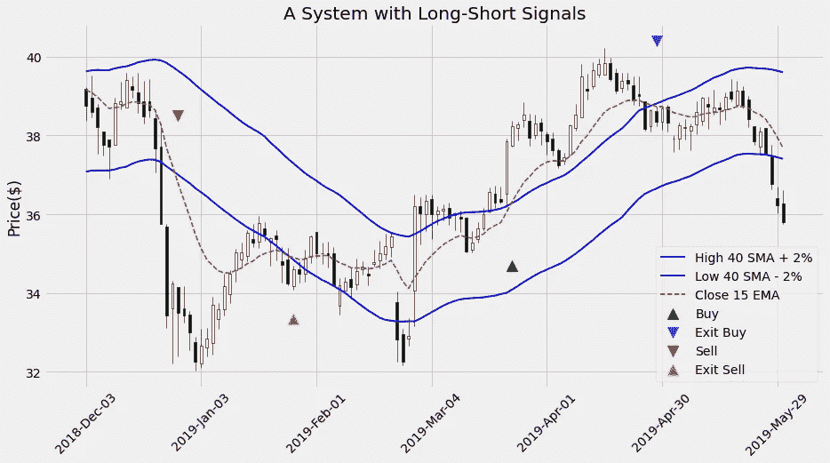****

****日期范围详细信息****

****我们应用与之前相同的计算来获得策略的回报:****

```
**# The returns of the Buy and Hold strategy:
df2['Hold'] = np.log(df2['Adj Close'] / df2['Adj Close'].shift(1))# The returns of the Moving Average strategy:
df2['Strategy'] = df2['Position'].shift(1) * df2['Hold']# We need to get rid again of the NaN generated in the first row:
df2.dropna(inplace=True)returns2 = np.exp(df2[['Hold', 'Strategy']].sum()) -1print(f"Buy and hold return: {round(returns2['Hold']*100,2)}%")
print(f"Strategy return: {round(returns2['Strategy']*100,2)}%")**
```

****输出:****

```
**Buy and hold return: 17.04%
Strategy return: -5.25%**
```

****和以前一样，我们可以按年计算回报率:****

```
**n_days2 = len(df2)# Assuming 252 trading days in a year:
ann_returns2 = 252 / n_days2 * returns2print(f"Buy and hold annualized return: {round(ann_returns2['Hold']*100,2)}%")
print(f"Strategy annualized return: {round(ann_returns2['Strategy']*100,2)}%")**
```

****输出:****

```
**Buy and hold annualized return: 3.52%
Strategy annualized return: -1.09%**
```

****在这种情况下，我们的策略实际上不如*买入并持有*策略。****

****你可能已经注意到，我使用**未调整的价格序列**来评估信号，而我一直使用调整后的价格来计算回报。每当股息、拆分或其他公司行为造成价格缺口时，使用未经调整的价格评估信号有引入错误触发的风险。在这里，我只是用了一个价格系列，这个价格系列很常见，每个人都可以免费下载。如果我们只有未调整的价格，我们应该使用所有关于公司行为的信息来修正我们的回溯测试。****

# ****结论****

****这就是我们执行回溯测试和选择可以依赖的策略所需要的吗？肯定不是:在我们的回溯测试中，我们做了(尽管是隐含的)一些假设和简化，这些假设和简化会极大地影响我们的结果。首先，我们假设一只股票可以在信号触发当天的收盘价买入。实际上，这是不能保证的:实际价格将在信号发生后一天的范围内。那么，**交易成本**就不得不包括在内了。例如:****

*   ****支付经纪费是为了执行和清算我们的订单。****
*   ****买价和卖价之间的价差是成本的一部分。****
*   ****如果我们利用杠杆买入，我们需要支付利息。同样，如果我们借入股票卖空，我们需要支付贷款利息。****

****其中一些因素比其他因素更容易理解并包含在模型中。****

****当我们想要评估一个系统的性能并将其与其他系统的性能进行比较时，给定期间的回报只是我们想要考虑的众多**性能和风险指标**中的一个。一些例子是:****

*   *****成功交易与失败交易的百分比*。****
*   ****最大[提款](https://www.investopedia.com/terms/d/drawdown.asp):我们累积利润的最高点和最低点之间的差额。****
*   ****收益的*标准差*和*夏普比率*。****
*   ****[风险/回报比](https://www.investopedia.com/terms/r/riskrewardratio.asp)，这是我们每投资一美元，从一笔交易中可以获得的预期回报。****

****我们刚刚介绍的准系统回溯测试为计算所有这些指标和构建更现实的系统提供了起点。****

****出于所有这些原因，除非我们想从零开始建立一个完整的系统，如果我们需要实际地回溯测试一个策略，最好的选择很可能是使用一个完整的解决方案，比如 *Zipline* 或 *Backtrader* 。然而，当我从头开始编写回溯测试时，我仍然不断地学习很多关于指标和策略的知识，这是我绝对推荐的练习。****