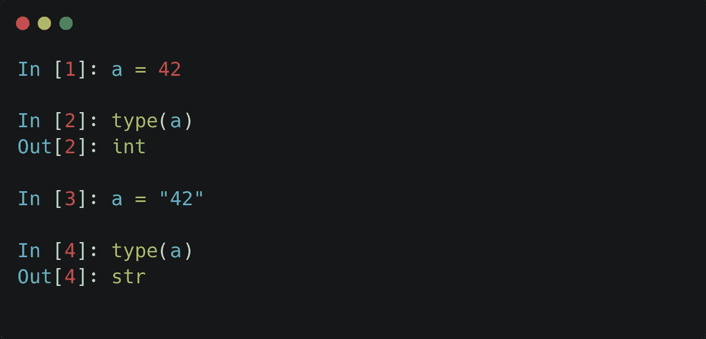
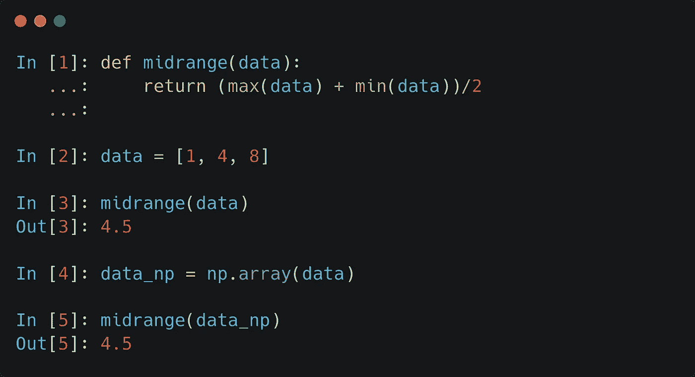
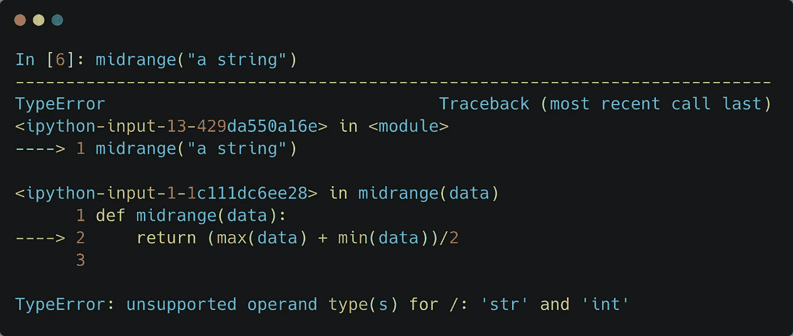
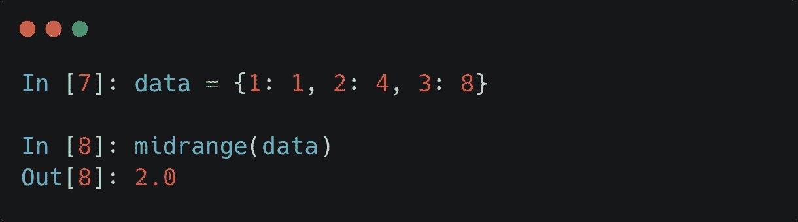
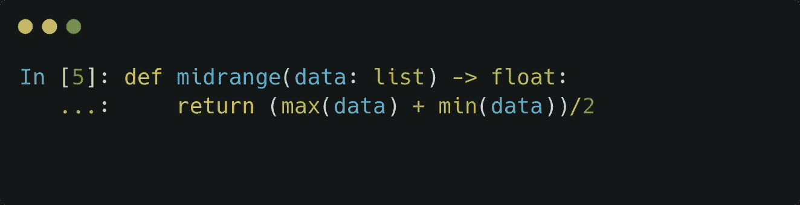
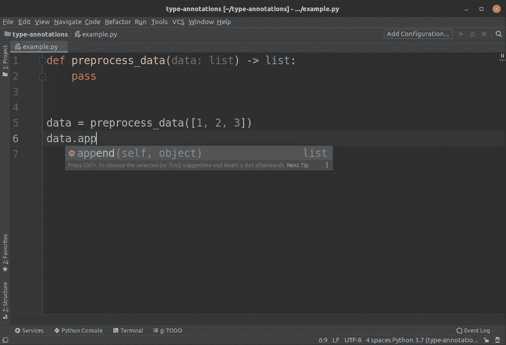
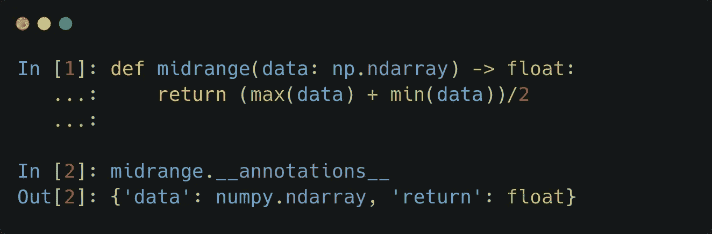
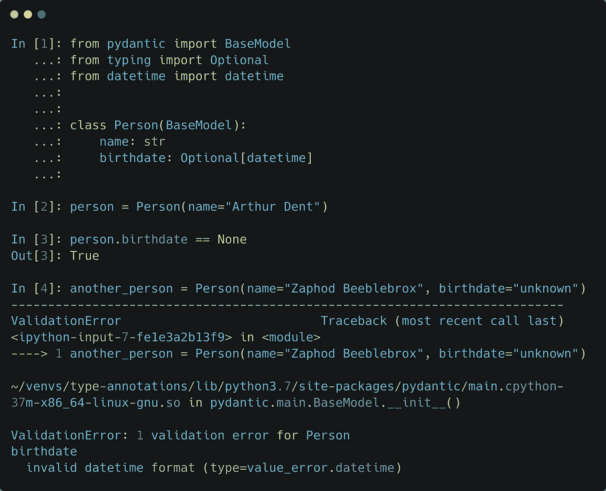

# 您应该开始在 Python 中使用类型注释

> 原文：<https://towardsdatascience.com/python-type-annotations-and-why-you-should-use-them-6f647c6b4e9c?source=collection_archive---------5----------------------->

照片由[拉杜·弗罗林](https://unsplash.com/@raduflorin?utm_source=medium&utm_medium=referral)在 [Unsplash](https://unsplash.com?utm_source=medium&utm_medium=referral) 拍摄

## 因为动态类型化，你花了多少时间调试？

我刚开始学 Python 的时候，是 C 背景。我当时没有丰富的软件开发经验，动态打字提供的自由的滋味是如此甜蜜。利用多态和鸭类型的函数允许我用很少的资源做很多事情。

后来，随着我的经验增长，我开始参与大型项目，我逐渐明白这种自由是福*而*是祸。随着贡献者的增加，代码越来越接近产品级，没有静态类型或类型检查会导致令人讨厌的意外。

这是 Python 生态系统中许多人的共同感受。然而，保持动态类型所允许的自由，但减轻其负面影响是困难的。

输入*类型注释*。

如果 Python 中有一个特性可以最大限度地增加对代码的积极影响，同时只需要最少的努力，那就是*类型注释*。它允许开发人员与解释器(以及其他开发人员)有效地交流预期的参数类型和返回值，同时保持动态类型的优势。

# Python 中的动态类型

那么，什么是动态类型呢？为了看到这一点，让我们来玩一玩。

在幕后，Python 中类似上面`a`的变量是*指针*，指向某一类型的对象。然而，指针并不局限于表示给定名称的固定类型的对象。这给了我们很大的自由。例如，函数可以接受任何类型作为参数，因为在后台会传递一个指针。

不幸的是，如果没有适当的照顾，这可能会很快出错。

## 动态类型是一把双刃剑

想想下面的例子。

这个简单的统计函数也适用于列表和 NumPy 数组！多牛逼啊！

嗯，不完全是。有很多方法可以烧伤你自己。例如，您可能会无意中传递一些东西，导致函数崩溃。如果我们用一个字符串调用函数，就会发生这种情况。

没有在字符串和整数之间定义除法运算符，因此错误。因为 Python 是一种解释型语言，所以这个问题不会出现，直到函数被错误的参数调用。这可能需要几周的运行时间。像 C 这样的语言可以在编译时间*捕捉这些错误，以免出错。*

事情可能会变得更糟。例如，让我们用*字典*调用函数。

执行成功，但是*结果错误*。当一个字典被传递时，`min`和`max`函数计算*键*的最小值和最大值，而不是我们想要的值。这种错误可能会在很长一段时间内不被发现，同时，你会觉得一切都很好。

让我们看看我们能做些什么来避免这样的问题！

# 输入函数注释和类型提示

2006 年， [PEP 3107](https://www.python.org/dev/peps/pep-3107/) 引入了*函数注释*，在 [PEP 484](https://www.python.org/dev/peps/pep-0484) 中扩展了*类型提示*。(PEP 是 Python Enhancement Proposal 的简称，是 Python 建议和讨论新语言特性的方式。)

函数注释就是*“一种向 Python 函数添加任意元数据注释的语法”*，如 PEP 3107 所述。实际情况如何？

类型可以用`argument: type = default_value`提示，返回值可以用`def function(...) -> type`提示。

这些根本不会被强制执行，并且会被解释器忽略。然而，这并不意味着它们没有惊人的用处！来说服你，看看我们能有什么收获！

## 通过代码完成加快开发速度

你有没有尝试过在记事本这样的准系统文本编辑器中开发？你必须输入所有的东西，并且时刻记住什么是什么。如果 IDE 不知道您正在使用的对象，它也帮不了您。

看看下面的例子。

PyCharm 中的自动完成

通过函数注释，IDE 知道`data`对象的类型，它是`preprocess_data`函数的返回值。因此，您得到了自动完成，这节省了大量的时间。

这也有助于使用函数。大多数情况下，定义是在一个完全不同的模块中，远离你调用它的地方。通过告诉 IDE 参数的类型，它将能够帮助您以正确的格式传递参数，而不必手动检查文档或实现。

## 代码作为文档

开发人员花在阅读代码上的时间比写代码多得多。我坚信伟大的代码是自文档化的。通过适当的结构和变量命名，很少需要注释。函数注释对此有很大贡献。只要浏览一下定义，就会发现很多关于如何使用它的信息。

## 类型检查

注释可以从函数外部访问。

这不仅对程序员有用，对程序本身也有用！在调用函数之前，如果需要，可以在运行时检查其参数的有效性。

基于 PEP 484，类型检查被带到了下一个级别。它包括`typing`模块，*“为类型注释提供标准语法，开放 Python 代码以更容易进行静态分析和重构，潜在的运行时类型检查，以及(也许，在某些上下文中)利用类型信息的代码生成”*，如 PEP 中所述。

举一个更具体的例子，`typing`模块包含`List`，所以通过使用注释`List[int]`，您可以知道该函数期望(或返回)一个整数列表。

# 更进一步:用 pydantic 进行数据验证

类型检查带来了很多机会。但是，一直手动做就没那么方便了。

如果你想要一个稳定的解决方案，你应该试试 [*pydantic*](https://pydantic-docs.helpmanual.io) ，一个数据验证库。使用它的`BaseModel`类，您可以在运行时验证数据。

您甚至可以超越这个例子，例如为 *pydantic* 模型提供定制的[验证器](https://pydantic-docs.helpmanual.io/usage/validators/)。

*pydantic* 是 FastAPI 的支柱之一，是 Python 中 web 开发框架的后起之秀。在那里， *pydantic* 可以轻松地为端点定义 JSON 模式。

如果您感兴趣，可以在下面找到这些框架的文档。(它们是很好的读物，所以我强烈推荐它们。)

 [## pydantic

### 版本文档:1.6.1 使用 python 类型注释的数据验证和设置管理。pydantic…

pydantic-docs.helpmanual.io](https://pydantic-docs.helpmanual.io/)  [## FastAPI

### FastAPI 框架，高性能，简单易学，快速编码，准备生产文档…

fastapi.tiangolo.com](https://fastapi.tiangolo.com/) 

# 结论

所以，我希望我已经说服你了。类型注释需要最小的努力，但是它们对你的代码有巨大的积极影响。它

*   让您和您的团队更容易阅读代码，
*   鼓励你心中有类型，
*   帮助识别与类型相关的问题，
*   启用正确的类型检查。

如果你还没有使用它，你应该现在就开始使用它！这是你只用少量工作就能做的最大的代码改进之一。

[***如果你喜欢把机器学习概念拆开，理解是什么让它们运转，我们有很多共同点。看看我的博客，我经常在那里发表这样的技术文章！***](https://www.tivadardanka.com/blog)