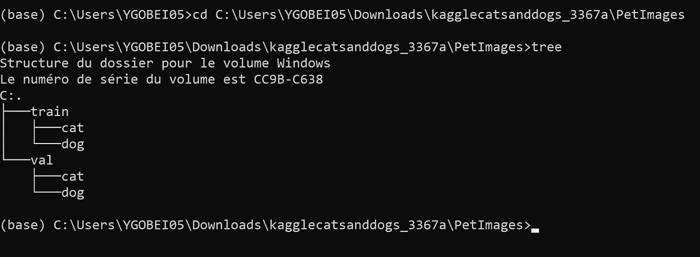

# 计算机视觉的 Python 实用函数

> 原文：<https://towardsdatascience.com/python-utility-functions-for-computer-vision-640a7302eeb0?source=collection_archive---------45----------------------->



## 如何在处理图像分类时节省一些管理图像的时间。

如果你花足够的时间使用深度学习研究计算机视觉，你会知道在管理图像时，有些代码片段会反复出现。如果你像我一样，厌倦了总是编写 python 代码来遍历数据集中按类别划分的图像列表，或者从图像构建 NumPy 数组，这篇文章将对你有用。我还将解释如何构建一个模块，该模块可以用您最常用的函数从您机器上的任何脚本中导入。

# 向 PYTHONPATH 添加模块

在描述我认为在处理图像时有用的函数之前，我想解释一下你如何能够从任何脚本中调用它们而不必重写代码。这将通过在脚本中编写您的所有函数并将该脚本的位置添加到您计算机的环境变量中来完成。更具体地说，您希望添加一个名为 PYTHONPATH 的新变量。当您导入模块时，您为此变量指定的路径将包含在 python 搜索的目录中。如果您想查看这些目录的列表，您可以在脚本或笔记本中使用以下代码

```
import sys
print(sys.path)
```

第一步是在脚本中编写所有的函数和类，包括导入。例如，让我们将这个脚本称为 myutils.py。其次，您必须将这个文件的位置添加到您的环境变量中。我并没有重新发明轮子，而是把你引向这个来源的,它详细解释了对于任何操作系统，如何做这件事。最后一步是从另一个脚本中导入新创建的模块，就像处理任何其他模块一样:

```
import myutils
myutils.some_function()
```

或者

```
from myutils import another_function
another_function()
```

请注意，在这种情况下，为您的函数编写一些文档非常重要。在导入模块时，您将无法访问代码，并且很难记住函数的确切作用和参数的含义。我不会在这里包括我的文档，只是为了避免弄乱代码，避免与文本中的解释重复。

# 要求

在直接进入函数之前，列出运行这些函数所需的包是很重要的。它们都是标准的数据科学包，应该在实用程序脚本的顶部导入。当您导入模块时，不必再次导入它们。

# 将图像加载到 NumPy 数组

我想介绍的第一个函数非常简单，但对其他函数也很有用，可以很容易地避免代码中的大量重复。代码如下

此函数用于加载图像，并使用特定的插值方法调整其大小。插值部分听起来不是很有用，但事实证明 tensorflow 和 tf.keras 在默认情况下并不使用相同的方法，因此跟踪使用了哪一种方法会变得很有用。然后，图像被转换成一个 numpy 数组，它的像素被归一化为 0 到 1 之间的值，并且增加了一个维度。这些最后的步骤是使用这些图像作为神经网络的输入所必需的。

# 将数据集拆分为定型集和验证集

所有好影像分类项目的第一步都是获取一个数据集，并将其组织到不同的文件夹中，每个文件夹对应一个类别。完成后，您会希望将这些数据分成训练集和值集，以便能够评估深度学习模型的性能。这可以通过使用 sklearn 提供的 train_test_split 函数来实现。不过，这仅适用于 numpy 阵列，但直接在您的映像上进行更永久的分割会很有用。这就是下面的函数所做的。

这个函数只是将图像的路径作为输入。这些需要放在名为“train”的目录中，其中每个文件夹代表一个类。该函数在每个类中提取一定比例的图像，由参数“split”确定，并将它们移动到一个新创建的名为“val”的目录中。

# 从图像目录创建 numpy 数据集

一旦有了数据集，通常有三种方法可以将图像输入到 tf.keras 神经网络中:作为 numpy 数组、使用 keras 生成器或使用 tfrecords。第一个选项可能很烦人，所以下面的函数会处理必要的步骤。

同样，要使用该功能，必须将图像分离到文件夹中，每个文件夹专用于一个类别。用作输入的目录示例是使用前面的函数“train_split”创建的 train 和 val。使用“load_image”将所有图像加载到 numpy 数组中，并组合成一个大数组。从文件夹的划分中也创建了一系列标签。类别按照文件夹的顺序进行编号(通常是按字母顺序)。如果“onehot”参数为 False，则每个标签就是类别的编号。如果“onehot”为真，则每个标签被转换为一个独热编码向量。

# 寻找重复的图像

有时，当您自己制作数据集时，最终会得到同一图像的多个副本。如果数据集很小，这可以手动处理，但如果有成千上万的图像，这就成问题了。这就是为什么我构建了一个类来查找重复项并删除它们。网上已经有很多这样做的脚本了。这肯定不是最好的，但我喜欢的一点是，如果你的数据已经被分割，这也没关系。即使一个图像在 train 目录中，而另一个在 val 中，也会发现重复的图像。此外，图像之间的比较是以 numpy 数组的形式进行的，因此即使它比较慢，也比使用 hash 更准确。代码如下:

这个类的唯一输入是图像所在的目录。将检查目录中的所有图像，无论它们位于哪个级别。当类被实例化时，将会创建一个字典，其中图像根据它们的大小被分开。然后，您可以使用“find_duplicates()”方法来获取出现多次的图像列表。完成后，方法“show_duplicates()”允许您可视化多次出现的图像，并且您可以使用方法“delete_duplicates()”删除这些图像。

# 将通用函数应用于图像

我想讨论的最后一个函数乍一看似乎很简单，但是非常通用，所以这个策略可以变得非常强大。这个想法是再次工作的图像是分开的文件夹根据类别。该函数遍历所有图像，并对它们应用一个通用函数。

第一个参数是图像所在目录的路径。又一个例子是训练或阀。参数“do”是您想要的任何函数，它将图像的路径作为第一个参数。*args 部分是指您想要的任何参数。使用函数时你在那里写的任何东西都将被用作函数 do 的参数。这些必须作为未命名的参数给出。如果想要指定命名参数，就必须使用*kwargs。这种区别归结为“函数(2)”和“函数(数=2)”之类的东西的区别。

我认为这里需要一个例子。假设我想打印文件名和关键字。我将定义一个函数，并将其作为“work_with_files”的参数，如下所示:

该调用的输出如下所示:

```
filename: image1.jpg
filename: image2.jpg
filename: image3.jpg
...
```

我认为这些功能很简单，但是经常使用，值得与人分享。希望有人能从我花大量时间用 python 处理图像中学到的东西中受益。如果您有任何意见或问题，请告诉我:)