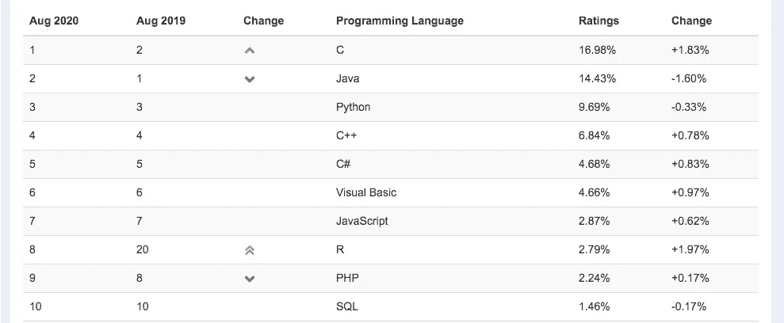

# Python vs(和)R 用于数据科学

> 原文：<https://towardsdatascience.com/python-vs-and-r-for-data-science-4a32580846a4?source=collection_archive---------23----------------------->

## 用一组预定义的因素详细比较 Python 和 R

照片由来自[佩克斯](https://www.pexels.com/photo/man-standing-infront-of-white-board-1181345/?utm_content=attributionCopyText&utm_medium=referral&utm_source=pexels)的[克里斯蒂娜·莫里洛](https://www.pexels.com/@divinetechygirl?utm_content=attributionCopyText&utm_medium=referral&utm_source=pexels)拍摄

> 当承担一个新项目时，选择正确的[编程语言](/top-programming-languages-for-ai-engineers-in-2020-33a9f16a80b0)可能是程序员经常做出的最令人生畏的决定之一。

在为数据科学项目选择编程语言时， [**Python**](https://www.python.org/) **和** [**R**](https://www.r-project.org/) 无疑是首选。多年来，R 和 Python 都从开发人员和用户那里获得了许多针对各种现代任务的积极反馈。乍一看可能很难决定两者中哪一个更好，但让我告诉你一些事情，即使它们在某些领域相似，例如**是免费和开源的**，它们都可以**提供一些独特的和改变游戏规则的功能**。

**使用 Python/R 的子社区示例:**

*   深度学习
*   机器学习
*   高级分析
*   预测分析
*   统计数字
*   勘探和数据分析
*   学术科学研究

**在这篇文章的帮助下，我们想阐明一下 Python 和 r 的区别**

# Python 和 R 简介

# ● Python

> Python 是程序员需要多大自由的一个实验。太多的自由，没人能读懂别人的代码；太少，表现力受到威胁。
> 
> 吉多·范·罗苏姆

**Python** 作为一种**高级通用编程语言**自 **1989** 以来就一直存在，它是为了强调代码可读性而构建的。Python 鼓励开发人员为各种规模的项目编写**清晰且符合逻辑的代码。Python 具有极强的可扩展性，附带了数百个库****，扩展了它的核心功能，同时它的开源特性允许开发人员自由构建和共享定制库。******

****Python 还作为数据科学 、**机器学习和深度学习**的例外[、工具，因为有几个包和库可用，例如](/best-data-science-tools-for-data-scientists-75be64144a88?source=your_stories_page---------------------------) [**TensorFlow**](https://www.tensorflow.org/) **、** [**熊猫**](https://pandas.pydata.org/) **、**[**Keras**](https://keras.io/)**、** [**NumPy**](https://numpy.org/)****

## ******优点******

****●由于其易于使用的特性，在开发人员中非常受欢迎。****

****●支持多种编程范式，如面向对象和过程化。****

****●执行时间相对较短。****

****●拥有大量第三方库。****

## ******缺点******

****● Python 可能缺少 r 中一些流行库的替代品。****

****●动态类型有时会导致难以正确跟踪故障。****

**** [## 面向数据科学的顶级 Python 库

### 面向数据科学的流行 Python 库概述

towardsdatascience.com](/top-python-libraries-for-data-science-c226dc74999b) 

# ●R

由[**Ross Ihaka**](https://en.wikipedia.org/wiki/Ross_Ihaka)**和 [**Robert Gentleman、**](https://en.wikipedia.org/wiki/Robert_Gentleman_(statistician)) R 于 1993 年首次推出，旨在将无与伦比的**统计计算和图形功能**交给开发人员、统计人员、分析师和数据挖掘人员。它有一个命令行界面。**

**当谈到数据科学时，许多研究人员仍然**更喜欢 R 而不是 Python** ，因为它具有**强大的面向统计的特性**和**交互式可视化能力**。此外，使用 R 的框架，您可以为可操作的见解创建仪表板和交互式可视化。**

**作为一种过程化语言，r 允许开发人员将问题的复杂部分分解成更小的块，从而使问题的解决更容易。**

## ****优势****

**●配备了一套强大的分析工具。**

**●有一系列用于增强其核心行为和能力的软件包。**

**RStudio IDE 和 Jupyter 等图形用户界面可以为已经强大的工具添加图形界面，同时添加更多功能，如集成帮助、代码调试器和代码完成。**

**●允许强大的数据导入选项，包括文件，如 Microsoft Excel。**

**●支持各种第三方包的扩展性。**

## ****劣势****

**● R 很难学，如果不小心使用会让事情走下坡路。**

**●某些库缺乏适当的文档会浪费开发人员的努力。**

**●比 Python 表现相对较慢。**

** [## 数据科学应该选择 R 的 6 个理由？

### 最近更新由克莱尔 d。人工智能创新的加速增长已经导致几个…

blog.digitalogy.co](https://blog.digitalogy.co/r-for-data-science/)** 

# **Python 与 R——详细比较**

**为您的下一个数据科学项目选择一种语言可能具有挑战性，尤其是当两种语言可以执行相同的任务时。既然介绍已经结束，我们将在接下来的部分中讨论这两种语言之间的比较，记住一组显著的特性，大多数开发人员会发现这些特性非常有用。**

# ****1。数据收集的差异****

**为了方便数据收集，Python 可以支持各种常用的数据格式，比如**CSV、JSON 文件，甚至 SQL 文件**。数据科学家在 Python 中广泛使用的另一个数据源是**数据集**。Python 还可以让你借助合适的库直接从互联网上提取数据。**

**尽管不像 Python 那样灵活，R 允许您通过 **Excel、CSV 和文本文件**导入数据。使用 **Minitab 或 SPSS** 等软件包构建的文件也可以转化为 r 中使用的数据框，使用[**Rvest**](https://blog.rstudio.com/2014/11/24/rvest-easy-web-scraping-with-r/)**和[**magritter**](https://cran.r-project.org/web/packages/magrittr/index.html)等软件包可以帮助你从网上刮取并清理数据。****

# ****2.**数据探索的差异******

****Python 的各种库可以帮助你非常容易地分析结构化和非结构化数据。诸如**熊猫、NumPy、** [**PyPI**](https://pypi.org/) 等库无疑是数据探索的佼佼者。 [**Pandas**](https://pandas.pydata.org/) **，**例如，允许您**将数据组织到数据框**中，使清理更简单。此外，熊猫甚至可以保存大量数据，同时提供额外的好处。****

****专为数据探索而构建的 R 提供了出色的结果，因为它是专为统计学家和数据挖掘者而构建的。使用 R，您可以应用一系列的测试和技术，比如**概率分布，对您的数据进行数据挖掘**。r 可以执行**数据优化、随机数生成、信号处理**，甚至提供对第三方库的支持。****

# ****3.**数据可视化的差异******

****使用 Python，您可以以图形和图表的形式创建**有效且可定制的可视化效果**。像 [**IPython**](https://ipython.org/) 和[**matplotlib**](https://matplotlib.org/)**这样的库的存在是为了帮助开发者和研究人员创建强大的交互式可视化。虽然 Python 生态系统包含更多的库，但最常用的是 matplotlib。******

******另一方面，R 可以提供**高级可视化**，因为它是编程语言提供的核心功能之一。r 自带了对许多标准图形的内置支持，对于更复杂的可视化，您可以使用库，如**[**gg plot 2**](https://ggplot2.tidyverse.org/)**，**[**Plotly**](https://plotly.com/)**，以及**[**Lattice**](https://cran.r-project.org/web/packages/lattice/lattice.pdf)**。**********

**** [## 你应该在 R 语言中学习的 7 种可视化

### 随着数据量的不断增加，没有可视化就不可能讲述故事。数据可视化是一种…

www.tatvic.com](https://www.tatvic.com/blog/7-visualizations-learn-r/) 

# 4.**数据建模的差异**

对于数据建模，Python 提供了几个库来满足所需的建模类型。比方说，对于**数值建模**，Python 提供了其 [**NumPy**](https://numpy.org/) 库，同样，对于科学计算**，我们有 [**SciPy**](https://www.scipy.org/) 。各种其他库和技术允许 Python 中有更多的数据建模选项。**

在 R 中，由于编程语言提供了强大的统计能力，您可以高效地进行**统计建模**。它附带了大量的支持包来帮助您进行统计建模，甚至是特定的分析，如**泊松分布、线性&逻辑回归。**

# 5.表演

性能是任何编程语言的一个关键方面，它经常成为选择一种语言而不是另一种语言的主要原因。大多数程序员甚至数据科学家开始喜欢 Python 而不是 R 的一个关键原因是，Python 能够相对容易地快速执行大多数数据科学任务。Python 胜过 R 的另一个地方是它的执行速度相对更快。其他不利于 R 的因素可能包括缺乏特性，比如单元测试和代码可读性不够。

**Python 性能提示—**

[https://wiki.python.org/moin/PythonSpeed/PerformanceTips](https://wiki.python.org/moin/PythonSpeed/PerformanceTips)

[https://stack ify . com/20-simple-python-performance-tuning-tips/](https://stackify.com/20-simple-python-performance-tuning-tips/)

 [## Python vs. Node。JS:哪个最适合你的项目？

### 使用一组预定义的因素对 Python 和 Node.js 进行详细比较

towardsdatascience.com](/python-vs-node-js-which-one-is-best-for-your-project-e98f2c63f020) 

# 6.图书馆

当谈到这些编程语言提供的包和库时，它们都为几乎每种情况提供了数千个有用的包。

[**PyPI**](https://pypi.org/) 托管和管理 Python 的包，而 R 这边的事情则由 [**CRAN**](https://cran.r-project.org/) 处理。如果你对数字更感兴趣，Python 有超过**25.7 万个包**，而 CRAN 有一点**超过 1.6 万个**。太多了！

尽管 Python 确实提供了比 R 多 10 倍的包，但并不是所有的包都对数据科学有用。在阅读这些数字时，不要忘记 Python 是一种通用编程语言，而 R 不是。

 [## 2020 年你必须使用的最好的 Python IDEs 和代码编辑器

### 具有显著特性的顶级 Python IDEs 和代码编辑器

towardsdatascience.com](/best-python-ides-and-code-editors-you-must-use-in-2020-2303a53db24) 

# 7.流行

这两种编程语言在开发人员和数据科学家中相当受欢迎，是在他们的命令下添加的好选择。Python 似乎在这方面处于领先地位，因为它的通用性质和围绕数据科学的几个库的可用性，但是 R 紧随其后。

> 根据 StackOverflow 的说法，Python 是发展最快的主要编程语言。

 [## 堆栈溢出开发者调查 2020

### 每个月，大约有 5000 万人访问 Stack Overflow 来学习、分享和建立他们的职业生涯。行业估计…

insights.stackoverflow.com](https://insights.stackoverflow.com/survey/2020#technology-most-loved-dreaded-and-wanted-languages-wanted) 

一些统计学家和数据挖掘者仍然更喜欢 R，因为它具有强大的数字处理和可视化功能。此外，R 提供了对数据分析的更好的控制，因为它倾向于统计和数值计算，并收集了库，提供了更高级和更深入的结果来证实这一说法。

> 编程语言 R 持续上升，并有望成为 TIOBE 的 2020 年编程语言。

2020 年 8 月 TIOBE 指数([来源](https://www.tiobe.com/tiobe-index/))

 [## 10 家使用 Python 的世界级公司

### Python 正被 IT 界的一些巨头积极使用

towardsdatascience.com](/10-world-class-companies-using-python-26cde24919a8) 

# 8.**工作机会**

数据科学领域的工作机会正在增加，统计数据显示**更多的工作需要 Python 而不是 R** 。由于数据科学的快速发展，现在比以往任何时候都更需要这两种编程语言。

Python 作为一种全能的编程语言，可以成为一个可靠的总体选择，因为它可以让您进行软件工程，并提供一个进入数据科学的良好切入点。然而，如果您想在短时间内提取有价值的统计数据，制作漂亮的可视化数字，并为 web 应用程序创建图形界面，R 将是更好的选择。

# 9.社区

一个社区**为开发者提供支持和指导**，可以说它是开发者**访问次数第二多的地方**，仅次于项目代码。它在**快速找到问题的根本原因和解决方案**方面具有重要价值，同时**提供了许多有用的提示。**

当我们谈到一种编程语言的社区时，首先想到的是它的目标用户。通常，它包括开发人员，但是我们的案例也包括统计人员和数据挖掘人员。Python 被各种各样的受众使用，包括各种应用程序。另一方面，r 主要由企业和主要研究统计数据的研究人员使用。

不用说，这两种编程语言都提供了一个活跃的开发人员和贡献者社区，定期为其他人和语言提供宝贵的见解。

**Python 社区—**

 [## 我们的社区

### Python 编程语言的官方主页

www.python.org](https://www.python.org/community/) 

**RStudio 社区—**

 [## RStudio 社区

### 一个面向所有 R 和 RStudio 的社区

community.rstudio.com](https://community.rstudio.com/) 

# 结论

> 这两种语言的竞争性质可能有助于我们为我们的目的产生最简单和最有效的代码。

在整篇文章中，我们讨论了 Python 和 R 之间的一些决定性因素，这些因素在选择一种编程语言时起着主导作用。我们可以得出结论，尽管这两种语言对于数据科学来说都是值得尊敬的选择，但它们仍然各有利弊。学习 Python 可以让您灵活地处理大多数以数据科学为中心的项目，而学习 R 可以让您更好地掌握数据科学中的统计学。学习这两者无疑会让您在即将到来的数据科学项目中占据上风，但我们希望让您来做最终决策。

> ***注:*** *为了消除各种各样的问题，我想提醒你一个事实，这篇文章仅代表我想分享的个人观点，你有权不同意它。*

# 更多有趣的阅读—

我希望这篇文章对你有用！下面是一些有趣的读物，希望你也喜欢

 [## 面向所有人的顶级谷歌人工智能工具

### 使用谷歌人工智能中心将想法变为现实

towardsdatascience.com](/top-google-ai-tools-for-everyone-60346ab7e08)  [## 机器学习和深度学习的最佳 Python 库

### 现代机器学习模型和项目的 Python 库

towardsdatascience.com](/best-python-libraries-for-machine-learning-and-deep-learning-b0bd40c7e8c)  [## 用于自然语言处理的 Python 库

### 用于自然语言处理的流行 python 库概述

towardsdatascience.com](/python-libraries-for-natural-language-processing-be0e5a35dd64)  [## 2020 年必读的数据科学书籍

### 看看吧，你为什么要读它们？

towardsdatascience.com](/data-science-books-you-must-read-in-2020-1f30daace1cb)  [## 2020 年必读的机器学习书籍

### 看看吧，你为什么要读它们？

towardsdatascience.com](/machine-learning-books-you-must-read-in-2020-d6e0620b34d7) 

> ***关于作者***
> 
> ***克莱尔 D*** *。在*[***digital ogy***](https://www.digitalogy.co/)***—****是一个内容制作者和营销人员。这是一个技术采购和定制匹配市场，根据全球各地的特定需求，将人们与预先筛选的&顶尖开发人员和设计师联系起来。连接****Digitalogy****on*[***Linkedin***](https://www.linkedin.com/company/digitalogy)*[***Twitter***](https://twitter.com/DigitalogyCorp)*[***insta gram***](https://www.instagram.com/digitalogycorp)*。***********