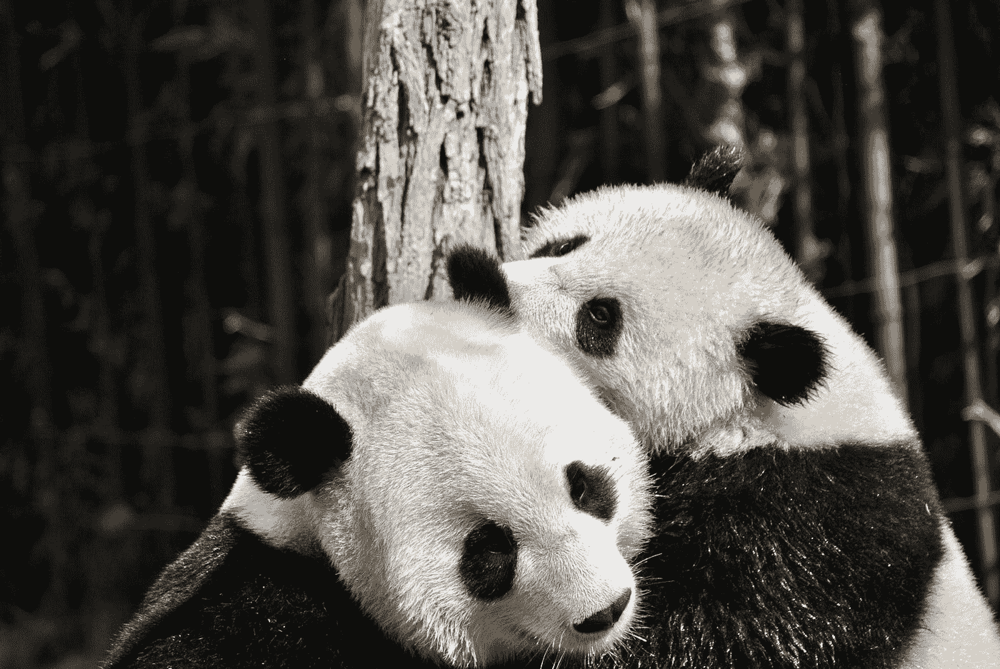

# 巨蟒大战山羊:蒙蒂霍尔重访

> 原文：<https://towardsdatascience.com/python-vs-goats-monty-hall-revisited-548f4fbe036b?source=collection_archive---------44----------------------->

## 在熊猫的帮助下！



伊洛娜·弗罗利希在 [Unsplash](https://unsplash.com?utm_source=medium&utm_medium=referral) 上的照片

## 问题是

尽管有打熊猫的照片，我们还是要在这里讨论一下[天魔堂问题](https://en.wikipedia.org/wiki/Monty_Hall_problem)。这个问题在统计学中很有名，可能已经在大学、网上或任何地方介绍了大多数统计学课程。包括我在内的大多数人从这个问题中学到的是，统计或概率思维不幸是违反直觉的，因此必须加以训练。或者换句话说:仅仅学习公式并不能让你通过这门课程。

但是现在回到实际问题:你是参加游戏节目的幸运儿。主要价格是昂贵的跑车，现在可能是电池电动的。在你和开着一辆崭新的汽车离开之间有三扇门。两扇门后是山羊，一扇门后是你的梦想之车。你如何打败山羊并得到汽车？

游戏规则是:你选择一扇门。然后，脱口秀主持人蒙蒂选择了另一扇门，打开门，门后总是一只山羊。所以其中一只山羊已经不碍事了。现在你做什么？换到第二个关闭的门或者坚持让你选择你的门的幸运感觉。我的第一直觉告诉我没关系:三扇门，一辆车有三分之一的机会。蒙蒂的行动无关紧要，他总是选择一只山羊。是吗？

## 战略

现在数学说它有，特别是考虑到一些托马斯·贝叶斯的工作。我看了不少关于这个问题的解释，也是在[媒体](https://medium.com/@adamzerner/monty-hall-problem-346bc6392b0a)上。没有一个能让我立即理解。那么为什么不试一试呢？由于没有无限数量的山羊和跑车，我选择在熊猫的帮助下模拟使用 Python。

这个问题可以很容易地分解成以下几个步骤:

1.  我们把一辆汽车藏在其中一扇门后，两只山羊藏在另外两扇门后。
2.  我们选择一扇门，由于缺乏进一步的随机信息，只是跟随我们的幸运感觉。
3.  友好的智力竞赛节目主持人蒙蒂从另外两扇门中选择一扇门，打开门，总是有一只山羊走出来。
4.  他让我们换门。我们该怎么办？
5.  我们的大门敞开了。我们要么开着一辆崭新的汽车驶向夕阳，要么不得不接纳一只新宠物。

步骤 4 中只有一个决策点。在这一步中，我们将通过定义三个场景并模拟所有三个场景来帮助我们的 Python:

*   **场景 A** :常变。
*   **场景 N** :永远不变，坚持那种幸运的感觉。
*   **场景 S** :有时会改变，因为缺乏对问题的更好理解，两个未打开的门之间有 50:50 的几率。

在什么情况下我们可以打败山羊？

## 解决方案

显然，我们在这里谈论的是概率。所以不幸的是，数学和 Python 都不能帮助幸运的智力竞赛节目嘉宾总是得到跑车。但是 Python 可以帮助我们获得概率，并真正相信它们。数学至少对我来说总是有困难。我将在这里解释一下代码。

目标是使代码尽可能地可读和可理解，并为此牺牲内存和性能的效率。所以你将能够找到更简洁有效的问题模拟。我们首先用熊猫数据框架来模拟蒙蒂霍尔问题。注意 number_games 是一个整数，它定义了我们想要玩的游戏的数量。

```
all_games = pd.DataFrame(index=range(0, number_games), 
                         columns=['Door_A', 'Door_B', 'Door_C',
                            'Choice_1', 'Choice_Monty', 
                            'Choice_A', 'Choice_N', 'Choice_S',
                            'Success_A', 'Success_N', 'Success_S'])for game_idx in all_games.index:
    # we put goats behind all doors
    all_games.loc[game_idx, ["Door_A", "Door_B", "Door_C"]] = 
                            ["Goat", "Goat", "Goat"]
    # oops, we forgot the car
    all_games.loc[game_idx, random.choice(["Door_A", "Door_B", "Door_C"])] = "Car"
    # the first choice is purely random
    all_games.loc[game_idx, "Choice_1"] = random.choice(["Door_A", "Door_B", "Door_C"])
```

如果你看一下生成的熊猫数据帧，你会发现在所有的游戏中，我们在门 A 到 C 中的一个门后面藏了一辆汽车，在另外两个门后面藏了两只山羊。我们已经选了一扇门。下一步是蒙蒂的选择，这就是奇迹发生的地方。他的选择绝非随意。

```
for game_idx in all_games.index:
    game = all_games.iloc[game_idx]
    # Monty will not open the door we chose
    monty_choices = {"Door_A", "Door_B", "Door_C"} - {game["Choice_1"]}
    monty_choices = list(monty_choices)
    # Monty will not open the door with the car
    if(game[monty_choices[0]] == "Car"):
        monty_choice = monty_choices[1]
    elif(game[monty_choices[1]] == "Car"):
        monty_choice = monty_choices[0]
    else:
        monty_choice = random.choice(monty_choices)
    # We store Monty's choice
    all_games.loc[game_idx, "Choice_Monty"] = monty_choice
```

在 Monty 做出选择后，我们应用了上面定义的三个策略:A 代表总是改变，N 代表从不改变，S 代表有时以 50:50 的概率改变。

```
# never change
all_games["Choice_N"] = all_games["Choice_1"]for game_idx in all_games.index:
    game = all_games.iloc[game_idx]
    # always change
    all_games["Choice_A"][game_idx] = ({"Door_A", "Door_B", "Door_C"} - {game["Choice_1"], game["Choice_Monty"]}).pop()
    # sometimes change
    all_games["Choice_S"][game_idx] = random.choice(list({"Door_A", "Door_B", "Door_C"} - {game["Choice_Monty"]}))
```

即使您不是 Python 爱好者，代码也应该是可读的。在总是变化的情况下，我们需要 *pop()* 从集合中获取唯一剩余的元素。最后一步是给我们的场景打分，如果我们真的有车，就给 1 分；如果我们的家里又多了一只有点难闻的四条腿，就给 0 分。我将把这个留给读者，或者你可以在我的 [GitHub](https://github.com/Nop287/python_vs_goats) 上获得源代码。

一旦我们对模拟评分，我们可以简单地在数据帧上使用 *describe()* 来获得结果。在我运行的 10，000 个游戏中，我得到了以下值:

*   场景 A:如果我们总是改变，获得汽车的概率为 0.6659。
*   场景 N: 0.3341 概率如果我们从不改变，
*   情景 S: 0.4980 概率如果我们有时改变。

## 摘要

查看我们代码的结果，我们可以看到，场景 A 总是切换车门，这让我们有三分之二的概率得到跑车。所以从长远来看，3 次中有 2 次我们会得到一辆车，而不是一只没用的山羊。为什么会这样呢？

我们坚持三扇门的情况，没有先前的信息，三分之一的机会。但是蒙蒂给我们看了一扇有山羊的门。所以他把这个问题转化为一个双门 50:50 机会得到汽车的问题。这反映在场景 S 中，有时会更换门。

但是在场景 A 中还有第三种选择，那就是永远改变。在我们的选择中，我们将车门分成两组:我们的车门有三分之一的机会挡住汽车，另外两个车门有三分之二的机会挡住汽车。因此，我们的选择正是通过这种划分来添加信息。

现在蒙蒂只用三分之二的机会看着两扇门的隔板。经过蒙蒂的选择，我们可以肯定的是，如果汽车一开始就在那里，那扇未打开的门就藏着汽车。所以我们总是选择那扇门，继承了三分之二的概率。

还是难以理解？是的，我同意。但是看看模拟给我们的数字。用 Python 模拟帮助我打败了山羊，并对问题有了更好的理解。希望它也能为你做同样的事情！只需获得[代码](https://github.com/Nop287/python_vs_goats)，然后自己尝试一万次。这会给你一个合理准确的概率估计。有多精确？为此我不得不回到我的统计学课程上。