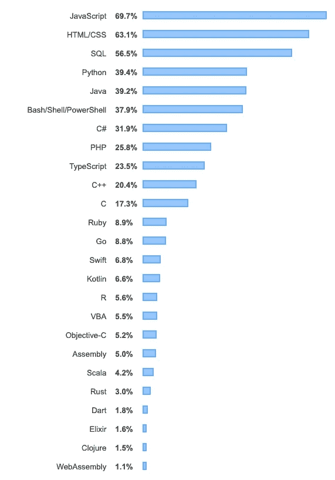
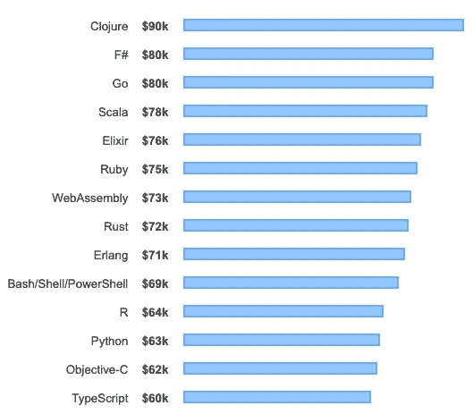
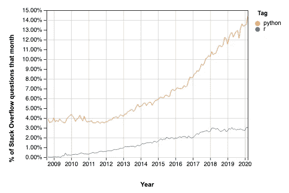
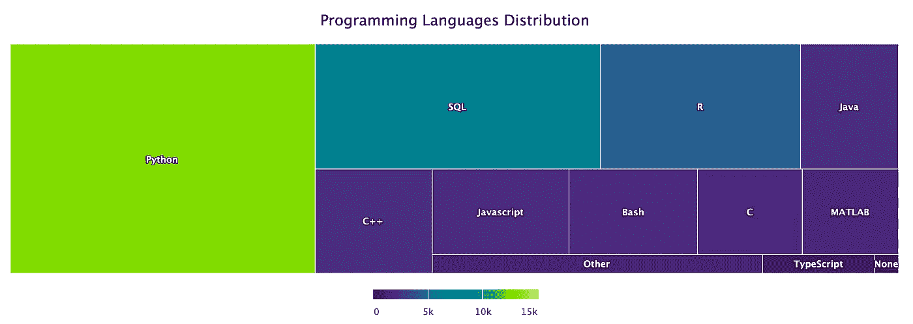

# Python 与 R 在数据科学中的对比

> 原文：<https://towardsdatascience.com/python-vs-r-for-data-science-6a83e4541000?source=collection_archive---------16----------------------->

## 两大语言的特点、群体和行业地位的比较分析。

[张杰瑞](https://unsplash.com/@z734923105?utm_source=unsplash&utm_medium=referral&utm_content=creditCopyText)在 [Unsplash](https://unsplash.com/s/photos/mountain?utm_source=unsplash&utm_medium=referral&utm_content=creditCopyText) 上拍照

Python 和 R 的比较多年来一直是业界的热门话题。r 已经存在了二十多年，专门用于统计计算和图形，而 Python 是一种通用编程语言，与数据科学和统计学一起有许多用途。许多初学者都有同样的问题:我应该从这两种伟大的语言中选择哪一种来开始学习数据科学？

# 计算机编程语言

Python 于 1991 年发布，作为一门**极其简单的**语言，它让你可以做**几乎任何你能想象到的事情**，它已经为自己建立了强大的声誉。它为**网站**、**后端服务**、**本机桌面应用程序、图像处理系统、机器学习管道、数据转换系统**等提供支持，并且它以语言的简单性而闻名，这使得它成为任何人最容易开始使用的编程语言之一。

这种语言的主要优点是:

*   它的语法**与本土英语**非常相似，如此相似以至于大多数写得好的脚本大声读起来都有意义。
*   它有一个巨大的社区围绕着它；对于你遇到的任何问题，可能有成百上千的人在网上问了同样的问题并得到了答案。
*   它为你能想到的任何应用程序提供了大量的第三方模块和库。
*   围绕这种语言有一个**非常大的数据科学社区**，这意味着有许多工具和库可以解决数据科学问题。
*   它既支持**面向对象编程**又支持**过程编程**范例，让您根据自己的需要自由选择。

得益于这些优势，Python 成为业界最流行的语言之一也就不足为奇了。据 Ncube 报道，谷歌、Dropbox、网飞、Stripe 和 Instagram 等大型科技公司也使用这种方法。

# r 项目

R Project 是一个 GNU 项目，由 R 语言、运行时和用它们构建应用的实用程序组成， **R 是在这个环境**中使用的解释语言。这种语言专门围绕**统计计算和图形**，这意味着它直接适合许多数据科学问题，而**通过内置工具和围绕它的第三方库简化了数据科学项目**。

R 语言的优势是:

*   它有许多专门用于数据操作的库和工具。这种语言和这些工具允许你容易地修改你的数据结构，将它们转换成更有效的结构，或者为你的特定用例清理它们。
*   有很多**非常流行的包和库**，比如 [tidyverse](https://www.tidyverse.org/) 负责端到端的数据操作和可视化。这些库允许您轻松开始数据科学任务，而无需从头开始编写所有算法。
*   它有一个设计非常好的 IDE，叫做 RStudio。与语言本身集成，RStudio 提供了**语法高亮、代码完成、集成帮助、文档、数据可视化和调试器**，允许您在不离开屏幕的情况下开发 R 项目。
*   R 背后的团队一直**非常专注于**确保这些工具能够在所有平台上工作，由于这些努力 **R 可以在 Windows、macOS 和 Unix 类操作系统上运行**。
*   它拥有围绕构建基于网络的仪表盘进行数据分析和可视化的工具，比如 [Shiny](https://shiny.rstudio.com/) 允许直接从 r

除了这些优点及其在数据科学社区中的广泛使用，R 在数据科学项目中是 Python 的有力替代。

# 比较:Python 与 R

由于两种语言在理论上提供了相似的优势，其他因素可能会影响选择哪种语言的决定。

## 流行

**这两种语言在数据科学界都很流行**；然而，当谈到选择一种语言添加到您的工具链和经验中时，选择一种在行业中受欢迎的语言可能是有意义的，并且可能允许您过渡到您专业领域内的不同职位。

根据 [Stack Overflow 的 2019 年开发者调查](https://insights.stackoverflow.com/survey/2019#technology)， **Python 是 72525 名专业开发者中第 4 受欢迎的编程语言**，最近甚至比 Java 还受欢迎。在同一次调查中， **R 位于第 16 位。**

Stack Overflow 2019 在专业开发者中的开发者调查结果

关于这些调查结果，需要记住的一点是，它们代表了栈溢出的开发人员社区，**显然，这些数据并不特定于数据科学家**；然而，这可能有助于更好地了解该行业的现状。

在同一个调查中查看全球范围内的工资，在 55，639 名参与者中，Python 和 R 似乎都站在同一点，R 的平均水平略高。

根据 [Stack Overflow 2019 开发者调查](https://insights.stackoverflow.com/survey/2019#technology)的工资语言

除了调查结果，通过查看堆栈溢出趋势可以看出，就提问的问题数量而言， **Python 比 R** 更受欢迎。

[堆栈溢出趋势](https://insights.stackoverflow.com/trends?tags=r%2Cpython)

通过查看这些数据，在整个开发者社区中，Python 似乎比 R 更受欢迎；然而，重要的是要记住 **Python 是一种通用编程语言，而 R 是专门用于统计计算的**，这意味着这种比较在数据科学家中的受欢迎程度并不相同。

为了更好地了解数据科学，我们可以看看 [2019 年 Kaggle 用户调查](/kaggle-user-survey-2019-326e187ff207)。事实上，他们在仪表盘上有一个专门的页面，是关于 Python 和 R T21 的。

根据 2019 年 Kaggle 用户调查，编程语言分布情况

正如在 Kaggle 数据中所看到的，在数据科学社区中，Python 比 R 有更大的用途，尽管这两种语言在用法上都有重要的地位。

## 图书馆

谈到数据科学，第三方库的可用性对于帮助您轻松入门非常重要。这两种语言周围都有非常活跃的社区，以及值得一看的丰富的软件包生态系统。

**Python**

*   **NumPy:** [Numpy](https://numpy.org/) 是在**数组数据结构**之上实现各种**数据操纵**操作的基础包。它包含这些数据结构的**高效**实现，以及用于许多统计计算任务的**通用功能**，由于其高效的基础，它允许**加速许多复杂任务**。
*   **Pandas:**[Pandas](https://pandas.pydata.org/)是一个强大且易于使用的开源库，用于**表格数据操作**任务。它包含**高效的数据结构**，非常适合直观地处理带标签的数据。
*   **Matplotlib:**[Matplotlib](https://matplotlib.org/)是一个用于创建静态或交互式**数据可视化**的库。由于它的简单性，您可以用几行 Python 代码创建非常详细的图形。
*   **Scikit-learn:** 作为 Python 生态系统中最受欢迎的库之一， [scikit-learn](https://scikit-learn.org/stable/) 包含基于 Numpy、Pandas 和 Scipy 构建的工具，这些工具专注于各种**机器学习**任务，例如**分类、回归和聚类**。
*   **Tensorflow:** 最初由 Google 开发并开源， [Tensorflow](https://scikit-learn.org/stable/) 是一个非常受欢迎的开源库，用于开发和训练**机器学习和深度学习**模型。

**R**

*   **Dplyr:** [Dplyr](https://www.rdocumentation.org/packages/dplyr/versions/0.7.8) 是一个用于在内存中和内存外轻松处理**表格数据**的库。
*   Ggplot2: [Ggplot2](https://ggplot2.tidyverse.org/) 是一个专注于**的库，它以《图形的语法一书为基础，以声明方式构建数据可视化**。
*   **data.table** :类似于 dplyr， [data.table](https://cran.r-project.org/web/packages/data.table/vignettes/datatable-intro.html) 是一个为**数据操作**设计的包，具有表达性语法。它实现了**高效的数据过滤、选择和整形**选项，使您能够在将数据输入模型之前以所需的形状获取数据。
*   **tidy verse:**[tidy verse](https://www.tidyverse.org)是为数据科学设计的 R 包**的集合。它包括许多流行的库，仅举几个例子: [ggplot2](https://ggplot2.tidyverse.org/) 用于数据可视化， [dplyr](https://dplyr.tidyverse.org/) 用于直观的数据操作，以及 [readr](https://readr.tidyverse.org/) 用于从各种来源读取矩形数据。**
*   Shiny: [Shiny](https://shiny.rstudio.com/) 是一个允许你从 R 构建**高度交互的网页的包，它使构建仪表板变得轻而易举。**
*   **Caret:** [Caret](http://topepo.github.io/caret/index.html) 是专门用于**预测模型和机器学习**以及数据操作和预处理的工具和函数的集合。

看看库的数量和这些包的功能，似乎两种语言都有相似的包来简化许多数据科学任务。总而言之，对于许多任务来说，当一个任务在 Python 中可行时，它在 R 中也是可行的，并且需要非常相似的努力。

## 结论

尽管它们似乎提供了不同的东西，但这两种语言都有优缺点，需要仔细了解需求。

*   如果你想从总体上进入编程领域，并寻找可以在软件开发的其他领域使用的东西，比如 T2、web 开发，那么 T4、Python、T7 是一种通用编程语言，T8 似乎是一个更好的选择。
*   如果你熟悉**其他科学编程语言**，比如 **MATLAB** ，**你可能会更容易学习 R** 并利用它提高效率。这些语言之间有许多相似之处，特别是向量运算和关于矩阵运算的一般思维模式，而不是过程方法。
*   如果你需要做特别的分析，并偶尔与其他数据科学家/技术人员分享，使用 **Python** 和[**Jupyter Notebooks**](https://www.saturncloud.io/s/best-practices-for-jupyter-notebooks)可能会很好。如果您正在寻找为非技术利益相关者和内部使用构建快速仪表板的方法，那么利用 **R** 和令人惊叹的 [**闪亮的**](https://shiny.rstudio.com/) 库可能是个好主意。
*   如果您需要**开发 API**来公开您的模型，或者您需要**其他软件来与您的模型进行交互**，那么投资于 **Python** 可能会对您有所帮助，因为它拥有围绕各种编程任务的巨大工具。你可以**用一个非常简单的 API** 用 [Flask](https://flask.palletsprojects.com/en/1.1.x/) 或 [FastAPI](https://github.com/tiangolo/fastapi) 来暴露你的模型，或者你可以用 [Django](https://www.djangoproject.com/) 来构建成熟的**生产就绪的 web 应用程序**。
*   如果你想把所有的软件包都放在手边，主要关注于你的分析**来做决策**，并寻找**最简单的设置**来开始， **R 可能是那里的首选工具**。由于有了 **RStudio** 及其集成功能，无需离开窗口即可轻松从原始数据转换到可视化分析。**尽管 Python 也很容易上手**并且默认安装在许多系统**中**，但多年来，它已经发展成不同的版本和不同的设置，因此，在您的计算机上建立一个功能良好的数据科学堆栈非常重要。

就像任何其他问题一样，解决方案主要**取决于问题的需求**并且**除了“*这取决于*”之外，这个问题没有正确的答案**。**这两种语言都非常强大**，无论你将时间投入到哪一种语言中，如果你正在长期寻找数据科学的职业生涯，**没有错误的答案**；学习这两种语言中的任何一种都会在未来给你带来好处，因此，不要陷入分析瘫痪，只需选择一种，继续你的工作。众所周知，**这两种语言都能够处理大多数数据科学问题**，剩下的归结为**方法学**、团队的**能力**和手头的资源，它们大多独立于语言。

既然你已经设法读到这里，这里有一张可爱的浣熊的照片给你，保重。

照片由[加里·本迪格](https://unsplash.com/@kris_ricepees?utm_source=unsplash&utm_medium=referral&utm_content=creditCopyText)在 [Unsplash](https://unsplash.com/s/photos/cute?utm_source=unsplash&utm_medium=referral&utm_content=creditCopyText) 上拍摄