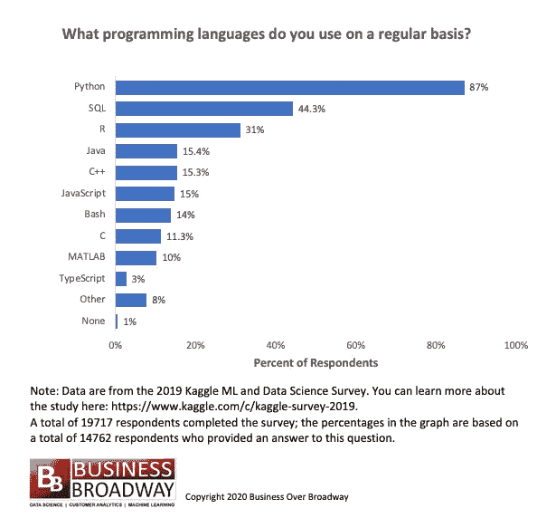
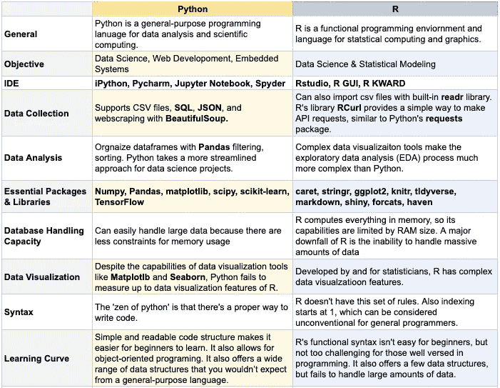

# Python vs R:基础知识

> 原文：<https://towardsdatascience.com/python-vs-r-the-basics-d754c45c1596?source=collection_archive---------37----------------------->

## 一位有抱负的数据科学家关于在两种流行语言中做出选择的指南。


[【图片信用】](https://unsplash.com/@cdr6934)

大多数数据科学家将 Python 或 R 称为他们的“首选”编程语言。两者都有庞大的软件生态系统和社区，所以两种语言都适合几乎任何数据科学任务。

所以问题来了，一个有抱负的数据科学家应该先学哪种语言？长话短说，答案通常是 Python。然而，在潜水之前，每种语言都有自己的优缺点。

此外，值得注意的是，Python 和 R 并不是唯一可用于数据科学的编程语言或工具。其他一些包括 Scala、SAS、Julia、MATLAB 等等。

# Python 是什么？

Python 是一种面向对象的高级编程语言，语法简单易学。它于 1991 年推出。Python 3.0 的 2008 修订版使得许多基于 Python 2 的旧库不再向前兼容。大多数数据科学工作现在可以通过五个主要的库来完成: **Numpy，Pandas，Scipy，Scikit-learn** 和 **Seaborn** 。

Python 的主要优势是大规模的机器学习的植入。此外，它使可复制性和可访问性变得容易。如果您需要在应用程序或网站中使用您的分析结果，Python 是最佳选择。

# R 是什么？

r 是一种用于统计计算和图形的编程语言和环境。r 基于 1976 年推出的 S。所以 R 有时候可以认为是过时的。然而，每天都有新的包被开发出来，使得这种语言能够赶上更“现代”的 Python。

R 与其他统计产品的最大区别是输出。r 有先进的工具来交流结果。例如， **Rstudio** 附带了库 **ggplot2** ，这是一个可视化工具，可以生成盒状图、小提琴图、点状图、带状图等等。

# 数据科学家用的最多的语言是什么？



[我[法师信用](http://businessoverbroadway.com/2020/06/29/usage-of-programming-languages-by-data-scientists-python-grows-while-r-weakens/#:~:text=Most%20Popular%20Programming%20Languages,-The%20survey%20included&text=As%20seen%20in%20Figure%201,%2C%20C%2C%20MATLAB%20and%20TypeScript.)

如果你是这个领域的新手，很难知道是使用 Python 还是 r。然而，对于数据科学来说，没有“正确的”编程语言。一种语言并不比另一种更好——这完全取决于您的用例以及您试图回答的问题。

从 Kaggle 在 2019 年的研究中，很明显 Python 是目前数据科学的领先编程语言。SQL 是一种为关系数据库管理设计的语言，排在第二位。但是，在进行数据分析时，它可能会受到限制。由于 R 语言广泛的统计能力，它排在第三位。

# **Python vs R**



[图片由作者提供]

这张图表远非详尽无遗，专家们对哪种语言是“高级”语言争论不休。但是最后，Python 程序员和 R 程序员经常互相借鉴很棒的想法。比如 Python 的 **plotnine** 数据可视化包，灵感来源于 R 的 **ggplot2** 包。而 R 的 **rvest** 网页抓取包的灵感来源于 Python 的 **BeautfiulSoup** 包。

同样值得注意的是 Python 和 R 之间的互操作性。您可以使用 **rpy2** 包从 Python 运行 R 代码。您可以使用 **reticulate** 从 R 运行 Python 代码。这意味着一种语言中的所有特性都可以从另一种语言中访问。

# 语法上的差异

Python 的“禅”在于有一种合适的方式来编写任何东西。r 没有这一套约定，所以对于初学者来说，编程可能不太结构化，也很难学。让我们来看四个基本的例子，看看它们的异同。

## **变量:**

我们已经知道，我们可以用' = '操作符在 Python 中给一个变量赋值。

```
python_apples = 3
```

在 R 中，我们必须使用一个箭头操作符来给变量赋值。

```
r_apples <- 3
```

## **列表**:

类似地，Python 中的列表可以赋给变量，括号内可以是任何数据类型。这些列表可以用元素的索引号进行索引，从 0 开始。

```
python_list = [1, 'two', 3.0]
python_list[1]
> 'two'
```

R 中的列表有点不同。它们被括在括号中，每个元素都有一个名称。这些元素可以用“$name”进行索引，但也可以用元素位置进行索引。请注意，R 中的索引从 1 开始，而不是通常的 0。

```
r_list <- list(num=42, greeting='Hello')
r_list$greeting
> 'Hello'
```

## **矢量**:

Python 向量只是数字数组。我们可以使用 NumPy 执行算术和附加操作，例如标量乘法和点积。

```
python_vec = [10,20,30,40,50]
```

在 R 中，我们用' c()'而不是括号来包装向量，每个元素都可以通过索引来访问。可以通过给向量赋值“空”来删除向量。

```
r_vec <- c(10,20,30,40,50)
```

## **导入 CSV 文件:**

对于 Python，我们必须导入流行的 **pandas** 库来访问数据帧。一般来说，Python 严重依赖库来执行特定的任务。

```
import pandas as pd
df = pd.read_csv('file_name.csv')
```

r 内置了 **readr** 库函数，优点是速度更快，数据类型解释一致。

```
library(readr)
r_df <- read_csv('file_name.csv')
```

这些只是 Python 和 r 中不同语法的基本例子。当你更深入地使用矩阵、数据帧和其他数据结构时，事情显然会变得复杂得多。尤其是 r。

但是从表面上看，每种语言的语法都有很多相似之处。例如，两种语言都使用“#”来注释。此外，单引号和双引号在两种语言中可以互换。

# 哪种语言最适合数据科学初学者？

对于初学者，建议使用 Python，因为这种语言的语法“可读”。它也比 R，甚至其他编程语言更有表现力，更简洁。

最终，Python 似乎是当今数据科学家最广泛使用的编程语言。它允许集成 SQL、TensorFlow 和许多其他用于数据科学和机器学习的有用函数和库。拥有超过 70，000 个 Python 库，可能性是无限的。

也就是说，数据科学家(或者一般的程序员)不应该局限于一种语言。在一个项目中结合两个领先的软件生态系统来获得一组独特的互补功能是可能的。

虽然 Python 和 R 都是数据科学的绝佳选择，但员工背景、您从事的项目以及您所在行业的文化等因素会影响您的偏好。我鼓励所有有抱负的数据科学家对这两种语言保持开放的心态。在学习 Python 时，请留意 R 可以派上用场的例子。