# Python vs R:如何使用 Shiny &机器学习分析 4000 份招聘广告

> 原文：<https://towardsdatascience.com/python-vs-r-what-i-learned-from-4-000-job-advertisements-ab41661b7f28?source=collection_archive---------26----------------------->

来源: [iStockphoto](https://www.istockphoto.com/gb)

## 一个带有源代码的端到端 ML 系统

作为一名 10 多年的承包商，我总是盯着招聘信息板，问自己

*   有多少角色符合我的技能组合？
*   这些角色工资多少？
*   什么技能是需要的？
*   我应该把学习的重点放在哪里？

2018 年 KDnuggets 发布了文章[“Python 蚕食 R:2018 年用于分析、数据科学、机器学习的顶级软件:趋势和分析](https://www.kdnuggets.com/2018/05/poll-tools-analytics-data-science-machine-learning-results.html)”。在我的职业生涯中，我已经转换过一次语言——也许是时候把 Python 加入进来了？

我发现自己在查看招聘信息。每一个。单身。日。

这种方法有两个问题。

*   这不太科学。
*   我想更谨慎地使用技术，减少我的屏幕时间。

因此，我在 [JobServe](https://www.jobserve.com/) 上建立了一个搜索“数据科学家”的网页抓取器。我安排这每天发生，处理数据(删除重复，特征工程，可视化，模型)并将输出发送到一个闪亮的应用程序，该程序可在[https://apps.statcore.co.uk/trends-in-data-science/](https://apps.statcore.co.uk/trends-in-data-science/)获得

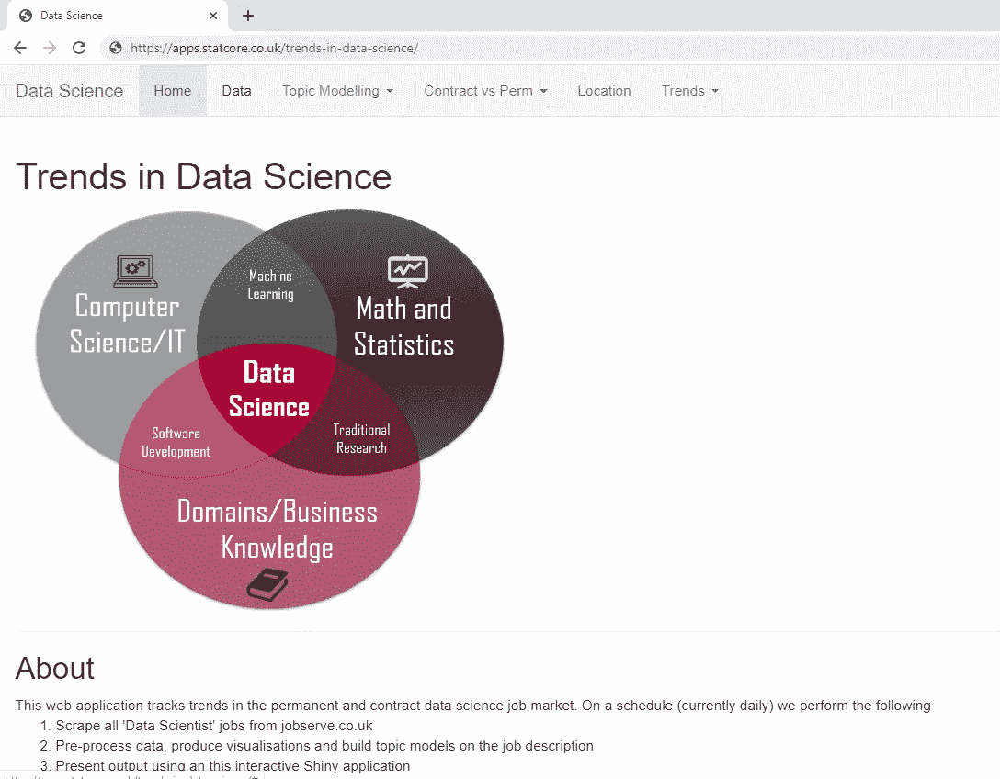

[追踪数据科学趋势的闪亮应用](https://apps.statcore.co.uk/trends-in-data-science/)

在编写这个应用程序时，它有 4000 份工作的数据，并允许我

*   对古老的 Python vs R 问题做出数据驱动的决策。
*   使用应用于职位描述的主题建模来确定需求技能。

*该项目的完整源代码和 docker 图片可以在*[*https://github.com/tonyjward/trends-in-data-science*](https://github.com/tonyjward/trends-in-data-science)*和*[*https://hub.docker.com/r/tonyjward/trends-in-data-science*](https://hub.docker.com/r/tonyjward/trends-in-data-science)找到

我是这样做的。

# 数据收集

在 JobServe 上搜索“数据科学家”,目前会给出 35 个结果，并提供大量我们想要捕捉的有趣信息。

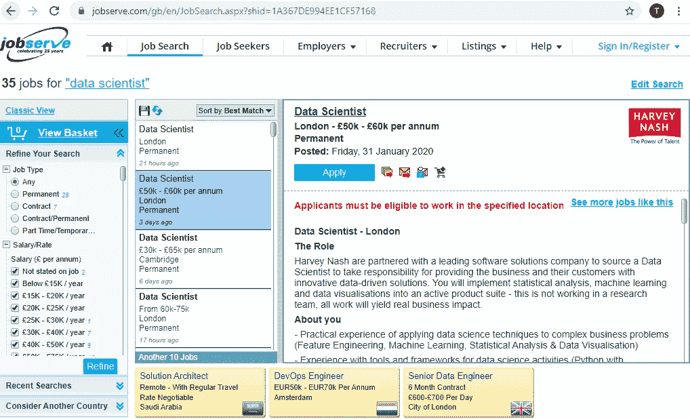

在 JobServe 上搜索“数据科学家”

不幸的是，由于网站动态显示内容，并不是所有的搜索结果都能立即看到。用户首先必须从边栏中选择一个作业，然后边栏会更新包含作业详细信息的主面板。这使得 web 抓取变得复杂，因为我们不能简单地抓取和解析 html——这样做只会返回当前所选作业的数据。

## 硒

因此，我们使用 Selenium——一种自动化的网络浏览器——我们指示它像人类一样与网页进行交互，即在框中输入文本，按 return 键，使用 down 键浏览搜索结果并保存结果。

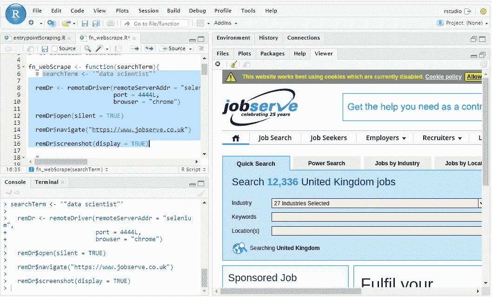

用硒酸盐刮 Jobserve

# 特征工程

工资信息是以自由格式文本的形式提供的，其中包含一些需要处理的奇怪和不一致的地方。

*问题:提供的薪资范围(****50k—70k****)
解决方法:取最大值*

*问题:单位不一致(* ***50k 对 50000****)
解决方法:如果字符数大于 4，则除以 1000*

*问题:非常大的薪水(* ***每年 60k—900k****)
解决方法:将所有超过 3300k 的薪水除以 100，将所有超过 3300k 的薪水除以 10。*

*问题:奴工(* ***)高达 0.00 年息*** *)
解决方法:视为 NA*

# 复制

由于一个广告显示了 7 天，我们每天都在刮，我们将有重复的广告在我们的数据。另外

*   可以重新公布角色
*   招聘人员可以多次发布虚假的角色来获取简历

因此，我决定使用自由格式的工作描述作为唯一标识符来删除重复的内容。

# 探索性数据分析

随着数据准备工作的结束，是时候进入正题了。

使用[闪亮的应用程序](https://apps.statcore.co.uk/trends-in-data-science/)可以访问所有 4000 份工作的数据。用户可以在永久雇佣和合同雇佣之间进行选择，执行关键字搜索或按最高工资或发布日期对数据进行排序。

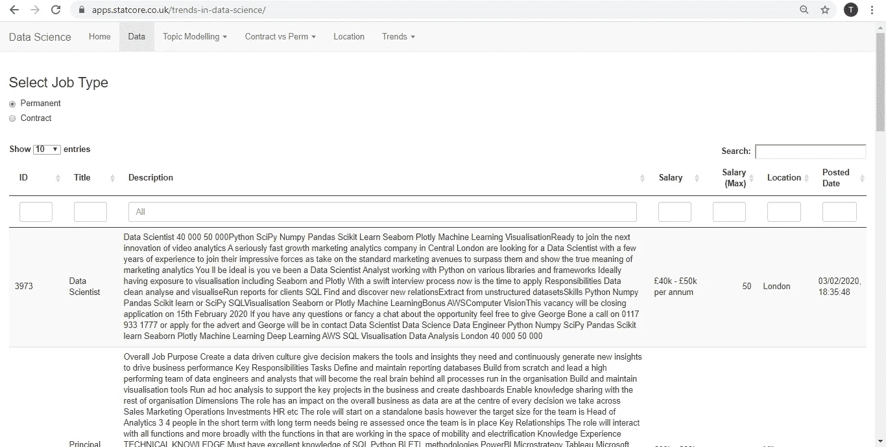

## 作业类型

首先，我对合同工和固定工之间的区别感兴趣。

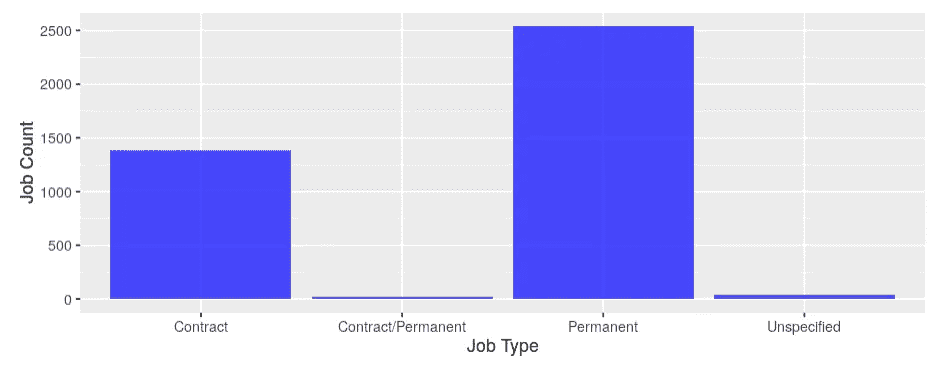

按工作类型划分的角色数量

正如你所料，大多数职位都被宣传为永久性的。不过，我很惊讶地看到，合同工占了全部工作岗位的近 40%。然而，重要的是要记住，JobServe 通常是许多承包商寻找下一个角色的地方，所以我不认为这种分裂代表了整个市场。

## 工具

根据工作描述中是否提到，我将每份工作分为四类

*   Python 而不是 R
*   r 但不是 Python
*   Python 还是 R
*   两种语言都没有

然后，我观察了这一类别的工作总数是如何变化的。首先是永久性角色:

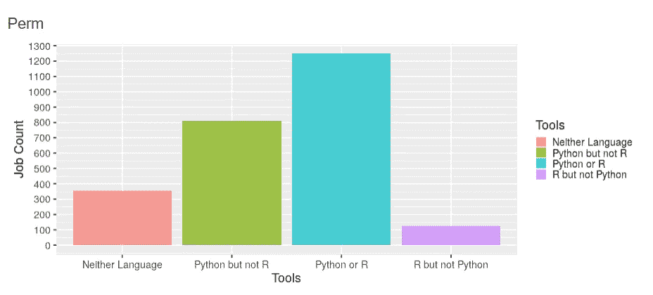

永久角色的工具流行度

然后，对于合同角色:

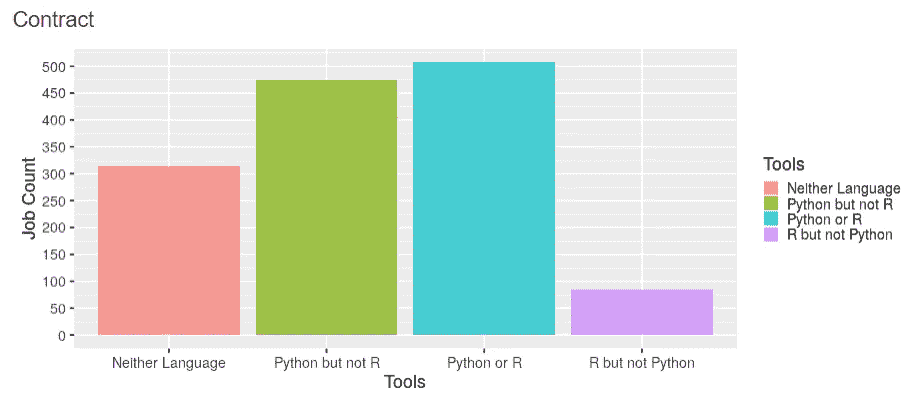

合同角色的工具流行度

哇！Python 刚刚在人气上狠批了 R！

薪酬呢？下面的方框图显示了每个组的几个汇总统计数据:

*   工资中位数(水平线)
*   第 25 和第 75 百分位(彩色框的底部和顶部)

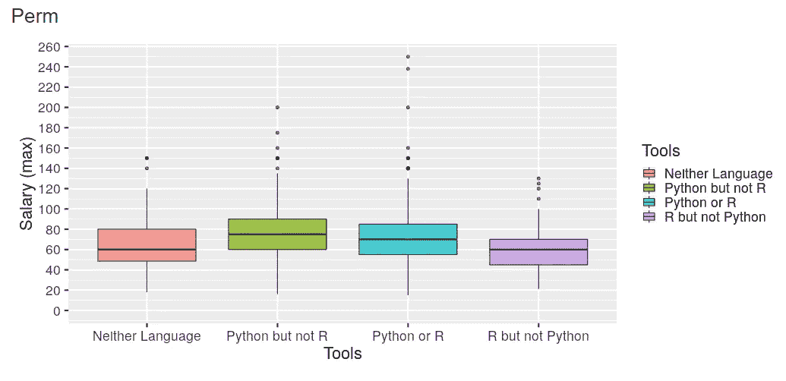

对于指定 Python 而非 R 的角色，永久员工的工资中值最高(75k)。指定 R 但不指定 Python 的角色大约少付 20%(60k)。

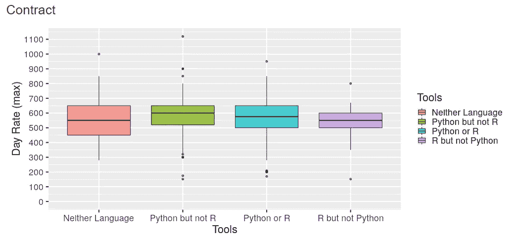

对于指定 Python 而不是 R ( 600)的角色，承包商的平均日工资最高。指定 R 但不指定 Python 的角色工资大约低 8%(550)。

所以学习 Python 的理由很充分…

# 主题建模

之前，我将一种叫做潜在狄利克雷分配(LDA)的主题模型应用于客户评论和保险损失理算员笔记，取得了良好的效果，所以我很高兴将这种技术应用于工作描述，看看我能发现什么。

以下内容摘自该算法的共同发明人 David Blei 撰写的主题建模概述。

> 主题模型是一种算法，用于发现弥漫在大量非结构化文档集合中的主题。主题模型可以根据发现的主题组织系列。

> LDA 背后的直觉是文档展示了多个主题。例如，考虑图 1 中的文章。这篇题为“寻找生命最基本的(基因)必需品”的文章是关于使用数据分析来确定一个有机体生存所需的基因数量(从进化的角度来说)。我们用手突出了文章中使用的不同单词。关于数据分析的单词，如“计算机”和“预测”，用蓝色突出显示；关于进化生物学的单词，如“生命”和“有机体”，用粉红色突出显示；关于遗传学的单词，如“测序”和“基因”，用黄色突出显示。

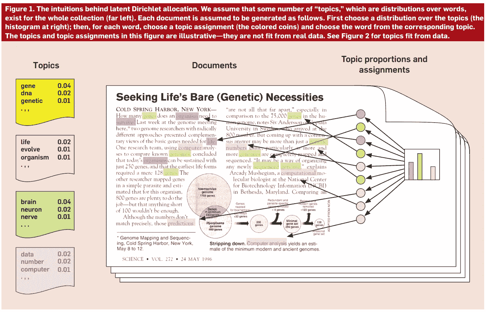

来源:[主题建模概述](http://www.cs.columbia.edu/~blei/papers/Blei2012.pdf)

主题建模允许您“逆向工程”我们假设生成文档的潜在主题。首先，我们必须指定我们希望模型找到多少主题。因为我们正在进行无监督学习，所以这里没有正确的答案——一个好的选择往往是反复试验的结果。

# 20 个主题

从用 20 个主题训练的主题模型开始，我们使用 [LDAvis](http://bl.ocks.org/AlessandraSozzi/raw/ce1ace56e4aed6f2d614ae2243aab5a5/) 来理解每个主题的相关单词。我们发现话题可以按以下方式组织。

*   沟通和商业敏锐度
*   技术
*   招聘人员评论
*   角色优势和要求
*   合同角色
*   数据工程

## 沟通和商业敏锐度

产生洞察力和有效沟通以交付业务价值的能力是数据科学的核心能力，也是其自身的主题。

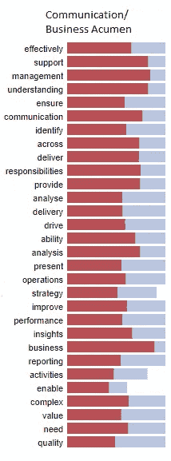

## 技术

该模型确定了一些技术技能，如机器学习和报告。

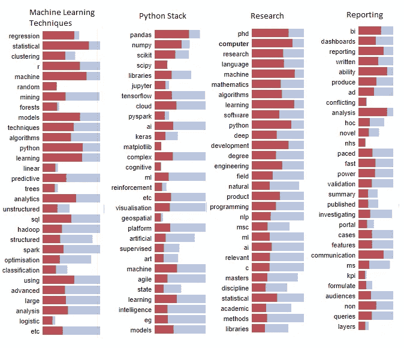

## 招聘人员评论

接下来是招聘人员在许多招聘信息中使用的各种主题。其中包括与歧视有关的免责声明，以及几项行动呼吁。

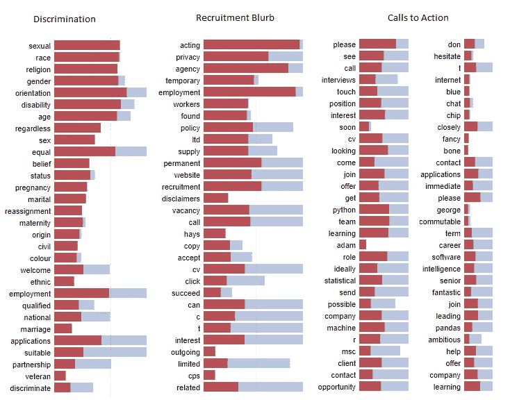

## 角色优势和要求

该模型已将安全审查确定为一个主题，以及员工可获得的福利(养老金计划、弹性工作制、免费健身房)。

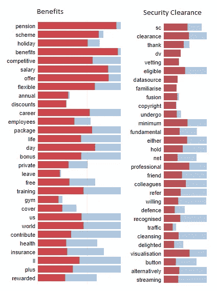

## 合同角色

该数据包含永久和合同角色的混合，并且该算法已经识别出这一点。

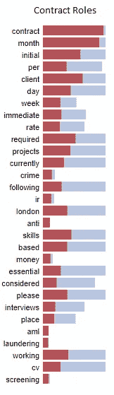

## 数据工程

有趣的是，数据工程有自己的主题，相关的术语有云计算(aws，azure)和各种技术(sql，hadoop，spark，nosql，kafka)

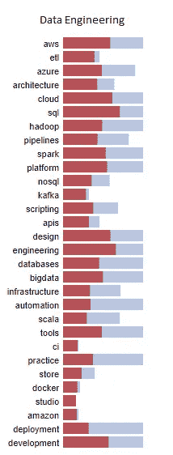

# 60 个主题

如果我们想要更精细的视图，我们可以将主题的数量增加到 60 个。当我们这样做时，我们发现“数据工程”被分成了 4 个子主题。

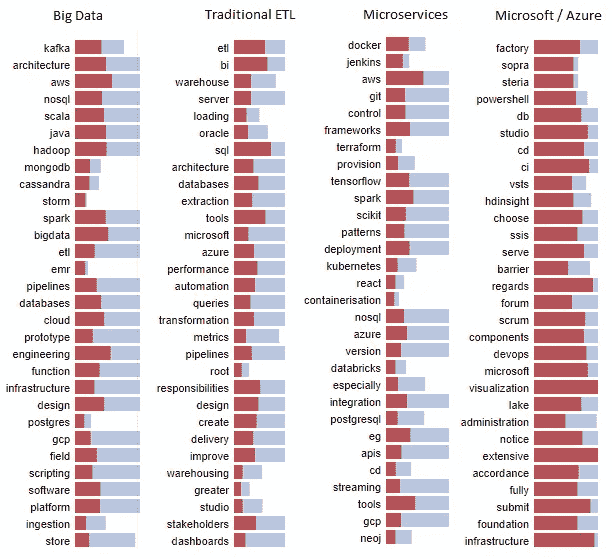

我们也开始看到特定的数据科学应用领域/行业出现，如生物信息学和反洗钱。

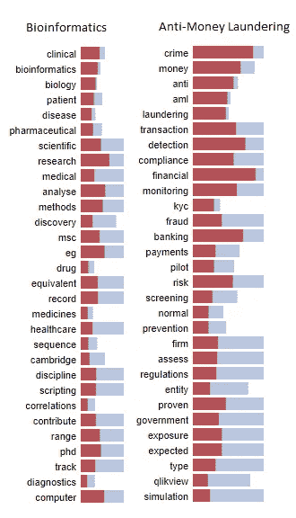

# 整理系列

我们可以使用我们的主题模型来检索与某个主题相关的工作描述。为此，我们从下拉列表中选择一个主题，然后在概率栏中进行过滤。

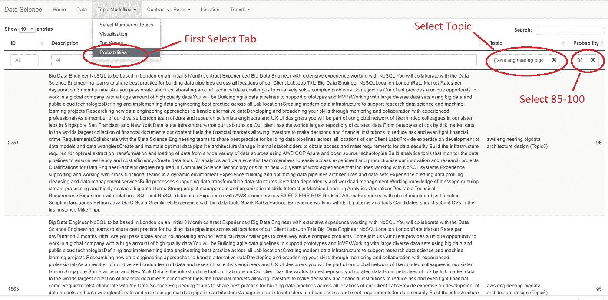

我们只是带回了所有大概率话题为“aws 工程大数据架构设计”的职位描述。但是请注意，由于模型每天晚上都要重新培训，所以每天的确切主题都会发生变化。

自己试试吧，如果在评论里发现什么有趣的东西，请告诉我！

# 包扎

这个项目让我能够在不经常检查手机的情况下监测数据科学就业市场的趋势——事实上，在 2019 年 4 月，在阅读了加州大学新港分校的数字极简主义之后，我完全摆脱了我的智能手机。

很早就很清楚，我应该开始学习 Python。根据[凯尔·麦基乌](https://www.linkedin.com/in/kylemckiou/)的推荐，我通过[泽德·肖的](https://learncodethehardway.org/python/)艰难地学习 Python，这给了我足够的知识来开始构建东西。

我现在已经在两个客户项目(可再生电力预测和资产监控)中使用了 Python，目前我正在从事一个个人项目，以预测灰狗赛跑的结果！

找到学习一门新语言的时间和动力并不容易——但当我需要一些额外的动力时，我会加载应用程序并研究最新趋势。希望你觉得有用。