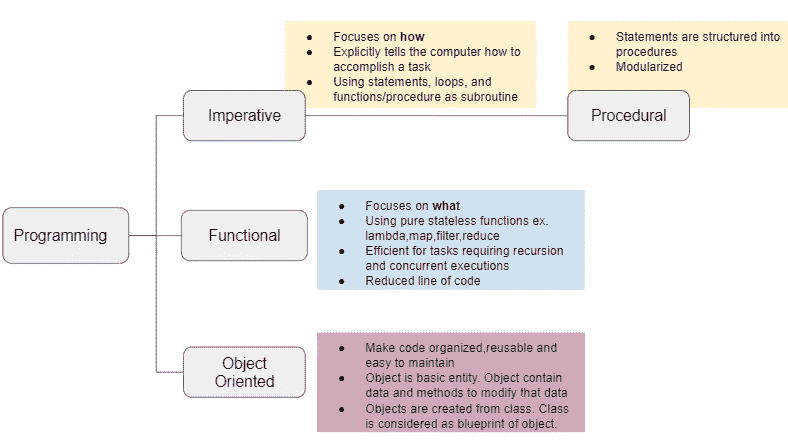
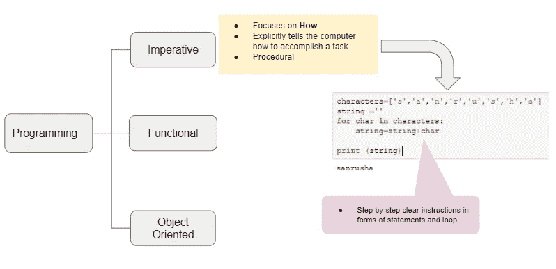
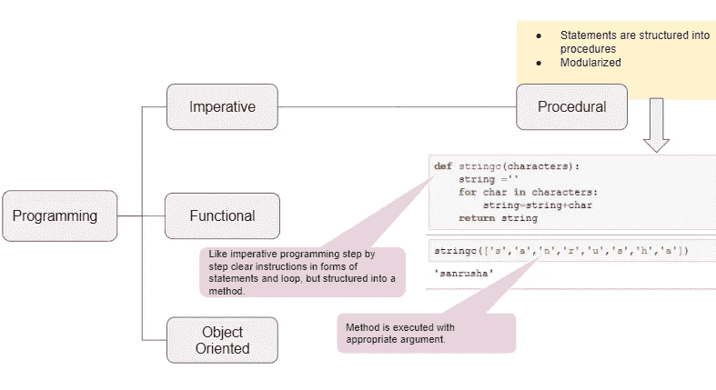
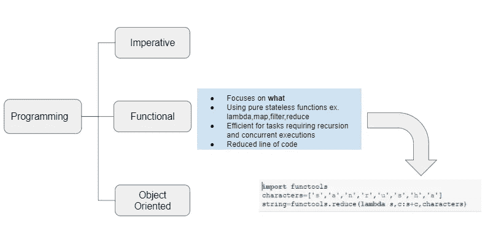
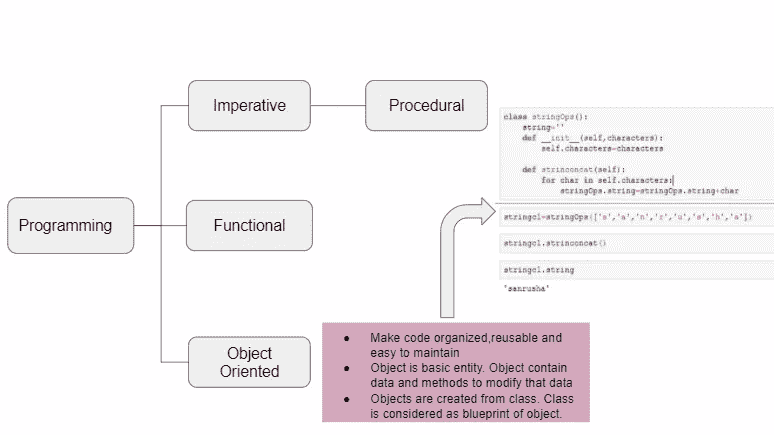
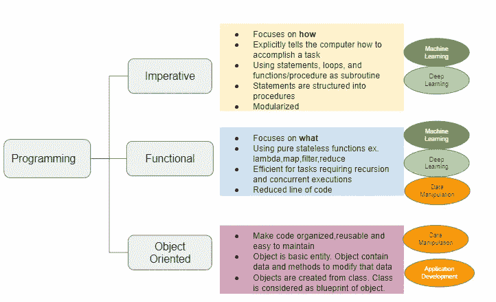

# Python:学什么，学多少？

> 原文：<https://towardsdatascience.com/python-what-to-learn-and-how-much-fb61bdef7b3a?source=collection_archive---------26----------------------->

## 命令式、函数式、面向对象:哪种编程范式非常适合我的工作？


[JESHOOTS.COM](https://unsplash.com/@jeshoots?utm_source=medium&utm_medium=referral)在 [Unsplash](https://unsplash.com?utm_source=medium&utm_medium=referral) 上拍照

Python 编程就像是无限的可能性。Web 和互联网开发、基于桌面 GUI 的应用程序、机器学习、深度学习、软件开发、商业应用程序开发 Python 编程的用例有很多。考虑到有这么多东西要学，很容易迷路，不知道多少是太多。

在本文中，我将带您了解 Python 支持的不同编程范例，并帮助您决定应该首先学习哪一种。

编程范式是对编程语言进行分类的一种风格或方式。

Python 支持三种编程范式:命令式、函数式和面向对象。图 1 显示了这些编程范例的特性。



图 1: Python 编程范例

## 必要的

命令式编程使用语句、循环等向计算机提供明确的步骤。



图 2:命令式编程范例的例子

下面是命令式编程的一个例子。这是一个简单的计算机指令，如何连接列表中提供的字符，并生成一个字符串。

如果运行上面的语句和循环，它将打印

```
sanrusha
```

在命令式编程中，命令集可以分组到一个代码块中，也称为**过程**。



图 3:过程化编程范例的一个例子

上述代码中的语句和循环可以分组到一个**过程** (Python 方法)中，如下所示。

现在，可以使用一组字符作为参数来调用 stringc 方法。

```
stringc([‘s’,’a’,’n’,’r’,’u’,’s’,’h’,’a’])
```

上述调用将返回

```
sanrusha
```

现在，这种方法比以前更加模块化。虽然过程使命令式编程模块化，但状态更改要么局限于过程，要么局限于过程的显式参数或返回。

## 功能的

函数式编程范式是一种使用内置高阶函数的编程风格。高阶函数将其他函数作为参数，或者将它们作为结果返回。

Python 内置函数像 **lambda、map、filter、generators、decorators、recursion**都是高阶函数。只要知道自己想要什么，就可以使用最合适的内置 python 函数，用最少的代码行来完成。



图 4:函数式编程范例的例子

下面的代码展示了如何通过使用 Python 高阶函数(如 reduce 和 lambda)在不到三行的代码中将字符组合成字符串。

参考下面的链接，获得 Python 中可用的内置高阶函数的完整列表

 [## functools 可调用对象上的高阶函数和运算-Python 3 . 8 . 5 文档

### 源代码:Lib/functools.py 该模块用于高阶函数:作用于或返回其他函数的函数…

docs.python.org](https://docs.python.org/3/library/functools.html) 

## **面向对象**

面向对象编程(OOP)范式如此著名，以至于你不得不尽最大努力去忽视它。面向对象编程如此著名的原因之一是它使代码可重用。这就像拿着一栋建筑的蓝图，按照你自己的喜好建造这栋建筑，比如层数、颜色、地板等等。

面向对象的蓝图叫做类。您可以根据自己的喜好将该类实例化为一个对象。虽然你不能用汽车的蓝图来制造自行车，但是你可以在使用蓝图的时候决定汽车的许多变化。

Python 充满了您将在程序中使用的内置类。虽然从第一天开始就掌握 OOP 并不容易，但好消息是你可能不需要在工作的第一天就从头开始编写 OOP 程序。对于一些工作，您可能永远不需要编写 OOP，您的工作可能通过使用内置类就足够了。



图 Python 面向对象编程的一个例子

下面是一个例子，如何用 OOP 来完成创建一个字符串的任务。

## 从哪里开始？

现在你的问题来了。

从哪里开始？

答案取决于你将要从事的工作。图 6 显示了基于您的工作应该关注的 python 编程范例。



图 6:掌握工作职能的编程范例

**结论**

如果你对编程一无所知，对 Python 也有一点了解，那就从命令式范式开始，了解函数式编程的知识。内置高阶 python 函数的知识会给你很大帮助。一旦您熟悉了这些范例，就开始探索面向对象编程。

参考资料:

[](https://www.udemy.com/course/python-with-oracle-developer-course/?referralCode=6F68B20A8FB16A20BFE1) [## Python+SQL+Oracle

### 欢迎来到 Udemy 上最受欢迎的 Python、SQL 和 Oracle 数据库课程。Python 是三大编程之一…

www.udemy.com](https://www.udemy.com/course/python-with-oracle-developer-course/?referralCode=6F68B20A8FB16A20BFE1)