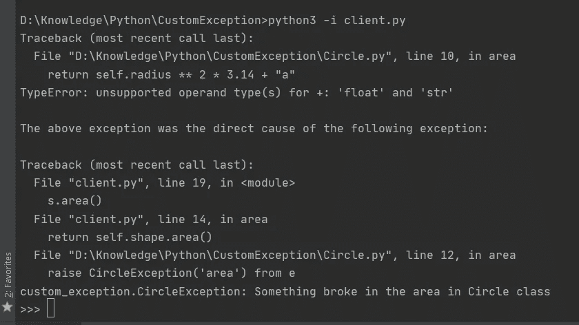
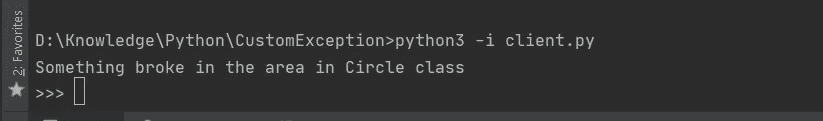

# Python:编写定制异常比您想象的要简单

> 原文：<https://towardsdatascience.com/python-writing-custom-exceptions-is-easier-than-you-might-think-14df327e503e?source=collection_archive---------47----------------------->

## Python 提供了许多内置的异常，然而，有时自己创建异常更有意义



在 Python 中处理运行时错误非常容易。您只需将代码放在 try-except 块中，并处理 Python 提供的许多内置异常类型中的异常。下面是一个用 Python 处理简单错误的例子。

```
number_followers = 40
"Hello, My name is Shivam and I have " + number_followers + " followers on Medium."
```

这段代码会产生一个错误，特别是 TypeError，因为+运算符不能将字符串和整数类型相加，我已经在关于魔法方法的[独立文章中解释了这些运算符是如何工作的，如果你想阅读相关内容，请查看。让我们试一试这段代码。](https://medium.com/dataseries/using-pythons-magic-methods-to-compare-tesla-and-ford-8dd9a4fcbe1e)

```
try:
   number_followers = 40
   "My name is Shivam and I have " + number_followers + "on medium."
except TypeError:
   print("A string and integer cannot be concatenated")
```

看，简单明了，但是只有我们需要写代码来连接一个字符串和一个整数。在现实生活中，管理大型代码库，许多团队使用您的代码，引发您的代码中出现的异常，这不是一个好的做法。

尽管 Python 提供了许多内置的异常类型，但有时我们不得不编写定制的异常来满足我们的目的。让我们假设一个程序来计算一个圆的面积，周长和其他一些东西，我们为此创建一个类圆。

编写新的定制异常非常简单。我们需要从内置模块中扩展异常类。

CircleException 现在可以像任何其他内置异常一样被引发

现在，我们可以在代码中出现错误的情况下抛出这个异常，而不必用确切的错误来麻烦客户团队。这样，客户端团队只需处理 CircleException，无论 Circle 类中有什么错误，都会引发该异常。除此之外，我们还可以在客户端修改错误消息，以获得更健壮的日志记录系统。

在客户端，我们只需要捕捉 CircleException 类型。

所以与其这样，

```
s = Circle(5)try:
    s.area()
except TypeError:
    print("Something wrong with the values sent")
except AttributeError:
    print("Something wrong with the attributes of the class")
except KeyError:
    print("Something went wrong with the keys in shape class")
```

我们将只处理 CircleException，这样客户端就不必处理所有可能与我们的 CircleClass 有关的错误。下面大概是这样的。

我们还可以修改它，并通过引入实例变量向自定义异常添加属性。

让我们通过在 Circle 类中引发 CircleException 时初始化方法名变量来使用它。

现在，客户端将所有的方法放在一个 try-except 下，将能够获得准确的错误消息，该错误消息可以记录在日志系统中。

```
s = Shape(shape_name='circle', radius=5)try: area = s.area()
    circumference = s.circumference()
    diameter = s.diameter()except CircleException as e:
    print(e)
```

让我们假设 Circle 类的 area 方法出了问题，没有权限修改 Circle 类的客户端可以很好地处理它，输出将是这样的。



本文帮助您理解如何以及为什么用 Python 编写自定义异常。在很多情况下，编写自定义异常比内置异常更有意义，读完本文后，我希望您对自定义异常有更好的理解，并知道如何抓住这些机会。

如果你喜欢这篇文章并学到了一些东西，请在 twitter 和 medium 上关注我，阅读更多类似的内容。我写关于 Python，数据科学，ML，AI 等等。