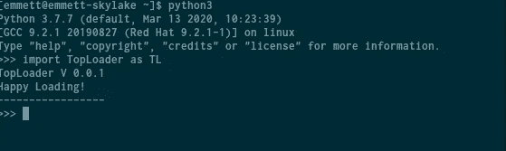
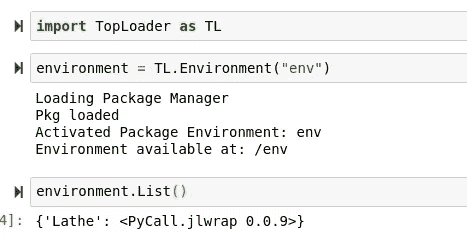
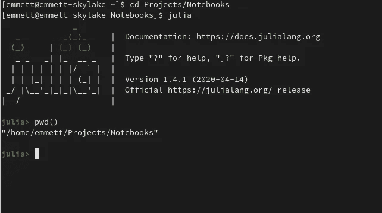
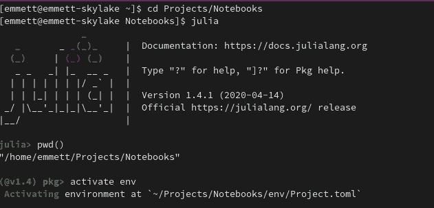
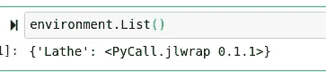
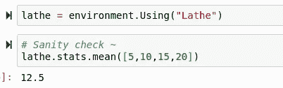
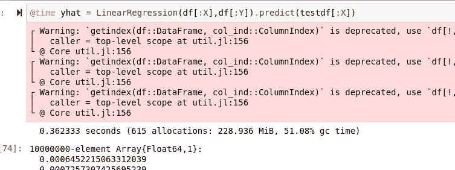
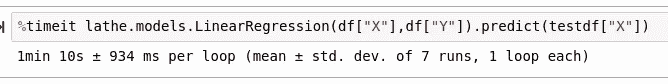

# 使用 Julia 的 Pythonic 大数据？

> 原文：<https://towardsdatascience.com/pythonic-big-data-using-julia-f06dec411a95?source=collection_archive---------47----------------------->

## 车床. jl

## Python 可以在 Julia 的帮助下处理大堆数据吗？


最近，我一直在尝试用 Julia 作为 Python 的后端。虽然这在理论上肯定是一个伟大的概念，但有些东西似乎在翻译中丢失了。这是我和几位 Julia 和 Python 科学家一直在进行的讨论，因为从 Python 中使用 Julia 的道路目前走得很少。我在另一篇文章中也提到了这个概念，您可以在这里阅读:

[](/is-julias-place-co-existence-with-python-eff2cb834f41) [## Julia 的位置与 Python 共存吗？

### Julia 是未来的 ML 语言，还是 Python 不太为人所知的伙伴？

towardsdatascience.com](/is-julias-place-co-existence-with-python-eff2cb834f41) 

在本文中，我讨论了 Julia 作为 Python 后端取代 C 的潜力。虽然在某种程度上，我确实认为这是一个奇怪的想法——因为 Julia 并不太难，并且在语法上与 Python 非常相似，这也有一个显著的优势。我认为使用 Python 与 Julia 的兼容层可能有用的原因是，Python 有更成熟的 web 框架，更容易部署，而且 Python 有更多为它创建的高级 API。能够将这些强大的工具与 Julia 的速度结合起来处理更多的数据和更大的算法将是梦想成真。


# 顶部加载器

作为 Python 和 Julia 共生技术的一部分，我们需要一个名为 TopLoader 的包。TopLoader 是一个 Pythonic 接口，用于管理 Julia 虚拟环境和包。您可以使用 Pip 添加 TopLoader，如下所示:

```
sudo pip3 install TopLoader
```

你可以在 Github 上找到 TopLoader:

[](https://github.com/emmettgb/TopLoader) [## emmettgb/TopLoader

### 你好，装载愉快！您可以使用以下命令安装 TopLoader:sudo pip 3 立即从 TopLoader 安装 TopLoader 您可以…

github.com](https://github.com/emmettgb/TopLoader) 

要设置 TopLoader，首先需要进入 Python REPL 并导入 TopLoader。这将安装和更新 PyCall，并将 Julia 可执行文件设置为从 Python 运行。当然，你也需要正确安装 Julia 来完成这项工作。Apt 软件包管理器安装 Julia 时存在一个已知问题，TopLoader 将无法找到 Julia。

为了解决这个问题，

> 不要通过 APT 安装 JULIA！

以下是 Julia Computing 给出的一些 Julian 建议:直接从 Julia Computing 安装 Julia 二进制文件，或 [http://julialang](http://julialang) 。org。使用 Julia 的包管理器版本会产生以下问题:

*   你可能会有一个过时版本的朱莉娅。例如，我使用 Fedora，Dnf 只有 1.2 版的 Julia，而当前版本是 1.4。如果没有最新版本的 Julia，您将无法使用新功能，例如使用@spawn 进行并行计算，这意味着除了多行 for 循环之外，您将无法运行任何线程。
*   您的 Julia 可执行文件可能会出现在错误的位置。您的包管理器以一种特殊的方式在您的系统上放置文件，拥有一个到/opt 的可执行链接肯定比必须预测每个包管理器将 Julia 二进制文件放在哪里，然后必须通过~/在 Bash 中导出它们更好。或者在每次启动 Julia 之前运行该命令。

当您最终可以导入 TopLoader 时，请确保它是通过 REPL 来完成的。跨越 Julia 和 Python 的解释所涉及的设置不能在其他任何地方发生。



# 添加车床

> [(笔记本)](https://github.com/emmettgb/Emmetts-DS-NoteBooks/blob/master/Python3/Lathe%20from%20TL.ipynb)

[](http://lathe.ai/) [## 车床

### 车床使用更快的方法和简单的方法。使得包装快速、简单且轻便。许多工具和模型…

车床. ai](http://lathe.ai/) 

L athe 使用 Julia 的语法表达式来模拟 Python 和 C++等典型鸭式语言中的类。这很好，因为这意味着模型在通过预测方法运行之前得到了初始化。这意味着我们可以像这样拟合一个模型:

```
model = LogisticRegression(trainX, trainy)
```

这个表达式将继续计算逻辑回归模型预测所需的任何值。然后我们可以调用 predict 方法，它是我们新模型对象的子对象，来获取我们的 **ŷ.**

```
**ŷ** = model.predict(testX)
```

为了演示如何使用 Python 中的 Lathe，我们将首先创建一个带有 TopLoader 的环境，然后向其中添加 Lathe:



这个环境已经存在，并且已经有车床在里面了。然而，我们将需要安装车床的不稳定分支，以便我们可以修改和测试它。虽然我们可以从 Python 中做到这一点，但我也想演示一下我们如何从朱莉娅·REPL 中做到这一点，在我看来，这要容易得多，也更有意义。我们需要做的就是在当前目录中输入朱莉娅·REPL:



然后用]进入 Pkg REPL，用激活命令激活我们的环境:



现在我们可以添加或删除任何我们想要的包。


现在，如果我们在 TopLoader 中重新加载我们的环境，并使用 List()函数，我们将获得新的更新版本的 Lathe。



我们可以从我们的环境中使用 using()方法将 Lathe 导入 Python:



每当我们创建一个模型类型的时候，一切都完全按照预期运行。


同样，predict()方法也是如此:


# 尝试大型数据集

为了确定我们是否真的从使用 Julia 而不是 Python 中获得了性能提升，我们需要一个基线。为了做到这一点，我把同样的线性回归函数翻译成 Python。这是一个相当基本的机器学习模型，所以幸运的是 Python 将能够自己完成我们的许多测试。

```
def dot(x,y):
    lst = []
    for i,w in zip(x,y):
        lst.append(i * w)
    return(lst)
def sq(x):
    x = [c ** 2 for c in x]
    return(x)
class LinearRegression:
    def __init__(self,x,y):
        # a = ((∑y)(∑x^2)-(∑x)(∑xy)) / (n(∑x^2) - (∑x)^2)
        # b = (x(∑xy) - (∑x)(∑y)) / n(∑x^2) - (∑x)^2
        if len(x) != len(y):
            pass
        # Get our Summations:
        Σx = sum(x)
        Σy = sum(y)
        # dot x and y
        xy = dot(x,y)
        # ∑dot x and y
        Σxy = sum(xy)
        # dotsquare x
        x2 = sq(x)
        # ∑ dotsquare x
        Σx2 = sum(x2)
        # n = sample size
        n = len(x)
        # Calculate a
        self.a = (((Σy) * (Σx2)) - ((Σx * (Σxy)))) / ((n * (Σx2))-(Σx**2))
        # Calculate b
        self.b = ((n*(Σxy)) - (Σx * Σy)) / ((n * (Σx2)) - (Σx ** 2))
        # The part that is super struct:
    def predict(self,xt):
        xt = [self.a + (self.b * i) for i in xt]
        return(xt)
```

我还导入了熊猫并读入了我的机器上的两个 CSV 文件，我用它们来进行速度测试。数据集有 10，000，000 个观察值，这可能仍然很容易执行，但几乎肯定会给 Python 一个很好的锻炼。为了给这些计算计时，我将使用 IPython 神奇的命令 timeit。

```
%timeit LinearRegression(df["X"],df["Y"]).predict(testdf["X"])
```

我们的结果是 8.78 秒。


与 Julia 在这个精确计算中的速度相比，结果是 0.362333 秒



但是使用 Python 的 TopLoader 呢？我们能期待类似于 Julia、Python 或介于两者之间的性能吗？在最坏的情况下，由于转换层的原因，性能也会受到严重影响。不幸的是，这似乎正是 TopLoader 以 1 分 10 秒的成绩出现时发生的情况。

> 糟糕透了。



# 结论

> 我不得不接受这个无效假设。

简短的回答是否定的，我的估计是正确的，兼容性层导致了太多的速度下降。然而，我认为这个观察可以洞察现实，如果有一个更好的系统，Python 中的 Julia 可能会很棒。TopLoader 的问题是，它需要将 Pythonic 数据转换成 Julian 数据，然后再将这些数据转换回 Julian 数据。也许如果有一种方法可以在后台运行 Julia 实例，从而更有效地从 Python 接收大量数据，那么可能有一种方法可以实现这一点。

随着对一个更好的系统的需求被清楚地阐明，也许我会开始一个新的项目来实现这个目标。然而，与此同时，在处理数据方面，Julia 肯定对 Python 没有任何帮助，而且使用兼容层似乎比使用 Python 本身要慢。虽然这个概念的未来可能是大胆的，甚至可能意味着用更少的努力获得更快的 Python 包，但未来肯定不是现在。

不管 TopLoader 在这方面有什么缺点，我仍然认为它是一个非常酷的包。用 Python 搭建 Julia 虚拟环境当然是一个很酷的想法，我只能希望最终能够确定一种方法来实现这个概念的全部功能。