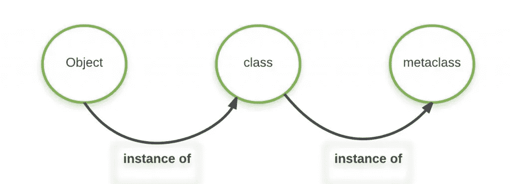
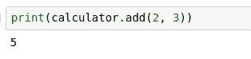
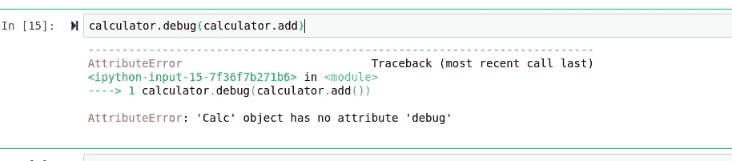

# 具有元类的 Pythonic 元编程

> 原文：<https://towardsdatascience.com/pythonic-metaprogramming-with-metaclasses-19b0df1e1760?source=collection_archive---------45----------------------->

## 你的装饰和元类生存指南。


# 介绍

元编程是操作代码的代码构造，可以在语法上产生一些非常有趣和富有表现力的结果。元编程并不是一个通常与 Python 联系在一起的概念，但事实是 Python 和 meta 实际上以许多很酷且独特的方式结合在一起。如果你曾经在 Python 中使用过元类或装饰器，那么你实际上是在用 Python 进行元编程。

像大多数高级编程语言一样，在 Python 中，每个单独的变量或对象都有一个类型。类型很重要，因为它们决定了每个变量的数据在内存中的存储方式。Python 中的每种类型都由一个类定义，我们可以通过使用标准库中的 type()函数来说明这一点:

```
string = "example"
print(type(string))<class 'str'>
```

string 类型的类是“str”类，它包含 split()之类的方法，这些方法通常用于解析字符。对于任何 Python 程序员来说，这可能都不是一个新概念，但是我们可以更进一步，使用元类来操纵类，而不需要编写它们。

# 基本用法

与 C、Java 甚至 C++中 int、char 和 float 是主要的数据类型不同，在 Python 中，它们是类中的一个对象。这对 Python 有利也有弊，因为对象是通常不可通用读取的数据类型。这意味着数据经常会卡在 Python 中，但也意味着 Python 中使用的数据是一个类的实例，也就是一个元类的实例。



我们首先需要的是一名室内装潢师。Python 中装饰者的工作是创建一个设计模式，允许我们在不修改类的情况下向类中添加新功能。使用 decorators 将使我们的类保持静态变得非常容易，同时还可以根据需要添加额外的特性。我喜欢让我的类装饰者继承函数装饰者，因为它在我们的代码之间创建了一个更大的边界，这是我们试图避免变异的。

```
from functools import wrapsdef debug(func): 
 '''decorator; debugs function when passed.'''

 [@wraps](http://twitter.com/wraps)(func) 
 def wrapper(*args, **kwargs): 
  print("Full name of this method:", func.__qualname__) 
  return func(*args, **kwargs) 
 return wrapper
```

现在我们可以添加实际的类装饰器了:

```
def debugmethods(cls): 
 '''class decorator to use debug method'''

 for key, val in vars(cls).items(): 
  if callable(val): 
   setattr(cls, key, debug(val)) 
 return cls
```

因此，我们的元类:

```
class debugMeta(type): 
 '''meta class which feed created class object 
 to debugmethod to get debug functionality 
 enabled objects'''

 def __new__(cls, clsname, bases, clsdict): 
  obj = super().__new__(cls, clsname, bases, clsdict) 
  obj = debugmethods(obj) 
  return obj 
```

现在，我们可以通过使用参数(metaclass=)创建一个新类来继承这个新类的数据。

```
# now all the subclass of this 
# will have debugging applied 
class Base(metaclass=debugMeta):pass
```

现在我们可以使用面向对象的继承将元类的属性继承到我们的新类中。每次修改“debugMeta”时，依赖于它的所有子元素都将继承这些更改。这产生了一些有趣的语法，我们可以在不需要修改它的情况下，自动向我们的类添加功能。

```
# inheriting Base 
class Calc(Base): 
 def add(self, x, y): 
  return x+y
```

现在使用计算器:



我们的 calculator 类实际上使用了我们用元类设置的调试行为，但是注意数据不是我们对象的子对象:



# 结论

虽然 Python 通常不会与元编程的概念联系在一起，但它不仅能够通过其独特的装饰器完美地实现这一概念，而且还在很多方面使用它。我认为 Python 相对于元编程为标准的许多其他语言的最大优势是 Python 的继承性。对于我上面所做的，如果没有继承，这一切都是不可能的，而且在我看来 Python 继承得非常好。由于我们经常将元编程与 Lisp 或 Scheme 之类的语言联系在一起，所以看到元编程以完全不同的方式完成是非常有趣的——而且是以完全不同的语言和完全不同的范式以非常酷的方式完成。最重要的是，decorators 肯定是一个很酷的概念，我真的希望更多的语言会采用它，因为它使元编程的过程变得非常简单和直接。

当将 Python 与其他语言进行比较时，尤其是与我用于元编程的函数式语言进行比较时，情况更是如此。经常折腾宏和表达式可能是强大的，但同时它可能令人难以置信地混乱，我认为 Python 在面对那个确切的问题时很好地利用了它的语法。