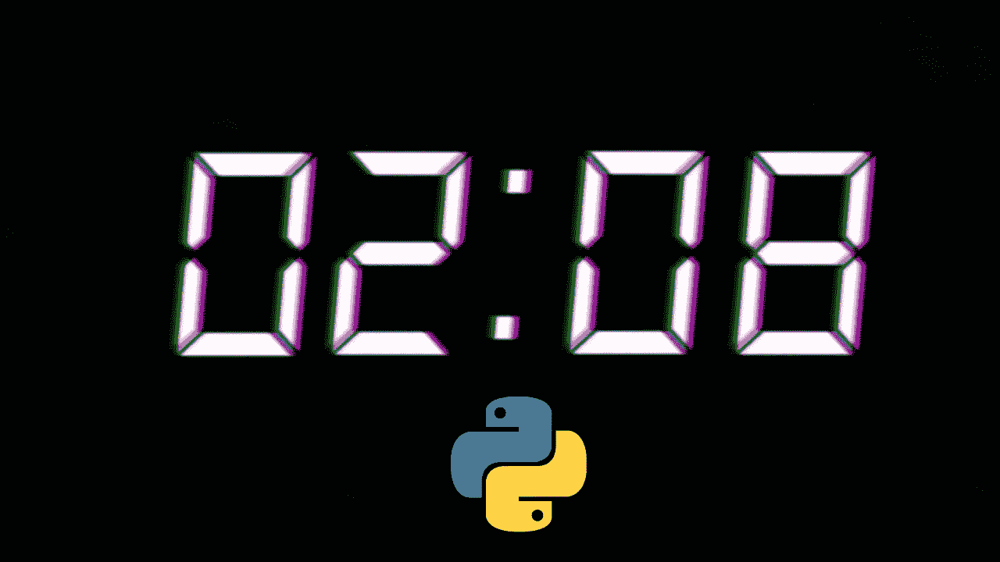
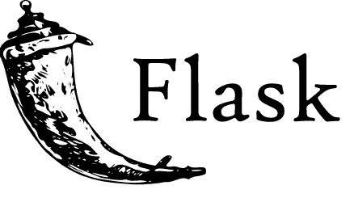

# Python 的到期日期

> 原文：<https://towardsdatascience.com/pythons-expiration-date-b1a55f368f1a?source=collection_archive---------0----------------------->

## Python 这个“大男孩”还要当多久？在脚本中？

(Python 徽标由[https://www.python.org/](https://www.python.org/)提供)

在过去的十年里，有一种语言的受欢迎程度飙升，并且超过了它所有的前辈，那就是 Python。Python 是一种易于使用、易于阅读、易于修改的面向对象编程语言，由 c 解释。Python 最近成为世界上最受欢迎的编程语言有许多原因，但也有许多原因可能会使它失去这个头衔。

# Python 是用来做什么的？

Python 是一种解释型语言，这意味着没有编译器或汇编器能够将这种语言转换成机器代码。相反，另一种语言，在 Python 的情况下是 C，用于解释带有 Python.h 头的语言。通常，这会将 Python 归入脚本类，然而，我认为不要忽视 Python 作为编程主流的地位是很重要的。

## 可执行？

Python 的一个巨大缺点是 Python 代码不能被编译成可执行文件。任何用 Python 编写的应用程序或工具都需要将 Python 及其依赖项安装在最终用户的系统上。与此同时，每个包的所有正确版本都与用于开发所述应用程序的包相对应。

## Web？

Python 已经证明了自己惊人的天赋，那就是运行网站的后端。这也是 Python 相对于很多其他语言的一个优势。Python 有大量不可思议的包来部署 API，甚至设计全功能的网络应用。

## 机器学习

机器学习是 Python 的另一个突出用途，这无疑有助于近年来 Python 的人气飙升。机器学习是技术的前沿，Python 以及它与 C 的密切关系对于机器学习来说是惊人的有效和有用。虽然 Python 确实缺乏一些类似语言(如 Nim、Julia 和 Go)的性能，但在很多方面，它通过快速、简单、简洁弥补了这一点，但也许更重要的是，

> 通用。

## Unix 操作系统

如果不谈论现代的类 Unix 系统，就很难谈论 Python。Python 2.7 已经被弃用了两个月，我的桌面环境以及我的操作系统中的许多特性仍然使用 Python 2.7。Bash 和 Python 的结合可以产生一些非常有用的脚本来运行服务器、填充数据、完成请求、编辑文件等等。

# Python 的缺点

尽管 Python 确实是一门伟大的语言，并对整个世界产生了巨大的影响，但每种语言都有其缺点，Python 也不例外。首先，也是最值得注意的:

> Python 很慢。

## 表演

虽然我当然同意使用日志和 for each 方法，一般来说只是编写更好的代码肯定可以加快 Python 的速度，但在某些情况下，代码肯定会很慢。机器学习是一个很好的例子，因为训练神经网络经常需要递归的致命使用。我无法告诉你有多少次我用 Python 写了一个拉数据的脚本，然后在我的命令行界面(CLI)中经历了超时和变慢。)

通过令人印象深刻的 Cython，人们正在努力缓解这一问题，但在尝试使用 Cython 时，过渡通常并不像苹果和橙子那样简单。尽管在很多场景中 Python 的局限性是不明显的，但如果我说我从来没有为了完成某件事而不得不转向 Julia、Nim 或 C 语言，那我就是在撒谎。

## 属国

Python 的另一个显著缺点是依赖性和虚拟环境。关于 Python 领域的脚本语言，我认为 Python 在依赖性和虚拟环境方面做得很好。我喜欢把 Python 比作我用来做类似事情的两种语言，Julia 和 Nim，Julia 的依赖世界和 Python 的非常相似。Julia 确实有一个优势，在我看来，虚拟环境要好得多，也更容易使用。

然而，随着 Nim 的加入，Python 在水中被遗弃了。使用 Nim，您可以创建一个包含所有必需依赖项的编译后的可执行文件。在如何为最终用户和部署处理依赖和包的问题上，Nim 轻而易举地胜过了 Python 和 Julia。

# Python 的优势

尽管我对 Python 有所抱怨，但我确实喜欢 Python 的许多方面。

## 庄严的

Python 是一种非常常用的编程语言，它有许多优点，例如:

*   易于谷歌搜索
*   容易谈论
*   伟大的包裹
*   频繁补丁

不仅如此，Python 被证明是值得尊敬和可靠的。这使得 Python 成为初学者的绝佳选择，同时也是那些希望以令人难以置信的速度构建稳定、持久的技术，同时又可以令人难以置信地轻松使用的人的绝佳选择。

## 看起来像英语

像 Python 这样的语言和类似的脚本语言之间的一个很大的区别就是 Python 的可读性和易理解性。通常阅读 Python 就像阅读一本奇怪的、抽象的关于变量等于数字的书。这不仅使初学者更容易，也使变异、修改和解密更容易，这些都是非常重要的，尤其是对于有数千名开发人员在其中工作的大型代码池。

> 说实话，我们都宁愿写 Python，也不愿写 c。

## 是福斯

虽然对一些人来说，他们的语言是否免费和开源并不重要，但对我来说，这当然很重要。Python 基金会的功能主要来自捐赠和教育证书，这意味着 Python 是一个完全免费和开放的软件，有人为你编写代码供你使用，这很好。

# Python 要过期了吗？

我经常被问到的一个问题是“你认为 Python 会存在多久？”这个问题经常出现在机器学习领域，因为 Python 有一大堆与机器学习相关的问题。想到任何语言都可能是静态的，并在很长一段时间内保持为最常用的编程语言，这很有趣。

Fortran 是 C 之前的大事件，C 是 C++之前的大事件，C++是 Java 之前的大事件，这个列表还在继续，并将永远继续。计算机是令人兴奋的，因为它们在不断进化，它们所研究的技术也在不断进化。就在 30 年前，16GB 内存的想法还是一个完全古怪的概念，所以根本不知道编程语言的未来会如何。

虽然 Python 最终很可能会被另一种编程语言所取代，但我认为重要的是要记住，人们仍然在编写 Fortran、C、Java 和 c++；因此，Python 本身很可能会伴随我们，并在很长一段时间内被普遍使用，不管它可能变得多么不受欢迎。

## 其他语言

(src =[http://julialang.org/](http://julialang.org/)

对 Python 的流行构成最大威胁的可能是其他新的编程语言。我已经讨论过的语言，Julia 和 Nim，只是我认为目前 Python 的两大竞争对手。Julia 肯定会改变我们进行机器学习的方式，而 Nim 肯定会改变高级脚本的游戏规则。

(【https://nim-lang.org/】T2

这些语言可能还没有获得那么多的动力，但是它们展示了一件我认为很重要的事情:

> 进步是可能的。

也就是说，Python 不是一堵坚固的砖墙，编程语言、机器学习和脚本编写的进步肯定不会就此止步。我认为这些语言不成功的部分原因是因为它们都是统计类型的，而且在大多数情况下

> 函数式语言，

我知道对于那些坚持使用和热爱 Python 的人来说，这可能是一个非常不和谐的概念。

# 结论

> 该不该学 Python？

我对这个问题的回答永远是肯定的。Python 是一门很棒的语言，可以让你入门并熟悉如何解决问题和开始编程。与包括 Julia 和 Nim 在内的其他语言相比，Python 还拥有大量的资源，这使得它更容易学习。

我的目标是提供一个关于编程概念的非常客观的观点，我不认为 Python 会很快消失。然而，我确实认为作为一名程序员不断成长很重要，更重要的是开阔你的视野。如果你已经使用 Python 有一段时间了，也许可以再学一门外语。尝试一种不同范式的语言，并理解这种范式和您所选择的语言的泛型编程方法是如何利用这些概念的。我认为这是有帮助的，因为你不仅可以学会使用更快的方法，还可以学到很多你以前可能不会想到的东西。