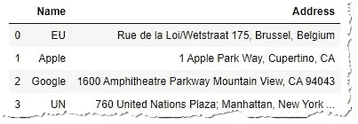
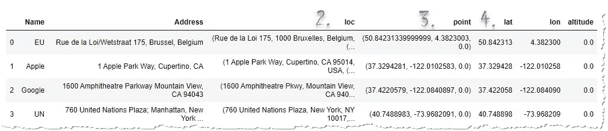
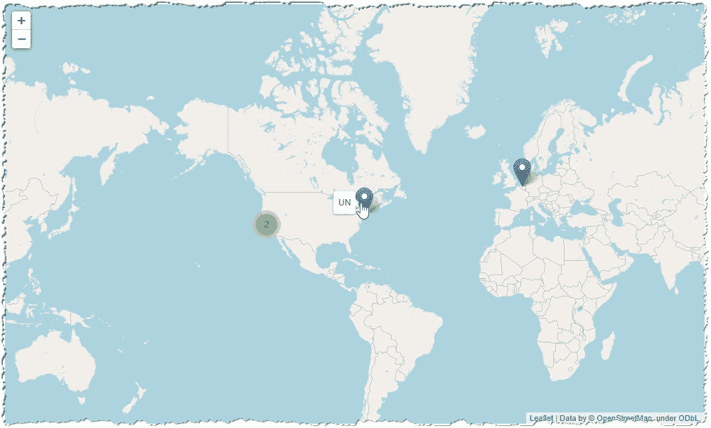
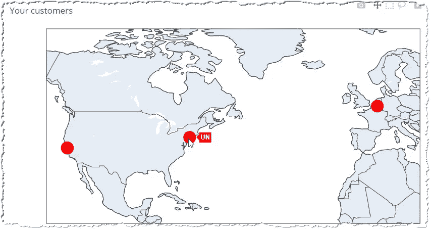

# Python 的地理编码-将地址列表转换为地图

> 原文：<https://towardsdatascience.com/pythons-geocoding-convert-a-list-of-addresses-into-a-map-f522ef513fd6?source=collection_archive---------1----------------------->

## 如何使用地理定位 API 接收绘制客户、工厂、车队和其他主题的地图所需的数据。


照片由[捕捉人心。](https://unsplash.com/@dead____artist?utm_source=medium&utm_medium=referral) on [Unsplash](https://unsplash.com?utm_source=medium&utm_medium=referral)

我们每个人都有一个数据库，里面有客户的地址，工厂或商店的名单，我们销售产品或合作的地区。在地图上显示这些数据是现代仪表盘的必备功能。为了做到这一点，我们必须将地址(城市名称或地区)转换成地理空间数据——纬度和经度。然后我们可以在引人注目的地图上展示它们。

**你会学到什么**

在本教程中，我们将探索如何:

*   [选择理想的地图服务](#3d61)
*   [使用](#c8f7) `[requests](#c8f7)`连接 API(老式方式)
*   [用 Python 的](#3128) `[geopy](#3128)` [库](#3128)获取位置(及更多)
*   [将地址列表转换为地理点](#5352)
*   [用](#03c6)`[folium](#03c6)``[plotly](#03c6)`将采集的数据显示在地图上
*   [将地图保存成。html 文件](#e0df)

你可以通过 Github-[Address to location . ipynb](https://github.com/vaclavdekanovsky/data-analysis-in-examples/blob/master/Maps/Geocoding/Address%20to%20Location.ipynb)下载这款 jupyter 笔记本，跟随我的脚步。

## 谁提供制图数据？

要将地址转换成坐标，你可以购买一个带有地理位置的地址数据库，或者查询一些地理定位服务提供商。任何提供地图的人通常都会提供一个地理定位 API(通常需要付费)。让我们回顾一下一些主要的提供商:

*   [谷歌地图平台](https://developers.google.com/maps/documentation)
*   [地图框 API](https://docs.mapbox.com/api/)
*   [必应 API](https://docs.microsoft.com/en-us/bingmaps/rest-services/)
*   OpenStreetMap API——(免费)
*   [Yandex 地图 API](https://tech.yandex.com/maps/)

本文回顾了一些主要的提供商:

[](https://medium.com/rakuten-rapidapi/top-10-map-apis-google-maps-bing-maps-mapbox-and-other-geolocation-apis-cb442fec07ed) [## 十大地图应用程序接口:谷歌地图、必应地图、地图盒子和其他地理定位应用程序接口

### 地图已经成为你离不开的必备追踪工具。它们是任何公司不可或缺的一部分…

medium.com](https://medium.com/rakuten-rapidapi/top-10-map-apis-google-maps-bing-maps-mapbox-and-other-geolocation-apis-cb442fec07ed) 

## 如何连接到映射 API

大多数 API 都允许直接调用。你把你的地址发送到一个网址，然后接收地理位置信息。多年来，我们使用 python `requests`库来做这件事。让我们探索对 Google API 的请求。

> 要连接到 Google API，您需要一个 API 密钥。你必须提出要求，然后保守秘密，因为你为服务付费。谷歌每月免费提供 200 美元，足以完成 40000 次地理编码请求。

地理编码调用通常非常简单:

```
Base address: [https://maps.googleapis.com/maps/api/geocode/json](https://maps.googleapis.com/maps/api/geocode/json)?
Parameters:
   # blank spaces are turned to %20
   address=1 Apple Park Way, Cupertino, CA
   key=API_KEY
```

你准备好你想要搜索的数据。在`urllib`的帮助下，你可以很容易地将参数转换成一个 URL，你调用`requests.get().`得到的响应要么是 XML，但更常见的是由`json.loads`处理的`json`

调用 Google API 将一个地区转换成地理位置

## 使用 GeoPy 简化您的工作

您可以努力利用映射提供者 API 的文档来充分利用它，但是利用像 [GeoPy](https://geopy.readthedocs.io/en/stable/) 这样的现有库更容易。使用 Geopy，您只需几行代码就可以完成上述操作。

Geopy 为流行的地图服务提供了一个类。[nomim](https://nominatim.openstreetmap.org/)是广受欢迎的 [OpenStreetMap](https://www.openstreetmap.org/#map=7/49.817/15.478) 背后的服务，它允许你免费进行地理编码。但是你应该遵守[的使用政策](https://operations.osmfoundation.org/policies/nominatim/)以便让每个人都能使用它:

> 一般来说，不鼓励对大量数据进行批量地理编码。如果遵循这些附加规则，较小的一次性批量任务是允许的

*   将您的请求限制在**单线程**
*   仅限 1 台机器，**无分布式脚本**(包括多个 Amazon EC2 实例或类似实例)
*   结果**必须缓存**在你这边。重复发送相同查询的客户端可能被分类为有故障和被阻止。

你是有一个小项目还是只想给老板留下好印象？让我们用 geo py . Nominatim 进行地理编码，首先，我们将 nominam 初始化为`geolocator`变量:

```
from geopy.geocoders import Nominatim
geolocator = Nominatim(user_agent="example app")
```

然后你需要一个地区的信息，我选择了意大利的托斯卡纳区:

```
[In]: geolocator.geocode("**Tuscany, Italy**").raw[Out]: {'place_id': 232933113,
 'licence': 'Data © OpenStreetMap contributors, ODbL 1.0\. [https://osm.org/copyright',](https://osm.org/copyright',)
 'osm_type': 'relation',
 'osm_id': 41977,
 'boundingbox': ['42.237615', '44.4725419', '9.6867692', '12.3713544'],
 **'lat': '43.4586541'**,
 **'lon': '11.1389204'**,
 'display_name': 'Toscana, Italia',
 'class': 'boundary',
 'type': 'administrative',
 'importance': 0.6870417219974091,
 'icon': 'https://nominatim.openstreetmap.org/images/mapicons/poi_boundary_administrative.p.20.png'}
```

从响应中，您可以获得纬度和经度

```
[In]: geolocator.geocode("**Tuscany, Italy**").point
[Out]: Point(43.4586541, 11.1389204, 0.0)
```

类似地，你可以从一个完整的地址请求地理定位，例如，苹果公司的[总部。](https://en.wikipedia.org/wiki/Apple_Park)

```
# request 
geolocator.geocode("1 Apple Park Way, Cupertino, CA")# extract the coordinates:
('37.3337572', '-122.0113815')
```

Geopy 允许`geocode`操作将地址转换为坐标，而相反的`reverse`操作将位置转换为地址:

```
[In]: geolocator.reverse('37.3337572, -122.0113815')[Out]: Location(Apple Park, 1, Apple Park Way, Monta Vista, Cupertino, Santa Clara County, California, 94087, United States of America, (37.3348469, -122.01139215737962, 0.0))
```

完整教程使用 GeoPy 收集苹果总部的位置，然后。倒转来确认它是正确的地方

## 谷歌地理公园

您可以通过 Geopy 使用许多地图服务，只需提供 API 密钥或用户凭据。例如，使用谷歌地图 API:

```
geolocator = GoogleV3(api_key=AUTH_KEY)
```

请求地理位置使用与上面相同的代码:

```
[In]: geolocator.geocode("1 Apple Park Way, Cupertino, CA").point
[Out]: Point(37.3337572, -122.0113815, 0.0)
```

尽管响应 JSON 的结构将反映所使用的服务。Google 响应中的 Lat 和 Lon 存储在`"geometry"."location"`中。但是 Geopy 为您做了这项工作，您只需读取`.point`属性。

## 将地址列表转换为地理坐标

在地图上显示带有地址的数据集之前，您需要找到这些点的地理位置。让我们来看看这份地址名单:

```
data = """Name,Address
EU,"Rue de la Loi/Wetstraat 175, Brussel, Belgium"
Apple,"1 Apple Park Way, Cupertino, CA"
Google,"1600 Amphitheatre Parkway Mountain View, CA 94043"
UN,"760 United Nations Plaza; Manhattan, New York City"
"""
```

我们知道我们可以使用 GeoPy 的`geolocator.geocode`，但是将熊猫数据帧转换成坐标的最有效方法是什么呢？我喜欢 Abdishakur 在这篇文章中描述的方法

[](/geocode-with-python-161ec1e62b89) [## 使用 Python 进行地理编码

### 如何将物理地址转换为地理位置→经纬度

towardsdatascience.com](/geocode-with-python-161ec1e62b89) 

1.  我将从我们的列表中创建一个熊猫数据框架

```
df = pd.read_csv(io.StringIO(data))
df
```



2.将`geolocator.geocode`应用于地址栏

```
df["loc"] = df["Address"].apply(geolocator.geocode)
```

3.从地理编码的响应中获取包含纬度和经度的`.point`，如果它不是`None`。

```
df["point"]= df["loc"].apply(lambda loc: tuple(loc.point) if loc else None)
```

4.将`.point`拆分成单独的列`'lat'` `'lon'`和`'altitude'`

```
df[['lat', 'lon', 'altitude']] = pd.DataFrame(df['point'].to_list(), index=df.index)
```



步骤 2-4 将从地理编码的响应中挖掘地理位置

数据集中有`'lat'`和`'loc'`列就足以在任何背景图上显示这些点。

# 将地理点转换为地图

地理坐标是没有用的，除非你把它们显示在地图上。Python 提供了几个库来使这项任务变得足够简单。

*   [leave](https://python-visualization.github.io/folium/)库，使用[leave . js](https://leafletjs.com/)在 [OpenStreetMap](https://www.openstreetmap.org/) 或任何其他地图数据提供者的顶部创建典型地图
*   [plotly](https://plotly.com/) 使用其固有的地图数据

## 用叶子创建地图

树叶地图是交互式的，它们包含带有弹出窗口的标记，可以聚集在具有高密度点的区域中，您可以使用图层并选择不同的源地图。这很容易编码:

```
# import the library and its Marker clusterization service
import folium
from folium.plugins import MarkerCluster# Create a map object and center it to the avarage coordinates to m
m = folium.Map(location=df[["lat", "lon"]].mean().to_list(), zoom_start=2)# if the points are too close to each other, cluster them, create a cluster overlay with MarkerCluster, add to m
marker_cluster = MarkerCluster().add_to(m)# draw the markers and assign popup and hover texts
# add the markers the the cluster layers so that they are automatically clustered
for i,r in df.iterrows():
    location = (r["lat"], r["lon"])
    folium.Marker(location=location,
                      popup = r['Name'],
                      tooltip=r['Name'])\
    .add_to(marker_cluster)# display the map
m
```



一张有叶子的简单地图。硅谷聚集了太多的点。

## 使用 Plotly 创建地图

Plotly 越来越受欢迎。因为它引入了 Plotly express 接口，所以创建图表是一个单独的线性过程，这也适用于地图图表。下面我们来看看如何用 Plotly 创建一个类似的地图。

```
# import the plotly express
import plotly.express as px# set up the chart from the df dataFrame
fig = px.scatter_geo(df, 
                     # longitude is taken from the df["lon"] columns and latitude from df["lat"]
                     lon="lon", 
                     lat="lat", 
                     # choose the map chart's projection
                     projection="natural earth",
                     # columns which is in bold in the pop up
                     hover_name = "Name",
                     # format of the popup not to display these columns' data
                     hover_data = {"Name":False,
                                   "lon": False,
                                   "lat": False
                                     }
                     )
```

`.scatter_geo(df)`根据测向数据帧中的数据在地图上创建点，如位置或弹出窗口。我们可以为每个数据点设置不同的大小或颜色，但我们在 df 数据帧中没有这样做，所以我们可以使用`.update_traces()`为所有数据点指定相同的大小或颜色。

```
fig.update_traces(marker=dict(size=25, color="red"))
```

你不必像在 leav 中那样确定理想的缩放比例，只需将`fitbounds`设置为“位置”即可。您还可以显示国家、河流、海洋、湖泊，并用`.update_geos`指定它们的颜色。

```
fig.update_geos(fitbounds="locations", showcountries = True)
```

最后，让我们使用`.update_layout`添加一个标题，并通过`fig.show()`显示最终的图表。

```
fig.update_layout(title = "Your customers")
fig.show()
```



一个简单的地图。

## 将地图导出到 html

欣赏笔记本中的地图可能会令人满意，但偶尔您希望与没有安装 python 的人共享您的工作。幸运的是将地图导出到。html 只有一行代码。

Folium 的`.save`方法创建了一个文件，该文件从 CDN 获得所有必要的资源，如 jquery、bootstrap、leaflet，并且该文件只有 8 KB。

```
m.save("folium_map.html")
```

Plotly 使用带有几个可选参数的`.write_html`命令。最重要的是`include_plotlyjs`。您可以设置输出文件是否将包含超过 3 MB 的 plotly 库，以实现那些漂亮的图表效果，或者您是否只想要可以包含在另一个 plotly 项目中的数据点。在第二种情况下，大小将是 9 KB。

```
fig.write_html("plotly_map.html", include_plotlyjs=True)
```

# 结论

在地图上显示数据是展示公司数据的有效方式。Python 的库帮助我们快速收集必要的地理空间数据，并使用它们绘制地图。您可以使用开源数据或付费服务来完成这项任务。

你想寻找更多的灵感吗，试试 plotly 和 leav 地图集

[](https://plotly.com/python/maps/) [## 地图

### Plotly 的 Python 图形库可以制作交互式、出版物质量的在线地图。如何使用…制作地图的示例

plotly.com](https://plotly.com/python/maps/)  [## Jupyter 笔记本浏览器

### 编辑描述

nbviewer.jupyter.org](https://nbviewer.jupyter.org/github/python-visualization/folium/tree/master/examples/) 

您喜欢本教程吗，请查看我的其他关于各种数据相关主题的文章:

[](/complete-guide-to-pythons-cross-validation-with-examples-a9676b5cac12) [## python 交叉验证的完整指南及示例

### sklearn 交叉验证的示例和使用案例解释了 k 折叠、洗牌、分层以及它如何影响…

towardsdatascience.com](/complete-guide-to-pythons-cross-validation-with-examples-a9676b5cac12) [](/dealing-with-extra-white-spaces-while-reading-csv-in-pandas-67b0c2b71e6a) [## 阅读熊猫 CSV 时处理多余的空格

### 为什么我们关心空白？内置熊猫功能，自定义处理。创建 1M 测试数据和…

towardsdatascience.com](/dealing-with-extra-white-spaces-while-reading-csv-in-pandas-67b0c2b71e6a)