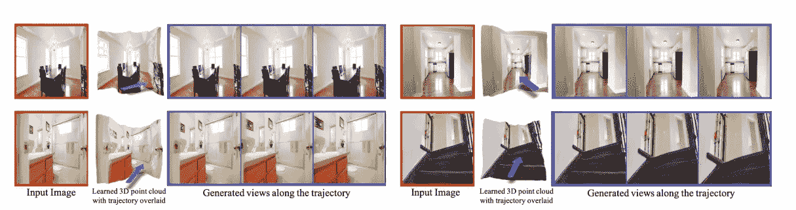
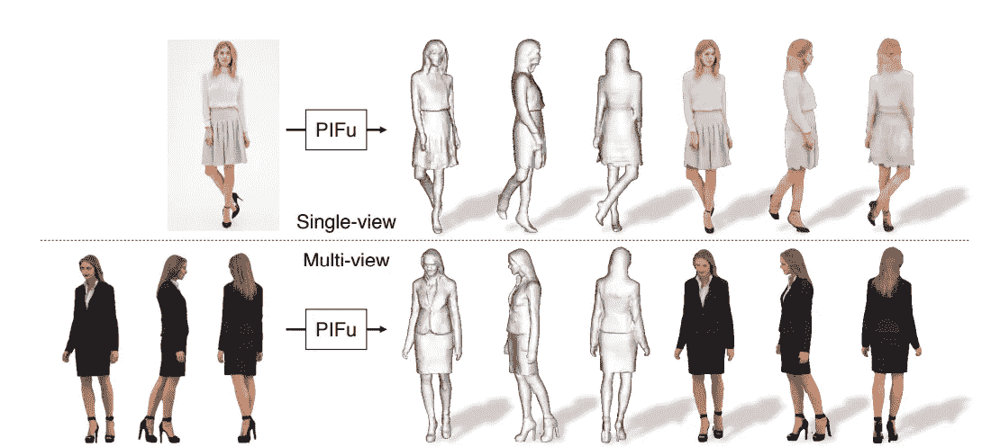
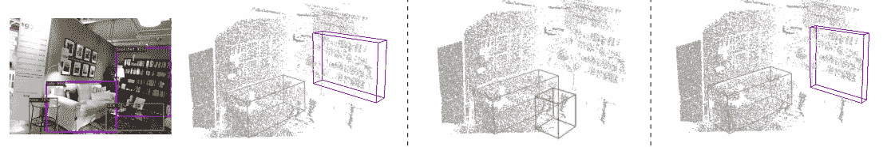

# PyTorch 3D 在 CVPR 2020

> 原文：<https://towardsdatascience.com/pytorch-3d-in-cvpr-2020-ea7849dfd6e8?source=collection_archive---------46----------------------->

## 脸书如何利用 PyTorch 框架实现三维目的

计算机视觉和模式识别大会( [CVPR](http://cvpr2020.thecvf.com/) )是计算机视觉和模式识别领域最新进展和趋势的顶级会议之一。它每年举行一次，由独立研究人员的高质量论文和大公司研发实验室的突破组成。由于今年新冠肺炎造成的疫情，组织者决定从 6 月 14 日至 19 日虚拟举办 CVPR 2020。尽管可能有所不同，但虚拟方面并没有在任何意义上降低会议上提交的论文和研究的绝对质量。

在今年的 CVPR 会议上，脸书人工智能的研究人员成功地在计算机视觉的许多重要和相对较新的领域推进了*最先进*模型的边界，其中主要是推理常规 2D 图像中显示的 3D 对象的新方法。利用公平的开源机器学习框架 [PyTorch 3D](https://github.com/facebookresearch/pytorch3d) 的众多功能，这项工作可以帮助解锁众多 AR/VR 增强功能，并成为在不久的将来塑造其他技术的关键。

## 在复杂的真实世界场景中，从单一图像获得不同的视角

脸书人工智能研究中心(FAIR)的研究人员建造了 SynSin，这是一个最先进的模型，它从完全不同的角度拍摄一张 RGB 图像，并生成同一场景的新图像。所提出的系统通过使用 PyTorch 3D 中实现的新颖的可区分渲染器，将预测的 3D 点云投影到场景的另一个视图上来工作。基于绘制的点云输入，使用生成式对抗网络(GAN)来合成输出图像。

由怀尔斯等人提供。[来源](https://arxiv.org/pdf/1912.08804.pdf)

由于 SynSin 依赖于渲染的 3D 点云作为其场景生成的基础，因此由于渲染的点云的灵活性，它能够生成不同分辨率的图像，与当代方法相比效率更高。

> 我们可以生成高分辨率图像，并推广到其他输入分辨率。
> 
> 怀尔斯等人— [来源](https://arxiv.org/pdf/1912.08804.pdf)

3D 点云的投影特征也由作者提出的*细化网络*解码，以帮助填充缺失区域并生成更真实的最终输出图像。与最近经常使用密集体素网格的方法相比，本文作者的方法能够扩展到复杂现实场景中的合成场景生成。这是目前大多数方法都无法达到的相当高的精确度。

由 Wiles、Gkioxari、Szeliski 和 Johnson 撰写的完整论文可在[此处](https://arxiv.org/pdf/1912.08804.pdf)查看，更深入地了解他们的可区分渲染器和 GAN 的细微差别。

## 从单幅图像中以前所未有的细节和质量水平重建三维人体模型

脸书人工智能的研究人员基于 Saito 等人在 2019 年发布的[像素对齐隐函数](https://arxiv.org/pdf/1905.05172.pdf)(皮夫)方法，创建了一个多层神经网络，以开发一种从 2D 图像中生成人的 3D 重建的方法，这种方法能够捕捉最先进的复杂性和细节，并将其渲染为 3D 模型。高度具体的细节，如手指，面部特征和衣服褶皱，都是使用高分辨率照片作为网络的输入来捕捉的。

斋藤等人提供。[来源](https://arxiv.org/pdf/1905.05172.pdf)

根据其功能，创建的网络可以大致分为两个主要部分。第一部分(或第一级网络)通过利用较低分辨率的图像来重建人类的 3D 结构。这部分类似于研究人员建立的皮夫方法。第二个网络在本质上更加轻量级，并利用更高分辨率的图像来捕捉和呈现人类更精细的方面。

> 通过允许从第一级访问全局 3D 信息，我们的系统可以有效地利用局部和全局信息进行高分辨率 3D 人体重建。
> 
> Saito 等人[来源](https://arxiv.org/pdf/1905.05172.pdf)

研究人员为这种精细的 3D 人类重建所采用的方法可能会被证明是 AR/VR 体验以及几个电子商务应用程序的一个重大推动。

论文全文由斋藤、黄、、森岛、金泽和在这里[找到](https://arxiv.org/pdf/1905.05172.pdf)。

## 融合图像中的 2D 投票和云中的 3D 投票

脸书人工智能的研究人员发表了一篇更多地涉及理论方法而不是应用的论文 ImVoteNet，这是一种改进的 3D 对象检测架构，专门用于 RGB-D 场景。他们探索了来自 2D 图像的数据如何帮助基于投票的 3D 检测管道。一些最近的作品(如 [VoteNet](https://arxiv.org/pdf/1904.09664.pdf) )展示了仅利用点云的艺术表演状态。ImVoteNet 论文建立在 VoteNet 的体系结构上，并将点云提供的 3D 几何图形与图像的高分辨率和纹理相融合，以从 2D 图像中提取几何和语义特征。

由齐等人提供— [来源](https://research.fb.com/wp-content/uploads/2020/04/ImVoteNet-Boosting-3D-Object-Detection-in-Point-Clouds-with-Image-Votes.pdf)

尽管点云在有效检测三维物体方面是有用的，但是它们的数据通常具有固有的局限性。由点云获得的数据通常是稀疏的，缺乏颜色信息，有时会受到[传感器噪声](https://www.sciencedirect.com/topics/engineering/sensor-noise)的影响。通过使用多塔训练方案融合 2D 图像和 3D 点云的特征，帮助研究人员从两种源图像中提取最佳效果。研究人员成功地从 2D 图像中提取了几何和语义特征，并利用相机参数将其提升到 3D。所建立的系统依靠一种旋转机制来有效地聚集点云中的几何信息。ImVoteNet 负责在点云本质上稀疏或分布不利的设置中，使用具有梯度混合的多模态训练来显著提高 3D 对象检测。

齐、陈、利塔尼和吉巴斯的论文全文可以在[这里](https://research.fb.com/wp-content/uploads/2020/04/ImVoteNet-Boosting-3D-Object-Detection-in-Point-Clouds-with-Image-Votes.pdf)找到。

尽管这些论文很吸引人，但 CVPR 拥有的远不止上面展示的。竞赛、专家讲座和[研讨会](http://cvpr2020.thecvf.com/workshops-schedule)是一个人需要留意的。从 [*去像素化*图像](https://today.duke.edu/2020/06/artificial-intelligence-makes-blurry-faces-look-more-60-times-sharper)到[潜在自动编码器](http://openaccess.thecvf.com/content_CVPR_2020/papers/Pidhorskyi_Adversarial_Latent_Autoencoders_CVPR_2020_paper.pdf)，每年都会展示一些最具创新性和最令人兴奋的论文。更多关于 CVPR 的信息，接受的论文，比赛和演讲可以在它的[主页](http://cvpr2020.thecvf.com/)上找到。